# Sim3dView 詳細設計書

## 0. 本書の位置づけ

[BASIC_DESIGN.md](BASIC_DESIGN.md)(基本設計書)の詳細版。データフォーマット・座標変換の数式・
通信プロトコルのバイト単位の定義・クラス図/シーケンス図/状態遷移図(UML、Mermaid記法)を記載する。
旧指示書 `claude_code_instructions.md` と旧設計書 `DESIGN.md` の内容はすべて本書または基本設計書に
統合済みであり、旧2文書は削除後もこの2文書のみで全内容を参照できる。

UML図はMermaid記法で記述している。GitHub/GitLab/VSCode等、Mermaidをネイティブサポートするツールで
プレビューすればそのまま図として描画される。

---

## 1. 対象地形データの実態調査結果

### 1.1 ファイル構成(1タイルあたり)

`map_data/ALPSMLC30_<TILEID>_*` の形式で、17タイル分×6ファイル = 102ファイル。

| サフィックス | 内容 | 本設計での用途 |
|---|---|---|
| `_DSM.tif` | 数値表層モデル(標高、GeoTIFF, 3600×3600px) | **使用**(唯一の入力ラスタ) |
| `_MSK.tif` | 品質マスク(雲・水域等のフラグ) | 不使用(v1) |
| `_STK.tif` | パンクロマチック(白黒)画像 | **不使用**(確定事項) |
| `_HDR.txt` | タイルのヘッダ情報(四隅座標・解像度・楕円体等) | 前処理ツールのテスト・検証用参考情報 |
| `_LST.txt` | 元シーン(観測パス)のリスト | 使用しない |
| `_QAI.txt` | 品質指標(SRTM/ASTERとの差分統計等) | 使用しない |

### 1.2 タイル分布と規模

タイルID命名: `N<緯度2桁>E<経度3桁>` = タイル南西角の整数度。1タイル = 経緯度1°×1°、3600×3600px
(1秒角)。

実在タイル(17枚、対角状に分布。緯度が上がるほど東経範囲が狭まる):

```
lat39:                                              E139
lat38:                                      E138 E139
lat37:                            E136 E137 E138 E139
lat36:      E135 E136 E137 E138 E139
lat35:      E135 E136 E137 E138 E139
```

- 外接矩形: 北緯35°〜40°、東経135°〜140°(5°×5°の格子のうち17/25セルが実在)
- 欠損8セル: N037E135, N038E135, N038E136, N038E137, N039E135, N039E136, N039E137, N039E138
- 実距離換算で概ね南北550km×東西450km規模(この緯度帯では経度1°≈90km、緯度1°≈111km)
- 解像度: 1秒角(3600px/度)= 南北方向約30m/px、東西方向は緯度のcos分だけ狭く約24〜27m/px

### 1.3 標高データの実態(全17タイル実測)

- 標高範囲: **-102.0m 〜 3771.0m**(単一ピクセル最大値。位置的に富士山と整合。東経138°/北緯35°タイル内)
- 明示的なnodataセンチネル値(-9999等)は検出されなかった
- データ型: GeoTIFF、符号付き整数(16bit相当。前処理でf32メートルに変換)
- 平均法ダウンサンプリング後(1024×1024)の実測範囲: 約-11.5m 〜 3677.9m
  (平均化により単一ピクセルの極値より穏やかな範囲になる。想定通りの挙動)

### 1.4 欠損タイルへの対応方針

- モザイク時、無データ領域は**標高0m(海面相当)で一律埋める**
- `metadata.json`に欠損フラグは設けない(前処理ツール内のコメントで方針を明記するに留める)

---

## 2. GeoTIFF前処理ツール仕様

### 2.1 入力

`map_data/*_DSM.tif` を機械的に列挙する(ディレクトリをglobし、ファイル名から`N###E###`パターンを
抽出してタイル位置を決定する。将来タイル追加にも対応できる)。

### 2.2 座標系(再投影は不要)

ALOS DSMタイルは元々EPSG:4326(WGS84/GRS80楕円体)の緯度経度グリッドで、1タイル=1°×1°=3600×3600px
ちょうどに整列している(タイル境界での位置ズレなし)。原点(=座標変換の基準)がUI入力によるランタイム
パラメータであるため、前処理側で特定の投影に固定する意味がない。よって:

- **再投影(reproject)は行わない**。17タイルを緯度経度グリッドのまま単純にモザイクし、ダウンサンプリング
  するだけでよい
- 実際のメートル単位の座標(東/北/上)への変換は、UIで指定された原点をもとに**フロント側が実行時に行う**
  (4節参照)
- GDALの役目は「GeoTIFFの読み取り・モザイク・ダウンサンプリング・書き出し」に限定される

### 2.3 モザイク

17タイルを緯度経度グリッド上のピクセル位置(タイルIDから一意に決まる)にそのまま敷き詰める。
外接矩形: 北緯35°〜40°・東経135°〜140° → **18000×18000px**(3600px/度 × 5度)。欠損8タイル分は
標高0mで埋める。

タイル南西角座標`(tile_lat, tile_lon)`から、モザイクcanvas上の配置位置(北→南、西→東の順で格納)を
求める式:

```
row_offset = (mosaic_max_lat - (tile_lat + 1)) * 3600
col_offset = (tile_lon - mosaic_min_lon) * 3600
```

### 2.4 ダウンサンプリング

- 目標解像度: 1024×1024
- リサンプリング手法: **平均法(average)**。18000÷1024≈17.6倍の間引きになるため、最近傍やバイリニアだと
  標高の代表性が落ちる
- 実装は、出力先セル`(dx, dy)`に対応する入力範囲`[sx0,sx1) x [sy0,sy1)`を整数演算で求め、その範囲内の
  全ピクセルの平均を取る

### 2.5 出力

| ファイル | 内容 | 備考 |
|---|---|---|
| `heightmap.bin` | f32, row-major, little-endian, 1024×1024, 標高値(海抜メートル) | **行順は南→北**(2.6節の座標復元式に対応させるため、GDAL標準の北→南から反転させて出力する) |
| `texture.png` | **生成しない**(v1) | 標高グラデーション着色を使うため不要 |
| `metadata.json` | 下記2.6参照 | 緯度経度範囲・標高範囲・楕円体パラメータを含む |

> **実装上の注意(重要)**: GDALは標準でラスタを北→南(row 0 = 北端)の順で格納する。しかし
> `metadata.json`の`geodetic_bounds`から緯度経度を復元する式(2.6節)は南→北(row 0 = 南端)を
> 前提としている。この食い違いを埋めるため、前処理ツールは**ダウンサンプリング後・出力直前に
> 行順を反転**させている。これを怠ると、フロント側で地形が南北反転して描画されるバグになる
> (実装時に実際に発生し、修正済み)。

### 2.6 `metadata.json` スキーマ

```json
{
  "width": 1024,
  "height": 1024,
  "elevation_min": -11.5457515716553,
  "elevation_max": 3677.90185546875,
  "geodetic_bounds": {
    "min_lat": 35.0,
    "max_lat": 40.0,
    "min_lon": 135.0,
    "max_lon": 140.0
  },
  "source_crs": "EPSG:4326 (WGS84相当, GRS80楕円体)",
  "height_datum": "orthometric height (EGM96 geoid)",
  "ellipsoid": { "a_m": 6378137.0, "inv_f": 298.257222101 },
  "has_texture": false,
  "default_origin": {
    "lat_dms": "35°21'20\"N",
    "lon_dms": "138°51'35\"E",
    "lat_deg": 35.355556,
    "lon_deg": 138.859722
  }
}
```

- `geodetic_bounds`: 各グリッドセル`(i, j)`の緯度経度は次式で線形補間して求める
  (`j`=行インデックス、`height`=1024。等間隔の緯度経度グリッドのため成立する)

  ```
  lat(j) = min_lat + (j / (height - 1)) * (max_lat - min_lat)
  lon(i) = min_lon + (i / (width  - 1)) * (max_lon - min_lon)
  ```

- `elevation_min`/`elevation_max`: 前処理時に**ダウンサンプリング後の出力データ**から実測する
  (前処理ツール実装上、`std::setprecision(15)`を明示指定して出力する。ostreamの既定精度(有効6桁)の
  ままだと`138.859722`が`138.86`のように丸められてしまうバグが実装時に発生し、修正済み)
- `has_texture`: フロント側が`texture.png`の有無を毎回fetch失敗で判定せずに済むよう明示フラグとして
  持たせている
- `default_origin`: UIの原点入力欄の初期値。実際に使われる原点はサーバー側が保持する状態が正
  (`OriginState`。5節参照)であり、これはあくまで未接続時のUI初期表示用
- `ellipsoid`/`height_datum`: フロント側のENU変換計算(3節)で使うパラメータ

### 2.7 前処理ツール処理フロー(UML: アクティビティ相当のフローチャート)


---

## 3. 座標系設計(ENU座標系)

### 3.1 定義

- シミュレーション座標系 = **東=X、北=Y、鉛直上向き=Z** の局所ENU(East-North-Up)座標系
- 原点 = UIで入力された緯度経度地点の、**海抜0m(ジオイド高0m)の点**
- デフォルト原点(試験用): 北緯35°21'20"、東経138°51'35"(10進: 35.355556°, 138.859722°)。
  地形データの範囲内(タイル`N035E138`内、富士山付近)に収まっている

### 3.2 変換式(緯度経度+標高 → ENU)

地形グリッドの各点は`(lat, lon, h)`(hはDSMの標高値=海抜メートル)で表現される。原点`(lat0, lon0)`が
決まれば、標準的な測地座標→ECEF→ENU変換で一意にメートル座標が求まる。GRS80楕円体
(`metadata.json`の`ellipsoid`)を用いる。

```
a  = 6378137.0                      // 長半径
f  = 1 / 298.257222101              // 扁平率
e2 = f * (2 - f)                    // 離心率の2乗

// 1) 測地座標 → ECEF
N(lat) = a / sqrt(1 - e2 * sin(lat)^2)
X = (N(lat) + h) * cos(lat) * cos(lon)
Y = (N(lat) + h) * cos(lat) * sin(lon)
Z = (N(lat) * (1 - e2) + h) * sin(lat)

// 2) 原点(lat0, lon0, h0=0)のECEFを基準に差分を取り、原点でのローカル座標系に回転(ENU)
dX = X - X0,  dY = Y - Y0,  dZ = Z - Z0

East  = -sin(lon0)*dX + cos(lon0)*dY
North = -sin(lat0)*cos(lon0)*dX - sin(lat0)*sin(lon0)*dY + cos(lat0)*dZ
Up    =  cos(lat0)*cos(lon0)*dX + cos(lat0)*sin(lon0)*dY + sin(lat0)*dZ

// シミュレーション座標
sim_x = East
sim_y = North
sim_z = Up
```

- 高さの扱い: DSM値はEGM96ジオイド基準の海抜(orthometric height)であり、上式の`h`にそのまま使う
  (ジオイド高と楕円体高の差は本設計では無視する簡略化。地形の格子間隔が約540mあることを踏まえると
  実用上の影響は小さい)
- 地球の曲率は上式に自然に反映される(遠方の地点ほど`Up`が減少していく)。550km規模の広域では
  原点から離れるほど地表が「下に沈んで」見える効果が正しく表現される
- Rust実装は `sim_frontend/src/terrain/mesh.rs` の `EnuTransform` 構造体。C++側(サーバー)は
  座標変換自体を行わず、緯度経度のみを状態として保持する(5.3節参照)。

### 3.3 計算をどこで行うか

- **前処理(C++/GDAL)側では行わない**。`heightmap.bin`/`metadata.json`は原点非依存の生データのまま
- **フロント側(Rust/WASM)がメッシュ構築時・原点変更時にランタイムで計算する**。1024×1024≈105万頂点分の
  変換は原点ごとに1回で済み、WASM上でも軽量
- 原点を変更したら、地形メッシュの頂点バッファを再計算・再アップロードする
  (`heightmap.bin`/`metadata.json`の再フェッチは不要)

### 3.4 原点の変更タイミングとガード

原点はシミュレーション座標系の定義そのものであり、シミュレーション実行中に変更すると
C++側・フロント側双方の状態(位置、地形メッシュ)がずれるリスクがある。

- **シミュレーション開始前(停止中)のみ原点変更可能**とし、実行中はUIの原点入力をロックする
- 原点はサーバー(C++側)が正とする状態であり、UIはサーバーから配信された値を表示・編集する
- C++側は原点についてUIとは別の内部表現を持たない。サーバーが保持する原点state
  (`OriginState`として配信される値)を唯一の真実とする

### 3.5 原点入力のバリデーション

- UIの原点入力フォームは、`metadata.json`の`geodetic_bounds`の範囲を入力可能な値の上下限として使い、
  範囲外の値は**入力欄への入力段階でブロックする**か、送信ボタンを無効化する
- サーバー側でも同じ範囲チェックを行う(フロントのバリデーションを回避するクライアントに対する防御的
  チェック)。範囲外の`set_origin`が送られてきた場合は`CommandError`を返す

### 3.6 原点状態の状態遷移図

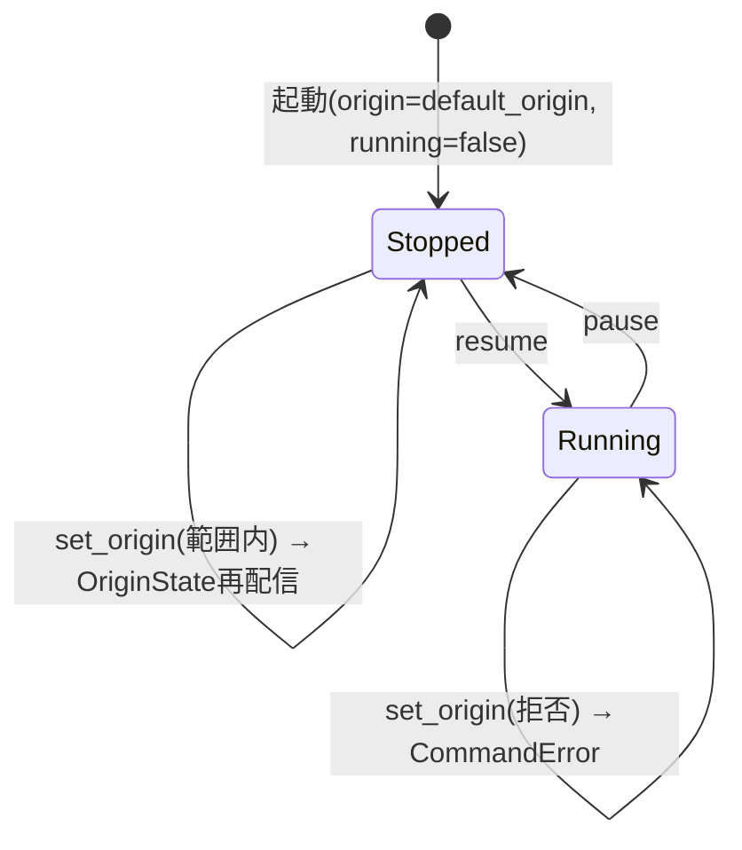

---

## 4. 通信プロトコル詳細

### 4.1 メッセージフレーミング

serdeの`tag`機能をC++側で素朴に再現するのは実装コストが高いため、**先頭1バイトをメッセージタイプ
識別子、残りをMessagePackボディとする自前フレーミング**を採用する(サーバー→クライアント方向のみ)。

```
[1 byte: msg_type] [N bytes: MessagePack body]
```

クライアント→サーバー方向(`ClientCommand`)はメッセージ型が1種類のみのため、プレフィックスバイトを
付けず、MessagePackボディのみを送信する。

msgpackへのシリアライズは、Rust側(rmp-serde)・C++側(msgpack-cxxの`MSGPACK_DEFINE`)ともに
**構造体を配列(フィールド宣言順の位置)としてエンコードする**方式を採る(mapではない)。したがって
両言語の構造体定義は**フィールド宣言順を完全に一致させる必要がある**(片方だけ並び替えるとデータが
壊れる)。

### 4.2 msg_type 一覧

| 値 | 名前 | 方向 | 送信タイミング |
|---|---|---|---|
| 0x01 | SimState | Server→Client | 高頻度(約60Hz) |
| 0x02 | VabConfig | Server→Client | 状態変化時、接続直後にも1回 |
| 0x03 | OriginState | Server→Client | 状態変化時、接続直後にも1回、全クライアントへbroadcast |
| 0x04 | StatusPanelConfig | Server→Client | 状態変化時、接続直後にも1回 |
| 0x05 | CommandError | Server→Client | コマンド拒否時。**要求元クライアントのみ**に送信 |
| (なし) | ClientCommand | Client→Server | ユーザー操作時 |

### 4.3 メッセージ型定義

**SimState**(サーバー→クライアント、高頻度)
```
t: f64                      // シミュレーション時刻(秒)。running中のみ進む
positions: Vec<f32>         // ダミーの単一点位置([x, y, z])。実際の可視化対象は将来拡張
frame_id: u32               // フレーム番号。running状態に関わらず毎ステップ増加
status_values: Vec<f64>     // StatusPanelConfig.items と同じ順序・同じ数
```

**VabConfig**(サーバー→クライアント、状態変化時のみ)
```
rows: u32
cols: u32
buttons: Vec<VabButton>
  VabButton:
    id: String
    label: String            // 空文字列 = 「未使用の穴」(6.2節)
    enabled: bool
```

**OriginState**(サーバー→クライアント、状態変化時+接続直後)
```
lat_deg: f64
lon_deg: f64
```

**StatusPanelConfig**(サーバー→クライアント、状態変化時+接続直後)
```
items: Vec<StatusItem>
  StatusItem:
    id: String
    label: String
    unit: String              // 単位。なければ空文字列
```

**CommandError**(サーバー→クライアント、要求元のみ)
```
command_type: String          // 拒否されたClientCommand.type
message: String                // エラー内容(人間可読)
```

**ClientCommand**(クライアント→サーバー)
```
type: String                   // "vab_press" / "pause" / "resume" / "set_param" / "set_origin"
button_id: String              // vab_press時のみ使用
value: f64                     // set_param時のみ使用
lat_deg: f64                   // set_origin時のみ使用
lon_deg: f64                   // set_origin時のみ使用
```

### 4.4 送信頻度

- シミュレーションループ(simスレッド)は約60Hz(16ms間隔)で駆動する
- `VabConfig`/`OriginState`/`StatusPanelConfig`は変化があったときのみ送信(毎フレーム送らない)

### 4.5 WebSocket再接続処理(フロント側)

- 再接続間隔は**指数バックオフ**(初回1秒、以後2倍ずつ、上限30秒でキャップ)
- バックオフ間隔に**ジッター(±300ms)**を加える(サーバー再起動時のサンダリングハード回避)
- **ブラウザタブが非表示の間は再接続の試行を一時停止**する(Page Visibility API)。タブがアクティブに
  戻ったタイミングで即座に再接続を再開する(バックオフの残り時間を待たない)
- リトライ回数の上限は設けない(タブが表示されている間は無制限にリトライ)
- 再接続成功後は、サーバーから`OriginState`/`VabConfig`/`StatusPanelConfig`が接続直後の仕様により
  再送されるため、フロント側の表示状態は自然に復旧する

### 4.6 プロトコルのクラス図


### 4.7 シーケンス図: 接続確立

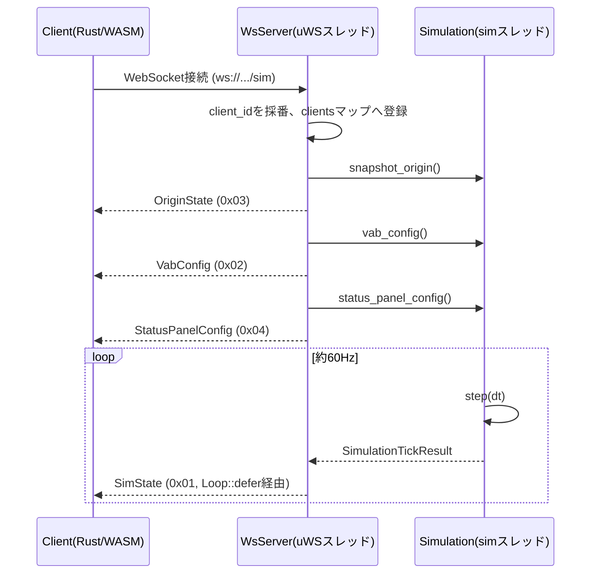

### 4.8 シーケンス図: set_origin(成功/拒否)

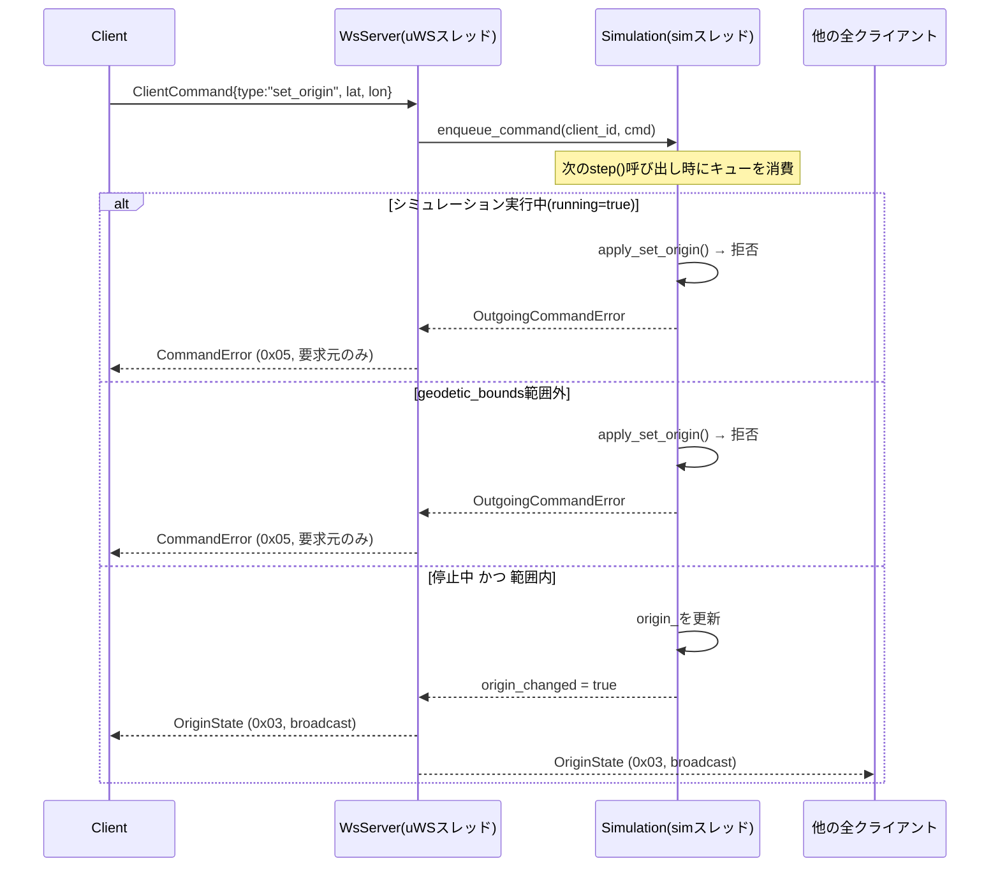

### 4.9 シーケンス図: VABボタン押下

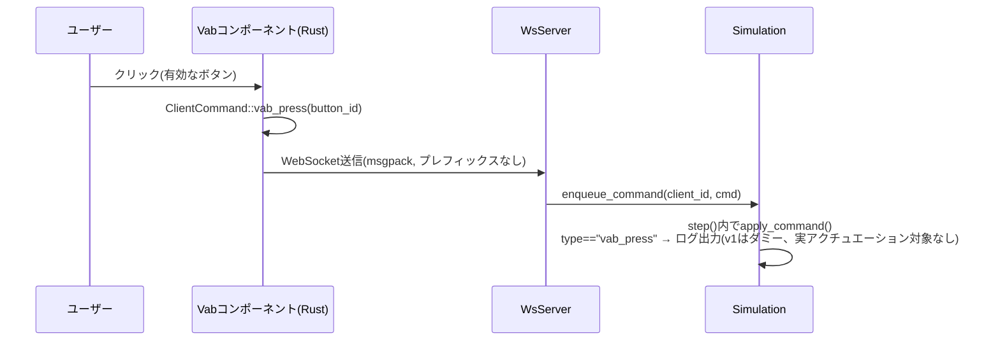

---

## 5. C++側詳細設計

### 5.1 スレッドモデル

- **uWSイベントループスレッド**: `WsServer::run()`を呼んだスレッド。HTTP/WebSocketの送受信を担当。
  `uWS::App`はシングルスレッド前提のため、このスレッド以外から`ws->send()`を直接呼んではならない
- **simスレッド**: `WsServer::run()`内で`std::thread`として起動。`Simulation::step()`を約60Hz
  (16ms間隔)で呼び続ける
- simスレッドからuWSスレッドへ処理を戻す(実際の送信を行わせる)には、必ず`uWS::Loop::defer()`を
  経由する

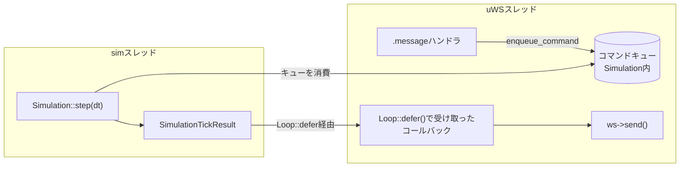

### 5.2 コマンド処理フロー

- `.message`ハンドラで受信したコマンドは**直接シミュレーション状態を書き換えず**、
  `Simulation::enqueue_command()`でスレッドセーフなキュー(`std::deque` + `std::mutex`)に積む
- simスレッド側で`step()`の**前半**でキューを消費してから、物理状態(`t_`等)を更新する
- `step()`の戻り値`SimulationTickResult`に、そのステップで発生した`CommandError`と
  `origin_changed`フラグが入っており、uWSスレッド側がこれを見て適切な送信(broadcast/単一送信)を行う

### 5.3 クラス図

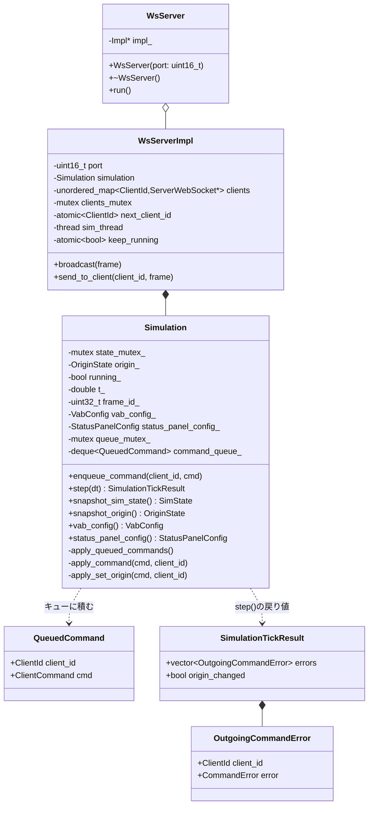

### 5.4 HTTP静的配信(地形データ)

`sim_server`は`/sim`(WebSocket)とは別に、以下のHTTP GETルートを持つ:

| パス | Content-Type | 内容 |
|---|---|---|
| `GET /terrain/metadata.json` | application/json | `assets/terrain/metadata.json`をそのまま返す |
| `GET /terrain/heightmap.bin` | application/octet-stream | `assets/terrain/heightmap.bin`をそのまま返す |

フロント(trunk serveでホストされる別オリジン)からfetchされるため、両ルートとも
`Access-Control-Allow-Origin: *`ヘッダーを付与する。想定CWD(カレントディレクトリ)は`sim_server/`
(`assets/terrain/...`という相対パスでファイルを開くため)。

### 5.5 GeoTIFF前処理ツール(geotiff_preprocess)のクラス構成

`tools/geotiff_preprocess/main.cpp`に実装(単一ファイル、`sim_server`本体とは別実行ファイル)。

| 関数/構造体 | 役割 |
|---|---|
| `TileId` | ファイル名から抽出した`(lat, lon)`整数度 |
| `parse_tile_filename()` | `"ALPSMLC30_N035E138_DSM.tif"` → `TileId{35, 138}` |
| `SourceGrid` | GDALで読み込んだ1タイル分の標高グリッド + 地理範囲 |
| `load_dsm_tile()` | GDALでGeoTIFFを1枚読み込む(再投影しない) |
| `build_mosaic()` | map_dataディレクトリをglobし、18000×18000キャンバスへ配置 |
| `downsample_average()` | 平均法によるダウンサンプリング |
| `flip_rows_north_to_south()` | GDAL標準の行順(北→南)を南→北へ反転(2.5節の注意参照) |
| `write_heightmap_bin()` / `write_metadata_json()` | 出力ファイル書き出し |

---

## 6. Rust側詳細設計

### 6.1 コンポーネント構成図

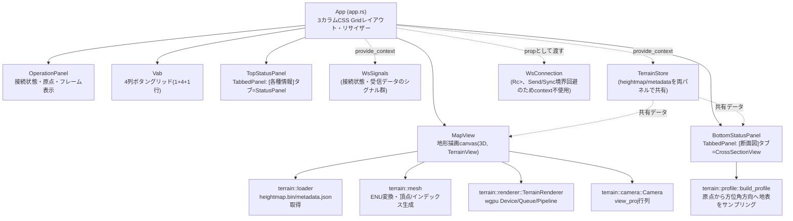

### 6.2 WebSocket接続管理のクラス図

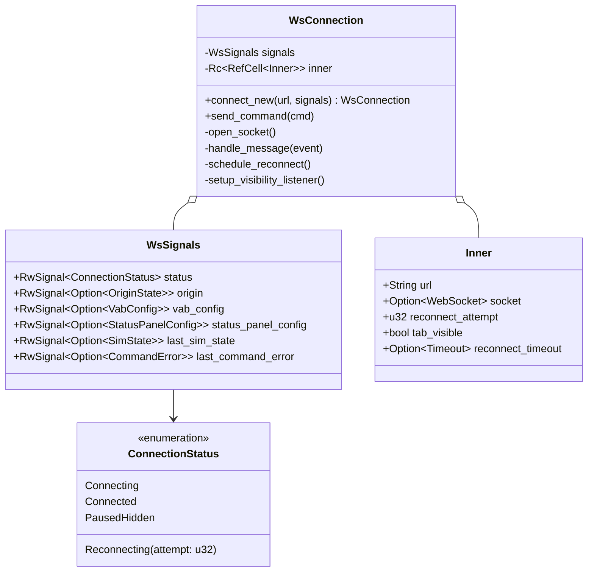

`WsConnection`は`Rc<RefCell<Inner>>`を内部に持ちSend/Syncではないため、Leptos 0.8の
`provide_context`(Send+Sync境界を要求する)には乗せられない。そのため`WsSignals`はcontext経由、
`WsConnection`はコンポーネントのpropとして明示的に渡す設計とした
(`WsConnection`自体には`unsafe impl Send/Sync`を付与している。`wasm32-unknown-unknown`は
シングルスレッドのため実質的に安全)。

### 6.3 再接続状態遷移図

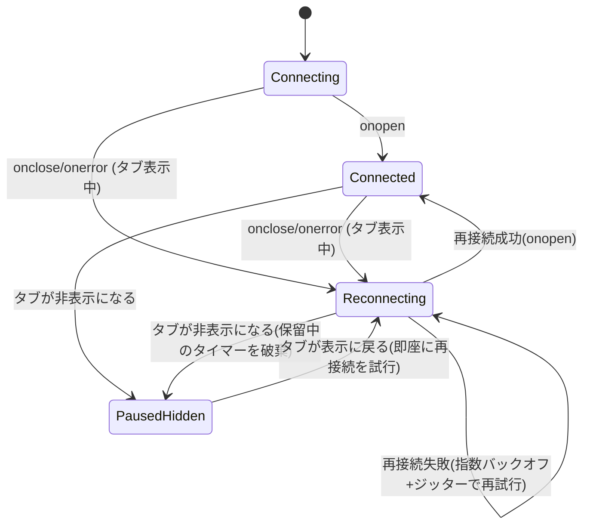

### 6.4 地形描画パイプライン

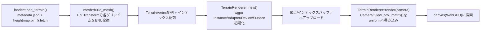

### 6.5 地形描画クラス図

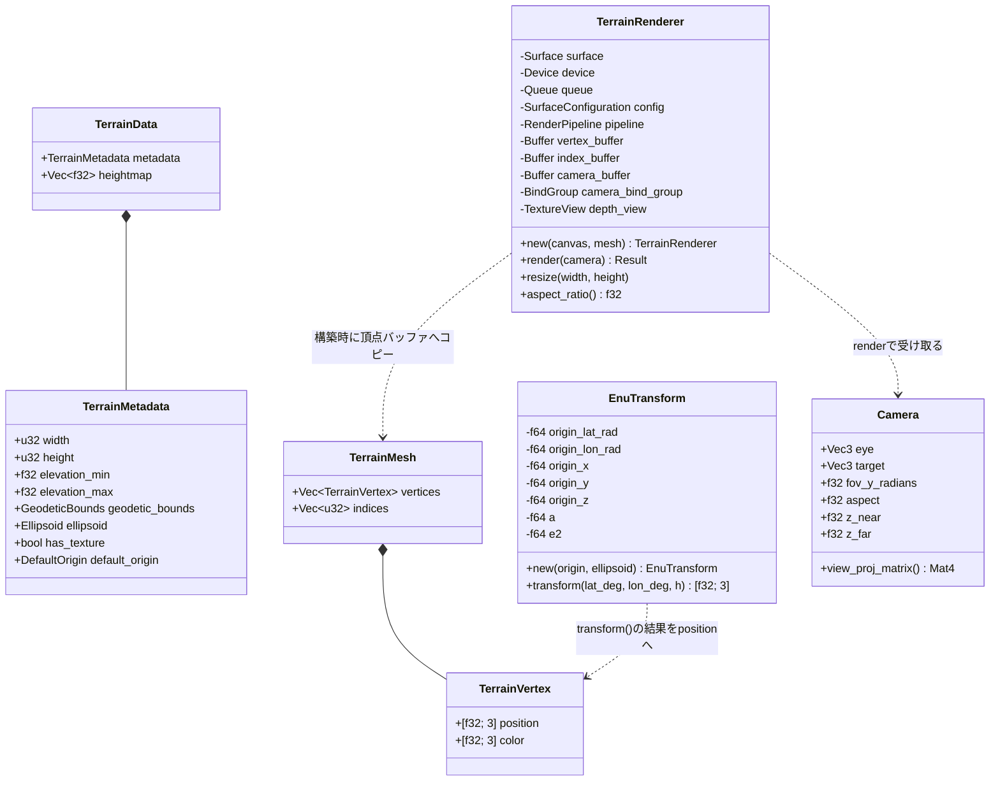

### 6.6 座標軸の扱い(ENU→wgpu)

ENU座標系(東=X, 北=Y, 上=Z)は右手系(East×North=Up)。wgpu/glamの一般的な慣習であるY-upとは
軸の意味が異なるが、**頂点データ自体は変換せず**、カメラのビュー行列側で吸収する:

- `Camera::view_proj_matrix()`は`glam::Mat4::look_at_rh(eye, target, Vec3::Z)`のように、
  up方向として`Vec3::Z`を明示的に渡す
- 射影行列は`Mat4::perspective_rh`(wgpu/Vulkan/Metal互換の深度[0,1])を使う。OpenGL互換の
  `perspective_rh_gl`(深度[-1,1])は使わない
- ENUがそもそも右手系であるため、`_rh`系の関数とそのまま整合し、軸の入れ替えによる
  ハンドネス反転を気にする必要がない

### 6.7 標高グラデーション配色

標高を`elevation_min`〜`elevation_max`で正規化し、以下のカラーストップで線形補間する:

| 正規化標高 t | 色(RGB, 0〜1) | 用途 |
|---|---|---|
| 0.0 | (0.05, 0.35, 0.35) | 低地: 深緑がかった青緑 |
| 0.25 | (0.15, 0.5, 0.2) | 緑 |
| 0.5 | (0.55, 0.5, 0.25) | 黄土色 |
| 0.75 | (0.45, 0.32, 0.22) | 茶 |
| 1.0 | (0.95, 0.95, 0.95) | 山頂付近: 白に近い明色 |

### 6.8 頂点シェーダ・フラグメントシェーダ(WGSL概要)

`terrain.wgsl`。カメラのview_proj行列をuniformバッファ(`@group(0) @binding(0)`)として受け取り、
頂点位置を変換するのみのシンプルな構成(ライティング計算なし、頂点色をそのまま出力)。

```wgsl
struct CameraUniform { view_proj: mat4x4<f32> };
@group(0) @binding(0) var<uniform> camera: CameraUniform;

struct VertexInput { @location(0) position: vec3<f32>, @location(1) color: vec3<f32> };
struct VertexOutput { @builtin(position) clip_position: vec4<f32>, @location(0) color: vec3<f32> };

@vertex
fn vs_main(in: VertexInput) -> VertexOutput {
    var out: VertexOutput;
    out.clip_position = camera.view_proj * vec4<f32>(in.position, 1.0);
    out.color = in.color;
    return out;
}

@fragment
fn fs_main(in: VertexOutput) -> @location(0) vec4<f32> {
    return vec4<f32>(in.color, 1.0);
}
```

### 6.9 断面図(ボトムステータスパネルの「断面図」タブ、`terrain::profile` / `CrossSectionView`)

ボトムステータスパネルは3D視点ではなく、**原点を起点に方位角スライダーで指定した方向の地表断面を
2D(距離 vs 標高の折れ線)で表示する**。wgpuは使わずSVGで描画するため、中央地図用の
`TerrainRenderer`とは完全に独立(GPUリソースを消費しない)。

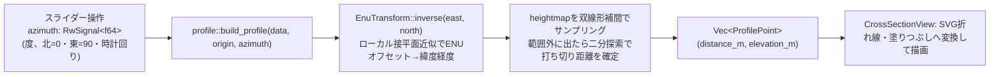

- 方位角0本につき301点(`NUM_SAMPLES=300`)を、原点から「地形データの範囲内にいられる
  最大距離」まで均等にサンプリングする。最大距離は二分探索(30回)で求める
  (`EnuTransform::inverse`で緯度経度に変換し、`geodetic_bounds`内かどうかを判定する)
- `EnuTransform::inverse`は`transform`(緯度経度→ENU)の近似逆変換。原点緯度における
  子午線曲率半径Mと卯酉線曲率半径Nを使ったローカル接平面近似(`lat = lat0 + north/M`,
  `lon = lon0 + east/(N・cos(lat0))`)
- 原点(`WsSignals.origin`)・方位角(`azimuth`)のどちらが変わってもLeptosの反応性により
  自動的に再計算・再描画される(明示的なEffectは不要、`chart`クロージャ内で両方を`.get()`
  しているため)

---

## 7. UI詳細設計

### 7.1 レイアウト

```
┌─────────────┬───────────────────┬───────────────────┐
│ 操作パネル(上) │                   │ トップステータスパネル │
│  ステータス    │                   │  [各種情報]タブ      │
├─────────────┤     地図(3D地形)    ├───────────────────┤
│ 操作パネル(下) │                   │ ボトムステータスパネル │
│    VAB       │                   │  [断面図]タブ        │
└─────────────┴───────────────────┴───────────────────┘
```

- CSS Gridで4列(左パネル固定 / 地図 / リサイザー(6px) / 右パネル)を構成する
- 左パネルは`display:grid; grid-template-rows: 1fr auto;`で上下2分割(操作パネル/VAB)。
  VAB側は`auto`で内容の高さにぴったり合わせ、余った分は操作パネル側(`1fr`)が吸収する
  (固定`1fr 1fr`だと、VABの実寸と半分の高さがずれた際に一方に余白/スクロールが生じるため)
- 右パネルは`grid-template-rows: 1fr 1fr;`で上下2分割(トップ/ボトムステータスパネル、
  こちらは両方とも内容量の変動が小さいため固定分割のままでよい)。両パネルとも
  `TabbedPanel`(7.6節)で実装しており、現状は1タブのみだが後から同じ枠に別タブを追加できる
- 左パネル幅は`--panel-width`(CSS変数、既定320px)で固定
- 地図・右パネルの幅は`grid-template-columns`の`minmax(下限px, Nfr)`で指定し、`N`(fr値)を
  Leptosの`RwSignal<f64>`で保持する。ドラッグ量(スクリーン座標のpx)をそのままfr値に加減算する
  設計のため、fr値の初期値もpxスケールの数値にしておく(小さい値だと1回のドラッグで下限に
  張り付いてしまう不具合が実装時に発生し、修正済み)

### 7.2 レスポンシブ方式

- 3カラムの横並びレイアウトは崩さない(縦積みへの再レイアウトは行わない)
- 画面幅が狭くなった場合は、`minmax()`の`fr`部分により中央・右パネルの幅が比例的に縮小する
- `minmax()`の下限を下回る場合は、外側コンテナ(`.app-shell`)に`overflow-x: auto`を設定してあるため
  横スクロールで対応する
- 各パネル内(`.panel-section`)は`overflow-y: auto`で縦スクロールに対応する

### 7.3 リサイザー(splitter)の実装

- 地図・右パネルの境界にドラッグ可能な6px幅の要素を配置する
- `on:pointerdown`でドラッグ開始位置を記録し、`element.set_pointer_capture(pointer_id)`で
  ドラッグ中にカーソルが要素外に出てもイベントを受け取り続けるようにする
- `on:pointermove`でドラッグ量(dx)を計算し、center_fr/right_frシグナルを更新する
  (center_fr += dx, right_fr -= dx)
- `on:pointerup`/`on:pointercancel`でドラッグ終了

### 7.4 VAB仕様

- 開発用ダミー`VabConfig`の初期値: rows=6, cols=4(24ボタン)
- ボタンの操作種別: 単純クリックのみ
- ラベルが空文字の`VabButton`は「未使用の穴」として、**DOM要素自体を生成しない**
- 実装上の注意: 穴を`filter()`で除外すると自動配置(auto-placement)がずれるため、各ボタンに
  `grid-row`/`grid-column`を配列インデックスから明示的に計算して指定する
  (`row = i / cols + 1; col = i % cols + 1;`)
- 先頭行・最終行は、間の行群から視覚的に離して描画する(先頭行の下・最終行の上に追加の
  `margin`を入れるだけの汎用ルールで、特定の`rows`数を前提としない)。rows=6のときは結果として
  1行+4行+1行のグループ構成に見える

### 7.5 状況パネル仕様

- 表示項目(ラベル・単位・並び順)は`StatusPanelConfig`によりC++側が動的に決定する
- フロント側は表示項目をハードコードせず、`items`の定義通りに`SimState.status_values`を
  並べて表示する
- v1では数値項目のみを対象とする

### 7.6 タブ付きパネル(`components/tabbed_panel.rs`)

右パネル上下段(トップ/ボトムステータスパネル、`components/right_panel.rs`)は、
汎用の`TabbedPanel`コンポーネントで実装する。パネル固有の名前(「各種情報」「側面図」等)は
**タブのラベル**であり、パネル自体の見出し(タイトル)は位置に基づく汎用名
(「トップステータスパネル」「ボトムステータスパネル」)にすることで、後から同じ枠に
別内容のタブを追加できるようにしてある。

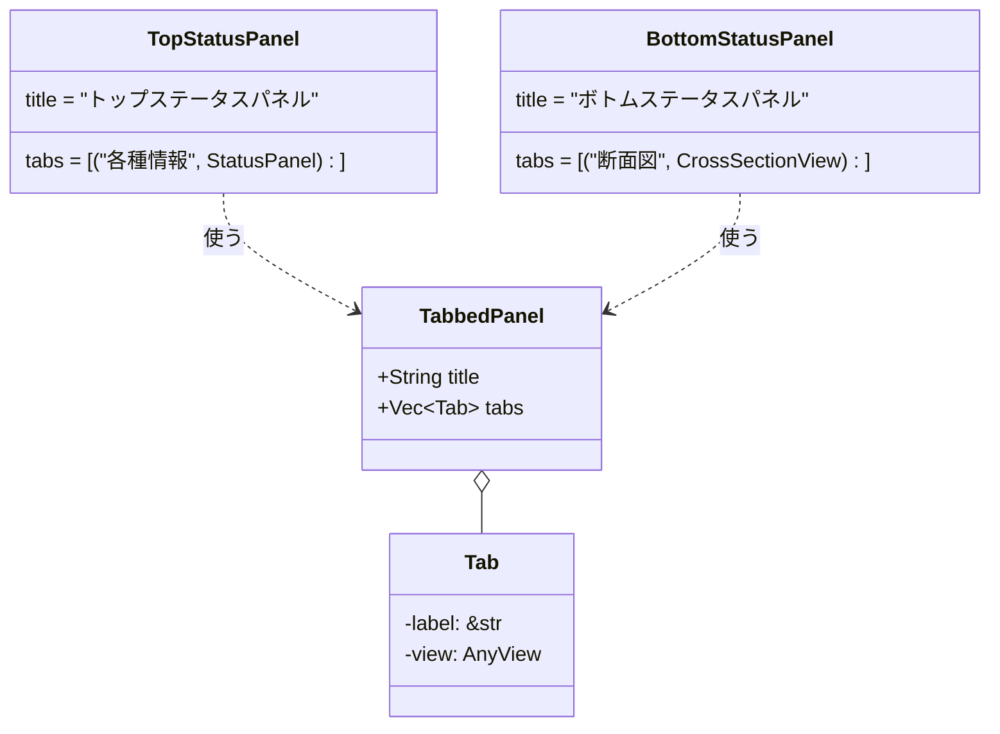

- `active: RwSignal<usize>`で選択中タブのインデックスを保持する
- 各タブの中身(`AnyView`)は初回描画時に全タブぶん一度だけ生成してDOMに残し、
  非選択タブは`style:display="none"`で隠すだけにする(タブ切り替えのたびに
  作り直さない。Leptosの再マウントコストを避けるための一般的なパターン)
- タブが1個しかない場合でもタブバー自体は表示する(見た目の一貫性のため、
  タブ数によって表示/非表示を切り替えるような分岐は入れていない)

---

## 8. UML図一覧(索引)

| 図 | 節 | 種別 |
|---|---|---|
| 前処理ツール処理フロー | 2.7 | フローチャート |
| 原点状態の状態遷移図 | 3.6 | ステートマシン図 |
| プロトコルのクラス図 | 4.6 | クラス図 |
| シーケンス図: 接続確立 | 4.7 | シーケンス図 |
| シーケンス図: set_origin | 4.8 | シーケンス図 |
| シーケンス図: VABボタン押下 | 4.9 | シーケンス図 |
| C++側スレッドモデル | 5.1 | フローチャート |
| C++側クラス図 | 5.3 | クラス図 |
| Rustコンポーネント構成図 | 6.1 | コンポーネント図 |
| WebSocket接続管理クラス図 | 6.2 | クラス図 |
| 再接続状態遷移図 | 6.3 | ステートマシン図 |
| 地形描画パイプライン | 6.4 | フローチャート |
| 地形描画クラス図 | 6.5 | クラス図 |
