# Sim3dView 詳細設計書

## 0. 本書の位置づけ

[BASIC_DESIGN.md](BASIC_DESIGN.md)(基本設計書)の詳細版。データフォーマット・座標変換の数式・
通信プロトコルのバイト単位の定義・クラス図/シーケンス図/状態遷移図(UML、Mermaid記法)を記載する。
旧指示書 `claude_code_instructions.md` と旧設計書 `DESIGN.md` の内容はすべて本書または基本設計書に
統合済みであり、旧2文書は削除後もこの2文書のみで全内容を参照できる。

UML図はMermaid記法で記述している。GitHub/GitLab/VSCode等、Mermaidをネイティブサポートするツールで
プレビューすればそのまま図として描画される。

---

## 1. 対象地形データの実態調査結果

### 1.1 ファイル構成(1タイルあたり)

`map_data/ALPSMLC30_<TILEID>_*` の形式で、17タイル分×6ファイル = 102ファイル。

| サフィックス | 内容 | 本設計での用途 |
|---|---|---|
| `_DSM.tif` | 数値表層モデル(標高、GeoTIFF, 3600×3600px) | **使用**(唯一の入力ラスタ) |
| `_MSK.tif` | 品質マスク(雲・水域等のフラグ) | 不使用(v1) |
| `_STK.tif` | パンクロマチック(白黒)画像 | **不使用**(確定事項) |
| `_HDR.txt` | タイルのヘッダ情報(四隅座標・解像度・楕円体等) | 前処理ツールのテスト・検証用参考情報 |
| `_LST.txt` | 元シーン(観測パス)のリスト | 使用しない |
| `_QAI.txt` | 品質指標(SRTM/ASTERとの差分統計等) | 使用しない |

### 1.2 タイル分布と規模

タイルID命名: `N<緯度2桁>E<経度3桁>` = タイル南西角の整数度。1タイル = 経緯度1°×1°、3600×3600px
(1秒角)。

実在タイル(17枚、対角状に分布。緯度が上がるほど東経範囲が狭まる):

```
lat39:                                              E139
lat38:                                      E138 E139
lat37:                            E136 E137 E138 E139
lat36:      E135 E136 E137 E138 E139
lat35:      E135 E136 E137 E138 E139
```

- 外接矩形: 北緯35°〜40°、東経135°〜140°(5°×5°の格子のうち17/25セルが実在)。
  **この外接矩形はハードコードではなく、`geotiff_preprocess`が実際に見つかったタイルの
  南西角ID(ファイル名から取得)の最小/最大から実行時に自動計算する**(2.3節)。
  そのため`map_data/`に別の場所のタイルを追加/削除しても、コード変更なしに追従する
- 欠損8セル: N037E135, N038E135, N038E136, N038E137, N039E135, N039E136, N039E137, N039E138
- 実距離換算で概ね南北550km×東西450km規模(この緯度帯では経度1°≈90km、緯度1°≈111km)
- 解像度: 1秒角(3600px/度)= 南北方向約30m/px、東西方向は緯度のcos分だけ狭く約24〜27m/px

### 1.3 標高データの実態(全17タイル実測)

- 標高範囲: **-102.0m 〜 3771.0m**(単一ピクセル最大値。位置的に富士山と整合。東経138°/北緯35°タイル内)
- 明示的なnodataセンチネル値(-9999等)は検出されなかった
- データ型: GeoTIFF、符号付き整数(16bit相当。前処理でf32メートルに変換)
- 平均法ダウンサンプリング後(当初1024×1024)の実測範囲: 約-11.5m 〜 3677.9m
  (平均化により単一ピクセルの極値より穏やかな範囲になる。想定通りの挙動)。解像度を
  2048×2048へ引き上げた後の実測範囲は約-22.0m 〜 3710.8m(平均化の範囲が狭まった分、
  単一ピクセルの極値に近づいた。これも想定通り)

### 1.4 欠損タイルへの対応方針

- モザイク時、無データ領域(存在しないタイル + 各タイル内のNODATA画素 + マスクファイルが
  海と示す画素、下記参照)は**f32のNaNで一律埋める**(標高0mとは明確に区別する。標高0m付近の
  実在する陸地と見た目上混同されてしまうため。当初は0mで埋めていたが、複数GeoTIFFタイルの間に
  ある無データ領域を陸地と区別して海として塗り分けたいという要望を受けてNaNへ変更した)
- フロント側は`heightmap`の値が`NaN`の格子点を海と判定し、その格子点を含む三角形は
  描画しない(背景色のまま見える。6.7節)
- `metadata.json`に欠損フラグは設けない(NaN自体が「データなし」の目印になるため)。

**タイル内部の海域はマスクファイル(`*_MSK.tif`)ベースで検出する**: 当初はGDALの
`GetNoDataValue()`(明示的なNODATAセンチネル、1.3節の通りこのデータセットでは検出されない)
だけを見ていたが、これだとタイル境界をまたがない・タイル内部で完結する海域(沿岸部・
内海など)を検出できない。実測したところ、ALOS World 3D-30mのDSMはタイル内部の海域画素に
「標高0m」という一見有効に見える値を格納しており(NODATAセンチネルではない)、対応する
`*_MSK.tif`(DSMと同じ3600×3600グリッド、1バイト/画素)の画素値が**3**の位置が正確に海域に
対応することを、同梱の`*_QAI.txt`の`MASK_NUM_SEA`統計値との突き合わせで確認した(画素値の
内訳: 0=有効データ, 3=海, 4/12=代替データソース[GSI10/PSM]で補完した陸地でありNaN化はしない)。
`load_sea_mask()`(`geotiff_preprocess/main.cpp`)がDSMと同名(拡張子前の`_DSM`を`_MSK`に
置換)の`_MSK.tif`を読み、値が3の画素をNaNへ追加で置換する。マスクファイルが見つからない・
サイズが一致しないなど読めない場合は警告を出してNODATAベースの判定のみにフォールバックし、
処理は止めない。この変更で、モザイク全体に占めるNaN(海)の割合は約32%(NODATAのみ)から
約60%(マスク併用)に増え、沿岸部・内海の描画精度が大幅に改善した。

`elevation_min`/`elevation_max`はNaNを除いた実データのみで計算する。

**タイル内の小さなNODATA穴は周囲から補間して埋める**(要望により追加。「地図の範囲内欠損
データは周りのデータから補間できる?」→「タイル内の小さなNODATA穴だけ補完で大丈夫」という
やり取りを踏まえた仕様): タイル自体が丸ごと存在しない大きな欠損(1タイル=3600×3600=約1296万
画素)は周囲から補間しても実際の地形とは無関係な架空の起伏になるだけなので対象外のまま
(従来通りNaN)。一方、タイル内部のNODATA画素(雲の影・センサー欠損等を想定。ただし
1.3節の通り現在の`map_data/`のデータにはGDALが検出する明示的なNODATAセンチネルが
存在しないため、このパスは現状のデータでは実際には発火しない。将来別のDSMソースを
使う場合に備えた対応)のうち、**海ではなく**、かつ連結成分の画素数が
`kMaxFillableHolePixels`(2000。ネイティブ解像度で半径25px≒直径約1.5kmの円に相当する
「小さな穴」の目安)以下のものは、`fill_small_nodata_holes()`が周囲の有効画素(海を除く)
から補間して埋める。埋められなかった(大きすぎる、または海に囲まれている等の)NODATA画素は
従来通りNaNのまま残る。

アルゴリズム: 8連結で穴画素を連結成分に分け、大きすぎる成分はスキップする。埋める成分は、
穴の境界(有効画素に隣接する穴画素)からBFSで内側へ波及させながら、その時点で確定済み
(有効、または既に埋め済み)の8近傍画素の平均値で順に埋めていく(常に実データまたは実データ
から補間済みの値だけを材料にし、穴の内部からいきなり値を作ることはない)。海は補間の材料
にも対象にもしない(海は「データが欠損している」のではなく「実際に海である」ため)。
合成データによる単体動作確認(スクラッチパッドでの一時的な検証、リポジトリには含めない):
中央に囲まれた小さな穴が周囲の値で正しく埋まること、海マスが補間材料に使われないこと、
傾斜のある領域の穴がその場の傾向に沿った値で埋まること、`kMaxFillableHolePixels`を超える
大きな穴が埋められずNaNのまま残ることを確認済み。

---

## 2. GeoTIFF前処理ツール仕様

### 2.1 入力

`map_data/*_DSM.tif` を機械的に列挙する(ディレクトリをglobし、ファイル名から`N###E###`パターンを
抽出してタイル位置を決定する。将来タイル追加にも対応できる)。

### 2.2 座標系(再投影は不要)

ALOS DSMタイルは元々EPSG:4326(WGS84/GRS80楕円体)の緯度経度グリッドで、1タイル=1°×1°=3600×3600px
ちょうどに整列している(タイル境界での位置ズレなし)。原点(=座標変換の基準)がUI入力によるランタイム
パラメータであるため、前処理側で特定の投影に固定する意味がない。よって:

- **再投影(reproject)は行わない**。17タイルを緯度経度グリッドのまま単純にモザイクし、ダウンサンプリング
  するだけでよい
- 実際のメートル単位の座標(東/北/上)への変換は、UIで指定された原点をもとに**フロント側が実行時に行う**
  (4節参照)
- GDALの役目は「GeoTIFFの読み取り・モザイク・ダウンサンプリング・書き出し」に限定される

### 2.3 モザイク

タイルを緯度経度グリッド上のピクセル位置(タイルIDから一意に決まる)にそのまま敷き詰める。
外接矩形は固定のハードコード値ではなく、2段階の処理で実行時に決める:

1. `discover_tiles()`: `map_data/`内の`*_DSM.tif`をディレクトリ走査し、ファイル名からタイルID
   (南西角の整数緯度経度)だけを読み取る(GDALでの実データ読み込みはまだ行わない、高速)
2. `compute_mosaic_bounds()`: 見つかった全タイルIDの緯度・経度それぞれの最小値・最大値から
   外接矩形(`MosaicBounds{min_lat, max_lat, min_lon, max_lon}`。max側はタイル南西角+1)を求める。
   現在の17タイル構成では北緯35°〜40°・東経135°〜140° → **18000×18000px**(3600px/度 × 5度)に
   なるが、これは実データから導出された結果であり、`map_data/`に別の場所のタイルを追加/削除
   すれば次回実行時に自動的に変わる
3. `build_mosaic()`: 決まった外接矩形のcanvas上に、各タイルを実際に読み込んで敷き詰める。
   タイルが存在しないセル(欠損タイル)はNaNで埋める(1.4節)

タイル南西角座標`(tile_lat, tile_lon)`から、モザイクcanvas上の配置位置(北→南、西→東の順で格納)を
求める式:

```
row_offset = (mosaic_max_lat - (tile_lat + 1)) * 3600
col_offset = (tile_lon - mosaic_min_lon) * 3600
```

### 2.4 ダウンサンプリング

- 目標解像度: 2048×2048(当初1024×1024だったが、「マップの解像度を上げてほしい」との要望により
  引き上げた。`geotiff_preprocess/main.cpp`の`kTargetWidth`/`kTargetHeight`)
- リサンプリング手法: **平均法(average)**。18000÷2048≈8.8倍の間引きになるため、最近傍やバイリニアだと
  標高の代表性が落ちる
- 実装は、出力先セル`(dx, dy)`に対応する入力範囲`[sx0,sx1) x [sy0,sy1)`を整数演算で求め、その範囲内の
  全ピクセルの平均を取る
- NaN(1.4節)は平均の対象から除外する。範囲内にNaNでない画素が1つでもあればその平均を採用し
  (陸地の縁で実データを最大限活かす)、範囲全体がNaNの場合のみ出力もNaN(海)にする

### 2.5 出力

| ファイル | 内容 | 備考 |
|---|---|---|
| `heightmap.bin` | f32, row-major, little-endian, 2048×2048, 標高値(海抜メートル) | **行順は南→北**(2.6節の座標復元式に対応させるため、GDAL標準の北→南から反転させて出力する) |
| `texture.png` | **生成しない**(v1) | 標高グラデーション着色を使うため不要 |
| `metadata.json` | 下記2.6参照 | 緯度経度範囲・標高範囲・楕円体パラメータを含む |

> **実装上の注意(重要)**: GDALは標準でラスタを北→南(row 0 = 北端)の順で格納する。しかし
> `metadata.json`の`geodetic_bounds`から緯度経度を復元する式(2.6節)は南→北(row 0 = 南端)を
> 前提としている。この食い違いを埋めるため、前処理ツールは**ダウンサンプリング後・出力直前に
> 行順を反転**させている。これを怠ると、フロント側で地形が南北反転して描画されるバグになる
> (実装時に実際に発生し、修正済み)。

### 2.6 `metadata.json` スキーマ

```json
{
  "width": 1024,
  "height": 1024,
  "elevation_min": -11.5457515716553,
  "elevation_max": 3677.90185546875,
  "geodetic_bounds": {
    "min_lat": 35.0,
    "max_lat": 40.0,
    "min_lon": 135.0,
    "max_lon": 140.0
  },
  "source_crs": "EPSG:4326 (WGS84相当, GRS80楕円体)",
  "height_datum": "orthometric height (EGM96 geoid)",
  "ellipsoid": { "a_m": 6378137.0, "inv_f": 298.257222101 },
  "has_texture": false,
  "default_origin": {
    "lat_dms": "35°21'20\"N",
    "lon_dms": "138°51'35\"E",
    "lat_deg": 35.355556,
    "lon_deg": 138.859722
  }
}
```

- `geodetic_bounds`: 各グリッドセル`(i, j)`の緯度経度は次式で線形補間して求める
  (`j`=行インデックス、`height`=1024。等間隔の緯度経度グリッドのため成立する)

  ```
  lat(j) = min_lat + (j / (height - 1)) * (max_lat - min_lat)
  lon(i) = min_lon + (i / (width  - 1)) * (max_lon - min_lon)
  ```

- `elevation_min`/`elevation_max`: 前処理時に**ダウンサンプリング後の出力データ**から実測する
  (前処理ツール実装上、`std::setprecision(15)`を明示指定して出力する。ostreamの既定精度(有効6桁)の
  ままだと`138.859722`が`138.86`のように丸められてしまうバグが実装時に発生し、修正済み)
- `has_texture`: フロント側が`texture.png`の有無を毎回fetch失敗で判定せずに済むよう明示フラグとして
  持たせている
- `default_origin`: UIの原点入力欄の初期値。実際に使われる原点はサーバー側が保持する状態が正
  (`OriginState`。5節参照)であり、これはあくまで未接続時のUI初期表示用
- `ellipsoid`/`height_datum`: フロント側のENU変換計算(3節)で使うパラメータ

### 2.7 前処理ツール処理フロー(UML: アクティビティ相当のフローチャート)

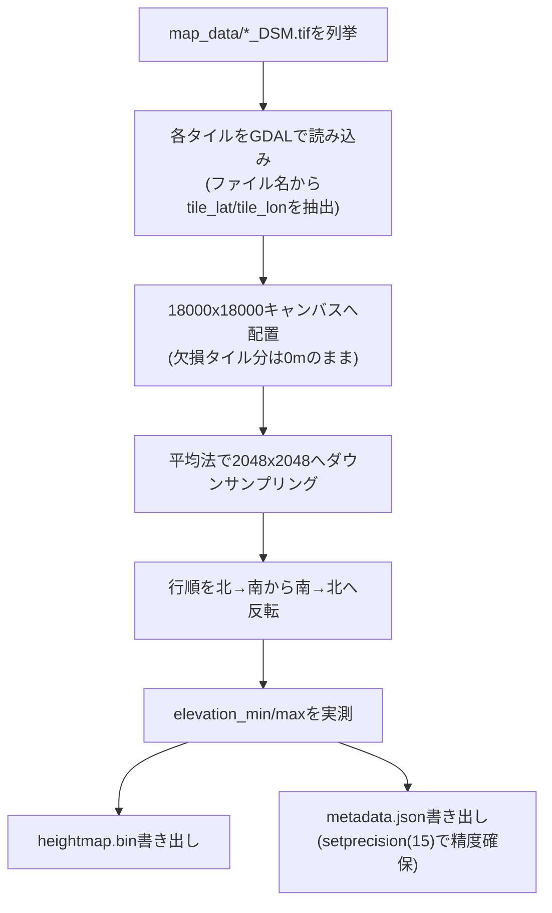

---

## 3. 座標系設計(ENU座標系)

### 3.1 定義

- シミュレーション座標系 = **東=X、北=Y、鉛直上向き=Z** の局所ENU(East-North-Up)座標系
- 原点 = UIで入力された緯度経度地点の、**海抜0m(ジオイド高0m)の点**
- デフォルト原点(試験用): 北緯35°21'20"、東経138°51'35"(10進: 35.355556°, 138.859722°)。
  地形データの範囲内(タイル`N035E138`内、富士山付近)に収まっている

### 3.2 変換式(緯度経度+標高 → ENU)

地形グリッドの各点は`(lat, lon, h)`(hはDSMの標高値=海抜メートル)で表現される。原点`(lat0, lon0)`が
決まれば、標準的な測地座標→ECEF→ENU変換で一意にメートル座標が求まる。GRS80楕円体
(`metadata.json`の`ellipsoid`)を用いる。

```
a  = 6378137.0                      // 長半径
f  = 1 / 298.257222101              // 扁平率
e2 = f * (2 - f)                    // 離心率の2乗

// 1) 測地座標 → ECEF
N(lat) = a / sqrt(1 - e2 * sin(lat)^2)
X = (N(lat) + h) * cos(lat) * cos(lon)
Y = (N(lat) + h) * cos(lat) * sin(lon)
Z = (N(lat) * (1 - e2) + h) * sin(lat)

// 2) 原点(lat0, lon0, h0=0)のECEFを基準に差分を取り、原点でのローカル座標系に回転(ENU)
dX = X - X0,  dY = Y - Y0,  dZ = Z - Z0

East  = -sin(lon0)*dX + cos(lon0)*dY
North = -sin(lat0)*cos(lon0)*dX - sin(lat0)*sin(lon0)*dY + cos(lat0)*dZ
Up    =  cos(lat0)*cos(lon0)*dX + cos(lat0)*sin(lon0)*dY + sin(lat0)*dZ

// シミュレーション座標
sim_x = East
sim_y = North
sim_z = Up
```

- 高さの扱い: DSM値はEGM96ジオイド基準の海抜(orthometric height)であり、上式の`h`にそのまま使う
  (ジオイド高と楕円体高の差は本設計では無視する簡略化。地形の格子間隔が約540mあることを踏まえると
  実用上の影響は小さい)
- 地球の曲率は上式に自然に反映される(遠方の地点ほど`Up`が減少していく)。550km規模の広域では
  原点から離れるほど地表が「下に沈んで」見える効果が正しく表現される
- Rust実装は `sim_frontend/src/terrain/mesh.rs` の `EnuTransform` 構造体。C++側(サーバー)は
  座標変換自体を行わず、緯度経度のみを状態として保持する(5.3節参照)。

### 3.3 計算をどこで行うか

- **前処理(C++/GDAL)側では行わない**。`heightmap.bin`/`metadata.json`は原点非依存の生データのまま
- **フロント側(Rust/WASM)がメッシュ構築時・原点変更時にランタイムで計算する**。2048×2048≈419万頂点分の
  変換は原点ごとに1回で済み、WASM上でも実用上問題ない速度で完了する(実機確認済み)
- 原点を変更したら、地形メッシュの頂点バッファを再計算・再アップロードする
  (`heightmap.bin`/`metadata.json`の再フェッチは不要)

### 3.4 原点の変更タイミングとガード

原点はシミュレーション座標系の定義そのものであり、シミュレーション実行中に変更すると
C++側・フロント側双方の状態(位置、地形メッシュ)がずれるリスクがある。

- **シミュレーション開始前(停止中)のみ原点変更可能**とし、実行中はUIの原点入力をロックする
- 原点はサーバー(C++側)が正とする状態であり、UIはサーバーから配信された値を表示・編集する
- C++側は原点についてUIとは別の内部表現を持たない。サーバーが保持する原点state
  (`OriginState`として配信される値)を唯一の真実とする

### 3.5 原点入力のバリデーション

- UIの原点入力フォームは、`metadata.json`の`geodetic_bounds`の範囲を入力可能な値の上下限として使い、
  範囲外の値は**入力欄への入力段階でブロックする**か、送信ボタンを無効化する
- サーバー側でも同じ範囲チェックを行う(フロントのバリデーションを回避するクライアントに対する防御的
  チェック)。範囲外の`set_origin`が送られてきた場合は`CommandError`を返す。範囲は`Simulation`の
  コンストラクタが起動時に`assets/terrain/metadata.json`の`geodetic_bounds`から読む(ハードコードしない。
  読めなかった場合はチェックを無効にして警告を出す)

### 3.6 原点状態の状態遷移図

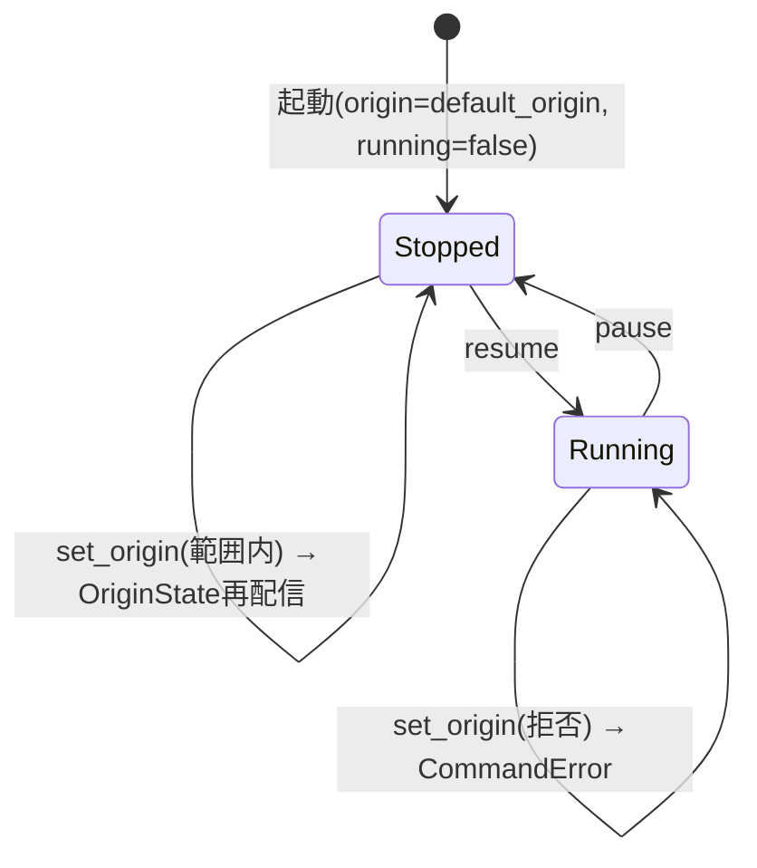

---

## 4. 通信プロトコル詳細

### 4.1 メッセージフレーミング

serdeの`tag`機能をC++側で素朴に再現するのは実装コストが高いため、**先頭1バイトをメッセージタイプ
識別子、残りをMessagePackボディとする自前フレーミング**を採用する(サーバー→クライアント方向のみ)。

```
[1 byte: msg_type] [N bytes: MessagePack body]
```

クライアント→サーバー方向(`ClientCommand`)はメッセージ型が1種類のみのため、プレフィックスバイトを
付けず、MessagePackボディのみを送信する。

msgpackへのシリアライズは、Rust側(rmp-serde)・C++側(msgpack-cxxの`MSGPACK_DEFINE`)ともに
**構造体を配列(フィールド宣言順の位置)としてエンコードする**方式を採る(mapではない)。したがって
両言語の構造体定義は**フィールド宣言順を完全に一致させる必要がある**(片方だけ並び替えるとデータが
壊れる)。

### 4.2 msg_type 一覧

| 値 | 名前 | 方向 | 送信タイミング |
|---|---|---|---|
| 0x01 | SimState | Server→Client | 高頻度(約60Hz) |
| 0x02 | VabConfig | Server→Client | 状態変化時、接続直後にも1回 |
| 0x03 | OriginState | Server→Client | 状態変化時、接続直後にも1回、全クライアントへbroadcast |
| 0x04 | StatusPanelConfig | Server→Client | 状態変化時、接続直後にも1回 |
| 0x05 | CommandError | Server→Client | コマンド拒否時。**要求元クライアントのみ**に送信 |
| 0x06 | AppStatus | Server→Client | 状態変化時(pause/resume)、接続直後にも1回、全クライアントへbroadcast |
| (なし) | ClientCommand | Client→Server | ユーザー操作時 |

### 4.3 メッセージ型定義

**SimState**(サーバー→クライアント、高頻度)
```
t: f64                      // シミュレーション時刻(秒)。running中のみ進む
positions: Vec<f32>         // ダミーの単一点位置([x, y, z])。実際の可視化対象は将来拡張
frame_id: u32               // フレーム番号。running状態に関わらず毎ステップ増加
status_values: Vec<f64>     // StatusPanelConfig.items と同じ順序・同じ数
```

**VabConfig**(サーバー→クライアント、状態変化時のみ)
```
rows: u32
cols: u32
buttons: Vec<VabButton>
  VabButton:
    id: String
    label: String            // 空文字列 = 「未使用の穴」(6.2節)
    enabled: bool
```

**OriginState**(サーバー→クライアント、状態変化時+接続直後)
```
lat_deg: f64
lon_deg: f64
```

**StatusPanelConfig**(サーバー→クライアント、状態変化時+接続直後)
```
items: Vec<StatusItem>
  StatusItem:
    id: String
    label: String
    unit: String              // 単位。なければ空文字列
```

**CommandError**(サーバー→クライアント、要求元のみ)
```
command_type: String          // 拒否されたClientCommand.type
message: String                // エラー内容(人間可読)
```

**AppStatus**(サーバー→クライアント、状態変化時+接続直後。7.7節)
```
text: String                   // シミュレータアプリケーション自体の状態文字列
                                // (例: "シミュレーション実行中" / "一時停止中")
```

**ClientCommand**(クライアント→サーバー)
```
type: String                   // "vab_press" / "pause" / "resume" / "set_param" / "set_origin"
button_id: String              // vab_press時のみ使用
value: f64                     // set_param時のみ使用
lat_deg: f64                   // set_origin時のみ使用
lon_deg: f64                   // set_origin時のみ使用
```

### 4.4 送信頻度

- シミュレーションループ(simスレッド)は約60Hz(16ms間隔)で駆動する
- `VabConfig`/`OriginState`/`StatusPanelConfig`は変化があったときのみ送信(毎フレーム送らない)

### 4.5 WebSocket再接続処理(フロント側)

- 再接続間隔は**指数バックオフ**(初回1秒、以後2倍ずつ、上限30秒でキャップ)
- バックオフ間隔に**ジッター(±300ms)**を加える(サーバー再起動時のサンダリングハード回避)
- **ブラウザタブが非表示の間は再接続の試行を一時停止**する(Page Visibility API)。タブがアクティブに
  戻ったタイミングで即座に再接続を再開する(バックオフの残り時間を待たない)
- リトライ回数の上限は設けない(タブが表示されている間は無制限にリトライ)
- 再接続成功後は、サーバーから`OriginState`/`VabConfig`/`StatusPanelConfig`が接続直後の仕様により
  再送されるため、フロント側の表示状態は自然に復旧する

### 4.6 プロトコルのクラス図

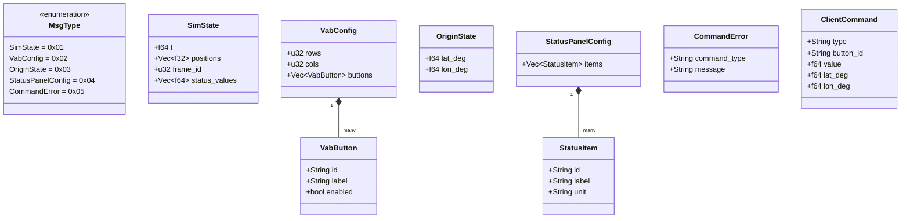

### 4.7 シーケンス図: 接続確立

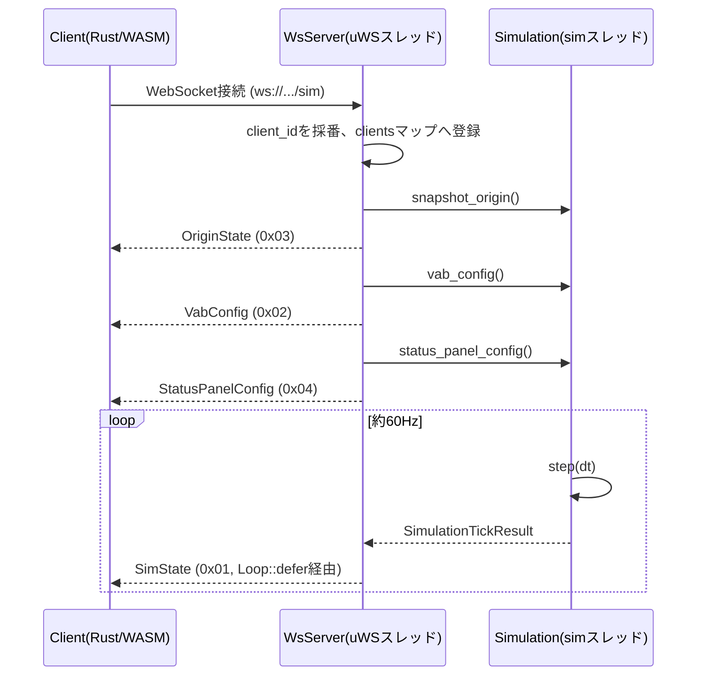

### 4.8 シーケンス図: set_origin(成功/拒否)

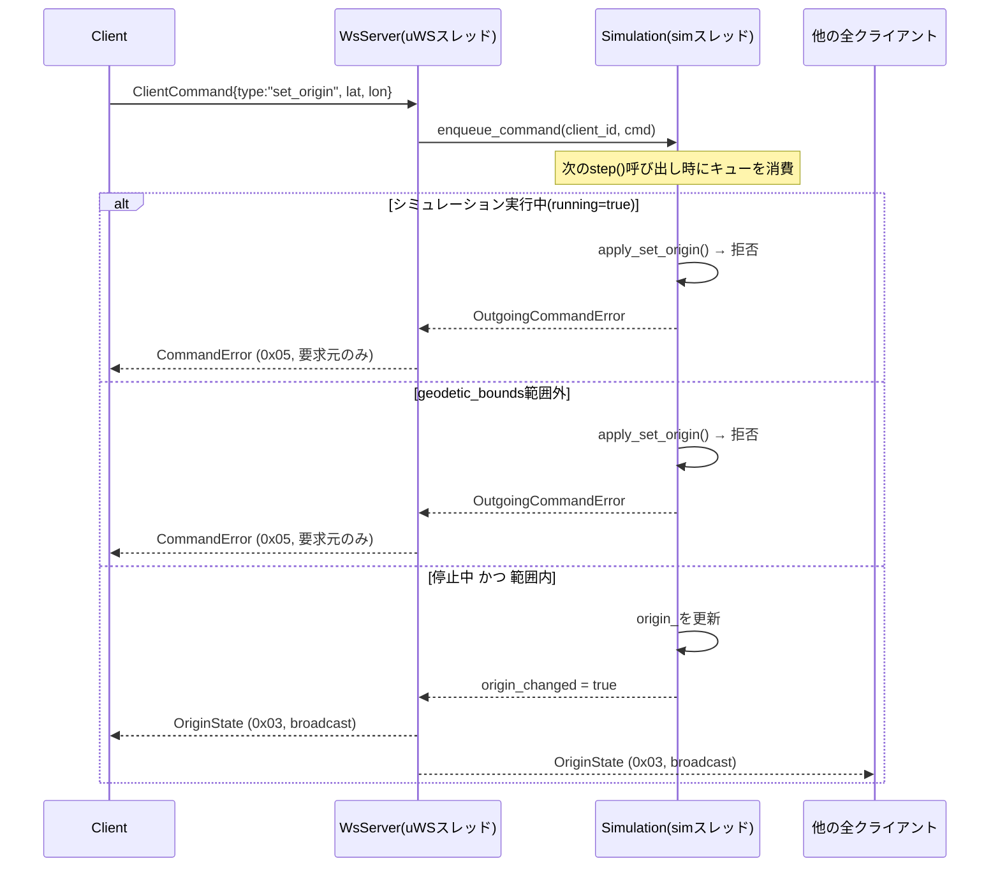

### 4.9 シーケンス図: VABボタン押下

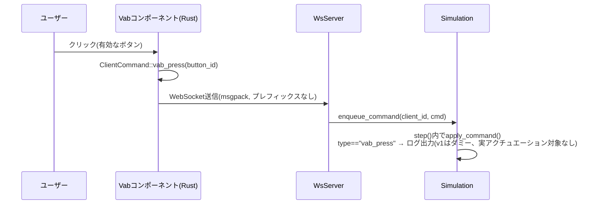

---

## 5. C++側詳細設計

### 5.1 スレッドモデル

- **uWSイベントループスレッド**: `WsServer::run()`を呼んだスレッド。HTTP/WebSocketの送受信を担当。
  `uWS::App`はシングルスレッド前提のため、このスレッド以外から`ws->send()`を直接呼んではならない
- **simスレッド**: `WsServer::run()`内で`std::thread`として起動。`Simulation::step()`を約60Hz
  (16ms間隔)で呼び続ける
- simスレッドからuWSスレッドへ処理を戻す(実際の送信を行わせる)には、必ず`uWS::Loop::defer()`を
  経由する

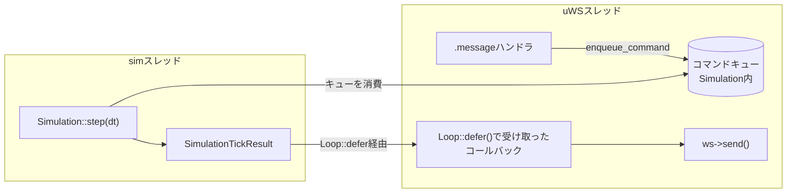

### 5.2 コマンド処理フロー

- `.message`ハンドラで受信したコマンドは**直接シミュレーション状態を書き換えず**、
  `Simulation::enqueue_command()`でスレッドセーフなキュー(`std::deque` + `std::mutex`)に積む
- simスレッド側で`step()`の**前半**でキューを消費してから、物理状態(`t_`等)を更新する
- `step()`の戻り値`SimulationTickResult`に、そのステップで発生した`CommandError`と
  `origin_changed`フラグが入っており、uWSスレッド側がこれを見て適切な送信(broadcast/単一送信)を行う

### 5.3 クラス図

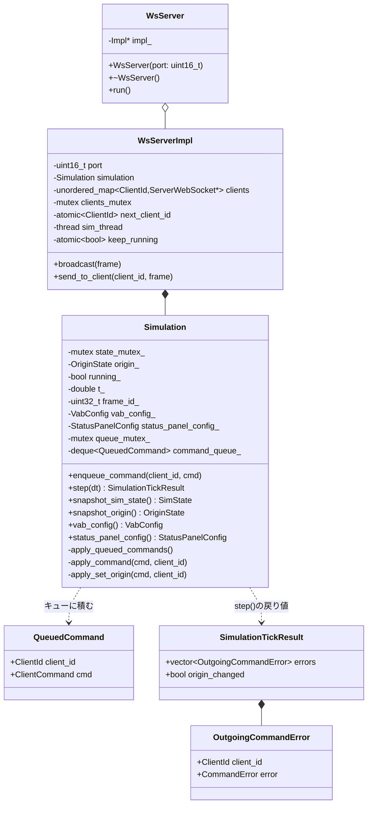

### 5.4 HTTP静的配信(地形データ)

`sim_server`は`/sim`(WebSocket)とは別に、以下のHTTP GETルートを持つ:

| パス | Content-Type | 内容 |
|---|---|---|
| `GET /terrain/metadata.json` | application/json | `assets/terrain/metadata.json`をそのまま返す |
| `GET /terrain/heightmap.bin` | application/octet-stream | `assets/terrain/heightmap.bin`をそのまま返す |

フロント(trunk serveでホストされる別オリジン)からfetchされるため、両ルートとも
`Access-Control-Allow-Origin: *`ヘッダーを付与する。想定CWD(カレントディレクトリ)は`sim_server/`
(`assets/terrain/...`という相対パスでファイルを開くため)。

### 5.5 GeoTIFF前処理ツール(geotiff_preprocess)のクラス構成

`tools/geotiff_preprocess/main.cpp`に実装(単一ファイル、`sim_server`本体とは別のCMakeプロジェクト・別実行ファイル。sim3dviewライブラリの一部としてリポジトリ直下の`tools/`に置く)。

| 関数/構造体 | 役割 |
|---|---|
| `TileId` | ファイル名から抽出した`(lat, lon)`整数度 |
| `parse_tile_filename()` | `"ALPSMLC30_N035E138_DSM.tif"` → `TileId{35, 138}` |
| `DiscoveredTile` | `TileId` + ファイルパス(まだGDAL読み込みはしていない) |
| `discover_tiles()` | map_dataディレクトリをglobし、ファイル名からタイルIDだけを列挙(1段階目) |
| `MosaicBounds` | モザイクの外接矩形(整数度)。ハードコードではなく実行時に計算する値 |
| `compute_mosaic_bounds()` | 見つかった全タイルIDの緯度・経度の最小/最大から外接矩形を求める |
| `SourceGrid` | GDALで読み込んだ1タイル分の標高グリッド + 地理範囲 |
| `load_sea_mask()` | 対応する`*_MSK.tif`を読み、画素値3(海)の位置をビットマップで返す(1.4節) |
| `fill_small_nodata_holes()` | 海ではない小さなNODATA穴(連結成分が`kMaxFillableHolePixels`以下)を周囲の有効画素からBFSで補間して埋める(1.4節) |
| `load_dsm_tile()` | GDALでGeoTIFFを1枚読み込む(再投影しない)。小さなNODATA穴は補間、残ったNODATA画素+マスク海域画素はNaNへ置換 |
| `build_mosaic()` | 外接矩形サイズのキャンバスへ各タイルを配置(2段階目) |
| `downsample_average()` | 平均法によるダウンサンプリング(NaNは平均から除外) |
| `flip_rows_north_to_south()` | GDAL標準の行順(北→南)を南→北へ反転(2.5節の注意参照) |
| `write_heightmap_bin()` / `write_metadata_json()` | 出力ファイル書き出し |

---

## 6. Rust側詳細設計

> **注記(ライブラリ/サンプル分離後の対応関係)**: 「本swをライブラリとして使えるように
> 整理したい」との要望を受け、Rust側は`sim3dview`ライブラリcrateと`sample/sim_frontend`
> サンプルアプリcrateに分割した(git履歴・sim3dview/README.md参照)。以下6節・7節で
> `components/xxx.rs`・`terrain/xxx.rs`と書いている箇所は、分割前(単一crateだった当時)の
> パスをそのまま残している。現在の実際の置き場所は:
> - **`sim3dview`ライブラリへ移動**: 6.2〜6.9節が説明する地形描画パイプライン・カメラ・
>   座標軸・標高配色・シェーダ・LOS/覆域計算・markers・pick・LosView、7.6節のTabbedPanel、
>   7.7節のフローティングパネルのうち原点設定・覆域高度設定の実装本体(トリガーのメニュー
>   項目自体は除く)。旧`components/`配下は`sim3dview/src/ui/`、旧`terrain/`配下は
>   `sim3dview/src/terrain/`に対応する
> - **`sample/sim_frontend`サンプルアプリに残留**: 7.4節のVAB、7.5節の状況パネル、7.7節の
>   メニューバー自体(トリガーのみ)、4節の通信プロトコル(`protocol.rs`/`ws.rs`)、
>   `app.rs`(全体レイアウト)
>
> 旧`WsSignals.origin`への依存は、ライブラリ側では`terrain::origin::OriginState`
> (プロトコル非依存の`RwSignal<Option<Origin>>`)に置き換わっており、`app.rs`が
> protocol⇔ライブラリの橋渡しEffectを持つ。`terrain::loader`/`terrain::store::TerrainStore`が
> 参照するURLも、旧実装のようにポート9001をハードコードせず、呼び出し側(`app.rs`)が
> `base_url`として明示的に渡す形に変わっている。

### 6.1 コンポーネント構成図

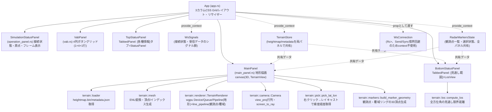

### 6.2 WebSocket接続管理のクラス図

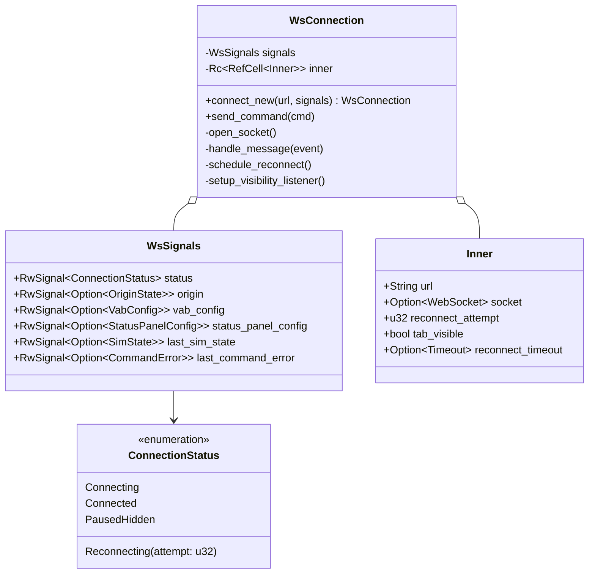

`WsConnection`は`Rc<RefCell<Inner>>`を内部に持ちSend/Syncではないため、Leptos 0.8の
`provide_context`(Send+Sync境界を要求する)には乗せられない。そのため`WsSignals`はcontext経由、
`WsConnection`はコンポーネントのpropとして明示的に渡す設計とした
(`WsConnection`自体には`unsafe impl Send/Sync`を付与している。`wasm32-unknown-unknown`は
シングルスレッドのため実質的に安全)。

### 6.3 再接続状態遷移図

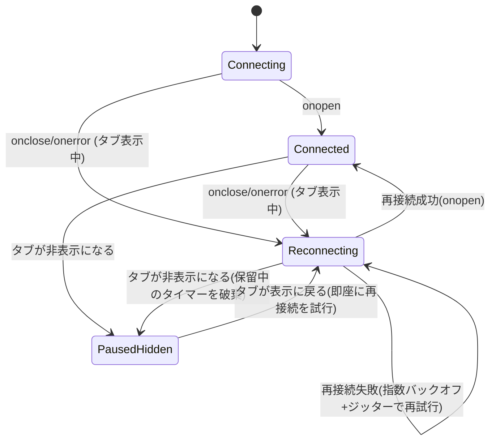

### 6.4 地形描画パイプライン

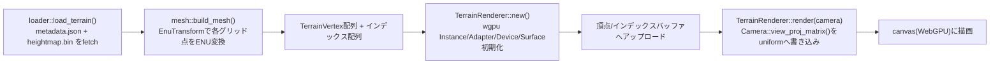

### 6.5 地形描画クラス図

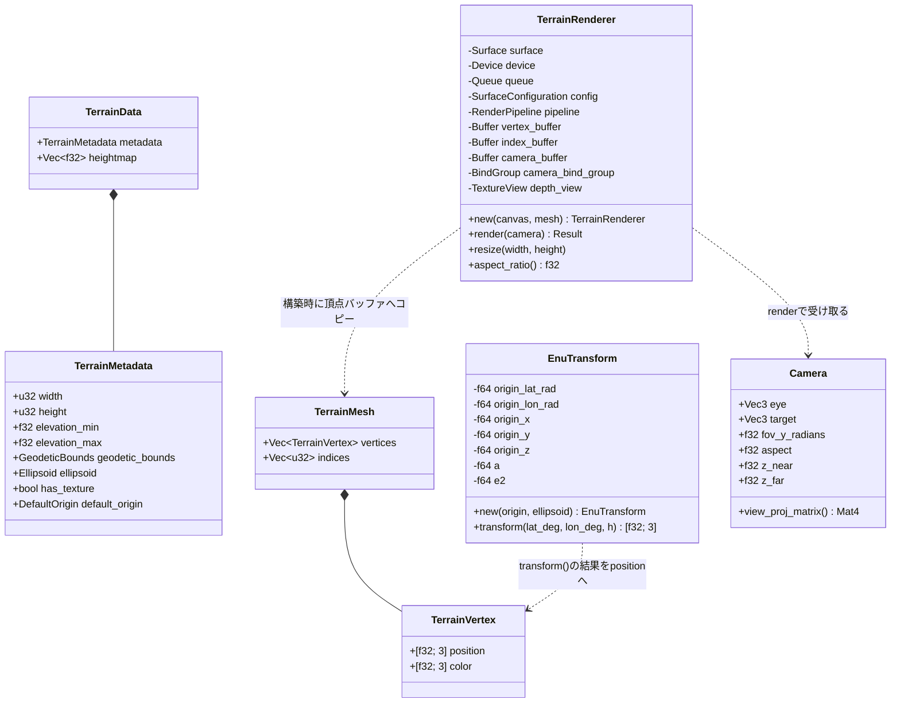

### 6.6 座標軸の扱い(ENU→wgpu)

ENU座標系(東=X, 北=Y, 上=Z)は右手系(East×North=Up)。wgpu/glamの一般的な慣習であるY-upとは
軸の意味が異なるが、**頂点データ自体は変換せず**、カメラのビュー行列側で吸収する:

- `Camera::view_proj_matrix()`は`glam::Mat4::look_at_rh(eye, target, Vec3::Z)`のように、
  up方向として`Vec3::Z`を明示的に渡す
- 射影行列は`Mat4::perspective_rh`(wgpu/Vulkan/Metal互換の深度[0,1])を使う。OpenGL互換の
  `perspective_rh_gl`(深度[-1,1])は使わない
- ENUがそもそも右手系であるため、`_rh`系の関数とそのまま整合し、軸の入れ替えによる
  ハンドネス反転を気にする必要がない

### 6.7 標高グラデーション配色

標高を`elevation_min`〜`elevation_max`で正規化し、以下のカラーストップで線形補間する:

| 正規化標高 t | 色(RGB, 0〜1) | 用途 |
|---|---|---|
| 0.0 | (0.12, 0.4, 0.18) | 低地: 深緑 |
| 0.25 | (0.15, 0.5, 0.2) | 緑 |
| 0.5 | (0.55, 0.5, 0.25) | 黄土色 |
| 0.75 | (0.45, 0.32, 0.22) | 茶 |
| 1.0 | (0.95, 0.95, 0.95) | 山頂付近: 白に近い明色 |

**海(データなし)の扱い**: `heightmap`の値が`NaN`の格子点(1.4節: 存在しないタイル +
各タイル内のNODATA画素 + マスクファイルが海と示す画素)は描画しない。頂点position自体は
NaNだと破綻するため標高0mで配置するが、`terrain/mesh.rs::build_mesh`はこの頂点を1つでも含む
三角形をインデックスに加えない(海岸線は最大1グリッドセル分陸側に退く)。海と実データ範囲の
外側は`TerrainRenderer::render()`のクリア色(黒 `wgpu::Color{0,0,0,1}`)のまま見える。
三角形の有無はheightmapだけで決まり原点に依存しないため、原点変更で再構築してもインデックス数は
変わらない(`update_vertices`は頂点バッファだけを書き換える)。`terrain::mesh::sample_heightmap`
(カメラ注視点の高さ・見通し範囲・クリック位置の判定で共用)は、双線形補間の結果がNaNなら
標高0mへ丸める。

> 経緯: かつては海を水色(`WATER_COLOR`)で塗り、実データ外側を覆う背景スカートと
> 表示メニューの「海を表示」切り替えがあったが、「海を水色で表示する機能を削除」との
> 要望で撤去した(履歴はDEVELOPMENT_HISTORY.md参照)。

### 6.8 頂点シェーダ・フラグメントシェーダ(WGSL概要)

`terrain.wgsl`。カメラのview_proj行列をuniformバッファ(`@group(0) @binding(0)`)として受け取り、
頂点位置を変換するのみのシンプルな構成(ライティング計算なし、頂点色をそのまま出力)。

```wgsl
struct CameraUniform { view_proj: mat4x4<f32> };
@group(0) @binding(0) var<uniform> camera: CameraUniform;

struct VertexInput { @location(0) position: vec3<f32>, @location(1) color: vec3<f32> };
struct VertexOutput { @builtin(position) clip_position: vec4<f32>, @location(0) color: vec3<f32> };

@vertex
fn vs_main(in: VertexInput) -> VertexOutput {
    var out: VertexOutput;
    out.clip_position = camera.view_proj * vec4<f32>(in.position, 1.0);
    out.color = in.color;
    return out;
}

@fragment
fn fs_main(in: VertexOutput) -> @location(0) vec4<f32> {
    return vec4<f32>(in.color, 1.0);
}
```

覆域ドーム用に、同じ`vs_main`を再利用しつつ固定の半透明アルファを返す`fs_dome`エントリ
ポイントも定義している(6.9節)。

**MSAA(マルチサンプルアンチエイリアシング、4x)**: メッシュ解像度を2048×2048に引き上げた後、
遠景で多数の細かい三角形(陸地・海のNaN色を含む)が1画素に収まりきらずエイリアシング
(市松状の斑点)を起こすようになったため導入した(「地表面上に水色の点がいっぱい書かれてる」
との報告を受けて調査・対処)。3つのパイプライン(地形本体・マーカー線・覆域ドーム)すべてで
`multisample.count = 4`にし、深度テクスチャも同じサンプル数にする。

**スーパーサンプリング(2x、MSAAと併用)**: MSAA(4x)導入後も、やや引いた視点・浅い角度では
エイリアシング(「広域表示時に地形上に背景と同じ色の点が多数表示される/ズーム・カメラ操作時に
ちかちかする」)が残っていたため追加した。WebGPUでは8倍MSAAが実装依存で非対応な場合がある
(実機の`createTexture`で明示的にエラーになることを確認済み。仕様上必須なのは1と4のみ)ため、
MSAAの倍率自体は4のまま、**内部解像度をcanvasの`SUPERSAMPLE_FACTOR`(2)倍にして描画し、
最後に線形フィルタで実際のcanvas解像度へ縮小する2パス構成**にした:

1. 地形本体・マーカー線・覆域ドームの3パイプラインは、いずれも「canvasの2倍の内部解像度」の
   `msaa_view`(4xマルチサンプル)へ描画し、同じ内部解像度の`supersample_color_view`
   (シングルサンプル、`TEXTURE_BINDING`付き)へ`resolve_target`で解決する
2. 2パス目(`downsample_pipeline`)が、頂点バッファなしの「画面いっぱいの三角形」1枚
   (`terrain.wgsl`の`vs_fullscreen`、`vertex_index`だけから3頂点を計算する定石)を描き、
   `fs_downsample`が`supersample_color_view`を線形フィルタ(`FilterMode::Linear`)でサンプリング
   しながら実際のスワップチェーン(canvas解像度)へ出力する。ちょうど2倍のダウンサンプルなので、
   線形フィルタのバイリニア補間がそのまま2×2画素の平均(ボックスフィルタ相当)として働く

内部テクスチャの一辺は`SUPERSAMPLE_MAX_DIMENSION`(4096px)で安全側に頭打ちにしてある
(WebGPUが保証する`maxTextureDimension2D`の最小値8192に対し、非常に大きなcanvasで2倍すると
際どくなるため)。`resize()`のたびに深度テクスチャ・MSAAテクスチャに加え、
`supersample_color_view`と、それを参照する`downsample_bind_group`も作り直す。

効果検証: 修正前に陸地内で`WATER_COLOR`([140,199,235])と完全一致する画素が複数見つかって
いた領域を、`canvas.toDataURL()`によるピクセルサンプリングで再検証したところ、1200画素中
0画素まで減少(完全に解消)。ただしカメラがほぼ水平に近い浅い角度(1スキャンラインに
メッシュの非常に多くの行が投影される極端なケース)では、2倍のスーパーサンプリングだけでは
なお弱い縞模様が残ることを確認済み(より高い倍率かLOD的な仕組みが必要になる見込みで、
現時点では対応を見送っている)。

ハマりどころ: `trunk serve`はpath依存先(`sim3dview`)のソース変更を自動では検知しない
(監視対象は基本的にビルド対象crate自身のソースツリーのため)。ライブラリ側だけを編集した
場合は`trunk serve`の再起動が必要。

### 6.9 見通し範囲(レーダー観測点、`terrain::los` / `terrain::markers` / `terrain::pick` / `LosView`)

任意の地点(レーダー観測点)を観測点として、全方位角(1度刻み・360方向)の見通し限界距離を
計算し、(a) メインパネル(3D地形)上に覆域境界の輪郭線、(b) ボトムステータスパネルの
「見通し範囲」タブに2D極座標図(レーダー覆域図)、の2か所で
表示する。観測点自体は**メインパネル上での右クリックで追加する**(タブからの手入力ではない)。

**観測点の追加(右クリック→レイキャスト)**: メインパネルのcanvasで右クリックすると
(ブラウザ既定のコンテキストメニューは`prevent_default`で抑止)、クリックされた画面座標から
カメラの逆ビュー射影行列でENU座標系のレイを求め(`Camera::screen_to_ray`)、そのレイを
CPU側のheightmapに対して直接マーチングして地表との交点を探す(`terrain::pick::pick_lat_lon`。
GPU側の読み戻しは行わない)。交点が見つかり、かつ地形データ範囲内であれば、その緯度経度に
既定パラメータ(アンテナ高10m・最大観測範囲50km)の観測点(`RadarMarker`)を追加し、選択状態にする。
観測点は**複数個**追加でき、一覧は`ui_state::RadarMarkersState`(全パネル共有のcontext)が保持する。

**選択・削除・パラメータ編集**: ボトムステータスパネルの「見通し範囲」タブが観測点一覧を
リスト表示する。各行をクリックすると選択状態になり(3D側のハイライト色・極座標図の対象が
連動して切り替わる)、行内の入力欄でアンテナ高・最大観測範囲をその場で編集でき、「削除」
ボタンで一覧から取り除ける(選択中の観測点を削除すると選択状態はクリアされる)。

**3D描画(メインパネル)**: マーカー本体(四角い枠)と覆域ドームは、頂点データ・
描画パイプラインとも別々に扱う(下記)。原点変更時(メッシュ再構築後)・観測点の追加/削除/
選択変更のたびに両方の頂点データを作り直す(`components/terrain_view.rs::rebuild_markers`)。

- マーカー本体: `terrain::markers::build_marker_geometry`が観測点一覧・選択状態から
  LineList用の頂点列を作り、`TerrainRenderer`の`line_pipeline`(地形本体の`pipeline`とは
  別だが、頂点レイアウト・カメラバインドグループ・シェーダーは共用)で描画する。各観測点は
  地表にわずかに(25m)浮かせた四角い枠として描く(選択中は黄色、非選択はオレンジ)
- 覆域ドーム: `terrain::markers::build_dome_surface_geometry`が**選択中の観測点についてのみ**
  (複数観測点の覆域を同時に重ねると見づらいため)TriangleList用の頂点列を作り、専用の
  `dome_pipeline`(アルファブレンド有効・深度書き込み無効。地形やマーカーの奥に半透明で
  透けて見えるようにするため)で描画する

**覆域の3D表示は半球状の面(Surfaceを持つ多面体)**(「ワイヤーフレームではなくSurfaceが
存在する多面体に」という要望により、ワイヤーフレーム表現から変更): `push_dome_surface`が、
`terrain::los::compute_los_dome`(下記)の出力を使い、仰角0°〜80°
(`DOME_RING_ELEVATIONS_DEG = [0,5,10,20,35,55,80]`、地表付近をやや密に)の7段の緯度リング
(計算自体は各360分割)を隣接するリング×隣接する方位角ごとに四角形パッチ(三角形2枚)で
つないで球面状の面を作る。最上段リング(仰角ごとに半径が異なり単一の頂点には収束しない)は、
その高さの平均をアペックス(頂点)として傘状の三角形群で閉じ、開いた穴のない多面体にする。
色は半透明の水色固定(`terrain.wgsl`の`fs_dome`エントリポイントでアルファ0.22を出力)。

三角形化に使う方位角は`DOME_MESH_AZIMUTH_STRIDE`(10)で間引き、360分割→36分割にしている
(`compute_los_dome`自体の計算解像度はそのまま)。間引かずに360分割全てを三角形化すると、
アペックスへ閉じる傘の部分に極端に細い三角形が360枚重なり、アルファブレンド(半透明合成)が
描画順に依存するためカメラ角度が変わるたびに重なり方が変化して明るさがちらつく
(「画面を操作するとマップがチカチカする」との報告を受けて特定・修正)。また、地形に
遮蔽される方角ではドーム境界が定義上ちょうど地形の表面に接するため、そのままだと地形
メッシュとのZファイティングも起きる。これは`DOME_HEIGHT_BIAS_M`(20m)でドーム全体を
一律に持ち上げて回避している。

**`compute_los_dome`は「地形に遮蔽されない方角ではどの仰角でも同じ半径(=滑らかな球面)、
地表付近だけ地形の遮蔽で内側に凹む」という物理的に正しいモデル**(「上方向は、地表面に
よってさえぎられているところ以外は滑らかな球面になるのでは」との指摘を受けて修正。
当初案は`compute_los`(仰角0°の値のみ)をそのまま全仰角のドーム半径として使い回す簡易的な
extrudeだったが、これだと地形に遮蔽されない方角でも仰角によって半径が変わらず、指摘の
通り物理的に不自然だった)。仰角ごとに、観測点からの**直線(仰角一定のレイ)**が地形に
遮蔽されずどこまで届くかを、`compute_los`と同じサンプリングループを複数の仰角しきい値
(`tan`)に対して同時に評価することで求める。直線は一度地形にぶつかったら(直線である以上)
その先で地形が下がっても二度と地形の陰から出てこないため、`compute_los`の「手前の尾根の
陰でも先で再び見える」処理とは異なり「最初に遮蔽された時点で打ち切り」が正しい(これは
簡略化ではなく、レイが地表を這うcompute_losとは異なる幾何学的設定であることによる)。
地形に遮蔽されない方角では、指定した最大観測範囲(スラントレンジ)までそのまま届く。

**観測点は地形メッシュの原点(`OriginState`)とは独立**: 緯度経度の絶対値で保持しており、
`set_origin`コマンドは一切送らない。原点(メッシュ)が変わっても、観測点自体の緯度経度は
変わらず、描画側が新しい原点基準のENU座標へ再変換するだけ。地形メッシュの再計算も発生しない
ため、原点変更とは異なり**シミュレーション実行中でも自由に追加・編集できる**(3.4節の
「原点変更はシミュレーション停止中のみ」という制約は`OriginState`自体の変更にのみ適用され、
観測点には適用されない)。

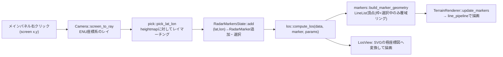

**等価地球半径(equivalent earth radius)**: 標準大気中では電波が幾何学的な直線よりわずかに
下向きに屈折するため、実際の見通し距離は真球上の幾何学的な地平線より遠くなる。この効果を
「実際の地球半径(平均6,371km)をk倍した仮想的に大きい球面上で電波が直進する」近似で表した
ものが等価地球半径で、標準大気ではk=4/3が広く使われる(レーダー・無線工学の標準的な近似、
`terrain/los.rs::K_FACTOR`に定数として実装。v1では固定値で、UIパラメータ化はしていない)。
距離`d`における地球曲率分の見かけの高度低下量は`d² / (2 * R_eff)`(`R_eff = R_earth * k`)。

**遮蔽判定(マスク角アルゴリズム)**: 方位角ごとに観測点から外側へサンプリングしながら、
各サンプル点の「見かけの仰角」(等価地球半径による曲率低下を差し引いた角度)を計算する。
それまでの最大仰角を`max_angle`として保持し、`angle(d) >= max_angle`を満たす点だけを
「観測点から直接見える点」とみなす(満たさない点は、より手前にある高い地形に遮蔽されて
見えない)。その方位角の見通し限界距離は、この条件を満たした点のうち最も遠いものの距離とする
(手前の尾根の陰でも、その先で地形が十分高くなれば再び見えるケースを許容する。単純な
「最初の遮蔽物で打ち切り」より実際のレーダー覆域に近い近似)。

**パラメータ**:
- 観測点位置(緯度・経度): メインパネル上の右クリック位置から`pick_lat_lon`で決まる
  (`RadarMarker::lat_deg/lon_deg`)。タブ側では読み取り専用表示のみで編集はできない
- アンテナ高(`RadarMarker::height_m`): 観測点の地表(heightmapから取得)からの高さ。
  一覧の行内で編集可、既定10m
- 最大観測範囲(`RadarMarker::max_range_m`): この距離とデータ範囲内の距離の小さい方までを
  計算対象とする。一覧の行内でkm単位表示・編集(内部ではmで保持)、既定50km

**計算コスト**: 観測点1つあたり360方位角 × 200サンプル/方位角 = 72,000回の`heightmap`双線形補間
(3D描画・極座標図とも選択中の観測点のみ計算するため、観測点の総数には比例しない)。
ブラウザで実測して体感遅延なく反応的に再計算できることを確認済み。

**メインパネルの2D/3D表示切り替え**(「地図について2d/3dを切り替えできるようにしたい/2dの
場合は覆域表示時に指定した海抜高度での探知可能領域を図示したい/3dの場合は従来通り」との
要望により追加): メインパネル右上に「2D表示に切替」/「3D表示に切替」ボタンを追加し、
`terrain::camera::ViewMode`(`ThreeD`/`TwoD`)で状態を持つ。3Dは既存の自由視点(透視投影、
ドラッグで回転)のまま変更なし。2Dは真上からの正射影(`Camera::Projection::Orthographic`、
`glam::camera::rh::proj::directx::orthographic`)に切り替わり、北を上に固定した地図のような
見た目になる。ドラッグはオービット回転ではなく`OrbitCamera::pan`による平行移動になり
(`up`ベクトルを北=Y軸にした`look_at`のため回転操作自体が意味を持たない)、ホイールズームは
`OrbitCamera::distance`を正射影の画面縦幅(ワールド座標メートル)として再利用することで
そのまま流用している。なお、当初あった俯瞰/側面プリセットボタンは「俯瞰ボタンと側面ボタンは
いらない」との要望により削除した(`terrain::camera::CameraPreset::Side`も不要になった
ため合わせて削除)。2D↔3D切り替えは「2D表示に切替」/「3D表示に切替」ボタンのみで行う。

**2Dモードでの覆域表示は「指定した海抜高度での探知可能領域」**(3Dの半球ドームとは別物、
選択中の観測点についてのみ表示する点は共通): `terrain::los::compute_coverage_area`が、
`compute_los_dome`(仰角一定の直線を仰角ごとに走査)と対になる形で、**高度一定の直線**を
対象の高度について走査する。方位角ごとに観測点から外側へサンプリングしながら、地形自身の
マスク角(`max_angle`、`compute_los`と同じ)と、対象(高度`target_altitude_m`固定)からの
仰角`target_angle(d) = (target_altitude_m - curvature_drop(d) - observer_height) / d`を
同時に更新し、`target_angle(d) >= max_angle`である間を可視とする。`target_angle(d)`は
距離`d`が伸びるほど地球曲率分・`1/d`の効果でほぼ単調に下がるため、`compute_los_dome`と
同じ「最初に遮蔽されたら以降も遮蔽され続ける」扱いにできる(いったん地形に遮蔽された
直線は、直線である以上その先で地形が下がっても二度と地形の陰から出てこないという、
6.9節前半で述べた`compute_los_dome`の理屈がそのまま当てはまる)。

表示対象の海抜高度はメニュー「設定」→「覆域高度設定...」のフローティングパネル
(`components/coverage_altitude_dialog.rs`、既定1000m、7.7節)で指定し、
`ui_state::RadarMarkersState::coverage_altitude_m`(全パネル共有だが今のところ
メインパネルの2Dモードのみが参照する、単一のグローバル設定)として持つ。
メインパネル側は`components/terrain_view.rs`のEffectでこのシグナルを購読しているだけで、
ダイアログ側から直接ジオメトリ再構築を呼び出しているわけではない(7.7節)。

3D描画(`push_dome_surface`)と同様、`terrain::markers::push_coverage_area`が地表面に沿わせた
(各点をその地点の地表標高+`COVERAGE_AREA_HEIGHT_BIAS_M`の高さに置く)星形(star-shaped、
観測点を中心とした極座標の境界なので自己交差しない)のTriangleListファンを作り、既存の
`dome_pipeline`(半透明・深度書き込み無効)で描画する。3Dドームと2D覆域表示は同じ
`TerrainRenderer::update_dome`バッファ・パイプラインを共有し、`components/terrain_view.rs::
rebuild_markers`がモードに応じてどちらのジオメトリを渡すか切り替えるだけ(専用パイプラインの
追加はしていない)。塗り自体は他の覆域表示と同じ半透明アルファ0.22で地図上ではかなり
控えめにしか見えないため(実機のピクセルサンプリングで色の混合自体は正しいことを確認済み)、
`push_coverage_outline`が同じ境界を不透明なLineList(マーカー本体と同じ`line_pipeline`)の
輪郭線として追加し、`build_marker_geometry`の結果と連結してマーカー用バッファに含める
(2Dモードのときだけ)。実機で、地形に遮られて欠けた不整形な領域が輪郭線ではっきり見え、
塗りつぶしの色もその内側で(ごくわずかにだが)周囲と違う色になっていることを確認済み。

---

## 7. UI詳細設計

### 7.1 レイアウト

```
┌──────────────────────────────────────────────────────────────┐
│ ファイル  設定  表示  ヘルプ                    ← メニューバー    │
├───────────────────────┬───────────────────┬───────────────────┤
│ シミュレーション          │                   │ トップステータスパネル │
│ ステータスパネル(上)      │                   │  [各種情報]タブ      │
├───────────────────────┤     メインパネル     ├───────────────────┤
│ VABパネル(下)            │    (3D地形)        │ ボトムステータスパネル │
│                         │                   │ [見通し範囲]         │
└───────────────────────┴───────────────────┴───────────────────┘
```

画面最上部にメニューバー(`components/menu_bar.rs`)を固定高さで配置し、その下に
既存の3カラムレイアウト(`.app-shell`)を残り高さいっぱいで敷く(`.app-root`が
`display:flex; flex-direction:column`で両者を縦に並べる)。

パネル名は全て位置ベースの汎用名で統一している(シミュレーションステータスパネル/VABパネル/
メインパネル/トップステータスパネル/ボトムステータスパネル)。表示内容そのものを指す旧称
(「操作パネル」「VAB」「地図」「各種情報パネル」「側面図パネル」)は、トップ/ボトムステータス
パネルではタブラベルとして残るのみで、パネル自体の名前としては使わない。

- CSS Gridで4列(左パネル固定 / メインパネル / リサイザー(6px) / 右パネル)を構成する
- 左パネルは`display:grid; grid-template-rows: 1fr auto;`で上下2分割
  (シミュレーションステータスパネル/VABパネル)。VABパネル側は`auto`で内容の高さに
  ぴったり合わせ、余った分はシミュレーションステータスパネル側(`1fr`)が吸収する
  (固定`1fr 1fr`だと、VABパネルの実寸と半分の高さがずれた際に一方に余白/スクロールが
  生じるため)
- 右パネルは`grid-template-rows: 1fr 1fr;`で上下2分割(トップ/ボトムステータスパネル、
  こちらは両方とも内容量の変動が小さいため固定分割のままでよい)。両パネルとも
  `TabbedPanel`(7.6節)で実装しており、現状は1タブのみだが後から同じ枠に別タブを追加できる
- 左パネル幅は`--panel-width`(CSS変数、既定320px)で固定
- 地図・右パネルの幅は`grid-template-columns`の`minmax(下限px, Nfr)`で指定し、`N`(fr値)を
  Leptosの`RwSignal<f64>`で保持する。ドラッグ量(スクリーン座標のpx)をそのままfr値に加減算する
  設計のため、fr値の初期値もpxスケールの数値にしておく(小さい値だと1回のドラッグで下限に
  張り付いてしまう不具合が実装時に発生し、修正済み)

### 7.2 レスポンシブ方式

- 3カラムの横並びレイアウトは崩さない(縦積みへの再レイアウトは行わない)
- 画面幅が狭くなった場合は、`minmax()`の`fr`部分により中央・右パネルの幅が比例的に縮小する
- `minmax()`の下限を下回る場合は、外側コンテナ(`.app-shell`)に`overflow-x: auto`を設定してあるため
  横スクロールで対応する
- 各パネル内(`.panel-section`)は`overflow-y: auto`で縦スクロールに対応する

### 7.3 リサイザー(splitter)の実装

- 地図・右パネルの境界にドラッグ可能な6px幅の要素を配置する
- `on:pointerdown`でドラッグ開始位置を記録し、`element.set_pointer_capture(pointer_id)`で
  ドラッグ中にカーソルが要素外に出てもイベントを受け取り続けるようにする
- `on:pointermove`でドラッグ量(dx)を計算し、center_fr/right_frシグナルを更新する
  (center_fr += dx, right_fr -= dx)
- `on:pointerup`/`on:pointercancel`でドラッグ終了

### 7.4 VAB仕様

- 開発用ダミー`VabConfig`の初期値: rows=6, cols=4(24ボタン)
- ボタンの操作種別: 単純クリックのみ
- ラベルが空文字の`VabButton`は「未使用の穴」として、**DOM要素自体を生成しない**
- 実装上の注意: 穴を`filter()`で除外すると自動配置(auto-placement)がずれるため、先頭行の
  各ボタンには`grid-row`/`grid-column`を配列インデックスから明示的に計算して指定する
  (`row = 1; col = i + 1;`。先頭行のみを扱うため`row`は常に1)

**カテゴリ選択タブ + 動的コンテンツ**(要望により追加): VabConfigの**先頭行(`cols`個)だけ**を
「カテゴリ選択タブ」として扱い、サーバーが決めたラベル・有効/無効のまま描画する(押すと従来
通り`vab_press`コマンドを送る)。**先頭行より後ろ(中段・下段、元のB5〜B24相当)は、サーバーの
VabConfigの内容を使わず、選択中カテゴリに応じて内容が切り替わるフロント側だけのダミー
コンテンツに置き換える**(`components/vab.rs`):

- 中段: `MID_ROWS`(4)行×`MID_TOTAL_COLS`(8)列のダミーボタン。1ページあたり`cols`列だけを表示し、
  残りは**「◀ 1/2 ▶」のページ送りボタン(`.vab-pager`)で切り替える**(横スクロールバー方式は
  「ボタンによってページを切り替える感じにしたい」との要望により不採用にした)。現在ページ
  (`current_page`、ローカル状態)×`cols`列目から`cols`個ぶんの列だけをグリッドに描画し、
  ◀/▶は端のページで無効化する。カテゴリ(先頭行)を切り替えたら現在ページは先頭に戻す
- 下段: `BOTTOM_COLS`(4)列の固定ダミーボタン(横スクロールなし)
- ラベルは選択中カテゴリの先頭行ボタンのラベルを使い、中段は`"{カテゴリ}-{n}"`、下段は
  `"{カテゴリ}A{n}"`という形式にして両者を区別している。クリックすると
  `vab_dummy_mid_{i}`/`vab_dummy_bottom_{i}`というローカル生成idで通常通り`vab_press`を送る
  (サーバー側は汎用的に`button_id`をログするだけなので、未知のidでも問題なく動作する)

VABはまだ実ハードウェア非連動の開発用ダミー段階であるため、**「カテゴリごとに実際に何を
表示・操作すべきか」はまだフロント側だけの試作**であり、サーバー(C++)側はカテゴリという
概念自体を持たない(先頭行の4ボタンを含め、VabConfig自体は今まで通り単一の固定24ボタン
グリッドを1回だけ送る)。サーバー側を本当にカテゴリ対応させる(カテゴリ選択に応じて
別のVabConfigを配信する等)のは将来の課題(CLAUDE.md参照)。

**有効化状態(色反転)**(「vabについて通常状態と色を反転した有効化状態を用意したい」との
要望により追加): 全VABボタン共通の`.vab-button-active`(背景を`var(--accent)`、文字色を
濃紺に反転する見た目)を、区画ごとに異なるソースで切り替える。

- 先頭行(B1〜B4相当): 「フロント側で現在の選択状況を有効化表示する」との要望通り、
  既存の`selected_category`(カテゴリ選択の選択中インデックス)をそのまま使う
  (元々`.vab-button-selected`という名前だったものを、有効化状態の汎用クラスとして
  `.vab-button-active`に統合した)
- 中段・下段: 当初の要望は「それ以外はC++側からのステータスをもって切り替える」だったが、
  この2区画は選択中カテゴリに応じてフロント側だけで生成するダミーボタン(`vab_dummy_mid_{i}`/
  `vab_dummy_bottom_{i}`)であり、C++側はその存在自体を知らない(VabConfigは先頭行の
  `cols`個しか使っていない、上記参照)。C++からステータスを紐づけようがないため、
  「フロントエンド側で制御する方針に変更する」との回答を受け、区画ごとに直近クリックした
  ボタンのインデックスをローカルに保持(`selected_mid`/`selected_bottom`、いずれも
  `RwSignal<Option<usize>>`)して有効化表示するようにした。カテゴリ切り替え時
  (先頭行クリック時)はどちらも`None`にリセットする(前カテゴリでの押下状態を
  引き継がない)
- 実装上の注意: `.vab-button-active`と`.vab-button-dummy`は詳細度が同じ単一クラス
  セレクタのため、CSS上の宣言順で後ろにある方が勝つ。中段・下段では両クラスが同時に
  付与されるため、`.vab-button-active`を`.vab-button-dummy`より**後ろ**に定義する
  必要がある(`style/app.css`)

### 7.5 状況パネル仕様

- 表示項目(ラベル・単位・並び順)は`StatusPanelConfig`によりC++側が動的に決定する
- フロント側は表示項目をハードコードせず、`items`の定義通りに`SimState.status_values`を
  並べて表示する
- v1では数値項目のみを対象とする

### 7.6 タブ付きパネル(`components/tabbed_panel.rs`)

右パネル上下段(トップ/ボトムステータスパネル、`components/right_panel.rs`)は、
汎用の`TabbedPanel`コンポーネントで実装する。パネル固有の名前(「各種情報」「側面図」等)は
**タブのラベル**であり、パネル自体の見出し(タイトル)は位置に基づく汎用名
(「トップステータスパネル」「ボトムステータスパネル」)にすることで、後から同じ枠に
別内容のタブを追加できるようにしてある。

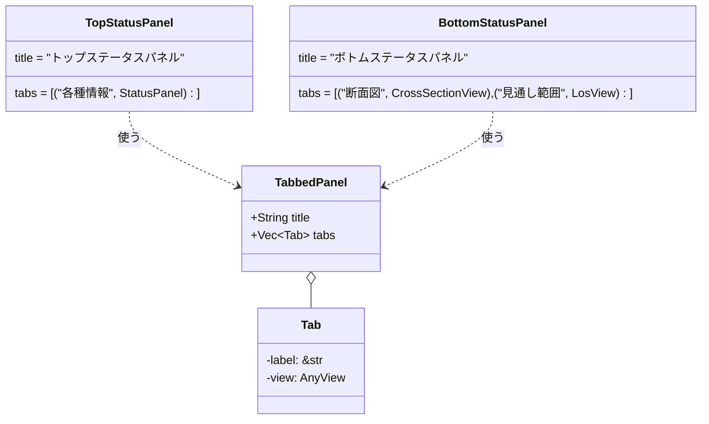

ボトムステータスパネルへ「見通し範囲」タブ(6.9節)を追加した際に、「断面図」
「見通し範囲」の2タブ構成になった(タブ配列に`tab(...)`のエントリを1行足すだけで、
`TabbedPanel`側の変更は一切不要だった。設計意図通りの拡張性)。その後「ボトムステータス
パネルの側面図もいらない」との要望を受けて断面図タブ(`CrossSectionView`、旧称「側面図」)
自体を一時削除したが、後日「断面図機能自体を復活してほしい」との要望を受けて再度追加し、
現在は再び2タブ構成になっている(git履歴参照。復活時の実装は`sim3dview::ui::
cross_section_view::CrossSectionView`としてライブラリ側に置いている)。

- `active: RwSignal<usize>`で選択中タブのインデックスを保持する
- 各タブの中身(`AnyView`)は初回描画時に全タブぶん一度だけ生成してDOMに残し、
  非選択タブは`style:display="none"`で隠すだけにする(タブ切り替えのたびに
  作り直さない。Leptosの再マウントコストを避けるための一般的なパターン)
- タブが1個しかない場合でもタブバー自体は表示する(見た目の一貫性のため、
  タブ数によって表示/非表示を切り替えるような分岐は入れていない)

### 7.7 メニューバー・フローティングパネル(原点設定/覆域高度設定)

画面最上部のメニューバー(`components/menu_bar.rs`)は「ファイル」「設定」「表示」
「ヘルプ」の4項目。「設定」配下に2つのフローティングパネルを開く項目がある:

- 「原点設定...」: 原点入力フォーム(緯度・経度・`設定`ボタン、DETAILED_DESIGN.md
  3.5節のバリデーション込み)を`components/origin_dialog.rs`として画面中央に表示する。
  フォーム自体の中身は実装当初シミュレーションステータスパネルに直接埋め込まれて
  いたものをそのまま移設したもので、ロジックに変更はない。サーバーへ`set_origin`
  コマンドを送るため`WsConnection`を必要とする
- 「覆域高度設定...」: メインパネルの2D表示モードで使う覆域表示の対象海抜高度
  (`ui_state::RadarMarkersState::coverage_altitude_m`、6.9節)を編集する
  `components/coverage_altitude_dialog.rs`を画面中央に表示する。当初はメインパネル
  右上のインライン入力欄(2Dモード時のみ表示)だったが、「高度はメニューから
  フローティングウインドウで入力できるようにして」との要望を受けてこちらへ移設した。
  サーバーへは何も送らないフロント側だけのローカル表示設定のため`WsConnection`は
  不要で、`origin_dialog.rs`と見た目(`.origin-dialog*`のCSSクラスを共用)は同じだが
  実装ははるかに単純(バリデーションも送信ボタンもない、数値入力欄1つだけ)

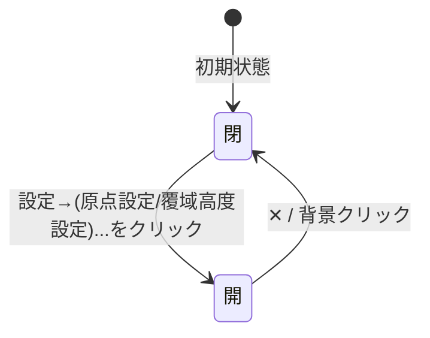

- 開閉状態はそれぞれ`ui_state::OriginDialogState`/`CoverageAltitudeDialogState`
  (どちらも`RwSignal<bool>`の単純なラップ)を`provide_context`で共有し、
  `MenuBar`(トリガー)・各ダイアログ本体(表示)の双方が`use_context`で参照する
- メニューのドロップダウン・フローティングパネルとも、背景の透明な`.menu-backdrop`/
  半透明の`.origin-dialog-backdrop`をクリックすると閉じる(パネル本体のクリックは
  `ev.stop_propagation()`でバックドロップまで伝播させない)
- 「ファイル」「表示」「ヘルプ」は現時点では項目未定のため、クリックすると
  「(準備中)」のプレースホルダのみ表示する(実装の骨組みだけ用意し、後から
  項目を追加できるようにしてある)
- 実装上の注意: メニュー項目のクリックハンドラで`WsConnection`(非`Copy`)を
  ムーブするクロージャ(`on_submit`)を、開閉のたびに何度も呼ばれる`Fn`/`FnMut`
  クロージャの外側で1回だけ作ると「2回目以降の呼び出しでムーブ済みエラー」に
  なる(Leptosの`{move || ...}`は再実行される前提のため`FnMut`である必要がある)。
  `origin_dialog.rs`では、開閉のたびに実行される内側のクロージャの中で
  `conn.clone()`してから`on_submit`を作ることで回避している(`coverage_altitude_dialog.rs`
  は`WsConnection`を持たずRwSignalのみで完結するため、この問題自体が発生しない)
- 覆域高度の変更をメインパネルの3D描画へ反映する経路: `coverage_altitude_dialog.rs`は
  `coverage_altitude_m`シグナルを更新するだけで、実際のジオメトリ再構築・再描画は
  `components/terrain_view.rs`のEffect(レーダー観測点の一覧・選択状態を購読していた
  ものに`coverage_altitude_m`も加えた)が担う。ダイアログ側とメインパネル側が
  別コンポーネントであっても、共有シグナル経由のリアクティブな購読だけで完結し、
  互いを直接呼び出す必要がない

### 7.8 シミュレーションステータスパネルの状態表示(AppStatus)

シミュレーションステータスパネルの状態表示は、バッジなどの装飾を付けず、C++側から配信された
`AppStatus.text`を**そのまま文字列として表示する**だけ。取得できない場合(WebSocketが
`ConnectionStatus::Connected`でない、または接続済みでもまだ`AppStatus`を受け取っていない)は、
詳細を出し分けず一律「接続中」とだけ表示する(`ConnectionStatus`ごとの色分け・文言の出し分けはしない)。

`AppStatus.text`の実体はC++側`Simulation::running_`(pause/resumeコマンドで変化)に
連動しており、`OriginState`の`origin_changed`と同じパターンで
`SimulationTickResult::app_status_changed`フラグを介して、値が変化した時と
接続直後にのみ配信する(毎フレームは送らない)。

---

## 8. UML図一覧(索引)

| 図 | 節 | 種別 |
|---|---|---|
| 前処理ツール処理フロー | 2.7 | フローチャート |
| 原点状態の状態遷移図 | 3.6 | ステートマシン図 |
| プロトコルのクラス図 | 4.6 | クラス図 |
| シーケンス図: 接続確立 | 4.7 | シーケンス図 |
| シーケンス図: set_origin | 4.8 | シーケンス図 |
| シーケンス図: VABボタン押下 | 4.9 | シーケンス図 |
| C++側スレッドモデル | 5.1 | フローチャート |
| C++側クラス図 | 5.3 | クラス図 |
| Rustコンポーネント構成図 | 6.1 | コンポーネント図 |
| WebSocket接続管理クラス図 | 6.2 | クラス図 |
| 再接続状態遷移図 | 6.3 | ステートマシン図 |
| 地形描画パイプライン | 6.4 | フローチャート |
| 地形描画クラス図 | 6.5 | クラス図 |
