# Sim3dView 詳細設計書

## 0. 本書の位置づけ

設計書は次の3層で構成する(全体の索引は[README.md](README.md))。

| 層 | 文書 | 内容 |
|---|---|---|
| 基本設計 | [BASIC_DESIGN.md](BASIC_DESIGN.md) | 背景・全体構成・技術スタック・確定した設計方針(17項目)・ディレクトリ構成 |
| 詳細設計(システム) | **本書** | 地形データの実態・前処理の方針・座標系・通信プロトコル・C++サーバー・ライブラリの設計方針(モジュール構成・図・「なぜそうしたか」)・サンプルアプリのUI |
| 詳細設計(ライブラリ実装仕様) | 本書 **9節** | 定数・アルゴリズム・バイト配置・手順・テストの要点を、実装コードから起こした仕様(シェーダー全文は`sim3dview/src/terrain/*.wgsl`) |

**役割分担(同じ事実を2か所に書かないための約束)**

- 数値・定数・アルゴリズム・バイト配置の**正はソースコード**。**9節はそれをコードから起こした要点**で、1〜8節の方針・理由・図と食い違って見えたら9節(とコード)が正しい(1〜8節を直す)。
  1〜8節は数値の書き写しを避け、**方針と理由(なぜ)・全体像・図**を持ち、詳細は各節から9節の該当節へ案内する
- 機能ごとの経緯(要望→調査→原因→修正→実機確認)は[DEVELOPMENT_HISTORY.md](DEVELOPMENT_HISTORY.md)。本書には結論だけを書く
- **節番号はソースコードのコメントから参照されている**(例: `DETAILED_DESIGN.md 6.10節`)。節の追加は枝番で行い、番号を詰め直さない
- 通信プロトコル(4節)・C++サーバー(5節)・サンプルアプリのUI(7節)は`sample/`(アプリ固有)の設計で、9節(ライブラリ実装仕様)の対象外

UML図はMermaid記法で記述している。GitHub/GitLab/VSCode等、Mermaidをネイティブサポートするツールでプレビューすればそのまま図として描画される。

---

## 1. 対象地形データの実態調査結果

入力はALOS全球数値地表モデル(ALOS World 3D-30m)のGeoTIFFタイル。当初は17タイル(北緯35〜40°・東経135〜140°)で調査し、その後`map_data/`が増えて
現在は**390タイル**(北緯20〜50°・東経120〜150°の30°四方)になっている。以下の性質はタイルが増えても変わらない。

### 1.1 ファイル構成(1タイルあたり)

`map_data/ALPSMLC30_<TILEID>_*` の形式で、1タイルあたり最大6ファイル。

| サフィックス | 内容 | 本設計での用途 |
|---|---|---|
| `_DSM.tif` | 数値表層モデル(標高、GeoTIFF, 3600×3600px) | **使用**(入力ラスタ) |
| `_MSK.tif` | 品質マスク(海・雲・代替データ補完等のフラグ) | **使用**(画素値3=海の判定のみ。1.4節) |
| `_STK.tif` | パンクロマチック(白黒)画像 | **不使用**(確定事項。標高グラデーション着色のみ) |
| `_HDR.txt` | タイルのヘッダ情報(四隅座標・解像度・楕円体等) | 前処理ツールのテスト・検証用の参考情報 |
| `_LST.txt` | 元シーン(観測パス)のリスト | 使用しない |
| `_QAI.txt` | 品質指標(SRTM/ASTERとの差分統計等) | 使用しない(1.4節の調査でMASK統計値との突き合わせにだけ使った) |

### 1.2 タイル分布と規模

- タイルID命名: `N<緯度2桁>E<経度3桁>` = タイル**南西角**の整数度。1タイル = 経緯度1°×1°、3600×3600px(1秒角)
- 現在の範囲は`metadata.json`の`geodetic_bounds`(北緯20〜50°・東経120〜150°)。30×30=900セルのうち、陸のある390枚が存在する
  (海だけのセルは元データに無いか、前処理が「陸なし」として出力しない。フロントでは存在しないタイルとして扱う)
- **外接矩形はハードコードではなく、`geotiff_preprocess`が見つかったタイルIDの最小/最大から実行時に決める**(2.3節)。
  `map_data/`に別の場所のタイルを増減しても、ツールを再実行するだけで追従する(サーバーは起動時に`metadata.json`を読むので、sim_serverの再起動も必要)
- 解像度: 1秒角(3600px/度)= 南北方向約30m/px、東西方向は緯度のcos分だけ狭い(北緯35°で約25m/px)

### 1.3 標高データの実態

- 標高範囲(全390タイル、単一画素の実測): **-330m 〜 3937m**(`metadata.json`の`elevation_min`/`elevation_max`)。17タイルの調査時は-102m〜3771m(富士山)
- 明示的なnodataセンチネル値(-9999等)は検出されなかった。海はDSM上では標高0mで格納されている(1.4節)
- データ型は符号付き整数(16bit相当)。前処理でf32メートルに変換し、出力はint16に四捨五入する
- 水面ノイズ由来の大きな負値が一部にあるため、標高の色の正規化では下限を`elevation_min`ではなく**0m固定**にしている(9.4節)

### 1.4 欠損・海域の扱い(方針)

前処理は、無データ領域を**f32のNaNで一律に表し**(標高0mの実在する陸地と区別するため)、出力グリッドでは`i16::MIN`(-32768、`NO_DATA`)にする。
フロントは`NO_DATA`のノードを海(=地形なし)と判定し、そのノードを含む三角形は描画しない(海岸線は最大1セル分陸側に退く)。
存在しないタイル・タイル内のNODATA・海マスクの水域は、すべてこの「地形メッシュが無いところ」になり、そこに水域レイヤーが描かれる(6.10節)。
`metadata.json`に欠損フラグは設けない(`NO_DATA`自体が目印になる)。`elevation_min`/`elevation_max`はNaNを除いた実データだけで計算する。

**タイル内部の海域は`*_MSK.tif`(マスクファイル)で検出する**: GDALの`GetNoDataValue()`だけでは、タイル内部で完結する海域(沿岸・内海)を検出できなかった。
実測で、DSMは海域画素に「標高0m」という一見有効な値を格納しており、対応する`*_MSK.tif`(DSMと同じ3600×3600、1バイト/画素)の画素値**3**が海に正確に対応することを、
`*_QAI.txt`の`MASK_NUM_SEA`統計との突き合わせで確認した(0=有効、3=海、4/12=代替データ[GSI10/PSM]で補完した陸地で、NaN化しない)。
マスクが読めないときは警告してNODATAだけの判定に落とし、処理は止めない(17タイルでの実測: モザイク全体のNaN率は約32%→約60%になり、沿岸・内海の精度が大きく改善した)。

**タイル内の小さなNODATA穴は周囲から補間して埋める**(「範囲内の欠損は周りから補間できる?」→「タイル内の小さな穴だけ補完で大丈夫」というやり取りによる仕様):
タイルが丸ごと無い大きな欠損は、補間しても実際の地形とは無関係な架空の起伏になるだけなので対象外(NaNのまま)。海は「欠損」ではなく「実際に海」なので補間の材料にも対象にもしない。
連結成分が2000画素(ネイティブ解像度で直径約1.5kmの円)以下の穴だけを、境界から内側へ波及させながら確定済み近傍の平均で埋める
(アルゴリズムは9.5節)。現在の`map_data/`にはGDALが検出するNODATAが無いため、このパスは実際には発火しない(別のDSMソースを使う場合に備えた対応)。

---

## 2. GeoTIFF前処理ツール仕様

`tools/geotiff_preprocess`(C++/GDAL、独立したCMakeプロジェクト)。バイト単位の出力契約は9.1節、アルゴリズムは9.5節で、
本節は方針と理由を述べる。

### 2.1 入力

`map_data/*_DSM.tif` を機械的に列挙する(ディレクトリを走査し、ファイル名から`N###E###`パターンを抽出してタイル位置を決定する。タイルの追加にそのまま対応できる)。

### 2.2 座標系(再投影は不要)

ALOS DSMタイルは元々EPSG:4326(WGS84/GRS80楕円体)の緯度経度グリッドで、1タイル=1°×1°=3600×3600pxちょうどに整列している(タイル境界での位置ズレなし)。
原点(=座標変換の基準)がUI入力によるランタイムパラメータであるため、前処理側で特定の投影に固定する意味がない。よって:

- **再投影(reproject)は行わない**。緯度経度グリッドのまま、タイルごとにダウンサンプリングするだけ
- 実際のメートル単位の座標(東/北/上)への変換は、UIで指定された原点をもとに**フロント側が実行時に行う**(3節)
- GDALの役目は「GeoTIFFの読み取り・ダウンサンプリング・書き出し」に限定される(`sim_server`本体はGDALをリンクしない)

### 2.3 外接矩形と処理単位(全域モザイクは作らない)

1. `discover_tiles()`: `map_data/`内の`*_DSM.tif`を走査し、ファイル名からタイルID(南西角の整数緯度経度)だけを読み取る(GDALでの実データ読み込みはまだ行わない、高速)
2. `compute_mosaic_bounds()`: 見つかった全タイルIDの最小/最大から外接矩形(max側は南西角+1)を求め、`metadata.json`の`geodetic_bounds`に書く
3. 各タイルを**独立に**読み込み、その場でレベルごとのグリッドを作って書き出す(ストリーミング。並列処理)

> **経緯**: 当初は全タイルを1枚のモザイク(18000×18000px等)にして2048×2048へ縮小していたが、対象域が390タイルになると全域モザイクは約46GBでメモリが限界になり、
> 1セルも約1.6kmまで粗くなったため、タイル単位の処理(下記のタイルLOD)に変えた。モザイクは作らないので、メモリは1スレッドあたり数百MB。

### 2.4 解像度レベル(タイルLOD)

> **経緯**: 単一メッシュのまま解像度を上げると頂点バッファがWebGPUの上限(既定256MB)を超えるため、**1度タイル単位の複数解像度(LOD)方式**にした。
> さらに最細レベルを元データの解像度(30m)にするため、**1度タイルを6×6のチャンクに分割**した(DEVELOPMENT_HISTORY.md「地形の高解像度化」「拡大時に元データの解像度(30m)まで表示」)。

タイル(1度x1度)ごとに、一辺を`N`セルに分割した`(N+1)x(N+1)`ノードのグリッドを複数のレベルで出力する。現在は5レベル(`kLevelCells`):

| レベル | 一辺のセル数N | セルの大きさ | 単位 |
|---|---|---|---|
| 0 | 60 | 約1.85km | タイル全体で1枚 |
| 1 | 180 | 約620m | チャンク(N/6=30セル) |
| 2 | 600 | 約185m | チャンク(100セル) |
| 3 | 1800 | 約62m | チャンク(300セル) |
| 4 | 3600 | 約31m(元データ=1画素) | チャンク(600セル、約36万頂点) |

- 各ノードの値は、そのノード位置を中心とする1セル幅の窓内の有効画素の**平均**(NaN除外。窓内に有効画素が1つでもあれば陸、全部NaNなら海=データなし)
- **チャンク**: レベル1以上は、1度タイルを6×6のチャンク(緯度経度とも1/6度、約18km×15km)に分け、チャンクごとにグリッドを持つ。隣のチャンクと縁のノードを共有するので、
  同じレベルのチャンク同士は縁が一致する。1タイル全体の30mグリッドは約1300万頂点でGPUバッファ上限を超えるため、カメラのすぐ近くのチャンクだけを最細にする
- 陸のないタイル(海のみ)は出力せず、存在しないタイルとして扱う(フロントでは標高0mの海と同じ扱い)

### 2.5 出力

| ファイル | 内容 | 備考 |
|---|---|---|
| `metadata.json` | 2.6節 | 全体の緯度経度範囲・標高範囲・楕円体・レベル定義(`tile_levels`)・チャンク分割数 |
| `tile_index.json` | 存在するタイルの一覧(`lat`,`lon`,`elevation_min`,`elevation_max`) | 緯度→経度の昇順 |
| `base.bin` | レベル0(タイル全体で1枚)を全タイル分、`tile_index.json`の順に連結 | 約2.9MB。フロントが起動時に全部取得して常時保持する |
| `tiles/L{k}/N035E138.bin` | レベルk(1以上)のタイル別ファイル。チャンクのレコードを連結 | 1タイルあたりレベル1が約69KB、2が約735KB、3が約6.5MB、4が約26MB(全体で約12GB) |
| `texture.png` | **生成しない** | 標高グラデーション着色を使うため不要 |

グリッドは`int16`(標高メートル、四捨五入)・リトルエンディアン・row-major。**行は南→北、列は西→東**、データなしは`-32768`。
GDALはラスタを北→南で格納するので、前処理はグリッド化の際に行順を南→北へ反転する(しないと地形が南北反転する。実装時に実際に発生し修正済み)。
`tiles/L{k}/*.bin`は、チャンク(番号=行(南→北)×6+列(西→東))を番号順に並べた**固定サイズのレコード**の連結なので、
フロントは**HTTP Range**で必要なチャンク1個分だけ取得できる。バイト位置・サイズの計算式は9.1節。

### 2.6 `metadata.json`

フィールドの定義・検証・書式(`setprecision(15)`等)は9.1節。各フィールドを置いた理由:

| フィールド | 理由・用途 |
|---|---|
| `tile_levels` | レベルごとの1度タイル1辺あたりのセル数(先頭がレベル0=最粗)。フロントはこの配列からレベル数・各グリッドの大きさを決めるので、前処理側で値を変えてもフロントの変更は不要(レベル1以上は`chunks_per_tile`で割り切れること) |
| `chunks_per_tile` | 1度タイルを何×何のチャンクに分けるか(レベル1以上) |
| `geodetic_bounds` | 全タイルの外接矩形(整数度)。原点入力のバリデーション(3.5節)・タイル索引の大きさ・範囲チェックに使う。サーバーも起動時にこれを読む |
| `elevation_min`/`elevation_max` | ダウンサンプリング前の全画素から実測。色の正規化は上限だけを使う(下限は0m固定。1.3節) |
| `ellipsoid`/`height_datum` | フロント側のENU変換(3節)のパラメータ(WGS84相当。DSMの標高はEGM96海抜) |
| `has_texture` | `texture.png`の有無を毎回fetch失敗で判定せずに済むよう明示フラグとして持つ(現在は常にfalse) |
| `default_origin` | UIの原点入力欄の初期値。実際に使われる原点はサーバーが保持する状態(`OriginState`。5節)が正で、これは未接続時のUI初期表示用 |

### 2.7 前処理ツール処理フロー(UML: アクティビティ相当のフローチャート)

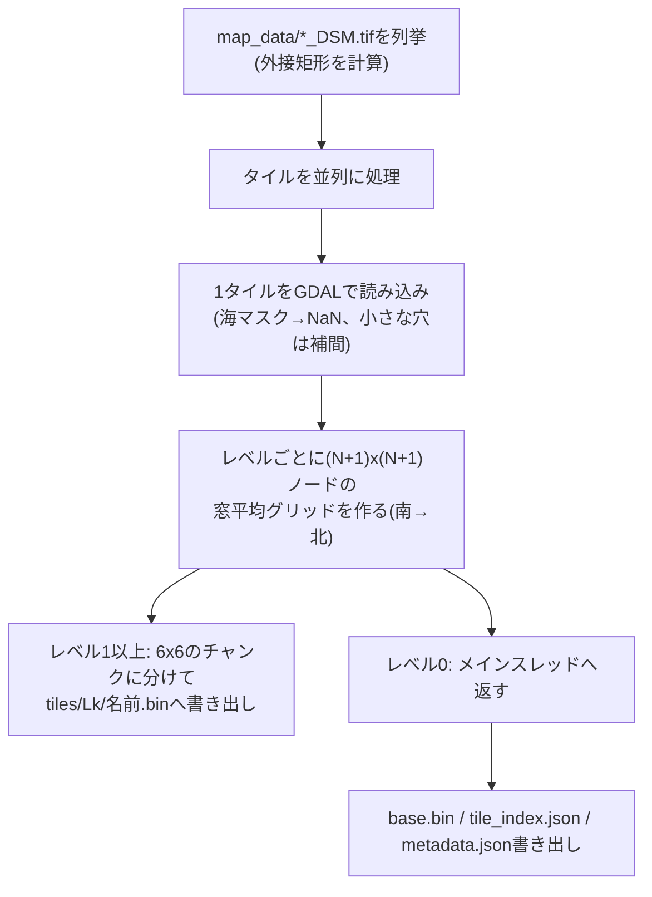

---

## 3. 座標系設計(ENU座標系)

### 3.1 定義

- シミュレーション座標系 = **東=X、北=Y、鉛直上向き=Z** の局所ENU(East-North-Up)座標系
- 原点 = UIで入力された緯度経度地点の、**海抜0mの点**(実装上は、DSMの海抜をそのまま楕円体高として扱うので、その地点の楕円体高0mの点。3.2節)
- デフォルト原点(試験用): 北緯35°21'20"、東経138°51'35"(10進: 35.355556°, 138.859722°)。
  地形データの範囲内(タイル`N035E138`内、富士山付近)に収まっている

### 3.2 変換式(緯度経度+標高 → ENU)

地形グリッドの各点は`(lat, lon, h)`(hはDSMの標高値=海抜メートル)で表現される。原点`(lat0, lon0)`が
決まれば、標準的な測地座標→ECEF→ENU変換で一意にメートル座標が求まる。GRS80楕円体
(`metadata.json`の`ellipsoid`)を用いる。

```
a  = 6378137.0                      // 長半径
f  = 1 / 298.257222101              // 扁平率
e2 = f * (2 - f)                    // 離心率の2乗

// 1) 測地座標 → ECEF
N(lat) = a / sqrt(1 - e2 * sin(lat)^2)
X = (N(lat) + h) * cos(lat) * cos(lon)
Y = (N(lat) + h) * cos(lat) * sin(lon)
Z = (N(lat) * (1 - e2) + h) * sin(lat)

// 2) 原点(lat0, lon0, h0=0)のECEFを基準に差分を取り、原点でのローカル座標系に回転(ENU)
dX = X - X0,  dY = Y - Y0,  dZ = Z - Z0

East  = -sin(lon0)*dX + cos(lon0)*dY
North = -sin(lat0)*cos(lon0)*dX - sin(lat0)*sin(lon0)*dY + cos(lat0)*dZ
Up    =  cos(lat0)*cos(lon0)*dX + cos(lat0)*sin(lon0)*dY + sin(lat0)*dZ

// シミュレーション座標
sim_x = East
sim_y = North
sim_z = Up
```

- 高さの扱い: DSM値はEGM96ジオイド基準の海抜(orthometric height)であり、上式の`h`にそのまま使う
  (ジオイド高と楕円体高の差は本設計では無視する簡略化。日本周辺のジオイド高は数十m規模で最細セル(約30m)と同程度以上のため、
  標高の絶対値の厳密さが要る用途では見直しが必要になる)
- 地球の曲率は上式に自然に反映される(遠方の地点ほど`Up`が減少していく。原点から1,000kmで約80km)。広域では
  原点から離れるほど地表が「下に沈んで」見える効果が正しく表現される
- Rust実装は `sim3dview/src/terrain/geodesy.rs` の `EnuTransform` 構造体(前計算するもの・逆変換・水域シェーダー用の係数は9.3節)。C++側(サーバー)は
  座標変換自体を行わず、緯度経度のみを状態として保持する(5.3節参照)。

### 3.3 計算をどこで行うか

- **前処理(C++/GDAL)側では行わない**。タイルのグリッドと`metadata.json`は原点非依存の生データのまま
- **フロント側(Rust/WASM)がメッシュ構築時・原点変更時にランタイムで計算する**。常駐する全タイル
  (数百万頂点)の変換を原点ごとに1回行う。行(緯度)・列(経度)ごとの三角関数を前計算して1頂点あたりの
  計算を軽くしてあり、WASM上でも実用上問題ない速度で完了する
- 原点を変更したら、常駐している全タイル(各自の解像度レベル)の頂点バッファを再計算・再アップロードする
  (タイルデータの再フェッチは不要。インデックスは原点に依存しないので作り直さない)

### 3.4 原点の変更タイミングとガード

原点はシミュレーション座標系の定義そのものであり、シミュレーション実行中に変更すると
C++側・フロント側双方の状態(位置、地形メッシュ)がずれるリスクがある。

- **シミュレーション開始前(停止中)のみ原点変更可能**とし、実行中はUIの原点入力をロックする
- 原点はサーバー(C++側)が正とする状態であり、UIはサーバーから配信された値を表示・編集する
- C++側は原点についてUIとは別の内部表現を持たない。サーバーが保持する原点state
  (`OriginState`として配信される値)を唯一の真実とする

### 3.5 原点入力のバリデーション

- UIの原点入力フォームは、`metadata.json`の`geodetic_bounds`の範囲を入力可能な値の上下限として使い、
  範囲外の値は**入力欄への入力段階でブロックする**か、送信ボタンを無効化する
- サーバー側でも同じ範囲チェックを行う(フロントのバリデーションを回避するクライアントに対する防御的
  チェック)。範囲外の`set_origin`が送られてきた場合は`CommandError`を返す。範囲は`Simulation`の
  コンストラクタが起動時に`assets/terrain/metadata.json`の`geodetic_bounds`から読む(ハードコードしない。
  読めなかった場合はチェックを無効にして警告を出す)

### 3.6 原点状態の状態遷移図

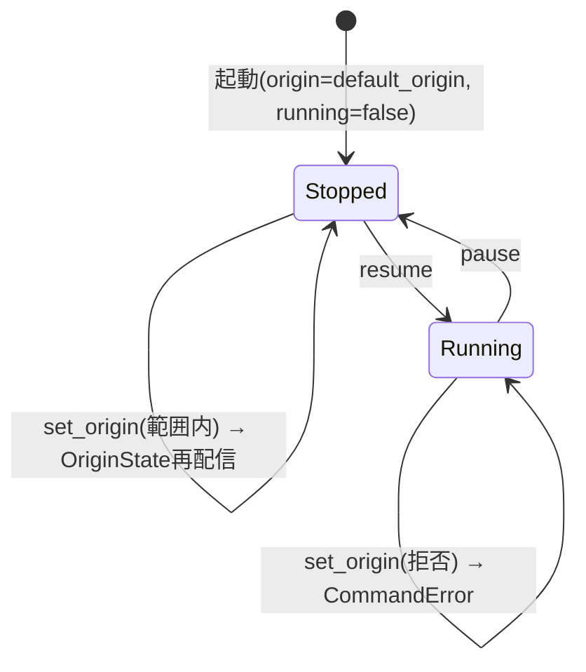

---

## 4. 通信プロトコル詳細

### 4.1 メッセージフレーミング

serdeの`tag`機能をC++側で素朴に再現するのは実装コストが高いため、**先頭1バイトをメッセージタイプ
識別子、残りをMessagePackボディとする自前フレーミング**を採用する(サーバー→クライアント方向のみ)。

```
[1 byte: msg_type] [N bytes: MessagePack body]
```

クライアント→サーバー方向(`ClientCommand`)はメッセージ型が1種類のみのため、プレフィックスバイトを
付けず、MessagePackボディのみを送信する。

msgpackへのシリアライズは、Rust側(rmp-serde)・C++側(msgpack-cxxの`MSGPACK_DEFINE`)ともに
**構造体を配列(フィールド宣言順の位置)としてエンコードする**方式を採る(mapではない)。したがって
両言語の構造体定義は**フィールド宣言順を完全に一致させる必要がある**(片方だけ並び替えるとデータが
壊れる)。

### 4.2 msg_type 一覧

| 値 | 名前 | 方向 | 送信タイミング |
|---|---|---|---|
| 0x01 | SimState | Server→Client | 高頻度(約60Hz) |
| 0x02 | VabConfig | Server→Client | 状態変化時、接続直後にも1回 |
| 0x03 | OriginState | Server→Client | 状態変化時、接続直後にも1回、全クライアントへbroadcast |
| 0x04 | StatusPanelConfig | Server→Client | 状態変化時、接続直後にも1回 |
| 0x05 | CommandError | Server→Client | コマンド拒否時。**要求元クライアントのみ**に送信 |
| 0x06 | AppStatus | Server→Client | 状態変化時(pause/resume)、接続直後にも1回、全クライアントへbroadcast |
| 0x07 | TrackList | Server→Client | シミュレーション進行中は約20Hz(SimStateの3フレームに1回)、接続直後にも1回。停止中は送らない |
| (なし) | ClientCommand | Client→Server | ユーザー操作時 |

### 4.3 メッセージ型定義

**SimState**(サーバー→クライアント、高頻度)
```
t: f64                      // シミュレーション時刻(秒)。running中のみ進む
positions: Vec<f32>         // ダミーの単一点位置([x, y, z])。実際の可視化対象は将来拡張
frame_id: u32               // フレーム番号。running状態に関わらず毎ステップ増加
status_values: Vec<f64>     // StatusPanelConfig.items と同じ順序・同じ数
```

**VabConfig**(サーバー→クライアント、状態変化時のみ)
```
rows: u32
cols: u32
buttons: Vec<VabButton>
  VabButton:
    id: String
    label: String            // 空文字列 = 「未使用の穴」(6.2節)
    enabled: bool
```

**OriginState**(サーバー→クライアント、状態変化時+接続直後)
```
lat_deg: f64
lon_deg: f64
```

**StatusPanelConfig**(サーバー→クライアント、状態変化時+接続直後)
```
items: Vec<StatusItem>
  StatusItem:
    id: String
    label: String
    unit: String              // 単位。なければ空文字列
```

**CommandError**(サーバー→クライアント、要求元のみ)
```
command_type: String          // 拒否されたClientCommand.type
message: String                // エラー内容(人間可読)
```

**AppStatus**(サーバー→クライアント、状態変化時+接続直後。7.7節)
```
text: String                   // シミュレータアプリケーション自体の状態文字列
                                // (例: "シミュレーション実行中" / "一時停止中")
```

**TrackList**(サーバー→クライアント、進行中は約20Hz+接続直後。6.12節)
```
t: f64                         // シミュレーション時刻(秒)
tracks: Vec<Track>             // 全トラックの最新状態(消えたトラックは次の一覧から抜ける)
  Track:
    id: u32                    // 同じ実体には常に同じID(フロントの航跡・ラベルの対応づけ)
    kind: u8                   // 0=不明 1=固定翼機 2=ヘリ 3=艦船 4=地上車両 5=ミサイル
    affiliation: u8            // 0=不明 1=友軍 2=敵 3=中立
    label: String              // 表示名(コールサイン等)
    lat_deg: f64
    lon_deg: f64
    alt_m: f64
    alt_ref: u8                // 0=alt_mは海抜 1=地表からの高さ(サーバーが地形の高さを持たない車両など)
    heading_deg: f64           // 進行方向(北から時計回り)
    speed_mps: f64             // 対地速度
    pitch_deg: f64             // ピッチ(機首上げが正)。3Dモデル(6.13節)の向きに使う。古いサーバーが送らなければ0
    roll_deg: f64              // ロール(右翼が下がる向きが正)。同上
```

**ClientCommand**(クライアント→サーバー)
```
type: String                   // "vab_press" / "pause" / "resume" / "set_param" / "set_origin"
button_id: String              // vab_press時のみ使用
value: f64                     // set_param時のみ使用
lat_deg: f64                   // set_origin時のみ使用
lon_deg: f64                   // set_origin時のみ使用
```

### 4.4 送信頻度

- シミュレーションループ(simスレッド)は約60Hz(16ms間隔)で駆動する
- `VabConfig`/`OriginState`/`StatusPanelConfig`は変化があったときのみ送信(毎フレーム送らない)
- `TrackList`は全トラックの最新状態をまとめて、シミュレーション進行中だけ約20Hzで送る(3フレームに1回)。位置は
  シミュレーション時刻の関数で、停止中は変わらないので送らない(新規接続には接続直後に1回)。フロントの描画は全体の再描画になるので、
  60Hzで送らずに表示に十分な頻度に抑えている

### 4.5 WebSocket再接続処理(フロント側)

- 再接続間隔は**指数バックオフ**(初回1秒、以後2倍ずつ、上限30秒でキャップ)
- バックオフ間隔に**ジッター(±300ms)**を加える(サーバー再起動時のサンダリングハード回避)
- **ブラウザタブが非表示の間は再接続の試行を一時停止**する(Page Visibility API)。タブがアクティブに
  戻ったタイミングで即座に再接続を再開する(バックオフの残り時間を待たない)
- リトライ回数の上限は設けない(タブが表示されている間は無制限にリトライ)
- 再接続成功後は、サーバーから`OriginState`/`VabConfig`/`StatusPanelConfig`が接続直後の仕様により
  再送されるため、フロント側の表示状態は自然に復旧する

### 4.6 プロトコルのクラス図

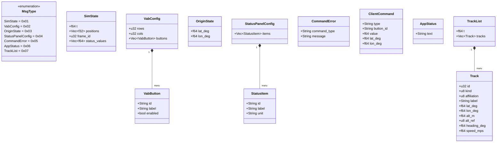

### 4.7 シーケンス図: 接続確立

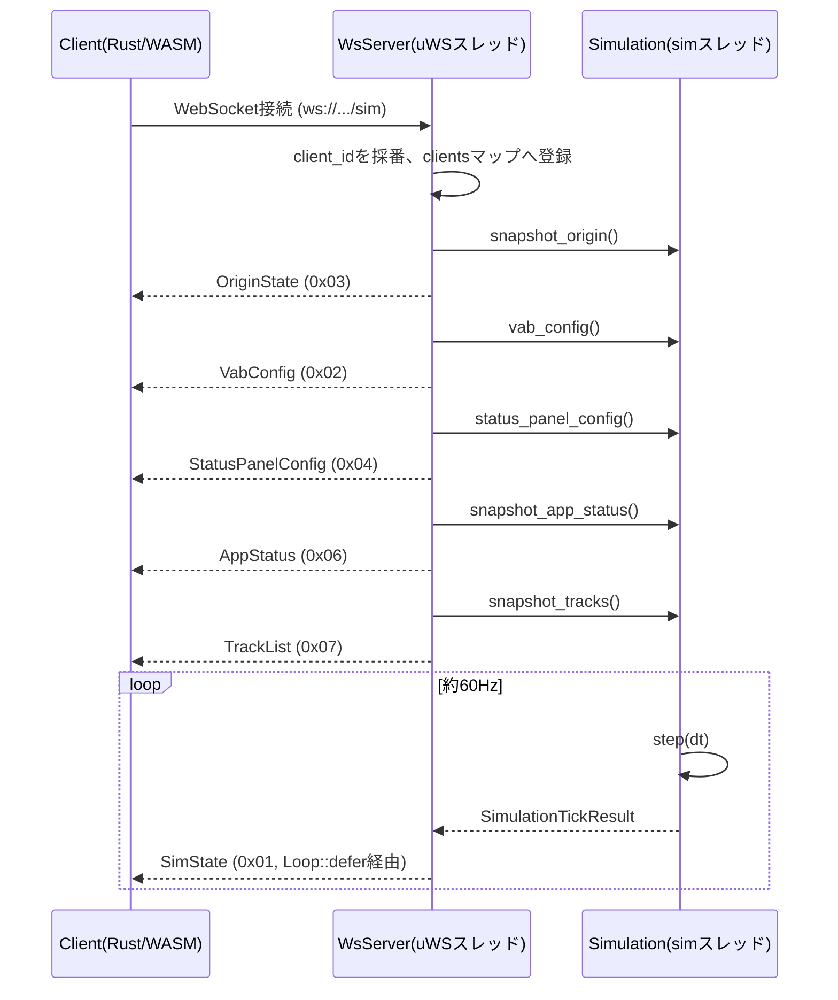

### 4.8 シーケンス図: set_origin(成功/拒否)

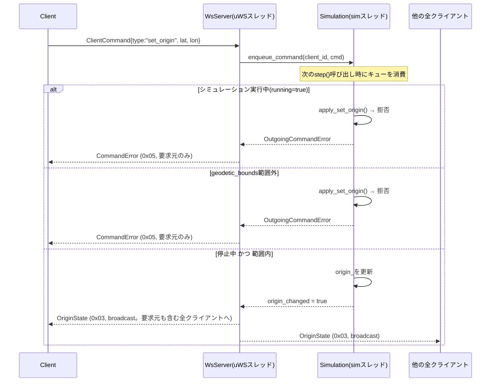

### 4.9 シーケンス図: VABボタン押下

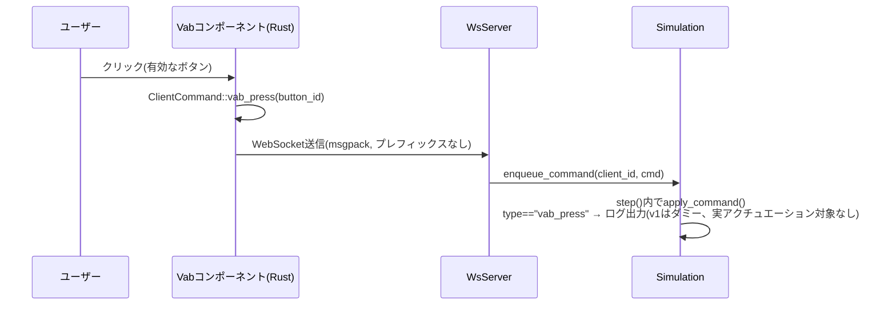

---

## 5. C++側詳細設計

### 5.1 スレッドモデル

- **uWSイベントループスレッド**: `WsServer::run()`を呼んだスレッド。HTTP/WebSocketの送受信を担当。
  `uWS::App`はシングルスレッド前提のため、このスレッド以外から`ws->send()`を直接呼んではならない
- **simスレッド**: `WsServer::run()`内で`std::thread`として起動。`Simulation::step()`を約60Hz
  (16ms間隔)で呼び続ける
- simスレッドからuWSスレッドへ処理を戻す(実際の送信を行わせる)には、必ず`uWS::Loop::defer()`を
  経由する

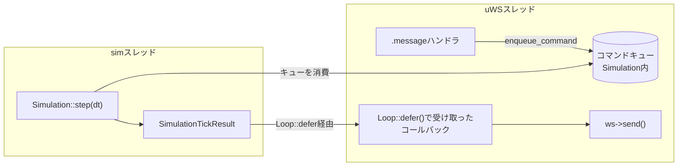

### 5.2 コマンド処理フロー

- `.message`ハンドラで受信したコマンドは**直接シミュレーション状態を書き換えず**、
  `Simulation::enqueue_command()`でスレッドセーフなキュー(`std::deque` + `std::mutex`)に積む
- simスレッド側で`step()`の**前半**でキューを消費してから、物理状態(`t_`等)を更新する
- `step()`の戻り値`SimulationTickResult`に、そのステップで発生した`CommandError`と
  `origin_changed`フラグが入っており、uWSスレッド側がこれを見て適切な送信(broadcast/単一送信)を行う

### 5.3 クラス図

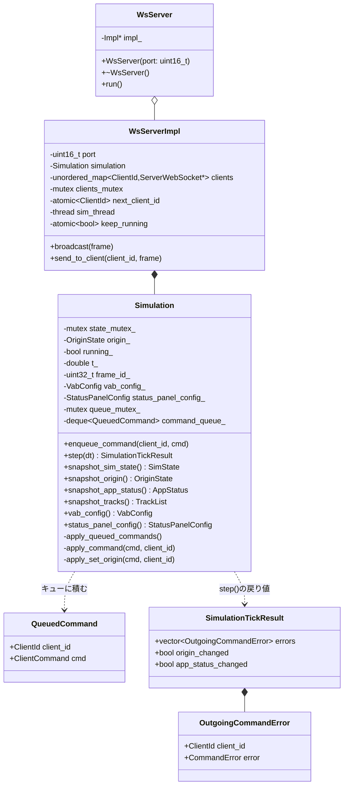

### 5.4 HTTP静的配信(地形データ)

`sim_server`は`/sim`(WebSocket)とは別に、以下のHTTP GETルートを持つ:

| パス | Content-Type | 内容 |
|---|---|---|
| `GET /terrain/metadata.json` | application/json | `assets/terrain/metadata.json`をそのまま返す |
| `GET /terrain/tile_index.json` | application/json | `assets/terrain/tile_index.json`をそのまま返す |
| `GET /terrain/base.bin` | application/octet-stream | `assets/terrain/base.bin`(全タイルの最粗レベルの連結)をそのまま返す |
| `GET /terrain/tiles/:level/:name` | application/octet-stream | `assets/terrain/tiles/{level}/{name}`(例: `L2/N035E138.bin`)。`level`・`name`は英数字・`_`・`.`のみ許可し、`..`を含むものは400(パストラバーサル対策)。**HTTP Range(単一範囲`bytes=a-b`)に対応**し、大きいファイル(最細レベルで1タイル約26MB)からチャンク1個分だけを206で返せる |

**キャッシュ**: 4つのルートとも、応答に`ETag`(ファイルの大きさ+更新時刻)と`Cache-Control: no-cache`を付ける。ブラウザは保存した
応答を使う前に毎回`If-None-Match`で確認し、変わっていなければ本体なしの**304**が返る(`*`・`W/`付き・カンマ区切りにも対応)。
2回目以降の表示で数十MBを取り直さずに済み、`map_data/`を作り直したときはETagが変わるので必ず新しいものになる
(有効期限(`max-age`)は付けない。古い地形を使い続ける事故を避けるため)。

フロント(trunk serveでホストされる別オリジン)からfetchされるため、全ルートとも
`Access-Control-Allow-Origin: *`ヘッダーを付与する。想定CWD(カレントディレクトリ)は`sim_server/`
(`assets/terrain/...`という相対パスでファイルを開くため)。

### 5.5 GeoTIFF前処理ツール(geotiff_preprocess)のクラス構成

`tools/geotiff_preprocess/main.cpp`に実装(単一ファイル、`sim_server`本体とは別のCMakeプロジェクト・別実行ファイル。sim3dviewライブラリの一部としてリポジトリ直下の`tools/`に置く)。

| 関数/構造体 | 役割 |
|---|---|
| `GeodeticBounds` | 出力`metadata.json`の`geodetic_bounds`(整数度の外接矩形) |
| `TileId` | ファイル名から抽出した`(lat, lon)`整数度 |
| `parse_tile_filename()` | `"ALPSMLC30_N035E138_DSM.tif"` → `TileId{35, 138}` |
| `DiscoveredTile` | `TileId` + ファイルパス(まだGDAL読み込みはしていない) |
| `discover_tiles()` | map_dataディレクトリをglobし、ファイル名からタイルIDだけを列挙(1段階目) |
| `MosaicBounds` | モザイクの外接矩形(整数度)。ハードコードではなく実行時に計算する値 |
| `compute_mosaic_bounds()` | 見つかった全タイルIDの緯度・経度の最小/最大から外接矩形を求める |
| `SourceGrid` | GDALで読み込んだ1タイル分の標高グリッド + 地理範囲 |
| `load_sea_mask()` | 対応する`*_MSK.tif`を読み、画素値3(海)の位置をビットマップで返す(1.4節) |
| `fill_small_nodata_holes()` | 海ではない小さなNODATA穴(連結成分が`kMaxFillableHolePixels`以下)を周囲の有効画素からBFSで補間して埋める(1.4節) |
| `load_dsm_tile()` | GDALでGeoTIFFを1枚読み込む(再投影しない)。小さなNODATA穴は補間、残ったNODATA画素+マスク海域画素はNaNへ置換 |
| `tile_name()` | タイルIDから`"N035E138"`形式の名前を作る(フロントのURLと一致させる) |
| `build_level_grid()` | 1タイルの標高から、レベルごとの`(N+1)x(N+1)`ノードの窓平均グリッド(南→北・int16)を作る(2.4節) |
| `write_chunked_level_file()` | タイル全体のグリッドを6x6のチャンク(縁のノードは隣と共有)に分け、固定サイズのレコードとして連結して書き出す(2.5節) |
| `process_tile()` | 1タイルを読み込み、全レベルのグリッドを作る。レベル1以上はその場でチャンク形式のファイルへ書き出し、レベル0はメインへ返す |
| `TileResult` | `process_tile()`の結果(タイル位置・標高の最小最大・レベル0のグリッド) |
| `write_int16_file()` / `write_tile_index_json()` / `write_metadata_json()` | 出力ファイル書き出し |
| `main()` | タイル列挙→並列処理→`base.bin`連結→索引・メタデータ出力 |

---

## 6. Rust側詳細設計

> **注記(ライブラリ/サンプル分離後の対応関係)**: Rust側は`sim3dview`ライブラリcrateと`sample/sim_frontend`サンプルアプリcrateに分かれている
> (経緯はDEVELOPMENT_HISTORY.md「sim_frontendをライブラリとサンプルアプリに分離」)。本節は**ライブラリ(`sim3dview`)の設計**が中心で、
> 6.1〜6.3の図には`sample/sim_frontend`側(通信・全体レイアウト)も含む。数値・アルゴリズムの要点は9節(下表の「実装仕様」列)。
>
> - **`sim3dview`ライブラリ**: 地形描画パイプライン・カメラ・座標軸・標高配色・シェーダ・LOS/覆域計算・markers・pick・作図・航跡(6.2を除く本節)、
>   7.6節のTabbedPanel、7.7節のフローティングパネル・右クリックメニュー・原点設定/覆域高度設定ダイアログの実装本体
> - **`sample/sim_frontend`サンプルアプリ**: 4節の通信プロトコル(`protocol.rs`/`ws.rs`)、6.2・6.3の接続管理、`app.rs`(全体レイアウト)、7.4節のVAB、7.5節の状況パネル、7.7節のメニューバー(トリガーのみ)
> - ライブラリは通信プロトコルもサーバーのURLも知らない。原点は`terrain::origin::OriginState`(プロトコル非依存)で受け、`app.rs`が`protocol::OriginState`⇔ライブラリの橋渡しEffectを持つ。
>   地形の取得先も、呼び出し側(`app.rs`)が`base_url`として明示的に渡す

### 6.0 ライブラリ(`sim3dview`)のモジュール構成

公開(`pub mod`)は、アプリが使う`camera`・`draw_tool`・`drawing`・`hillshade`・`markers`・`origin`・`origin_pick`・`recenter`・`store`・`tracks`と`ui`だけで、
それ以外は`pub(crate)`(ライブラリの内部。詳細は9.13節)。

| 領域 | モジュール | 役割 | 実装仕様 |
|---|---|---|---|
| データ | `terrain::fetch` | metadata.json・tile_index.json・base.bin・タイルのHTTP取得(Range含む) | 9.2 |
| | `terrain::loader` | `TerrainData`(取得済みグリッドの保持・双線形サンプリング・キャッシュの追い出し)・メタデータ型 | 9.2 |
| 測地 | `terrain::geodesy` | `Ellipsoid`(`WGS84`)・`EnuTransform`(緯度経度⇔ENU。回転は`DMat3`) | 9.3 |
| | `terrain::heightmap` | 標高サンプリング(`sample_heightmap`)・地表点のENU座標(`ground_at_enu`/`ground_at_geodetic`) | 9.3 |
| | `terrain::origin` | `Origin`・`OriginState` | 9.13 |
| メッシュ・LOD | `terrain::mesh` | 頂点・インデックス・法線・スカート・配色 | 9.4 |
| | `terrain::lod` | LOD計画(`plan_levels` = `evaluate_tile` → 並べ替え → `allocate_levels`)。`TileLayout` | 9.7 |
| 描画 | `terrain::renderer` | `TerrainRenderer`(状態と3つの描画パス)。`pipelines`・`targets`(深度/MSAA/縮小)・`uniforms`・`overlay`(頂点バッチ)・`frustum` | 9.9 |
| | `terrain::vertex`・`terrain::render_bias` | 作図・航跡・マーカー共通の頂点`DrawVertex`(種類`KIND_*`)・Zバイアスの一覧 | 9.9・9.10 |
| 図形・航跡 | `terrain::drawing`・`drawing_geometry`・`draw_tool`・`tracks`・`markers` | 6.9・6.11・6.12節 | 9.10〜9.12 |
| 3Dモデル(おまけ) | `terrain::models`(`gltf_import`・`placement`・`types`・`model.wgsl`)・`renderer::model_batch` | 航跡をglTFの3Dモデルで描く(6.13節) | 9.15 |
| 計算 | `terrain::los`・`profile`・`pick`・`camera` | 見通し(`RayContext`)・断面・ピッキング・カメラ | 9.6・9.8 |
| UI | `ui::terrain_view`(`mod.rs`=コンポーネント、`state`・`frame`・`lod_driver`・`overlay`・`labels`・`picking`・`models`) | 地図canvas | 9.13 |
| | `ui::context_menu`(`MapMenuState`を含む)・`floating_panel`・`tabbed_panel`・`origin_dialog`・`drawing_editor`・`model_settings_dialog`・`util` ほか | 汎用部品・ダイアログ | 9.14 |

**テスト**: `cargo test -p sim3dview`(ネイティブ)。`TerrainData::synthetic`(`cfg(test)`)で合成地形を作り、標高サンプリング・丸み込みの`ground_at_enu`・LODの予算配分・反転Z・`screen_to_ray`・
電波の地平線(見通し)・視錐台カリングなどを検証する。WGSL(`terrain.wgsl`・`draw.wgsl`)は`naga`で構文・型を検証し、uniform・頂点のレイアウトがRust側の構造体と一致することを確かめる
(方針は[IMPLEMENTATION_GUIDE.md](IMPLEMENTATION_GUIDE.md) 4.3、テストの要点は9節の各「検証」)。

### 6.1 コンポーネント構成図

```mermaid
graph TD
    App["App (app.rs)<br/>3カラムCSS Gridレイアウト・リサイザー"]
    App --> SimulationStatusPanel["SimulationStatusPanel<br/>(operation_panel.rs) 接続状態・原点・フレーム・航跡数(表示専用)"]
    App --> VabPanel["VabPanel<br/>(vab.rs) 先頭行=カテゴリタブ、中段先頭4枠=スクショ/録画/開始/一時停止、残り+下段=フロント側ダミー"]
    App --> MainPanel["MainPanel<br/>(main_panel.rs) 地形描画canvas(3D/2D, TerrainView)"]
    App --> TopStatusPanel["TopStatusPanel<br/>TabbedPanel: [各種情報]=StatusPanel / [航跡情報]=TrackDetail"]
    App --> BottomStatusPanel["BottomStatusPanel<br/>TabbedPanel: [断面図]=CrossSectionView / [見通し範囲]=LosView"]
    App --> DrawingWindow["DrawingWindow<br/>(drawing_window.rs) 非モーダルFloatingPanel+DrawingEditor(7.7節)"]
    App --> ContextMenu["ContextMenu<br/>右クリックメニュー本体(項目はmap_menu.rsが決める。7.7節)"]

    App -.provide_context.-> WsSignals["WsSignals<br/>(接続状態・受信データのシグナル群)"]
    App -.provide_context.-> TerrainStore["TerrainStore<br/>(地形データを全パネルで共有)"]
    App -.provide_context.-> RadarMarkersState["RadarMarkersState<br/>(観測点一覧・選択状態、全パネル共有)"]
    App -.provide_context.-> DrawToolState["DrawingState / DrawToolState<br/>(作図の一覧・図形の対話作成。6.11節)"]
    App -.provide_context.-> TracksState["TracksState<br/>(航跡の一覧・選択・表示設定。6.12節)"]
    App -.provide_context.-> MenuStates["ContextMenuState / MapMenuState<br/>(右クリックメニューの状態と、地図の項目を作る関数)"]
    App -.propとして渡す.-> WsConnection["WsConnection<br/>(Rc<RefCell<...>>、Send/Sync境界回避のためcontext不使用)"]

    MainPanel --> Loader["terrain::fetch / terrain::loader<br/>metadata.json・base.bin・タイル取得"]
    MainPanel --> Mesh["terrain::mesh<br/>ENU変換・頂点/インデックス生成"]
    MainPanel --> Renderer["terrain::renderer::TerrainRenderer<br/>wgpu Device/Queue/Pipeline(地形・水域)+draw系パイプライン(観測点ピン/2D覆域/作図/航跡)"]
    MainPanel --> Camera["terrain::camera::OrbitCamera<br/>view_proj行列・screen_to_ray"]
    MainPanel --> Pick["terrain::pick::pick_lat_lon<br/>クリック→レイキャストで緯度経度取得(右クリックメニュー・作図・原点指定)"]
    MainPanel --> Markers["terrain::markers::build_marker_geometry<br/>観測点・覆域の3D頂点生成"]
    BottomStatusPanel --> Los["terrain::los::compute_los<br/>全方位角の見通し限界距離"]
    TerrainStore -.共有データ.-> MainPanel
    TerrainStore -.共有データ.-> BottomStatusPanel
    RadarMarkersState -.共有データ.-> MainPanel
    RadarMarkersState -.共有データ.-> BottomStatusPanel
```

### 6.2 WebSocket接続管理のクラス図(サンプルアプリ側)

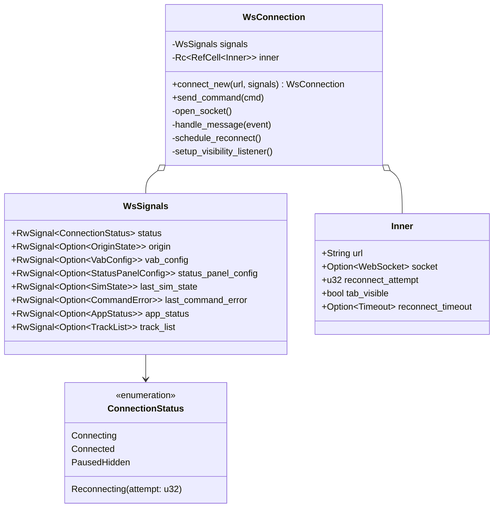

`WsConnection`は`Rc<RefCell<Inner>>`を内部に持ちSend/Syncではないため、Leptos 0.8の`provide_context`(Send+Sync境界を要求する)には乗せられない。
そのため`WsSignals`はcontext経由、`WsConnection`は`WsHandle`(`StoredValue::new_local`で包んだ`Copy`のハンドル。`Send`+`Sync`を満たす)に包み、
コンポーネントのpropとして明示的に渡す設計とした(以前は`unsafe impl Send/Sync`を付与していたが、ハンドル化して`unsafe`を無くした)。

### 6.3 再接続状態遷移図

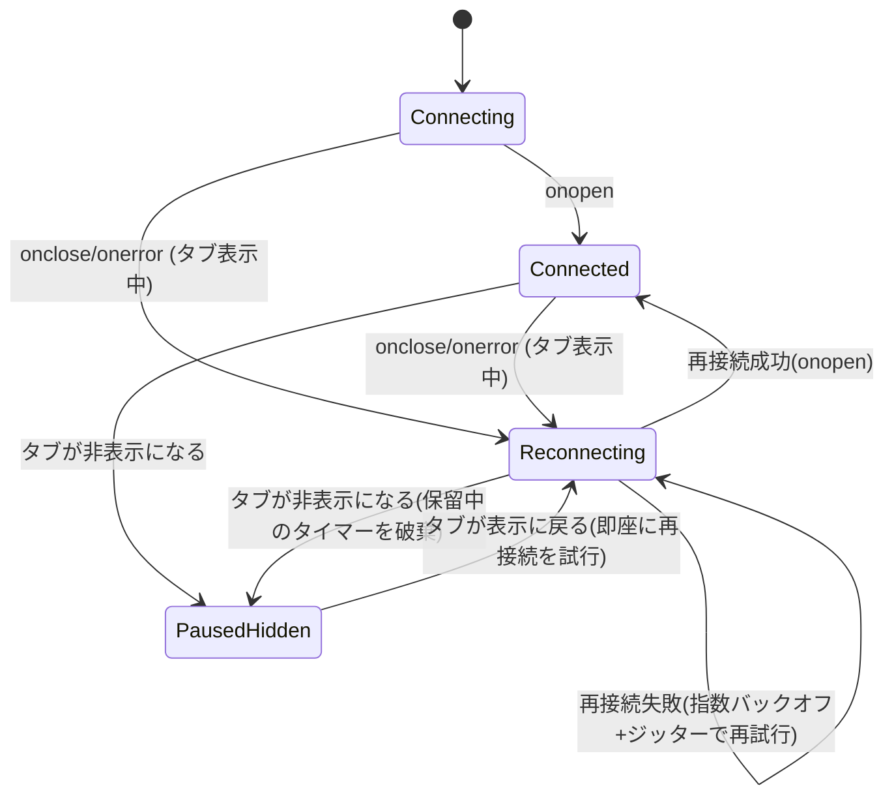

### 6.4 地形描画パイプライン

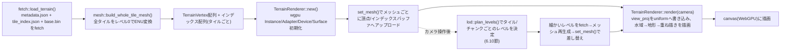

3つの描画パス(①地形・水域・絶対座標の重ね描き ②カメラ固定の重ね描き ③縮小)の構成と`TerrainRenderer`の公開APIは9.9節。

### 6.5 地形描画クラス図


### 6.6 座標軸の扱い(ENU→wgpu)

ENU座標系(東=X, 北=Y, 上=Z)は右手系(East×North=Up)。wgpu/glamの一般的な慣習であるY-upとは軸の意味が異なるが、**頂点データ自体は変換せず**、カメラのビュー行列側で吸収する:

- ビュー行列は`look_at`のup方向として`Vec3::Z`を明示的に渡す(2D=真上からの表示だけは視線がZ軸と平行になり特異点になるので、北(Y軸)を上にする)
- 射影行列はwgpu/Vulkan/Metal互換の深度範囲0〜1(glamの`directx`系)を使い、**反転Z+有限far**にしている(理由は9.6節。
  `screen_to_ray`(ピッキング)・水域の視線も反転Zと整合させる)。OpenGL互換の[-1,1]は使わない
- ENUがそもそも右手系であるため、`_rh`系の関数とそのまま整合し、軸の入れ替えによるハンドネス反転を気にする必要がない

**カメラが地面の下にもぐらない制限**(3Dモード): `OrbitCamera::keep_above_ground`が、視点(カメラ位置)を、その真下の地面の高さ+`MIN_EYE_CLEARANCE_M`(30m。最細の地形のセルと同程度)以上に保つ。
地面の高さは、呼び出し側(`ui::terrain_view::keep_camera_above_ground`)がいま画面に出している地形から`heightmap::ground_at_enu`で引く(地球の丸み込み、海・データ範囲外は海抜0m)。
カメラ操作・原点変更・LOD切り替えのあとの描画の前に必ず通る。方針:

- まず**距離を保ったまま仰角を上げる**(ドラッグで下へ回したとき、地面の高さで止まる操作感)。仰角は視点の水平位置と一緒に変わって真下の地面の高さも変わるので、数回繰り返して収束させる
- 仰角を最大まで上げても届かない場合(近すぎるズームイン・注視点の周りが高い地形)は、視点を真上に持ち上げ、注視点との距離・仰角をそこから求め直す(水平位置は変えない)
- 仰角は水平より下向き(注視点を見上げる)にもなりうる(谷底から山頂を見上げるのは地面の上なので許す)。以前は注視点の高さを基準に`MIN_PITCH`だけで制限していたため、下へ回すと視点が地面の下に入り、地形の裏側が見えていた
- 2Dモード(正射影)は視点の高さが見た目に関係しないので何もしない

正確な式は9.6節。

### 6.7 標高グラデーション配色と海の扱い

標高を`elevation_max`で正規化(下限は0m固定)し、5点のカラーストップ(低地=深緑 → 緑 → 黄土 → 茶 → 山頂=白に近い明色)で線形補間する。色の値・式は9.4節。

**海(データなし)の扱い**: `NO_DATA`のノード(1.4節)は描画しない。頂点positionはNaNだと破綻するため標高0mで配置するが、`mesh.rs::grid_indices`は
この頂点を1つでも含む三角形をインデックスに加えない(海岸線は最大1グリッドセル分陸側に退く。細かいレベルほど小さい)。
海と実データ範囲の外側には、地形メッシュより先に描く水域レイヤー(6.10節)が水色で見える(視線が楕円体に当たらない空は`TerrainRenderer::render()`のクリア色の黒)。
三角形の有無はグリッドだけで決まり原点に依存しないため、原点変更で再構築してもインデックス数は変わらない(`update_vertices`は頂点バッファだけを書き換える)。
`heightmap::sample_heightmap`(カメラ注視点の高さ・見通し範囲・クリック位置の判定で共用)は、`NO_DATA`を含むセルの双線形補間を標高0mへ丸める。

> 経緯: かつては海を水色で塗り、実データ外側を覆う背景スカートと「海を表示」切り替えがあったが、要望で一度撤去し、その後楕円体の水域レイヤー(6.10節)として再実装した(DEVELOPMENT_HISTORY.md参照)。

### 6.8 頂点シェーダ・フラグメントシェーダ・アンチエイリアス

シェーダー(`terrain.wgsl`・`draw.wgsl`)の**全文は`sim3dview/src/terrain/terrain.wgsl`・`draw.wgsl`、uniform・頂点のバイトレイアウトは9.9節**。
`terrain.wgsl`は、カメラの`view_proj`と陰影のON/OFFフラグをuniform(`@group(0) @binding(0)`)で受け取り、頂点位置を変換して、頂点色に陰影を掛けて出力する。
エントリポイントは、地形本体(`vs_main`/`fs_main`)・レベル切り替え中のクロスフェード(`vs_fade`/`fs_fade`。6.10節)・覆域ドーム用の固定半透明(`fs_dome`)・水域(`vs_fullscreen`/`fs_water`)・縮小(`fs_downsample`)。

**陰影(ヒルシェード)**: 色が標高のグラデーションだけだと、30mの細かい起伏(尾根・谷・斜面の向き)が見分けにくいため、地形の法線と固定の光源から明るさを求めて頂点色に掛ける
(表示メニューの「陰影表示」でON/OFF、既定ON)。

- **法線**: 頂点に`normal_xy`(単位法線のEast・North成分、snorm16x2の4バイト。Up成分はシェーダーが復元)を持たせる。ノードの東西・南北の隣のノードの位置の差(中心差分)の外積から求める
  (9.4節)。位置は丸める前のf64を使う(原点から遠いタイルでf32だと隣との差が誤差に埋もれてざらつくため)。
  海のノード・覆域ドームなど陰影を付けない頂点は`TerrainVertex::UNLIT_NORMAL`(単位法線ではありえない値。x=y=0は真上=平地なので別の値)にし、シェーダーが見て陰影を掛けない
  (マーカー・作図・航跡は別のシェーダー`draw.wgsl`)
- **光源**: ENU座標で固定(北西から仰角45度)。カメラの向きに依らず、地図の陰影の一般的な向きになる。2D表示でも同じ光源で、陸地測量図のような見た目になる
- **明るさ**: 環境光(0.35)と`n・L`の和を、平地(法線が真上)で1になるよう正規化する。平地はON/OFFで色が変わらず、光源側の斜面は最大約1.25倍、反対側は最小約0.43倍
- **切り替え**: ON/OFFはuniformの値で、メッシュの作り直しは不要。状態は`terrain::hillshade::HillshadeState`(context。`TerrainView`が購読して`TerrainRenderer::set_hillshade`)
- 頂点は24→28バイトになった(常駐頂点が約2500万なので約100MB増)。陰影は頂点ごとに求めて補間する(明るさは法線について線形なので、フラグメントごとに求めるのとほぼ同じ)

**MSAA(4x)+スーパーサンプリング(2x)**: メッシュの細分化後、遠景で多数の細かい三角形が1画素に収まりきらず、エイリアシング(市松状の斑点・ちらつき)を起こしたため導入した
(「地表面上に水色の点がいっぱい」「ズーム・カメラ操作時にちかちかする」という報告への対処)。

- すべてのパイプライン(地形・水域・覆域ドーム、および作図・マーカー・航跡が使う`draw.wgsl`系)で`multisample.count = 4`にし、深度テクスチャも同じサンプル数にする
- WebGPUで仕様上必須なのは1と4のみで、8倍は実装依存(実機で`createTexture`が明示的にエラーになることを確認)。そのため倍率は4のまま、**内部解像度をcanvasの`SUPERSAMPLE_FACTOR`(2)倍にして描画し、最後に線形フィルタで実際のcanvas解像度へ縮小する2パス構成**にした
  (ちょうど2倍なのでバイリニア補間がそのまま2×2画素の平均になる。`TextureBlitter`は使わず自前の縮小パス)
- 内部テクスチャの一辺は`SUPERSAMPLE_MAX_DIMENSION`(4096px)で頭打ち(`maxTextureDimension2D`の最小値8192に対し、非常に大きなcanvasで2倍すると際どいため)
- 効果: 修正前に陸地内で水色と完全一致する画素が複数あった領域を、ピクセルサンプリングで再検証して1200画素中0画素まで減少。**ただしカメラがほぼ水平に近い極端に浅い角度では、2倍でも弱い縞模様が残る**
  (完全な解消にはLOD的な仕組みかより高い倍率が必要。未対応。CLAUDE.md「既知の技術的負債」)

ハマりどころ: `trunk serve`はpath依存先(`sim3dview`)のソース変更を自動では検知しない。ライブラリ側だけを編集したら`trunk serve`を再起動する。

### 6.9 見通し範囲(レーダー観測点、`terrain::los` / `terrain::markers` / `terrain::pick` / `LosView`)

任意の地点(レーダー観測点)を観測点として、全方位角(1mil刻み・6400方向。1周=6400mil、NATO式)の見通し限界距離を計算し、
(a) メインパネル(3D地形)上に覆域(3Dはドーム、2Dは塗り+輪郭線)、(b) ボトムステータスパネルの「見通し範囲」タブに2D極座標図(レーダー覆域図)、(c) 「断面図」タブに断面+覆域、の3か所で表示する。
アルゴリズム・定数・数式の正は9.8節(計算)・9.10節(描画ジオメトリ)。

**観測点の追加・管理**: 観測点は**メインパネル上の右クリックで追加する**(タブからの手入力ではない)。右クリックメニュー(7.7節)があればその項目「ここにレーダー観測点を追加」、
無ければ右クリックそのもので追加する。クリック位置の求め方は、画面座標からカメラの`screen_to_ray`でレイを求め、CPU側のheightmapに対してマーチングして地表との交点を探す(`terrain::pick::pick_lat_lon`。GPUの読み戻しはしない)。
観測点は**複数個**追加でき、一覧は`markers::RadarMarkersState`(全パネル共有のcontext)が保持する。「見通し範囲」タブの一覧で、選択(3Dのハイライト色・極座標図の対象が連動)・アンテナ高(既定10m)と最大観測範囲(既定50km)のその場編集・削除ができる。

**観測点は地形メッシュの原点(`OriginState`)とは独立**: 緯度経度の絶対値で保持しており、`set_origin`コマンドは一切送らない。原点(メッシュ)が変わっても観測点の緯度経度は変わらず、
描画側が新しい原点基準のENU座標へ再変換するだけで、地形メッシュの再計算も発生しない。したがって、原点変更とは異なり**シミュレーション実行中でも自由に追加・編集できる**
(3.4節の「原点変更はシミュレーション停止中のみ」は`OriginState`自体の変更にのみ適用される)。

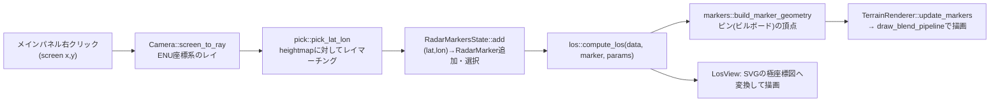

**計算モデル**

- **等価地球半径**: 標準大気中では電波が幾何学的な直線よりわずかに下向きに屈折し、実際の見通し距離は真球上の地平線より遠くなる。これを「地球半径をk倍した仮想の球面上で電波が直進する」近似で表す(標準大気でk=4/3、
  レーダー・無線工学の標準的な近似。v1では固定値でUIパラメータ化していない)。距離`d`での曲率による見かけの高度低下は`d² / (2 * R_eff)`
- **遮蔽判定(マスク角アルゴリズム、`compute_los`)**: 方位角ごとに観測点から外側へサンプリングし、各点の「見かけの仰角」(曲率低下を差し引いた角度)を求め、それまでの最大仰角以上の点だけを「観測点から直接見える」とする。
  見通し限界距離は見える点のうち最も遠いもの(手前の尾根の陰でも、その先で地形が十分高くなれば再び見えるケースを許容。単純な「最初の遮蔽物で打ち切り」より実際のレーダー覆域に近い)
- **3D覆域は半球状の面**(`compute_los_dome`): 仰角ごとに、観測点からの**直線(仰角一定のレイ)**が地形に遮蔽されずどこまで届くかを求める。直線は一度地形にぶつかったら、その先で地形が下がっても二度と陰から出てこないため、
  `compute_los`とは違って**最初に遮蔽された時点で打ち切る**のが正しい(簡略化ではなく、レイが地表を這う`compute_los`とは幾何学的設定が違うため)。遮蔽されない方角では、どの仰角でも同じ半径=滑らかな球面で、地表付近だけ地形の遮蔽で内側に凹む
  (当初案の「`compute_los`の値を全仰角に使い回す」簡易的なextrudeは、遮蔽されない方角でも仰角で半径が変わらず物理的に不自然だったので改めた)
- **2D覆域は「指定した海抜高度での探知可能領域」**(`compute_coverage_area`): `compute_los_dome`と対になり、仰角一定ではなく**高度一定の直線**を対象の高度について走査する。選択中の観測点についてのみ表示する点は3Dと共通。
  表示する海抜高度はメニュー「設定」→「覆域高度設定...」で指定する(既定1000m。`RadarMarkersState::coverage_altitude_m`、7.7節)
- **性能**: 観測点1つあたり方位数×1000サンプルの`heightmap`補間(表示する観測点の分だけ計算)。ドームは1600方位(4mil刻み)・2D覆域は3200方位(2mil刻み)・極座標図は3200方位で、全方位(6400方位)を計算していた以前の4分の1〜2分の1。
  以前は1mil刻みの全方位を同期で計算していたので、開発ビルドで観測点の追加が約2秒、覆域を出している間はカメラ操作(ズーム等)のたびに(地形のレベルが切り替わるたびに全部計算し直して)約1秒ずつ画面が固まった。
  そこで、(1)計算を小分け(1回8ms)にして非同期で進め、進行中に新しい要求が来たら古い計算は捨てる(`ui::util::run_in_slices`)、(2)計算結果をキャッシュし、観測点・モード・高度・**観測点の範囲に重なるチャンクのレベル**が同じなら計算し直さず、
  ジオメトリの作り直しだけにする(原点変更・選択し直し・範囲の外のチャンクの切り替えでは計算しない)、(3)地形のレベル切り替えで計算し直すときは300ms待ってまとめる、ようにした(`ui/terrain_view/coverage.rs`)。
  実機(開発ビルド)でズーム中の最大の固まりは、約1.05秒×22回→約70ms×2回、観測点の追加は約2秒→約120msになった。計算が終わるまでは、地形だけが変わったなら前の覆域を出し続け、観測点・モード・高度が変わったなら消す
  速度対策(いずれも結果は変えない): `EnuTransform`が原点の三角関数・曲率半径を`new`で前計算する、2D覆域の塗りと輪郭線で計算結果を共有する、`compute_los_dome`が走査中の最大仰角の単調性を使って
  全リング×全サンプルの走査を避ける(素朴実装と完全に同じ結果になることを比較テストで確認)

**3D描画とジオメトリの方針**(定数・頂点構成は9.10節)

- **マーカー**: 画面サイズ固定のピン(縁取り+本体+中の点。選択中は黄色、非選択はオレンジ)。観測点の位置(地表+25m)をアンカーに、画面のpxでずらすビルボード(`DrawVertex::billboard`)なので、拡大・縮小・回転しても同じ大きさで正面を向く。
  作図(6.11節)と同じ`draw_blend_pipeline`・絶対座標のuniformで、深度テストあり(アンカーの深度をクリップ空間で距離の0.2%手前へ寄せ、粗いLODの地形に埋まって消えないようにしている。遠くの山の陰には隠れる。地面すれすれの画素の扱いは6.12節「ビルボードの深度」)。
  以前は地表の四角い枠(`LineList`)だったが、ズームで大きさが変わって位置が分かりにくいため置き換えた
- **複数の覆域の同時表示**: 既定は、選択中の観測点の覆域だけ(重ねると見づらいため)。見通し範囲タブの「すべての観測点の覆域を同時に表示」(`RadarMarkersState::show_all_coverage`)をONにすると、
  **すべての観測点の覆域を同時に**出す。観測点ごとに色が違い(`coverage_colors(id)`。6色のパレットを`id`で選ぶ。1番目はドームが水色・2Dが緑のまま)、一覧の各行に色の見本(左=3D、右=2D)が付く。
  計算・キャッシュ・ジオメトリは観測点ごとに独立(`MarkerCoverage`)で、GPUには表示する観測点のジオメトリをつないで1つのバッファとして載せる(`sync_gpu`)。計算済みの観測点は、他の観測点が増えても計算し直さない。
- **覆域ドーム**: 表示する観測点(既定は選択中の1つ)について、仰角0°〜87°の38段の緯度リングを、隣接リング×隣接方位ごとの四角形パッチでつないだ半透明の面(ワイヤーフレームではなくSurfaceを持つ多面体)。
  専用の`dome_pipeline`(アルファブレンド有効・深度書き込み無効。地形やマーカーの奥に透けて見えるように)で描く。色は半透明の水色固定(`fs_dome`)
- **リング・頂点の処理**: (1) 遮蔽されなかったリングの半径をサンプル位置に丸めず上限ちょうどにする(丸めると高仰角ほど半径が不揃いで球にならなかった)、
  (2) リング数を増やし間隔を最上部まで細かくする。計算は4mil刻み(1600方位)で、面を張るときは2方位に1つに間引き、さらに**高いリングほど間引く**(円周が短いので`1/cos(仰角)`以下の2のべき乗個おき、最大32)。
  間引きの違うリングの間は、上のリングの1辺に下のリングの複数の頂点を扇状につないで、すき間もT字の継ぎ目も作らない(`stitch_rings`)。頂点数は以前(3200方位×38リング)の約71万から約16万に減った。
  **半径は平滑化しない**(以前は方位角方向にメディアン→平均、仰角方向にも[1,2,1]/4で平滑化していたが、要望で撤去した。地形の細かい凹凸や1方位だけ遮蔽される所は、放射状の筋としてそのまま出る)
- **ちらつき対策**: 最上段リングを閉じる傘の部分は48分割に間引く(全方位で三角形化するとアペックスへ極端に細い三角形が大量に重なり、アルファブレンドの描画順依存でカメラ角度ごとに明るさがちらつく)。
  リング間の四角形は重ならないので間引かない。また、遮蔽される方角ではドーム境界が定義上ちょうど地形表面に接してZファイティングするため、ドーム全体を一律に20m持ち上げる(`render_bias::DOME_M`)
- **2D覆域の塗り**: 星形(観測点中心の極座標の境界なので自己交差しない)の塗り(半透明、アルファ0.32)+外周の輪郭線(不透明・太さ2.5px)。**深度テストなし**(`draw_screen_pipeline`)で描く。
  以前は深度テストありで描いていたが、塗りの三角形は観測点から境界への長い平面で間の起伏(数百m)に埋まり、場所によって塗りが欠けていた。2Dは真上からの正射影で地形に隠れることがないので、深度テストを外して均一に塗られるようにした。
  3Dドームとはバッファ・パイプラインが別で、`ui/terrain_view/coverage.rs::refresh_coverage`がモードに応じてどちらを作るか切り替える(使わない方は空)

**メインパネルの2D/3D表示切り替え**: メインパネル右上の「2D表示に切替」/「3D表示に切替」ボタンで、`terrain::camera::ViewMode`(`ThreeD`/`TwoD`)を切り替える。
3Dは自由視点(透視投影、ドラッグで回転)。2Dは真上からの正射影で、北を上に固定した地図のような見た目になり、ドラッグは回転ではなく`OrbitCamera::pan`による平行移動になる
(`up`が北=Yなので回転操作自体が意味を持たない)。ホイールズームは`OrbitCamera::distance`を正射影の画面縦幅(m)として再利用する。
かつて俯瞰/側面のプリセットボタンがあったが、要望で削除した(2D↔3Dはこのボタンだけ)。

### 6.10 地形LOD(タイルとチャンクごとの解像度レベル)と水域レイヤー

対象域が30度四方に広がったため、単一メッシュでは解像度が足りず(1セル約1.6km)、頂点数を増やすとWebGPUのバッファ上限を超える。
そこで**1度タイル単位でLODを切り替え、近いタイルは6×6のチャンクに分けてチャンクごとに解像度を選ぶ**(2.4節のレベル定義。最細は元データの30m)。
計画の正確なアルゴリズム・定数は9.7節、適用ループ(取得・メッシュ生成・差し替えのスケジューリング)は9.13節。

- **描き方**: 全タイルを**6×6のチャンクのメッシュ**で描き、チャンクごとに独立してレベル(1〜4)を持つ。**最も粗くてもレベル1(約620m/セル)**で、遠くのタイルもこれより粗くはしない
  (以前は遠いタイルをレベル0=約1.85km/セルのタイル全体1枚で描いていた)。起動直後だけは全タイルのレベル0(合計約155万頂点)を`base.bin`から作って全体1枚で描き、
  レベル1のグリッド(1タイル約69KB、390個)が取得できたタイルから近い順にチャンク表示へ切り替える(取得は約20秒、メッシュ生成を含めた全タイルの切り替えは約40秒。その間はレベル0のタイルが混じる)。
  状態は`terrain::lod::TileLayout`(`Whole` / `Chunks(チャンクごとのレベル)`)
- **計画**(`terrain::lod::plan_levels`。GPU・ネットワークに触れない純粋関数): タイル・チャンクごとに、視点(2Dでは注視点)から最も近い点までの距離と、視錐台に入るかを求める。
  理想のレベルは、画面(CSSピクセル)上で**1セルが0.7ピクセル以下**になる最も粗いレベル。30mのレベル4が理想になるのは、1つ粗いレベル3(約62m)が0.7ピクセルに収まらない、つまり1ピクセルが約88m未満になる距離(canvas高さ700px・縦画角50°で視点から約66km以内。頂点の予算の中で近い順に配るので、実際に最細になるのは近い一部)。
  理想より1つだけ細かい現状のレベルは下げない(ヒステリシス。ちらつき防止)、視野の外は現状維持。
  遠い多数のタイルは、タイルの一番近い点でも理想がレベル1なら、チャンクごとの計算を省く(毎回計算すると重いため)
- **頂点予算**: チャンクの頂点の合計は2500万以下。**見えているタイルを先に**、見えていないタイルはその残りで扱い、それぞれ「下限の確保→レベルの周回」の順に配る。
  下限は全チャンクをレベル1で載せる分(1タイル約3.9万頂点。全390タイルで約1520万)で、足りなければそのタイルは全体表示のまま。
  周回は、目標が2以上のチャンクを近い順にレベル2まで、次に目標が3以上のものをレベル3まで、…と上げる(1周ごとに全チャンクを同じレベルへそろえてから次へ進む)。
  最細のチャンクは約36万頂点、レベル2は約1万頂点なので、近くを最細にする前に遠くをレベル2〜3にしておかないと、遠くが粗いまま残る
  (GPUメモリは頂点28バイトとインデックスで合計約1.2GB)。予算は300万→600万→2500万と増やしてきた。
  見えていないタイルの下限まで先に確保すると、全タイル分(約1520万頂点)が予算の大半を占めて見えている遠方を細かくできなかったため、後回しにした。
  予算が足りないとき、見えていないタイルは全体表示(レベル0)に戻り、カメラを向け直すと下限から順に取り直す
- **視錐台カリング**: 全タイルを常駐させると画面外の頂点が大量になるため、`TerrainRenderer::render`がメッシュごとの頂点位置を囲む直方体(`MeshGpu::bounds`。原点変更時に更新)が
  クリップ空間の6面のどれかの外に完全に出ているものは描かない(GPUのクリッピングでも何も描かれないので見た目は変わらない)
- **適用**(`ui::terrain_view`の`update_lod`): カメラ操作からの予約は150ms待ってまとめ、ドラッグ中は後回しにする。取得の完了・メッシュ反映の続きからの予約は8msだけ待って続ける
  (150msを待つと取得の補充が周期的に間延びし、全タイルのレベル1の取得だけで約4.7秒かかっていた)。必要なグリッドが取得済みならメッシュ(頂点+インデックス+縁のスカート)を作って`set_mesh`で差し替える。
  取得済みの範囲でより細かければ先にそこまで上げ、目標のグリッドが届いたらさらに上げる(レベル1→2→3→4と段階的)。1回の更新でメッシュを作る量は時間の目安(12ms)で区切り、残りは次の更新へ回す(速い端末では1回で多く進み、遅い端末では自動的に細かく刻まれる)
- **取得**: レベル2以下はタイル1枚分のファイルをまとめて取得してチャンクごとに分割し、レベル3以上はHTTP Rangeでチャンク1個分だけ取得する(最細で約0.7MB)。同時16件まで
  (ブラウザの同一ホストへのHTTP/1.1接続は通常6本だが、全タイルのレベル1を起動後に取得するので6件だと1分ほどかかった)。失敗は再試行しない。取得済みグリッドは合計300MBまで残し、超えたら画面に出していないものから古い順に捨てる
- **標高サンプリングとの一致**: 各チャンクの「いま画面に出しているレベル」(`TerrainData::set_chunk_level`)のグリッドで`sample_heightmap`が標高を引く。描画されている地形と、
  観測点・見通し計算・クリック判定・注視点の高さが一致する。細かいレベルに切り替わった直後は、注視点の高さと観測点・覆域を合わせ直す
- **継ぎ目**: 解像度の違う隣のメッシュ同士は縁のノードの高さが食い違い、隙間から背景の黒が見える。各メッシュの縁から下向きの壁(スカート。深さはレベル0が800m、以降400/250/150/100m)を付けて隠す。
  同じレベルのチャンク同士は縁のノードを共有するので継ぎ目は一致する
- **レベル切り替えのクロスフェード**: チャンクのレベルが変わる・タイル全体とチャンクが入れ替わるとき、古いメッシュを消して新しいメッシュを出すだけだと、細かさ・陰影の違いが一瞬で切り替わって境目が目立つ。
  そこで古いメッシュを`FADE_DURATION_MS`(350ms)だけ残し、新旧を**画素ごとの疎密(ディザ)で互いに補う割合**で重ねて描く(`renderer/fade.rs`が状態と割合、`terrain.wgsl`の`vs_fade`/`fs_fade`が描画)。
  新しい側は「疎密のパターン < 割合」の画素、古い側は残りの画素だけを描く(半透明ではなく`discard`)ので、深度は通常どおり書け、描く順にも依存せず、新旧が同じ画素で深度を奪い合うこともない。割合は時間の経過を`smoothstep`にしたもの。
  メッシュごとの割合は`FadeTable`(uniform、`vec4`×2048)に入れ、描画側が`draw_indexed`の`first_instance`に表の番号を渡して、頂点シェーダーが`instance_index`で引く(メッシュごとにバッファ・bind groupを作らない)。
  クロスフェード中のメッシュだけ専用パイプライン(`terrain_fade`)で描く(`discard`を持つシェーダーは早期深度テストが効きにくいので、普段の地形には使わない)。
  API: `set_mesh_faded`・`remove_mesh_faded`(`set_mesh`・`remove_mesh`はすぐに切り替える。起動時の初回配置・原点変更は後者)。`is_fading`の間は`render_frame`が`requestAnimationFrame`で描き直し続ける(でないと途中の割合で止まる)。
  途中でさらに差し替わったら、前の古い側は捨てて、いま出ている側が改めて消える側になる(連続して段階的に細かくなるとき、途中の1段は混ざらず切り替わる)。同時に混ぜる数が表の大きさを超える分・原点変更は、混ぜずにすぐ切り替える

**水域レイヤー**(「マスクファイルの水域と地形データの範囲外を水色で表示。標高は海抜0m。WGS84の丸みを考慮し、地形を隠さないように。標高が0m以下の地形の上にも水域が来ないように」との要望で追加。
以前はNaNセルの水色塗り・背景スカートというメッシュ方式で実装したが、z-fightingや縞状の透けが問題になり撤去した。DEVELOPMENT_HISTORY.md参照):

- **水域の範囲**: 「地形メッシュが張られない所」がそのまま水域になる(マスクの水域・存在しないタイル・タイル内のNODATA・地形データの範囲外)。マスクの水域を別に持つ必要はない
- **面はWGS84楕円体の海抜0m**(メッシュではなく解析的な楕円体): メッシュ(緯度経度の格子)だと、セルが弦になって面がセルの中央で凹み(1度で約240m、0.25度で約15m)、地形との継ぎ目や範囲の限り(遠景で途切れる)が問題になる。楕円体なら丸みが厳密で、範囲の限りもない
- **描き方**: 画面いっぱいの三角形1枚を、地形メッシュより**先に**描く(`water_pipeline`。自身は深度テストせず常に描く)。フラグメント(`fs_water`)が各画素の視線と楕円体の交点の有無を求め、あれば水色、なければ`discard`(空は黒のまま)
- **水域の深度と、地形が隠れない余裕**: 水域が深度を書かないと、水面の下・地球の丸みの向こう側にある地形まで水面越しに描かれてしまう(海面すれすれの低い視点から遠くの陸地を見ると、丸みで本来は隠れるはずの陸地が海の中に透けて見えた)。
  そこで、楕円体(地球本体)を不透明な物体として、交点の深度を書く。ただし書く深度は、交点から視線に沿って`WATER_DEPTH_MARGIN_M`(1,000m)奥へずらした点のもの。
  地形は交点から1km以内の奥までは水域より手前として描かれるので、**標高が0m以下(DSMの負の値)の地形が水域に隠れることはない**(標高-Hの地形と視線が角度θで交わるとき、交点との視線方向の距離はH/sinθ。-10mでもθ≧約0.6度まで隠れない)。
  地球の丸みの向こう側の地形は水平線から数km以上奥になるので隠れる。楕円体に当たらない視線(水平線より上を通って見える山頂など)は`discard`されるので、地形はそのまま描かれる。ドーム・マーカーは地形と同じく深度でテストされる
- **地形の縁の壁(スカート)は海抜0mまで届かせる**: 水域の深度が隠せるのは海抜0mより下を通る視線だけ。データ範囲の端など標高の高い縁の下に隙間が残ると、縁の外の低い視点から水域の面より上を通ってその下(地形の裏側)が見える。
  そのためスカートの底は、`skirt_depth`だけ下げた高さと海抜0mの**低い方**にした(`mesh.rs::grid_vertices`)
- **視線と楕円体の式**: 視線は`Camera::water_ray_basis`(`screen_to_ray`と同じ式。逆VP行列はf32の丸め誤差で向きが大きくずれるため使わない)。楕円体は陰関数`f(p) = c0 + 2 g・(M p) + |M p|²`で、
  原点が楕円体上(h=0)なので定数項が(丸め誤差の)`c0`だけになり、絶対座標約6.4e6mのままf32で二乗する場合のような桁落ちがない(係数は9.3節)。
  `f≒2h/a`なので、原点から遠い点(石垣島・約2,000km)でも海抜0mで誤差0.1m以下、-30m・500m・3,000mも一致することを合成テストで確認した
- **原点変更**: 係数は原点基準なので、頂点バッファを作り直す場面(初期化・原点変更)で`TerrainRenderer::set_ellipsoid_origin`を呼ぶ
- 色は`WATER_COLOR`(0.25, 0.55, 0.85)。地形の低地の緑と区別できる水色の単色

### 6.11 作図(図形・線、`terrain::drawing` / `terrain::drawing_geometry` / `draw.wgsl`)

アプリが任意の図形・線を地図上に出すための汎用機能。レーダー観測点(6.9節)のような用途固定のものとは別に、2D図形・3D図形・折れ線を、塗り・枠線・不透明度つきで、**絶対座標に固定**するか**カメラに固定**するかを選んで描ける。
通信プロトコルは一切知らない(アプリが`DrawingState`を`provide_context`して出し入れする)。データモデルは9.11節、ジオメトリ生成は4章、対話作成は5章。

**データモデル**(`terrain/drawing.rs`)

- `Drawing { id, shape, style, visible }`の一覧を`DrawingState.items`(`RwSignal<Vec<Drawing>>`)が持つ(`add`/`update`/`remove`/`clear`)。`TerrainView`が購読して描き直す(未提供なら作図なし)
- `Shape`: 2D図形=`Circle`/`Rect`(回転可)/`Polygon`(凹も可)/`Sector`(扇形)、3D図形=`Sphere`/`Cuboid`/`Cylinder`/`Cone`、線=`Polyline`。回転角・方位は時計回り・0度が上(北)
- `Style { fill, stroke, stroke_width_px }`。色はRGBA(アルファ<1で半透明)。2D図形は塗り+輪郭線、3D図形は面の塗り(陰影つき)+稜線、折れ線は`stroke`だけ
- 位置は`Position`の3種類(**1つの図形の中では同じ種類にそろえる**。混ぜた図形・`Screen`に置いた3D図形は`Shape::validate`が弾いて描かず、警告ログを出す):

| 種類 | 座標 | 固定先 | 奥行きの扱い | 置ける図形 |
|---|---|---|---|---|
| `World` | 緯度経度+`Altitude` | 絶対座標(原点変更・LOD切替に追従) | 地形と同じパスで深度テスト(山の陰に隠れる) | すべて |
| `View` | カメラからの右・上・前方(m) | カメラ | 地形の手前に別パスで描き、図形どうしは深度で隠し合う | すべて |
| `Screen` | 角(`Corner`)からのpx | 画面(canvas) | 地形の手前、追加順に重ねる(深度なし) | 2D図形・線 |

- `Altitude::Msl(h)`: 海抜(地形データの標高と同じ基準)。2D図形は**その高さの水平な面**(地球の丸みには沿う)。`Altitude::AboveGround(o)`: 地表から。2D図形・線は**地形の起伏に沿って貼り付く**(細分化して描く)。
  3D図形は位置の真下の地表を基準に置くだけで変形しない。地表に貼り付くものは、地形メッシュとのZファイティングを避けるため15m持ち上げる(`render_bias::DRAWING_M`。観測点・覆域と同じ考え方で、値の一覧は`terrain::render_bias`。9.10節)
- 大きさ(半径・幅等)の単位は`World`/`View`ではm、`Screen`ではpx

**ジオメトリ生成の方針**(`terrain/drawing_geometry.rs`、純粋関数。`build(ctx, drawings) -> DrawingBatches`)

- 面も太い線も`DrawVertex`(位置・RGBA・aux・params、56バイト)のTriangleListで表す。頂点列は座標の種類ごと(`world`/`view`/`screen`)、さらに`world`/`view`は不透明(深度を書く)と半透明(書かない)に分ける
- 2D図形は、置いた位置を中心とするローカル平面(x=右/東, y=上/北)で三角形と輪郭線を作り、種類ごとの変換で出力座標にする。`World`では、ローカル座標を基準点からの方位・距離(方位角等距離図法、球面の直接解)とみなして緯度経度へ戻し、
  `Altitude`から高さを決めて`EnuTransform`でメッシュ原点のENUへ変換する。多角形は三角形分割(`earcutr`)+辺の長さ上限での分割。分割の細かさは海抜の水平面で辺20km・輪郭2km、地表貼り付けで辺500m・輪郭250m
- 3D図形は位置における局所ENU(位置を通る鉛直線が+z)で作り、`enu_to_geodetic`→`EnuTransform::transform`で厳密に変換する(遠方でも地球の丸みで傾いた上向きが正しい)
- `World`の折れ線は点の間を大円に沿って分割し、地表基準は「地表からの高さ」を補間する
- 標高は`ctx.ground`クロージャで受ける(`ui::terrain_view`は`heightmap::sample_heightmap`を渡す)ので、地形なしで単体テストできる

**太い線**(`terrain/draw.wgsl`): WebGPUの線プリミティブは太さ1pxしかないため、線分1本を四角形(三角形2枚)にして頂点シェーダーで**画面のピクセル幅**へ広げる。
各頂点は「この端点(`position`)」と「反対側の端点(`aux`)」を持ち、クリップ座標→ピクセル座標で向きと法線を求めてから`params.x`(px)の半分だけ左右へ、端点は線の向きへ半幅だけ延ばす(折れ線のつなぎ目の隙間を埋める)。
視点の後ろの端点は線分をそこで打ち切る(透視投影で向きが反転して帯が壊れるのを避ける)。線は`LINE_DEPTH_BIAS`だけ手前に寄せて深度テストし、同じ位置の面とのZファイティングを避ける。
3D図形の面は法線からLambert風の陰影(絶対座標は地形と同じ北西・仰角45度、視点空間はカメラの左上手前)を掛ける。半透明の線は、折れ線のつなぎ目の重なり部分だけアルファが二重に掛かって濃く見える(不透明なら出ない)。

**描画パス**: 1つ目のパス(地形)は 地形→マーカー→`World`不透明→覆域ドーム→`World`半透明。カメラ固定(`View`/`Screen`)が1つでもあるときは**2つ目のパス**で描く:
1つ目のMSAAカラーを`Load`で引き継ぎ、深度だけ`Clear`し直して地形と隠し合わないようにする(`View`は`Camera::projection_matrix`=ビュー行列なしの射影、`Screen`はピクセル→クリップの行列で深度テストなし)。
パイプラインは不透明(深度書き込みあり)・半透明(なし)・画面(深度テストなし)の3本で、シェーダー・bind groupは地形とは別。詳細は9.9節。

**再構築のタイミング**(`ui/terrain_view/overlay.rs::rebuild_drawings`): 一覧の変更・原点変更・canvasのリサイズ(`Screen`の角の位置が変わる)、および地表基準の図形があるときの地形LOD切替。

**図形の対話作成**(`terrain/draw_tool.rs` / `ui/drawing_editor.rs`。仕様は9.11節、9.14節)

UIから図形を作る・編集する層。`DrawingState`の上に載る別のcontext`DrawToolState`で、ライブラリは通信もアプリ固有のUIも持たない。作る図形はすべて絶対座標(`Position::World`)。

- **作り方**: パネルでツール(円・矩形・多角形・扇形・折れ線・球・直方体・円柱・円錐)を選び、地図を左クリックして点を置く。クリック数は図形ごとに固定(円・球・円柱・円錐=中心→円周上の点、矩形・直方体=対角の2点、扇形=中心→開始側の縁→終了側の縁)で、
  多角形・折れ線だけ何点でも置いてダブルクリック/Enter(`確定`ボタン)で確定する。確定後もツールは選んだままで、続けて置ける。右クリック/Backspace=置いた点を1つ戻す(点が無ければツール解除)、Esc=ツール解除。地形データ範囲外のクリックは無視する
- **仮の図形**: 作成中はカーソル位置までを含めた図形(作れなければ点をつないだ折れ線)を`DrawingState`に**仮の1要素**として置き、クリック・カーソル移動のたびに更新する(確定・取り消しで消す)。
  カーソル移動は`TerrainView`が1フレームに1回へまとめる(更新のたびに作図全体の再構築+描画が走るため)
- **一覧と選択**: `DrawToolState.shapes`(作った順の`UserShape { id, name }`)が、このエディタで作った図形を区別する(アプリが`DrawingState`へ直接足したデモ等は一覧に出ず、保存もされない)。
  一覧で選ぶと地図上で**黄色い太線の枠**になり、下に数値編集フォームが開く(位置・大きさ・高度・見た目・名前・表示/非表示・削除)。地図上のドラッグでの頂点移動やシンボルのクリック選択は未実装
- **保存**: `DrawToolState::persist(key)`で、作った図形をJSON(`{version, shapes}`)にしてブラウザのlocalStorageへ保存し、次回起動時に復元する(内容が変わったときだけ書く)。版が違う・壊れたデータは警告ログを出して読み込まない
- **UI**: `ui::drawing_editor::DrawingEditor`。地図をクリックできるよう、モーダルではなく非モーダルの`FloatingPanel`(`modal=false`、7.7節)かタブの中身として置く(サンプルは表示メニューの「作図...」で開く移動可能なウインドウ)。
  作成中の案内と`確定`/`1つ戻す`/`終了`は、地図の左上に重ねるヒントバーに出す

### 6.12 航跡(トラック)表示(`terrain::tracks` / `draw.wgsl`の向きつきビルボード)

シミュレーションなどから受け取った航空機・艦船・車両等の現在位置を、シンボル・ラベル・航跡(軌跡)・高度線で表示する。ライブラリは通信プロトコルを知らず、アプリが`TracksState`(context)へ最新の一覧を`set`する
(サンプルでは`sample/sim_frontend/src/track_bridge.rs`が`protocol::TrackList`を変換して反映する。プロトコルは4.3節)。モデル・ジオメトリ・当たり判定の仕様は9.12節。

**データモデル**(`terrain/tracks.rs`)

- `Track { id, kind: SymbolKind, affiliation: Affiliation, label, lat_deg, lon_deg, altitude: Altitude, heading_deg, speed_mps }`。`SymbolKind`=不明/固定翼機/ヘリ/艦船/地上車両/ミサイル(形が変わる)、
  `Affiliation`=不明(黄)/友軍(青)/敵(赤)/中立(緑)(色が変わる)。高度は作図(6.11節)と同じ`Altitude`(サーバーが地形の高さを持たない車両などは`AboveGround`)
- `TracksState { entries, show_labels, show_trails, show_altitude_lines, selected }`。`set(Vec<Track>)`は受信のたびに全件を渡す(前回に無いIDは新規、今回に無いIDは航跡ごと消える)。
  航跡は同じIDの間だけ、前回の位置が最後の点から250m以上離れていれば足していく(上限400点)

**シンボル**(向きつきビルボード): 種別ごとの形を、進行方向が+y・右が+xのポリゴンで持ち、三角形分割(`earcutr`)して縁取り(暗色)→本体(所属の色)の順に積む。
位置(高度込み)をアンカーに、頂点は画面のpxでずらす**画面サイズ固定のビルボード**(マーカーのピンと同じ仕組み)。さらに`draw.wgsl`の**向きつき**(`params.z=2`)は、アンカーとアンカーから進行方向(ENUの水平)へ200m進んだ点を射影して、
進行方向が**画面上で実際に指す向き**を求め、その向きへ形を回す。3Dでカメラを回しても、2Dの地図でも、シンボルが実際の進行方向を向く(真上・真下から見て向きが画面に現れないときは画面の上向き)。深度は覆域マーカーと同じ扱い(アンカーの深度を距離の0.2%手前へ寄せる)に、下記「ビルボードの深度」を加える。

**ビルボードの深度**(`draw.wgsl`の`billboard_depth`。シンボル・選択の輪・観測点のピン共通): ビルボードは画面サイズ固定の四角形で、深度はアンカー1点の深度で一定になる。
そのままだと、地面すれすれ(高度0mの船・地上車両)のシンボルは、画面でアンカーより下の画素(視点に近い地面・水面)が、シンボルより手前の地形・水面になって**下半分が埋まる**(カメラを浅い角度に倒すほど顕著)。
そこで頂点ごとに、**アンカーを通る局所の水平面**(法線=アンカーと地球の中心を結ぶ向き)のうち、その画素の視線が当たる点の深度までは手前へ寄せる(深度は大きい方=手前を採る)。
面の上の点`anchor + s·east + r·north`が画面で`offset`だけずれた位置に射影される条件は、同次座標が線形なので`s`・`r`の連立一次方程式(2×2)になり、厳密に解ける(遠近の近似がない)。
視線が面に当たらない・視点の後ろなら何もしない。寄せる量は深度の1.3倍までに抑える(視線が地面とほぼ水平だと画素のわずかな差で当たる位置が視点側へ大きく動く。寄せ続けると手前の山に隠れるはずのシンボルまで山の上に描かれるため)。
面より手前の実際の起伏(山)には従来どおり隠れる。

**航跡・高度線・ラベル**

- 航跡: 過去の位置→現在位置の折れ線(太さ1.5px、所属の色、アルファ0.55。6.11節の太い線)。高度線: 現在位置から真下の地表へ下ろす細い線(1px)。地表から30m以下は出さず、3Dのみ(2Dは真上から見て点になる)
- ラベル: 名前+「高度 m 速度 km/h」(地表基準は`AGL `つき)。WebGPUには文字を描く機能がないので、`TerrainView`が`canvas`の上に重ねるHTML要素(`.terrain-track-labels`内の`.track-label`)で、
  毎フレーム(`render_frame`→`update_labels`)アンカーを画面へ射影して`transform`で動かす。カメラの後ろ・画面の外は非表示。トラック数が変わったときだけ要素を作り直し、文字は変わったときだけ更新する

**選択(クリックで詳細を出す)**

- `TracksState.selected`が選択中のID。`select(Option<id>)`で選択・解除、`set`で選択中のトラックが一覧から消えたら自動で解除する
- 当たり判定: `TerrainView`の`pointerup`で、ドラッグではない左クリック(移動が5px未満)のとき、「原点クリック指定」モード中なら従来どおり原点指定、そうでなければ`tracks::pick_track`
  (各シンボルのアンカーを画面へ射影し、クリック位置に最も近く半径20px以内のもの。地形の陰に隠れたシンボルも対象)で選ぶ。**何もない所のクリックは選択解除**
- 強調: 選択中のシンボルの後ろに白い輪を描き、ラベルに`.selected`クラスを付ける
- 詳細の表示はアプリの役目。ライブラリは`selected`と`selected_track()`、種別・所属の日本語名だけを渡す。サンプルは、トップステータスパネルの**「航跡情報」タブ**(`components/track_detail.rs`)に、
  名前・識別番号・種別・所属・位置・高度・針路・速度・原点からの距離と方位・「選択を解除」ボタンを出し、`TabbedPanel`の`active`(任意のprop)で、航跡が選択されたら自動でこのタブへ移る

**描画・再構築**: `TerrainRenderer::update_tracks`(専用バッファ、`draw_blend_pipeline`・絶対座標のuniform)。再構築(`ui/terrain_view/overlay.rs::rebuild_tracks`)は、トラックの受信・表示設定の変更・原点変更・2D/3D切替・地形LOD切替(地表基準・高度線があるとき)。
トラックは高頻度で更新されるので、受信のたびに`render_frame`だけ呼び、LODの更新は予約しない。

**サンプル(デモ)**: `sample/sim_server`の`Simulation::make_demo_scenario`が、デフォルト原点(富士山の近く)のまわりに7つのトラック(友軍機・敵機・ヘリ(地表基準)・中立の艦船(駿河湾)・車両(地表基準)・不明機・ミサイル)を楕円軌道で周回させ、
`TrackList`として配信する。フロントはVABパネルの「開始」「一時停止」ボタン(`resume`/`pause`コマンド。7.4節)でシミュレーションを進め、表示メニューの「航跡ラベル/航跡(軌跡)/高度線」で表示を切り替える。
自分のシミュレータへつなぐときは、シナリオの部分を自分のシミュレーション結果から`Track`を作る処理に置き換える。

### 6.13 3Dモデル(glTF)表示(`terrain::models` / `model.wgsl`)

航跡(6.12節)のトラックを、シンボルの代わりに**3Dモデル(glTF 2.0のGLB)**で描く**おまけ機能**。既存の航跡・作図・地形の描画を作り替えず、下の表の範囲に閉じる。
モデルを登録しない・`ModelsState`を提供しない・表示方式を`Off`にすれば、従来と完全に同じ(シンボルだけ)。

| 担当 | 場所 | 役目 |
|---|---|---|
| アプリ | `sample/sim_frontend`(`app.rs`・`menu_bar.rs`・`index.html`・`assets/models/`)、`sample/sim_server` | 種別→モデルのURLの登録(`ModelsState::set_source`)。GLBの配信。サーバーがピッチ・ロールを送る。設定ウインドウを開くメニュー |
| 純粋な計算 | `terrain::models`(`gltf_import`・`placement`・`types`・`mod`) | GLB→頂点・インデックス、位置・向き・大きさの行列、モデルにするかシンボルにするかの判定、`ModelsState`(設定) |
| GPU | `renderer::model_batch`・`terrain/models/model.wgsl` | モデルごとのバッファ、インスタンスのバッファ、パイプライン、描画 |
| 組み込み | `ui::terrain_view::models`、`ui::model_settings_dialog` | モデルファイルの取得・登録、毎フレームの判定、シンボルとの入れ替え、設定ウインドウ |

**既存コードへの変更は最小限**: `Track`にピッチ・ロール(`pitch_deg`・`roll_deg`)を足した。`TrackOptions::symbols_hidden`(モデルで描くトラックはシンボルを描かない)を足した。
`EnuTransform::local_frame`(その地点の東・北・上)を足した。`fetch_binary`を`pub(crate)`にした。`TerrainRenderer`にモデル用の3メソッドと、メインパスの描画1行を足した。
`TerrainView`は`ModelsState`(任意のcontext)を読み、`render_frame`の描画の前に`update_models`を呼ぶ。

**モデルの規約**: 単位はメートル(違えば`ModelSource::scale`)、glTFの規約(+Y上・+Z前)。原点が基準点(航空機・ヘリ・ミサイルは中心、艦船は水線の中央、車両は接地面の中央)。
前が+Zからずれて作られていれば`ModelSource::yaw_offset_deg`で直す。読み込み時に、glTFの座標を**機体座標**(x=右・y=前・z=上。東・北・上と同じ右手系)へ回し、全ノードの変換を頂点へ焼き込む。
対応する内容は、三角形メッシュの位置・法線・頂点色・マテリアルの基本色(`baseColorFactor`)。**テクスチャ・アニメーション・スキン・モーフ・光源・カメラは対応しない**(読み飛ばす。画像のデコードが要らないので`gltf`クレートは`image`なしで使う)。
外部ファイル・data URIのバッファは対応しない(GLBにする)。読めなければログに出して、そのモデルの種別はシンボルで描く。

**向き**: ヘディング(北から時計回り)・ピッチ(機首上げが正)・ロール(右翼が下がるのが正)を、その地点の東・北・上(`local_frame`。地球の丸みで原点の「上」からかたむく。原点から1,000kmで約9度)へ回す。
航空機の一般的なZ-Y-X回転(ヨー→ピッチ→ロールの順に、機体の軸で)。ピッチ・ロールはシンボルには効かない(モデルの向きだけ)。

**表示方式**(`ModelDisplayMode`。設定ウインドウ`ui::model_settings_dialog`で切り替える):

| 方式 | 動き |
|---|---|
| `SwitchToSymbol`(既定) | カメラからの奥行きが`switch_distance_m`(既定1,500m)以内のトラックはモデル(実寸)、遠いトラックはシンボル。境目でちらつかないよう、モデル表示中は1.1倍まで切り替えない |
| `MinScreenSize` | 常にモデル。モデルの外接球の直径が画面で`min_screen_px`(既定32px)に満たないときは、その大きさになる倍率まで実寸より大きくする(上限10万倍) |
| `Off` | シンボルのみ |

奥行きは視線方向の距離。2D(正射影)は、縦の視野角50度の透視投影で同じ縦幅が映る距離に換算する(3Dと同じ設定値で使える)。
切替距離はモデルの大きさに合わせて調整する(実寸の戦闘機が画面でシンボル並みの約30pxに見えるのはフルHDで約500m、艦船は数km)。**切替距離を遠くしすぎると、モデルが数pxでシンボルも無い状態になる**。
モデルで描いているトラックも、航跡(軌跡)・高度線・ラベル・選択の輪は今までどおり出る。

**描画**: 不透明・深度書き込みありで、メインパスの`World`不透明作図の直後(覆域ドームより前)に描く。陰影は頂点ごとのランバート(環境光0.4+絶対座標の作図と同じ光源)、所属の色を35%混ぜる。
モデルごとに1回の`draw_indexed`で、同じモデルの機数はインスタンス描画。位置は地形と同じ原点基準のENU座標(f32)なので、原点から1,000km離れると位置の粒度は約0.1mになるが、機体(十数m)には影響しない。
地表基準(`AboveGround`)の高度は、地表から2m持ち上げて置く(粗い地形LODに足元が埋まらない最小限。シンボルの25mは大きすぎる)。

**制限**: テクスチャなし。**カメラは100m(`MIN_DISTANCE`)までしか近づけない**ので、実寸のモデルの大きさは、画面が小さいと数十pxまで(フルHDの縦なら航空機で約160px)。選択の当たり判定は、シンボルと同じ位置(アンカー)の半径20px。
両面は、面の向きを見ずに頂点の法線で照らす(閉じたモデルなら問題ない)。

**サンプル**: `scripts/gen_sample_models.py`が、標準ライブラリだけで5種類(航空機・ヘリ・艦船・車両・ミサイル)の簡易な低ポリゴンモデルを`sample/sim_frontend/assets/models/`へ書き出す(`index.html`のcopy-dirでtrunkが`models/`として配信、`app.rs`が種別ごとに登録)。
サーバーのデモシナリオ(`snapshot_tracks`)は、航空機・ミサイルのピッチを上昇・降下の角度、ロールを旋回のバンク角(`atan(速度×旋回の角速度/g)`、±60度)に、艦船・車両を小さな揺れにする。表示メニューの「3Dモデル...」が設定ウインドウ。

### 6.14 スクリーンショット・画面録画(`terrain::capture` / `ui::terrain_view::capture`)

マップパネル(canvas)をPNG保存・WebM録画するおまけ機能。**サーバーへは一切送信しない、ブラウザ内だけで完結する処理**。
ボタンをどこに置くかはアプリ固有のUIなので、このライブラリはcontext(`terrain::capture::CaptureState`)で要求を受けるだけ
(`recenter::RecenterRequestState`と同じ「要求を運ぶだけのcontext」パターン。サンプルはVABパネル(`vab.rs`)に置いている)。

| 担当 | 場所 | 役目 |
|---|---|---|
| アプリ | `sample/sim_frontend/src/components/vab.rs`・`app.rs` | ボタンの配置、`CaptureState`の`provide_context` |
| context | `terrain::capture::CaptureState` | 要求(スクリーンショットの回数カウンタ・録画の開始/停止トグル・録画中フラグ)を運ぶだけ |
| 実処理 | `ui::terrain_view::capture`(非公開) | `HTMLCanvasElement`のtoBlob・captureStream、`MediaRecorder`、ダウンロードのDOM操作 |

**スクリーンショット**: `CaptureState::request_screenshot()`で要求カウンタを1増やす(`recenter_request.count`と同じ「0は未クリック、増えたら実行」の約束)。
`TerrainView`のEffectがそれを見て、canvasの`toBlob("image/png")`結果を`sim3dview_YYYYMMDD_HHMMSS.png`として`<a download>`要素をその場で作ってクリックすることでダウンロードさせる。

**画面録画**: `CaptureState::toggle_recording()`で`recording_requested`(bool)を反転させる。`TerrainView`のEffectはこの値と「今実際に録画中か」の食い違いを見て、
開始時は`HTMLCanvasElement.captureStream()`(引数なし=canvasが実際に描画されるたびにフレームが入る。地形は常時アニメーションせず操作時だけ再描画するため、固定fps指定より効率が良い)の`MediaStream`を
`MediaRecorder`に渡して`start()`、停止時は`stop()`する。コーデックは`vp9`→`vp8`→無指定(ブラウザ既定)の順に`MediaRecorder.isTypeSupported`で対応可否を見て選ぶ。
`start()`に`timeslice`を渡さないため、`stop()`のタイミングで録画全体が1つの`Blob`として`ondataavailable`に1回だけ届く(スクリーンショットと同じ`<a download>`の仕組みで
`sim3dview_YYYYMMDD_HHMMSS.webm`として保存)。ブラウザがMediaRecorder等に未対応で開始に失敗したら、`recording_requested`をfalseへ戻して諦める。

**写るもの/写らないもの**: canvas上の描画(地形・作図・航跡シンボル・覆域等)はどちらにも写るが、航跡ラベル等のHTML要素の重ね合わせ(`terrain-track-labels`)は対象外(canvasの外にあるDOM要素のため)。

---

## 7. UI詳細設計

サンプルアプリ(`sample/sim_frontend`)のUIの設計。本節が`components/xxx.rs`と書くものは`sample/sim_frontend/src/components/`のファイルで、
`ui/xxx.rs`と書くものは`sim3dview`ライブラリの汎用部品(9.14節)。

### 7.1 レイアウト

```
┌──────────────────────────────────────────────────────────────┐
│ ファイル  設定  表示  ヘルプ                    ← メニューバー    │
├───────────────────────┬───────────────────┬───────────────────┤
│ シミュレーション          │                   │ トップステータスパネル │
│ ステータスパネル(上)      │                   │  [各種情報][航跡情報]  │
├───────────────────────┤     メインパネル     ├───────────────────┤
│ VABパネル(下)            │    (3D地形)        │ ボトムステータスパネル │
│                         │                   │ [断面図][見通し範囲]  │
└───────────────────────┴───────────────────┴───────────────────┘
```

画面最上部にメニューバー(`components/menu_bar.rs`)を固定高さで配置し、その下に
既存の3カラムレイアウト(`.app-shell`)を残り高さいっぱいで敷く(`.app-root`が
`display:flex; flex-direction:column`で両者を縦に並べる)。

パネル名は全て位置ベースの汎用名で統一している(シミュレーションステータスパネル/VABパネル/
メインパネル/トップステータスパネル/ボトムステータスパネル)。表示内容そのものを指す旧称
(「操作パネル」「VAB」「地図」「各種情報パネル」「側面図パネル」)は、トップ/ボトムステータス
パネルではタブラベルとして残るのみで、パネル自体の名前としては使わない。

**画面上にはパネル名(見出し・ラベル)を表示しない**(後から「表示名を消してほしい」との要望を受けて
全て削除した)。上記の名前は設計書・コード上の呼び名としてだけ残る。`TabbedPanel`の`title`は
省略可能(省略/空文字なら見出しを出さずタブバーだけ)で、サンプルは指定しない。

- CSS Gridで4列(左パネル固定 / メインパネル / リサイザー(6px) / 右パネル)を構成する
- 左パネルは`display:grid; grid-template-rows: 1fr auto;`で上下2分割
  (シミュレーションステータスパネル/VABパネル)。VABパネル側は`auto`で内容の高さに
  ぴったり合わせ、余った分はシミュレーションステータスパネル側(`1fr`)が吸収する
  (固定`1fr 1fr`だと、VABパネルの実寸と半分の高さがずれた際に一方に余白/スクロールが
  生じるため)
- 右パネルは`grid-template-rows: 1fr 1fr;`で上下2分割(トップ/ボトムステータスパネル、
  こちらは両方とも内容量の変動が小さいため固定分割のままでよい)。両パネルとも
  `TabbedPanel`(7.6節)で実装しており、現状は1タブのみだが後から同じ枠に別タブを追加できる
- 左パネル幅は`--panel-width`(CSS変数、既定320px)で固定
- 地図・右パネルの幅は`grid-template-columns`の`minmax(下限px, Nfr)`で指定し、`N`(fr値)を
  Leptosの`RwSignal<f64>`で保持する。ドラッグ量(スクリーン座標のpx)をそのままfr値に加減算する
  設計のため、fr値の初期値もpxスケールの数値にしておく(小さい値だと1回のドラッグで下限に
  張り付いてしまう不具合が実装時に発生し、修正済み)

### 7.2 レスポンシブ方式

- 3カラムの横並びレイアウトは崩さない(縦積みへの再レイアウトは行わない)
- 画面幅が狭くなった場合は、`minmax()`の`fr`部分により中央・右パネルの幅が比例的に縮小する
- `minmax()`の下限を下回る場合は、外側コンテナ(`.app-shell`)に`overflow-x: auto`を設定してあるため
  横スクロールで対応する
- 各パネル内(`.panel-section`)は`overflow-y: auto`で縦スクロールに対応する

### 7.3 リサイザー(splitter)の実装

- 地図・右パネルの境界にドラッグ可能な6px幅の要素を配置する
- `on:pointerdown`でドラッグ開始位置を記録し、`element.set_pointer_capture(pointer_id)`で
  ドラッグ中にカーソルが要素外に出てもイベントを受け取り続けるようにする
- `on:pointermove`でドラッグ量(dx)を計算し、center_fr/right_frシグナルを更新する
  (center_fr += dx, right_fr -= dx)
- `on:pointerup`/`on:pointercancel`でドラッグ終了

### 7.4 VAB仕様

- 開発用ダミー`VabConfig`の初期値: rows=6, cols=4(24ボタン)
- ボタンの操作種別: 単純クリックのみ
- ラベルが空文字の`VabButton`は「未使用の穴」として、**DOM要素自体を生成しない**
- 実装上の注意: 穴を`filter()`で除外すると自動配置(auto-placement)がずれるため、先頭行の
  各ボタンには`grid-row`/`grid-column`を配列インデックスから明示的に計算して指定する
  (`row = 1; col = i + 1;`。先頭行のみを扱うため`row`は常に1)

**カテゴリ選択タブ + 動的コンテンツ**(要望により追加): VabConfigの**先頭行(`cols`個)だけ**を
「カテゴリ選択タブ」として扱い、サーバーが決めたラベル・有効/無効のまま描画する(押すと従来
通り`vab_press`コマンドを送る)。**先頭行より後ろ(中段・下段、元のB5〜B24相当)は、サーバーの
VabConfigの内容を使わず、選択中カテゴリに応じて内容が切り替わるフロント側だけのダミー
コンテンツに置き換える**(`components/vab.rs`):

- 中段: `MID_ROWS`(4)行×(`mid_pages`×`cols`)列のダミーボタン。**ページ数は`VabPanel`の`mid_pages`プロパティで、パネルを置く側が決める**
  (`Signal<usize>`なので実行中に変えられる。省略時は2、0は1扱い。サンプルは`app.rs`で`mid_pages=2usize`)。**1なら単一ページで、ページ送りを出さない**。
  1ページあたり`cols`列だけを表示し、2以上のときは
  **「◀ 1/N ▶」のページ送りボタン(`.vab-pager`)で切り替える**(横スクロールバー方式は
  「ボタンによってページを切り替える感じにしたい」との要望により不採用にした)。現在ページ
  (`current_page`、ローカル状態)×`cols`列目から`cols`個ぶんの列だけをグリッドに描画し、
  ◀/▶は端のページで無効化する。カテゴリ(先頭行)を切り替えたら現在ページは先頭に戻す
- 下段: `BOTTOM_COLS`(4)列の固定ダミーボタン(横スクロールなし)
- ラベルは選択中カテゴリの先頭行ボタンのラベルを使い、中段は`"{カテゴリ}-{n}"`、下段は
  `"{カテゴリ}A{n}"`という形式にして両者を区別している。クリックすると
  `vab_dummy_mid_{i}`/`vab_dummy_bottom_{i}`というローカル生成idで通常通り`vab_press`を送る
  (サーバー側は汎用的に`button_id`をログするだけなので、未知のidでも問題なく動作する)
- **例外**: 中段グリッドの絶対インデックス`i == 0`/`i == 1`(既定のカテゴリ・1ページ目なら
  「B1-1」「B1-2」の位置)の2枠だけは、カテゴリ・ページによらず常にスクリーンショット・
  画面録画ボタン(要望による固定配置。6.14節)に差し替わり、`vab_dummy_mid_0`/`_1`は送らない。
  続く`i == 2`/`i == 3`(「B1-3」「B1-4」の位置)も同様に固定で、シミュレーションの
  開始/一時停止ボタン(`resume`/`pause`コマンドを送るだけ。状態に応じた押し分け表示は持たない)。
  元は`SimulationStatusPanel`(25.1節)にもあったが、重複するため要望によりそちらから撤去し、
  VABへ一本化した(`SimulationStatusPanel`は接続状態・原点・フレーム・航跡数の表示専用になった)

VABはまだ実ハードウェア非連動の開発用ダミー段階であるため、**「カテゴリごとに実際に何を
表示・操作すべきか」はまだフロント側だけの試作**であり、サーバー(C++)側はカテゴリという
概念自体を持たない(先頭行の4ボタンを含め、VabConfig自体は今まで通り単一の固定24ボタン
グリッドを1回だけ送る)。サーバー側を本当にカテゴリ対応させる(カテゴリ選択に応じて
別のVabConfigを配信する等)のは将来の課題(CLAUDE.md参照)。

**有効化状態(色反転)**(「vabについて通常状態と色を反転した有効化状態を用意したい」との
要望により追加): 全VABボタン共通の`.vab-button-active`(背景を`var(--accent)`、文字色を
濃紺に反転する見た目)を、区画ごとに異なるソースで切り替える。

- 先頭行(B1〜B4相当): 「フロント側で現在の選択状況を有効化表示する」との要望通り、
  既存の`selected_category`(カテゴリ選択の選択中インデックス)をそのまま使う
  (元々`.vab-button-selected`という名前だったものを、有効化状態の汎用クラスとして
  `.vab-button-active`に統合した)
- 中段・下段: 当初の要望は「それ以外はC++側からのステータスをもって切り替える」だったが、
  この2区画は選択中カテゴリに応じてフロント側だけで生成するダミーボタン(`vab_dummy_mid_{i}`/
  `vab_dummy_bottom_{i}`)であり、C++側はその存在自体を知らない(VabConfigは先頭行の
  `cols`個しか使っていない、上記参照)。C++からステータスを紐づけようがないため、
  「フロントエンド側で制御する方針に変更する」との回答を受け、区画ごとに直近クリックした
  ボタンのインデックスをローカルに保持(`selected_mid`/`selected_bottom`、いずれも
  `RwSignal<Option<usize>>`)して有効化表示するようにした。カテゴリ切り替え時
  (先頭行クリック時)はどちらも`None`にリセットする(前カテゴリでの押下状態を
  引き継がない)
- 実装上の注意: `.vab-button-active`と`.vab-button-dummy`は詳細度が同じ単一クラス
  セレクタのため、CSS上の宣言順で後ろにある方が勝つ。中段・下段では両クラスが同時に
  付与されるため、`.vab-button-active`を`.vab-button-dummy`より**後ろ**に定義する
  必要がある(`style/app.css`)

### 7.5 状況パネル仕様

- 表示項目(ラベル・単位・並び順)は`StatusPanelConfig`によりC++側が動的に決定する
- フロント側は表示項目をハードコードせず、`items`の定義通りに`SimState.status_values`を
  並べて表示する
- v1では数値項目のみを対象とする

### 7.6 タブ付きパネル(`ui/tabbed_panel.rs`)

右パネル上下段(トップ/ボトムステータスパネル、`components/right_panel.rs`)は、
汎用の`TabbedPanel`コンポーネントで実装する。パネル固有の名前(「各種情報」「側面図」等)は
**タブのラベル**であり、パネル自体の名前は位置に基づく汎用名
(「トップステータスパネル」「ボトムステータスパネル」)にすることで、後から同じ枠に
別内容のタブを追加できるようにしてある。この名前は画面には出さない(`title`は省略可能で、
サンプルは指定しない)。

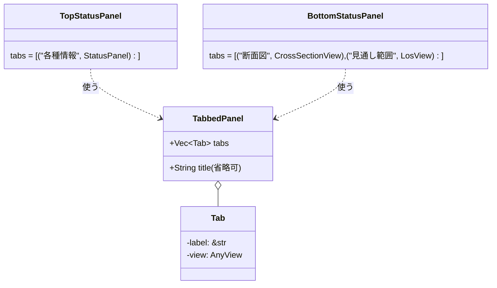

ボトムステータスパネルへ「見通し範囲」タブ(6.9節)を追加した際に、「断面図」
「見通し範囲」の2タブ構成になった(タブ配列に`tab(...)`のエントリを1行足すだけで、
`TabbedPanel`側の変更は一切不要だった。設計意図通りの拡張性)。その後「ボトムステータス
パネルの側面図もいらない」との要望を受けて断面図タブ(`CrossSectionView`、旧称「側面図」)
自体を一時削除したが、後日「断面図機能自体を復活してほしい」との要望を受けて再度追加し、
現在は再び2タブ構成になっている(git履歴参照。復活時の実装は`sim3dview::ui::
cross_section_view::CrossSectionView`としてライブラリ側に置いている)。

- `active: RwSignal<usize>`で選択中タブのインデックスを保持する
- 各タブの中身(`AnyView`)は初回描画時に全タブぶん一度だけ生成してDOMに残し、
  非選択タブは`style:display="none"`で隠すだけにする(タブ切り替えのたびに
  作り直さない。Leptosの再マウントコストを避けるための一般的なパターン)
- タブが1個しかない場合でもタブバー自体は表示する(見た目の一貫性のため、
  タブ数によって表示/非表示を切り替えるような分岐は入れていない)

### 7.7 メニューバー・フローティングパネル(原点設定/覆域高度設定)・右クリックメニュー

画面最上部のメニューバー(`components/menu_bar.rs`)は「ファイル」「設定」「表示」
「ヘルプ」の4項目。「表示」配下には、地形の陰影のON/OFFを切り替える「陰影表示」(ONのとき項目の頭に✓、
6.8節)、カメラの中心点を原点へ戻す「中心点を原点に戻す」、航跡表示(6.12節)の「航跡ラベル」「航跡(軌跡)」「高度線」の
ON/OFF(`TracksState`の各`show_*`。ONのとき✓)、作図(6.11節)のデモ図形を出し入れする「作図デモ」(`components/drawing_demo.rs`。
消すときは自分が追加した図形のIDだけを消すので、ユーザーが作った図形は残る)がある。図形を自分で作る操作は、「作図...」(移動できる非モーダルのウインドウ。6.11節「図形の対話作成」)。
「設定」配下に2つのフローティングパネルを開く項目がある:

- 「原点設定...」: 原点入力フォーム(緯度・経度・`設定`ボタン、DETAILED_DESIGN.md
  3.5節のバリデーション込み)を`ui/origin_dialog.rs`(ライブラリ)として画面中央に表示する。
  フォーム自体の中身は実装当初シミュレーションステータスパネルに直接埋め込まれて
  いたものをそのまま移設したもので、ロジックに変更はない。サーバーへ`set_origin`
  コマンドを送るため`WsConnection`を必要とする
- 「覆域高度設定...」: メインパネルの2D表示モードで使う覆域表示の対象海抜高度
  (`terrain::markers::RadarMarkersState::coverage_altitude_m`、6.9節)を編集する
  `ui/coverage_altitude_dialog.rs`(ライブラリ)を画面中央に表示する。当初はメインパネル
  右上のインライン入力欄(2Dモード時のみ表示)だったが、「高度はメニューから
  フローティングウインドウで入力できるようにして」との要望を受けてこちらへ移設した。
  サーバーへは何も送らないフロント側だけのローカル表示設定のため`WsConnection`は
  不要で、`origin_dialog.rs`と見た目(`.origin-dialog*`のCSSクラスを共用)は同じだが
  実装ははるかに単純(バリデーションも送信ボタンもない、数値入力欄1つだけ)

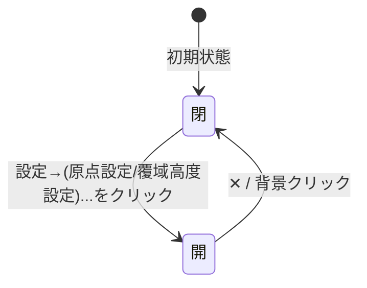

- 開閉状態はそれぞれ`ui::origin_dialog::OriginDialogState`/`ui::coverage_altitude_dialog::CoverageAltitudeDialogState`
  (どちらも`RwSignal<bool>`の単純なラップ)を`provide_context`で共有し、
  `MenuBar`(トリガー)・各ダイアログ本体(表示)の双方が`use_context`で参照する
- メニューのドロップダウン・フローティングパネルとも、背景の透明な`.menu-backdrop`/
  半透明の`.origin-dialog-backdrop`をクリックすると閉じる(パネル本体のクリックは
  `ev.stop_propagation()`でバックドロップまで伝播させない)
- **`FloatingPanel`の種類**(`ui/floating_panel.rs`、ライブラリの汎用部品。上の2つはどちらも既定のモーダル):
  - `modal`(既定`true`): 半透明バックドロップ(`.floating-panel-backdrop`)が画面を覆い、中央にパネルを出す。背景クリックか✕で閉じる。
  - `modal=false`(**ウインドウ**): バックドロップなし。画面全体を覆う透明な層(`.floating-window-layer`、`pointer-events: none`)の上に、ウインドウ
    (`.floating-panel--window`、`pointer-events: auto`)だけがクリックを受けるので、背後(地図など)を操作したまま出しておける。✕でだけ閉じる。
    位置は`initial_position`(画面左上からの(x, y)、既定(80, 60))で決め、パネルが大きいときは本体(`.floating-panel-body`)がスクロールする。
  - `draggable`(既定`false`、モーダルにも使える): タイトルバー(✕以外)のポインタ操作で動かす。位置は`left`/`top`(初期位置。モーダルは中央)に対する
    `transform: translate`の移動量で持ち、ドラッグ開始時のパネルの矩形から「右端が80px以上・左端が(画面幅-80px)以下・上端が0以上・上端が(画面高さ-40px)以下」
    になる範囲へ移動量を制限する(タイトルバーを画面外へ出してしまい、つかみ直せなくなるのを防ぐ)。動かした位置は、閉じて開き直しても保つ(中身を作り直さないため)。
    ウインドウのリサイズ・最小化・複数ウインドウの重なり順・位置の永続化は未実装。
  - サンプルの「作図...」(`components/drawing_window.rs`。`DrawingWindowState`の開閉状態をメニューから立てる)は`modal=false`+`draggable`で、
    作図エディタ(6.11節)を地図の上に浮かせる。
- **右クリックメニュー**(`ui/context_menu.rs`、ライブラリの汎用部品。`FloatingPanel`と同じく、本体だけをライブラリが持ち、中身は使う側が決める):
  - アプリは`ContextMenuState`を`provide_context`し、`<ContextMenu/>`を1つだけ置く。出したい所から`ContextMenuState::show(x, y, items)`(client座標)を呼ぶ。
    項目`MenuItem`は、操作(`action`。`enabled`で無効にもできる)・サブメニュー(`submenu`。入れ子可)・見出し(`label`。押せない)・区切り線(`separator`)。
  - 画面全体を覆う透明な背景(`.context-menu-backdrop`、z-index 30)の上にメニューを描く。メニュー外の左/右クリック(そのクリックは背後へ通さない)・Esc・項目の選択で閉じ、
    項目は**先に閉じてから**`on_select`を呼ぶ(呼んだ先で別のメニューを出せる)。画面の右端・下端にはみ出すときは、描画後に測って収まる位置へずらす
    (それまでは`visibility: hidden`で、指定位置から一瞬ずれて見えるのを防ぐ)。サブメニューは項目にカーソルを乗せる/押すと右へ開き、右に収まらなければ左へ開く(`.flip`)。
    `copy_to_clipboard(text)`(`navigator.clipboard`。https/localhostのみ)も付けてある。
  - **地図の右クリック**: `TerrainView`が`MapMenuState(UnsyncCallback<MapMenuTarget, Vec<MenuItem>>)`と`ContextMenuState`の**両方**を`use_context`できれば、
    右クリックで`MapMenuTarget { position: 地表の(緯度, 経度)(範囲外・空ならNone), track: 右クリックした航跡のシンボル }`を求め、コールバックが返した項目でメニューを出す
    (どちらもNoneなら出さない。シンボルを右クリックしたらそのトラックを先に選択する)。どちらかが無ければ従来どおり、その地点にレーダー観測点を追加する。
    図形の作成中は、メニューではなく「置いた点を1つ戻す」(6.11節)を優先する。
  - **サンプルの項目**(`components/map_menu.rs`。ライブラリの各`State`を呼ぶだけ): 航跡=見出し(名前・種別・所属)/中心点をこの航跡へ/選択を解除。地表=緯度経度の見出し/
    ここにレーダー観測点を追加/ここを原点に設定(`OriginPickState::on_pick`。シミュレーション停止中のみサーバーが受理)/ここを中心点にする(`RecenterRequestState::request_at`。
    カメラの中心点だけを移し、原点は変えない。高さはその地点の地表)/ここに図形を作成 ▶(図形の種類。`DrawToolState::start_at`でその地点を1点目にして開始)/緯度経度をコピー。
  - **作図ウインドウの図形一覧**(`ui/drawing_editor.rs`): 行の右クリックで、名前を変更(選択して名前欄へフォーカス)/複製(`DrawToolState::duplicate`。東北へ大きさの半分ずらして選択)/
    表示・非表示/削除。`ContextMenuState`が無ければ何も出ない。
  - 未実装: 矢印キーでの項目移動・ショートカット表示・チェック付き項目。
- 「ファイル」「表示」「ヘルプ」は現時点では項目未定のため、クリックすると
  「(準備中)」のプレースホルダのみ表示する(実装の骨組みだけ用意し、後から
  項目を追加できるようにしてある)
- 実装上の注意: メニュー項目のクリックハンドラで`WsConnection`(非`Copy`)を
  ムーブするクロージャ(`on_submit`)を、開閉のたびに何度も呼ばれる`Fn`/`FnMut`
  クロージャの外側で1回だけ作ると「2回目以降の呼び出しでムーブ済みエラー」に
  なる(Leptosの`{move || ...}`は再実行される前提のため`FnMut`である必要がある)。
  `origin_dialog.rs`では、開閉のたびに実行される内側のクロージャの中で
  `conn.clone()`してから`on_submit`を作ることで回避している(`coverage_altitude_dialog.rs`
  は`WsConnection`を持たずRwSignalのみで完結するため、この問題自体が発生しない)
- 覆域高度の変更をメインパネルの3D描画へ反映する経路: `coverage_altitude_dialog.rs`は
  `coverage_altitude_m`シグナルを更新するだけで、実際のジオメトリ再構築・再描画は
  `ui/terrain_view/mod.rs`のEffect(レーダー観測点の一覧・選択状態を購読していた
  ものに`coverage_altitude_m`も加えた)が担う。ダイアログ側とメインパネル側が
  別コンポーネントであっても、共有シグナル経由のリアクティブな購読だけで完結し、
  互いを直接呼び出す必要がない

### 7.8 シミュレーションステータスパネルの状態表示(AppStatus)

シミュレーションステータスパネルの状態表示は、バッジなどの装飾を付けず、C++側から配信された
`AppStatus.text`を**そのまま文字列として表示する**だけ。取得できない場合(WebSocketが
`ConnectionStatus::Connected`でない、または接続済みでもまだ`AppStatus`を受け取っていない)は、
詳細を出し分けず一律「接続中」とだけ表示する(`ConnectionStatus`ごとの色分け・文言の出し分けはしない)。

左パネルのシミュレーションステータスパネルには、原点・フレームの下に**「航跡数」**(最新の`TrackList`のトラック数。6.12節)がある。
「開始」「一時停止」ボタン(それぞれ`resume`/`pause`コマンドを送る)は、当初このパネルにあったが、VABパネル(7.4節の「例外」)に
統合したため撤去した(重複していたため要望により撤去。以前は`resume`を送る部品がフロントに無く、`running_`が`false`のまま
経過時間が0で止まっていた)。実行中は原点を変更できない(3.4節。拒否は`CommandError`)。

`AppStatus.text`の実体はC++側`Simulation::running_`(pause/resumeコマンドで変化)に
連動しており、`OriginState`の`origin_changed`と同じパターンで
`SimulationTickResult::app_status_changed`フラグを介して、値が変化した時と
接続直後にのみ配信する(毎フレームは送らない)。

---

## 8. UML図一覧(索引)

| 図 | 節 | 種別 |
|---|---|---|
| 前処理ツール処理フロー | 2.7 | フローチャート |
| 原点状態の状態遷移図 | 3.6 | ステートマシン図 |
| プロトコルのクラス図 | 4.6 | クラス図 |
| シーケンス図: 接続確立 | 4.7 | シーケンス図 |
| シーケンス図: set_origin | 4.8 | シーケンス図 |
| シーケンス図: VABボタン押下 | 4.9 | シーケンス図 |
| C++側スレッドモデル | 5.1 | フローチャート |
| C++側クラス図 | 5.3 | クラス図 |
| Rustコンポーネント構成図 | 6.1 | コンポーネント図 |
| WebSocket接続管理クラス図 | 6.2 | クラス図 |
| 再接続状態遷移図 | 6.3 | ステートマシン図 |
| 地形描画パイプライン | 6.4 | フローチャート |
| 地形描画クラス図 | 6.5 | クラス図 |
| 観測点の追加〜覆域表示のデータフロー | 6.9 | フローチャート |
| タブ付きパネルのクラス図 | 7.6 | クラス図 |
| フローティングパネルの開閉状態 | 7.7 | ステートマシン図 |

---

## 9. ライブラリ実装仕様(要点)

`sim3dview`ライブラリと前処理ツールの、定数・アルゴリズム・バイト配置・手順の**要点**(実装コードから起こした。食い違ったらコードが正)。
方針・理由は6節までを参照。シェーダーの全文は`sim3dview/src/terrain/terrain.wgsl`・`draw.wgsl`(コードが正)、
UIの細かなDOM・CSSクラス名・テスト一覧などのコードから直ちに読み取れる詳細は本節では省き、テストは`cargo test -p sim3dview`(各テストの名前が仕様の主要な数値を表す)。

記号: 「タイル」=緯度経度1度×1度。「チャンク」=タイルを6×6に分けた1個(緯度経度とも1/6度)。「レベル」=解像度段階。「ノード」=グリッドの格子点(セルの角)。

### 9.1 地形データのファイル契約(サーバー ⇔ フロント)

ベースURL(例 `http://localhost:9001/terrain`。末尾スラッシュなし)の下に置く。

| パス | 内容 |
|---|---|
| `metadata.json` | 全体設定 |
| `tile_index.json` | 存在するタイルの一覧 |
| `base.bin` | レベル0(タイル全体で1枚のグリッド)を全タイル分連結 |
| `tiles/L{k}/N035E138.bin` | レベルk(≥1)のタイル別ファイル。チャンクのレコードを連結 |

タイル名は `{N|S}{|lat|:3桁ゼロ埋め}{E|W}{|lon|:3桁ゼロ埋め}`(`(35,138)`→`N035E138`、`(-1,-5)`→`S001W005`)。`lat`/`lon`はタイル**南西角**の整数度。

**`metadata.json`**(フィールドの意味は2.6節)。フロントが読む必須フィールド(未知フィールドは無視):
`tile_levels: [u32]`・`chunks_per_tile: u32`・`elevation_min/max: f32`・`geodetic_bounds{min_lat,max_lat,min_lon,max_lon: f64}`・`ellipsoid{a_m,inv_f: f64}`・`has_texture: bool`・`default_origin{lat_deg,lon_deg: f64}`。
実データの例: `tile_levels=[60,180,600,1800,3600]`、`chunks_per_tile=6`、`geodetic_bounds`=(20,50,120,150)、`ellipsoid={6378137.0, 298.257222101}`。

- **検証(`load_terrain`)**: `tile_levels.len() >= 2`、`chunks_per_tile != 0`、`tile_levels[1..]`がすべて`chunks_per_tile`で割り切れる。違反は`Err`(`TerrainStore.error`に入る)
- 出力は`std::setprecision(15)`で行う(既定6桁だと`138.859722`が`138.86`に丸まる不具合が過去にあった)

**`tile_index.json`**: `{"tiles": [{"lat": 35, "lon": 138, "elevation_min": 0, "elevation_max": 3776}, ...]}`。**陸のあるタイルだけ**を緯度昇順→経度昇順で並べる(この順が`base.bin`の並びと一致)。
海のみのタイルは含めない。`elevation_min/max`はそのタイルの実測(LODの距離計算で中間高さ`(min+max)/2`に使う)。

**グリッドの共通形式**: `(N+1)×(N+1)`ノードの`int16`標高(メートル、四捨五入)、リトルエンディアン、row-major。**行は南→北(j=0が南端)、列は西→東(i=0が西端)**、データなしは`-32768`(`NO_DATA`)。
ノード(列i, 行j)の位置は 経度=`lon_tile + i/N`、緯度=`lat_tile + j/N`。GDALのラスタは北→南なので前処理で行順を反転する(忘れると地形が南北反転する)。

**`base.bin`** = 全タイルのレベル0グリッド(N₀=`tile_levels[0]`、ノード数(N₀+1)²)を`tile_index.json`の順に連結。総バイト数=`タイル数 × (N₀+1)² × 2`で、フロントは**一致しなければエラー**にする。起動時に全部取得して常時保持する(約2.9MB)。

**`tiles/L{k}/{名前}.bin`(k≥1)**: 1タイルを`C×C`のチャンク(C=`chunks_per_tile`)に分け、チャンク番号`c = cy*C + cx`(cy=行(南→北), cx=列(西→東))順に、**固定サイズのレコード**(チャンクのグリッド`(n+1)×(n+1)`ノード、`n = N_k / C`)を連結する。

```
record_bytes = (n+1)² × 2
チャンクcのバイト範囲 = [c*record_bytes, (c+1)*record_bytes - 1]      // HTTP Range: bytes=a-b
ファイル全体 = C² × record_bytes
```

チャンク(cx, cy)のグリッド内ノード(i, j)は、タイル全体のノード(cx*n + i, cy*n + j)に等しい(隣のチャンクとは縁のノードを共有する)。

**サーバーへの要件**: 静的配信(JSONは`application/json`、binは`application/octet-stream`)。**HTTP Range**(単一範囲`bytes=a-b`)に`206`で対応するのが望ましい(未対応でも動くが毎回全体を転送する。
単純な`bytes=a-b`ならCORSのプリフライトは不要。別オリジンなら`Access-Control-Allow-Origin`を付ける)。フロントは失敗(HTTPエラー・サイズ不一致)を**再試行しない**(`failed`集合。9.13)。

### 9.2 データ取得(`terrain::fetch`)と保持(`terrain::loader`)

**取得**(`gloo_net::http::Request`。すべてasync・`Result<_, String>`):

| 関数 | 動作 |
|---|---|
| `fetch_metadata(base_url)` | `{base}/metadata.json`を`TerrainMetadata`へ |
| `load_terrain(base_url)` | metadata取得→9.1の検証→`tile_index.json`→`base.bin`(サイズ検証)→`TerrainData::new(...)` |
| `fetch_tile_level(base_url, key, level, chunk_cells, chunk_count)` | `tiles/L{level}/{名前}.bin`全体。期待長=`chunk_count*(chunk_cells+1)²*2`、不一致は`Err` |
| `fetch_chunk_grid(base_url, key, level, chunk, chunk_cells)` | 同ファイルからRangeでチャンク1個分(`start=chunk*record_bytes`)。長さ不一致は`Err` |
| `tile_name(key)` | 9.1の名前 |

`decode_i16_le`は`chunks_exact(2)`を`i16::from_le_bytes`へ(端数は捨てる)。Range取得でサーバーが**200(全体)を返した場合**は返ってきた全体から`[start..=end]`を切り出す(範囲外は`Err`)。`!response.ok()`は`Err("… HTTP {status}")`。

**型**: `TileKey=(i32,i32)`(南西角の緯度・経度)、`MeshKey=(i32,i32,u8)`(タイル緯度・経度・チャンク番号。GPUメッシュの識別子)、`WHOLE_TILE: u8 = u8::MAX`(チャンク番号がこれ=タイル全体(レベル0)の1枚メッシュ)、
`NO_DATA: i16 = i16::MIN`、`WHOLE_FILE_MAX_LEVEL = 2`(このレベル以下はタイル1ファイルをまとめて取得、超えるレベルはRangeでチャンク単位)。

**`TerrainData`**: `{ metadata, base_url, base: Vec<i16>, tiles: Vec<TileEntry>, slots: Vec<Option<usize>>, cols, stamp, cached_bytes }`。`TileEntry { key, elevation_min, elevation_max, base_offset, chunk_level: Vec<Cell<u8>>, detail: RefCell<Vec<Option<CachedGrid>>> }`(`CachedGrid { data: Rc<Vec<i16>>, last_used }`)。

- `rows = round(max_lat-min_lat)`、`cols = round(max_lon-min_lon)`。`slots`(`rows*cols`個)が`(lat-min_lat)*cols + (lon-min_lon)`→`tiles`の添字。範囲外・存在しないタイルはNone
- `base_offset = タイル索引上の順番 × (N₀+1)²`。`whole_grid(tile)` = `base[base_offset .. +(N₀+1)²]`
- `detail`の添字 = `(level-1)*chunk_count + chunk`(`level>=1 && chunk<chunk_count`のときだけ有効)。`chunk_level`は`chunk_count`個で**初期値0**(=タイル全体をレベル0で出している)
- `chunk_grid(tile, level, chunk)`: 取得済みなら返し`last_used`を更新(LRU)。`has_chunk_grid`は更新しない。`best_cached_level(tile, chunk, max_level)`: `1..=min(max_level, num_levels-1)`を大きい方から見て取得済みの最初のレベル(無ければ0)
- `insert_chunk_grid(key, level, chunk, data)`: タイルが無い・`level`範囲外・スロット無効・`data.len() != (chunk_cells(level)+1)²`なら**黙って無視**。スロットが空だったときだけ`cached_bytes += len*2`。`insert_tile_level`はレコードごとに切って登録
- `set_chunk_level(key, chunk, level)` / `set_whole_tile(key)`: **「いま画面に出しているレベル」**を記録(標高サンプリングはこれを見る)
- `evict_unused(keep, limit_bytes)`: `cached_bytes <= limit`なら何もしない。超えていれば`keep`がfalseの取得済みグリッドを`last_used`の古い順に、上限以下になるまで破棄(`keep`がtrueのものは残す)

**`sample_bilinear(tile, u, v)`**(u=経度方向0..1, v=緯度方向0..1): ①`cx=clamp(floor(u*C),0,C-1)`, `cy`同様、`level = tile.chunk_level[cy*C+cx]`。②`level>0`かつそのチャンクが取得済みならそのグリッドで
(`cells=chunk_cells(level)`, `fx=u*N-cx*cells`, `fy=v*N-cy*cells`)、そうでなければレベル0の`whole_grid`(`cells=N₀`, `fx=u*N₀`)で引く。③双線形補間。**4ノードのどれか1つでも`NO_DATA`なら0.0**(海=標高0m)。

**テスト用の合成地形**: `TerrainData::synthetic(min_lat, min_lon, rows, cols, height)`(`cfg(test)`)。既定レベル`[6,12,24]`・チャンク2×2、`elevation_min=-100, max=4000`、`ellipsoid=WGS84`。
`synthetic_with_levels`でレベル定義を指定(LODのテストは実データと同じ`[60,180,600,1800,3600]`・6分割)。細かいレベルは空で、必要なら`insert_chunk_grid`で足す。これを最初に作ると以降の全テストが書ける。

### 9.3 測地(`terrain::geodesy`)と標高サンプリング(`terrain::heightmap`)

式は3.2節。`Ellipsoid::WGS84 = { a_m: 6378137.0, inv_f: 298.257222101 }`。`EnuTransform::new(&Origin, &Ellipsoid)`が**原点ごとに1回だけ**前計算するもの: `a`, `e2`, `origin_ecef`,
`enu_from_ecef: DMat3`(行が東・北・上の単位ベクトル。glamは列優先なので`from_cols((-sinλ0, -sinφ0cosλ0, cosφ0cosλ0), (cosλ0, -sinφ0sinλ0, cosφ0sinλ0), (0, cosφ0, sinφ0))`)、`meridian_radius = a(1-e2)/w³`、`parallel_radius = a/w·cosφ0`(`w=sqrt(1-e2 sin²φ0)`)。

| メソッド | 仕様 |
|---|---|
| `transform(lat,lon,h) -> [f32;3]` / `transform_f64` | ECEF→`enu_from_ecef*(P-origin_ecef)` |
| `ecef_to_enu(x,y,z)` | 入力がECEFの版(メッシュ生成が行ごとの三角関数を前計算して使う) |
| `enu_to_geodetic(e,n,u) -> (lat,lon,h)` | `ecef = origin_ecef + enu_from_ecef^T*(e,n,u)`。`lon=atan2(y,x)`、初期`lat=atan2(z, p(1-e2))`、**6回反復**(`N=a/sqrt(1-e2 sin²lat)`, `h=p/cos(lat)-N`, `lat=atan2(z, p(1-e2·N/(N+h)))`) |
| `inverse(e,n) -> (lat,lon)` | **接平面近似**: `lat=φ0+n/meridian_radius`, `lon=λ0+e/parallel_radius`。原点近傍(数十km)専用。遠方に使ってはならない(見通し計算・断面図が「原点=観測点」から短距離で使う) |
| `ellipsoid_shader_params()` | 水域シェーダー用の係数 |

**水域シェーダーの楕円体係数**: ENU点`p`について`f(p) = c0 + 2 g·(M p) + |M p|²`(f=0が楕円体面)。`M`の行=`[R.row(0)/a, R.row(1)/a, R.row(2)/b]`(`R = enu_from_ecef^T`、`b=a·sqrt(1-e2)`)、
`g = (origin_ecef.x/a, origin_ecef.y/a, origin_ecef.z/b)`を**f32に丸め**、`c0 = Σ(f32丸めしたg_i)²`をf64で足して`-1`(丸めで原点が面からずれないように)。原点は楕円体上なので定数項がほぼ0で、原点から遠くても桁落ちしない。

**検証**: 原点から数千km離れた4点(石垣島等)で`transform_f64`→`enu_to_geodetic`が緯度経度1e-9度・高さ1e-3m以内で往復。石垣島は原点から約1.8〜2.0e6mで`-350000 < Up < -250000`。
経度+0.001度(緯度35)で東≒80〜100m。水域係数は原点でf≈0、真上+1000mでf>0、真下-1000mでf<0、遠方の標高0m点でも|f|<1e-6。`inverse`は原点から(東10km,北-20km)で厳密逆と緯度1e-4度・経度5e-4度以内。

**標高サンプリング**:

- `sample_heightmap(data, lat, lon) -> Option<f32>`: `geodetic_bounds`の外なら`None`。`lat0 = min(floor(lat), max_lat-1)`(東端・北端ちょうどは内側のタイルの端として扱う)。
  タイルが無ければ`Some(0.0)`(海)。あれば`u=clamp(lon-lon0,0,1)`, `v=clamp(lat-lat0,0,1)`で`sample_bilinear`
- `ground_at_enu(data, transform, east, north) -> (lat, lon, up_f32)`: 「ENUの水平位置を通る鉛直線と地表の交点」。**標高ではなく丸み込みのENU上座標**を返す。
  `up = -(e²+n²)/(2a)`から始め、**4回**、`(lat,lon,_) = enu_to_geodetic(e,n,up)`→`elevation = sample_heightmap(..) or 0`→`up = transform_f64(lat,lon,elevation)[2]`を繰り返す。遠方の地表の高さ・クリック判定・注視点の高さはこれを使う
- `ground_at_geodetic(data, transform, lat, lon) -> (east,north,up)`: `elevation = sample_heightmap(..) or 0`→`transform(lat,lon,elevation)`

検証: 平坦で400km離れた点の`up`は`-d²/(2a)`と3%以内。標高1000mの丘なら`up`の差は1000mから10m以内。原点を変えても`ground_at_geodetic`→`ground_at_enu`で緯度経度が1e-5度以内で戻る。

### 9.4 メッシュ生成(`terrain::mesh`)

```rust
#[repr(C)] pub struct TerrainVertex { pub position: [f32;3], pub color: [f32;3], pub normal_xy: [i16;2] }   // 28バイト
TerrainVertex::UNLIT_NORMAL = [i16::MIN, i16::MIN]        // 「陰影を付けない」印
pub struct TerrainMesh { pub vertices: Vec<TerrainVertex>, pub indices: Vec<u32> }
```

- `position`はメッシュ原点基準のENU座標(東,北,上)。**軸を入れ替えない**(Z-upのままカメラ側で吸収)。`normal_xy`は単位法線のEast・North成分のsnorm16(`round(clamp(v/len,-1,1)*32767)`)。Up成分はシェーダーが復元する
- **配色**: 標高の色は`COLOR_MIN_ELEVATION_M = 0`(下限0m固定)〜`metadata.elevation_max`で正規化し、5点カラーストップを線形補間:
  t=0.0 (0.12,0.40,0.18) / 0.25 (0.15,0.50,0.20) / 0.5 (0.55,0.50,0.25) / 0.75 (0.45,0.32,0.22) / 1.0 (0.95,0.95,0.95)。`max<=min`なら常に最低色。`NO_DATA`頂点は色(0,0,0)・標高0mで配置(NaNだと位置が破綻するため)
- **スカート深さ** `skirt_depth_m(level) = [800, 400, 250, 150, 100][min(level, 4)]`(m)
- **`grid_vertices(grid, cells, place, max_elevation, transform)`**: `place = { lat_start, lon_start, step_deg, skirt_depth }`。頂点数=`(cells+1)² + 4(cells+1)`(`tile_vertex_count`)、並び=ノード(行=南→北、列=西→東)全部→スカート4辺(南,東,北,西)。
  **頂点数と並びは原点に依存しない**(原点変更時は位置だけを`update_mesh_vertices`で書き換える)。行ごとに`(sinφ, cosφ, N(φ))`、列ごとに`(sinλ, cosλ)`を前計算して高速化。法線用に**f64のENU位置**も保持する。
  スカートは辺の各ノードの頂点をコピーして位置だけ`min(h - skirt_depth, 0.0)`にする(**少なくとも海抜0mまで届かせる**。6.10節)
- **法線 `node_normals`**: 自身が`NO_DATA`なら`UNLIT_NORMAL`。東西・南北それぞれ、両隣が陸なら中心差分、片方が海・縁なら片側差分、差分が取れなければ`UNLIT_NORMAL`。`cross = east × north`、`len < 1e-9`または`cross.z <= 0`なら`UNLIT_NORMAL`。
  チャンクの縁ノードは隣の標高を見ない片側差分になり隣と法線がわずかに食い違うが、目立たないので許容
- **インデックス `grid_indices`**: セルごとに、3ノードとも陸なら三角形`[i0,i1,i2]`と`[i1,i3,i2]`。**`NO_DATA`ノードを含む三角形は張らない**。スカートは辺の区間の両端が陸のときだけ`[a,b,sa, b,sb,sa]`の2枚。全陸なら三角形数=`2cells² + 4cells·2`。原点に依存しない
- **公開関数**: `build_whole_tile_vertices/mesh(data, tile, transform)`(レベル0)、`build_chunk_vertices/mesh(data, tile, chunk, level, transform)`(グリッド未取得なら`None`。`lat_start = tile.lat + cy*cells*step`, `step=1/level_cells(level)`)、`tile_vertex_count(cells)`

検証: 色の境界(-50m/0m→最低色、5000m→最高色)、全陸タイルの頂点数・インデックス数(`3*(2*cells² + 8*cells)`)、中央ノードを`NO_DATA`にすると三角形が6枚減る、東へ上る斜面の法線が西向き、四隅は片側差分で法線が求まる。

### 9.5 前処理ツール(`tools/geotiff_preprocess`、C++20/GDAL)

単発実行CLI。独立したCMakeプロジェクト(`find_package(GDAL CONFIG REQUIRED)`、vcpkgの`gdal`。MSVCは`/Zc:__cplusplus`)。使い方: `geotiff_preprocess [map_data=map_data] [出力=sample/sim_server/assets/terrain]`(リポジトリルートから実行する前提)。

- **入力**: `map_data/`内で名前に`_DSM.tif`を含むファイルを走査し、**`_DSM.tif`の直前8文字**(`N035E138`)を`[N|S][3桁][E|W][3桁]`として解析してタイルIDにする(解析できないファイルは警告してスキップ)。
  外接矩形=全タイルIDの最小/最大(max側は南西角+1)で、固定値は持たない。各タイルは3600×3600のFloat32(サイズが違うタイルは警告してスキップ)。タイルは(緯度,経度)昇順にソートして出力順を安定させる
- **1タイルの読み込み(`load_dsm_tile`)**: ①全画素をFloat32で読む(行0=北端)。②**海マスク**`*_MSK.tif`を読み、**画素値==3を海**とするbitmapを作る(マスクが無い・不一致なら警告してNODATAのみ)。
  ③NODATAがあれば**小さな穴を補間**(候補=`値==NODATA && !海`、8連結の連結成分、**2000画素超は埋めない**、境界から内側へBFSで確定済み8近傍の平均で埋める。海は材料にしない)。④残ったNODATAと海マスク画素を`NaN`にする
- **レベルグリッド `build_level_grid(src, cells)`**: `cell_px = 3600/cells`、`half_px = max(cell_px/2, 1.0)`。ノード位置`center`(画素座標)を中心とする窓 `start = clamp(floor(center - half_px + 0.5), 0, 3599)`、
  `end = clamp(floor(center + half_px + 0.5), start+1, 3600)`。列ノードi: `window(i*cell_px)`、行ノードj(南→北): `window((cells-j)*cell_px)`(北端基準の行範囲へ反転)。
  値=窓内の**有効画素の平均を`lround`し[-32767,32767]にクランプ**、有効画素が0個なら`-32768`
- **レベルと出力**: `kLevelCells={60,180,600,1800,3600}`、`kChunksPerTile=6`(起動時に「レベル1以上が割り切れる」ことを検証)。タイルごとに全画素の有効値から`elevation_min/max`を求め、**有効画素が1つも無ければ「陸なし」としてスキップ**。
  レベル0は結果として返し(メインスレッドで`base.bin`へ連結)、レベル≥1は`tiles/L{k}/{名前}.bin`へ即書き出し(チャンク番号順に`(cells/6+1)²`ノードの部分グリッドを切り出して連結)。
  並列ワーカー数=`min(8, max(1, hardware_concurrency/2))`、1スレッドあたりのメモリは数百MB(全域モザイクは作らない)。JSONは手書きで、`metadata.json`は`setprecision(15)`の後に出力し、`geodetic_bounds`は整数のまま、`tile_levels`は`[60, 180, 600, 1800, 3600]`
- **検証**: `metadata.json`の`geodetic_bounds`が`map_data`の外接矩形と一致、`base.bin`のサイズ=`タイル数×61²×2`、`tiles/L4/N035E138.bin`のサイズ=`36×601²×2`(約26MB)、隣接チャンクの縁ノード列が一致、
  富士山(`N035E138`)の最高点が**南→北の正しい位置**にある(反転バグの確認)

### 9.6 カメラ(`terrain::camera`)・ピッキング(`terrain::pick`)・断面(`terrain::profile`)

ライブラリは`glam 0.33`(`glam::camera::rh::{proj::directx, view::look_at_mat4}`)。**座標系はENU(X=東,Y=北,Z=上)のまま**で、Z-upはビュー行列の`up`引数で吸収する。

```rust
pub enum Projection { Perspective { fov_y_radians: f32 }, Orthographic { view_height_m: f32 } }
pub struct Camera { eye, target, up: Vec3, projection, aspect, z_near, z_far }
pub enum ViewMode { ThreeD, TwoD }
pub struct OrbitCamera { target: Vec3, distance, yaw, pitch, fov_y_radians, z_near, z_far: f32, mode: ViewMode }
```

| 定数 | 値 | 意味 |
|---|---|---|
| `MIN_DISTANCE` / `MAX_DISTANCE` | 100 / 2,000,000 | ズームの下限・上限(m) |
| `Z_FAR` | 8,000,000 | 3Dの遠方クリップ(MAX_DISTANCE+データ対角線に余裕) |
| `MIN_PITCH` / `MAX_PITCH` | -1.5 / +1.5 rad | 真上・真下は`look_at`の特異点なので避ける |
| `MIN_EYE_CLEARANCE_M` | 30 | 視点が真下の地面から離れる最小高さ |
| `ORTHO_EYE_HEIGHT_M` | 100,000 | 2Dの視点高度(見た目に影響しない。クリップ範囲用) |
| `ORTHO_DEPTH_RANGE_M` | 1,200,000 | 2Dの奥行き範囲(丸みで原点から3,300kmの端が約850km下がるため) |
| Overview初期値 | distance=400,000, yaw=-π/4, pitch=0.6, fov_y=50°, z_near=1, mode=ThreeD | |

**`OrbitCamera`**: `eye = target + (d·cos(pitch)·cos(yaw), d·cos(pitch)·sin(yaw), d·sin(pitch))`(yawはEast軸基準・反時計回り)。`orbit(dyaw,dpitch)`は`yaw -= dyaw`、`pitch`をクランプ(3Dのみ)。
`pan(d_east,d_north)`(2D)は`target -= (d_east, d_north)`。`zoom(factor)`は`distance`をクランプ(2Dでは`distance`を**正射影の画面縦幅(m)**として流用)。
`pan_orbit_target(dx_px,dy_px,canvas_h)`(3DのShift+ドラッグ): `wpp = 2·distance·tan(fov/2)/canvas_h`、`right=(-sin yaw, cos yaw, 0)`、`forward_h=(-cos yaw, -sin yaw, 0)`、`delta = right·(dx·wpp) + forward_h·(-dy·wpp)`、`target.xy -= delta.xy`。
**`target.z`は呼び出し側が移動先の地表(`ground_at_enu`の上座標)に更新する**(`camera.rs`は標高を知らない)。原点・メッシュには触れない。
`keep_above_ground(ground_up)`(3Dのみ): 6回、`min_z = ground_up(eye.xy) + 30`に届くまで仰角を上げる(`sin_pitch = (min_z - target.z)/distance`、`MAX_PITCH`でも届かなければ打ち切り)。
それでも届かなければ視点を真上へ持ち上げて距離と仰角を求め直す(水平位置は変えない)。呼び出しは**描画の直前に必ず**通す(カメラ操作・原点変更・LOD切替のあと)。
`to_camera(aspect)`: 3Dは`eye()`・`up=Vec3::Z`・`Perspective`。2Dは`eye = target + (0,0,ORTHO_EYE_HEIGHT_M)`・`up=Vec3::Y`(北が画面上)・`Orthographic{view_height_m = distance}`・`z_far = ORTHO_EYE_HEIGHT_M + ORTHO_DEPTH_RANGE_M`。

**行列(反転Z)**: `view_proj = projection_matrix() * look_at_mat4(eye, target, up)`。`Perspective => directx::perspective(fov_y, aspect, z_far, z_near)`(near/farを入れ替えて渡す=反転Z)、
`Orthographic => directx::orthographic(-half_w, half_w, -half_h, half_h, z_far, z_near)`。深度は[0,1]で**近い=1、遠い=0**。レンダラーは`depth_compare: Greater`・深度クリア0.0・`Depth32Float`。
**有限のfar**を使う(無限遠射影は「原点から遠いほど地表が消える」不具合が出た)。反転Zの理由: near=1m・far=8,000,000mの広いレンジを通常の深度で扱うと遠方の精度が失われz-fightingが出る(浮動小数は0付近が密)。
`projection_matrix()`(ビュー行列なし)はカメラ固定の作図(視点空間)のために公開する。

**レイ**: `basis()`: `forward = normalize(target - eye)`, `right = normalize(forward × up)`, `up' = right × forward`。`screen_to_ray(x,y,w,h)`: `ndc_x = x/w*2-1`, `ndc_y = 1-y/h*2`。
透視は原点=`eye`・向き=`forward + right*(ndc_x*half_w) + up'*(ndc_y*half_h)`(`half_h=tan(fov/2)`)、正射影は原点=`eye + right*(ndc_x*half_w) + up'*(ndc_y*half_h)`・向き=`forward`(`half_h=view_height/2`)。
`water_ray_basis()`は同じ式で`[[eye.xyz, 透視1/正射影0], [forward,0], [right*half_w,0], [up'*half_h,0]]`を返す(水域シェーダー用)。
**逆VP行列でレイを求めない**(near点と中間点の差が約1mしかなく、カメラが数百〜2,000km離れるとf32丸め誤差で向きが大きくずれ、ズームアウト時に別の地点を拾う)。

**ピッキング** `pick_lat_lon(data, mesh_origin, camera, x, y, w, h) -> Option<(lat, lon)>`: GPU読み戻しなしのCPUレイマーチ。`MAX_MARCH_DISTANCE = 8,000,000m`, `NUM_MARCH_STEPS = 6000`(刻み≒1.33km), `NUM_BISECT_STEPS = 24`。
`diff(t) = p.z - ground_at_enu(p.xy).up`(`p = ray_origin + dir*t`)。`diff(0) < 0`なら`None`。刻みごとに、点が`elevation_max`より上なら地表評価を省き、`diff(t) <= 0`になった区間を24回二分探索。
交点は`ground_at_enu`で緯度経度に戻す(**接平面近似は使わない**。数百km離れると数十kmずれる)。`geodetic_bounds`の外なら`None`。

**断面** `build_profile(data, origin, azimuth_deg) -> Vec<ProfilePoint{distance_m, elevation_m, lat_deg, lon_deg}>`: `NUM_SAMPLES = 300`(301点)、`max_valid_distance`(方位方向にデータ範囲内でいられる最大距離。上限1,000,000mを30回二分探索。losも共有)まで等間隔、
位置は`inverse`(1,000km以内なので接平面近似で許容)、標高は`sample_heightmap or 0`。方位は北=0・東=90・時計回り。

**検証**: 反転Z(視線上`z_near`の点の深度≈1、`z_far`≈0、`[10..4e6]`mで**単調減少**)、`screen_to_ray`のレイ上の点を`view_proj`で射影し直すと元のNDCに戻る(複数距離・3D/2D)、`water_ray_basis`が`screen_to_ray`と一致、
`orbit/zoom/pan`のクランプ、`keep_above_ground`(高い地形の上なら仰角を上げ、届かなければ持ち上げる。2Dは変更なし)。ピッキング: 中央画素が注視点を拾う・空を向く画素は`None`・範囲外の交点は`None`。

### 9.7 LOD計画(`terrain::lod`)

「どのタイルのどのチャンクをどのレベルで出すか」を決める純粋関数。適用(取得・メッシュ差し替え)は9.13。

| 定数 | 値 |
|---|---|
| `DETAIL_VERTEX_BUDGET` | 25,000,000(下限=レベル1の分を含むチャンク頂点の合計上限) |
| `CHUNK_TARGET_CELL_PX` | 0.7(画面上で1セルがこのpx以下になる最も粗いレベルを理想とする。1.0だと遠方が粗く、0.5だと近くの最細が予算で足りない) |
| `METERS_PER_DEGREE` | 111,000(セル寸法の見積もり) |
| `FRUSTUM_MARGIN` | 1.2(視錐台判定の余裕) |

`TileLayout { Whole, Chunks(Vec<u8>) }`、`cell_size_m(level) = 111000/level_cells(level)`、`chunk_vertex_cost(level) = tile_vertex_count(chunk_cells(level))`(レベル1=1,085、全タイルの下限=390×36×1085≈1,520万、レベル4≈36万)。

**ビュー情報**: 透視は`focus = eye`、`pixel_m(distance) = 2·max(distance,50)·tan(fov/2)/canvas_h`。正射影(2D)は`focus = target`(視点は真上にあるだけ)、`pixel_m = view_height_m/canvas_h`。
`rect(lat0,lon0,lat1,lon1,mid_h) -> (distance, visible)`: 矩形内で`focus`に最も近い点までの距離。`visible`は矩形の4隅+中心の5点をクリップ座標へ(`m = w*1.2`)、**5点すべてが同じ面の外側**ならその面は「外」、背後の点が1つでもあれば全面の外判定をリセット、
`visible = !(全点が背後) && !(いずれかの面が外)`。

**`plan_levels(data, transform, camera, canvas_h_px, resident)`**(戻り値は優先度順):

1. **タイルごとの評価**: `mid_h = (elevation_min+max)/2`、`(distance, visible) = rect(タイル全体)`。`ideal_level(pixel_m) = 1..=max_level のうち cell_size_m(k) <= CHUNK_TARGET_CELL_PX*pixel_m を満たす最小のk`(無ければ最細)。
   `!visible`または`tile_ideal == 1`なら全チャンクが同じ`(distance, visible)`を共有(遠い多数のタイルの計算を省く)。そうでなければチャンクごとに`rect`で距離・視野を求めて理想レベルを出す。
   `target_level(have, ideal, visible, max)`: `!visible`→`max(have,1)`(現状維持)、`have > ideal`→`min(ideal+1, have)`(理想より1つだけ細かいなら保つ=ヒステリシス)、それ以外→`ideal`。1〜maxにクランプ
2. **並べ替え**: `visible`降順→`distance`昇順
3. **予算配分 `allocate_levels`**: 並べ替えた列を「見えているタイル」「見えていないタイル」に分け、この順に`allocate_group`を適用する(予算の残りは共有)。
   `allocate_group`: `base_cost = chunk_count × chunk_vertex_cost(1)`。優先度順に、残りが`base_cost`以上のタイルへ全チャンクをレベル1で確保(確保できないタイルは`Whole`)。
   次に、確保したタイルの全チャンクを(visible降順, distance昇順)に並べ、`level = 2..=max_level`の周回で、目標が`level`以上のチャンクを1つ前のレベルから`level`へ上げる
   (増分`chunk_vertex_cost(level)-chunk_vertex_cost(level-1)`が残りを超えたら、そのグループの配分を終える)。**頂点コスト合計は常に予算以下**

検証(実データと同じレベル定義の3×3タイル): セルサイズ・頂点コストが上の数値と一致、`ideal_level`の境界、遠景(2,000km)では全タイルがレベル1・近景では近いチャンクだけが細かく先頭が最も近いタイル、予算が足りないと遠い側が`Whole`、ヒステリシス、視野外は現状維持、
予算が少ないとき遠いチャンクが先に目標へ届く(近くの最細は後回し)、見えていないタイルの下限は見えているタイルの細分化より後(足りなければ`Whole`)。

### 9.8 見通し(覆域)計算(`terrain::los`)

| 定数 | 値 | 意味 |
|---|---|---|
| `EARTH_RADIUS_M` | 6,371,000 | 平均地球半径 |
| `K_FACTOR` | 4/3 | 等価地球半径係数(`r_eff = R·k`。固定値) |
| `NUM_AZIMUTHS` | 6400 | 1周=6400mil(NATO式)、1mil=0.05625度 |
| `SAMPLES_PER_RAY` | 1000 | 1方位あたりのサンプル数(最大観測範囲50kmで50m間隔) |
| `MAX_TARGET_SAMPLES` | 200 | 対象1点までの判定(`is_visible`/`min_visible_altitude`)のサンプル数上限 |

`curvature_drop(d) = d²/(2·r_eff)`。`RayContext::new(data, origin, antenna_height)`: `observer_altitude_msl = ground + antenna_height`、`transform = EnuTransform::new(origin(=観測点), ellipsoid)`。
観測点は**それ自身を原点とするENU**で計算する(メッシュ原点とは独立)。標高は`sample_heightmap`(画面に出しているレベル)。`LosParams { observer_height_m, max_range_m }`、`LosPoint { azimuth_deg, range_m }`。

- **`compute_los`**(仰角0°の見通し限界。極座標図用): 方位ごとに`ray_max = min(max_valid_distance, max_range)`、`i in 1..=1000`で`d = ray_max*i/1000`、`angle = (elev - curvature_drop(d) - observer_alt)/d`、
  `angle >= max_angle`なら`max_angle = angle; visible_range = d`(マスク角アルゴリズム。手前の尾根の陰でもその先で再び見えれば延びる)
- **`is_visible` / `min_visible_altitude`**(断面図用): `is_visible`は`dist>max_range`なら偽、`target_angle = (elev(target)-drop(dist)-observer_alt)/dist`、`samples = clamp(ceil(dist/500), 10, 200)`で途中の点の仰角が`target_angle`を超えたら偽。
  `min_visible_altitude`は`required_angle = 途中の点の仰角の最大`から`required_angle*dist + drop(dist) + observer_alt`(仰角式が対象高度について線形なので直接解く)
- **`compute_coverage_area`**(2D: 指定海抜高度の探知可能領域): 高度一定の直線を走査。`angle > max_angle`で`max_angle`を更新(注意: `compute_los`は`>=`、こちらは`>`)、`target_angle = (target_altitude_m - drop(d) - observer_alt)/d`が`>= max_angle`の間は`visible_range = d`、
  最初に遮蔽されたら**打ち切り**(直線は陰から出てこない)
- **`compute_los_dome`**(3D: 半球ドーム。仰角一定の直線): 入力は仰角配列(**0以上90未満の昇順**)、出力は`Vec<DomeRing{elevation_deg, points: Vec<LosPoint(range_m=スラントレンジ)>}>`。最初の遮蔽で打ち切る。
  リングkの水平距離の上限`horizontal_cap(k) = min(data_max, max_range * cos(el_k))`。遮蔽されずに上限まで届いたら**サンプル位置に丸めず上限ちょうど**(丸めると高仰角ほど半径が不揃いで球にならない)、`range = d/cos(el)`。
  **最適化**: 走査中の最大仰角`max_angle`は単調非減少なので、`max_angle > tan(el_k)`になったリングを先頭から順に確定し、全リング確定で打ち切る(全リング×全サンプル走査の素朴実装と**完全に同じ結果**になる。素朴実装との比較テストを書くこと)

**小分けの計算と方位の間引き**: `compute_los`・`compute_coverage_area`は`RangeComputation`(`RangeKind::{Visible, AtAltitude(高度)}`)、`compute_los_dome`は`DomeComputation`の薄い包み(単体テスト用。`#[cfg(test)]`)で、
本体は`new(data, origin, params, ..., azimuth_step)`→`advance(data, count)`(次の方位から最大`count`個を計算。終わったら`true`)→`finish()`の**再開できる計算**。呼び出し側(UI)が`advance`を時間で区切って呼び、合間に画面へ処理を譲る。
`azimuth_step`(mil)は6400を割り切る値で、出力の点数は`6400/azimuth_step`(`azimuth_deg = j·step·360/6400`)。**間引いた結果は全方位の結果の同じ方位の値と一致する**(テストで確認)。小分けにしても結果は変わらない(テストで確認)。
**性能**: 観測点1つ=方位数×1000サンプルの`sample_heightmap`。全方位(6400)で640万回。UIは、ドーム1600方位・2D覆域3200方位・極座標図3200方位で計算する(6.9節)。
**検証**(標高0mの平坦地形、原点=観測点): 全方位で電波の地平線距離(`sqrt(2·r_eff·h_obs)`相当)に一致、平坦地形の可視判定が電波の地平線に従う、東約16kmの標高1,500m尾根が背後を隠す、`min_visible_altitude`と可視判定の整合、
2D覆域が高い対象で最大範囲まで届き尾根で止まる、平坦ならドームの全リングが最大観測範囲のスラントレンジ、`curvature_drop`が距離の2乗、方位の添字がmil。

---

### 9.9 レンダラー(`terrain::renderer`・`terrain::vertex`)

依存: `wgpu = "30"`・`bytemuck`(`Pod`/`Zeroable`)・`glam 0.33`、WGSL検証用に`naga 30 (wgsl-in)`(dev)。**wgpuのAPIは版で名前が変わる**ので、wgpu 30系
(`Instance::new(InstanceDescriptor::new_without_display_handle())`、`SurfaceTarget::Canvas`、`get_current_texture()`が`CurrentSurfaceTexture`列挙を返す、`depth_write_enabled: Some(..)`など)を前提にする。

**描画構成**(3パス。設計は6.8・6.11節):

| パス | 描画先 | 内容 |
|---|---|---|
| ① メイン | 4×MSAAカラー+深度(内部解像度=canvas×2) | 水域 → 地形メッシュ → `World`不透明作図 → 3Dモデル(6.13節) → 覆域ドーム → `World`半透明作図 → 2D覆域 → マーカー → 航跡 |
| ② オーバーレイ(カメラ固定の作図があるときだけ) | 同じMSAAカラー(`Load`)+深度(`Clear(0.0)`) | 視点空間の不透明 → 視点空間の半透明 → 画面座標(追加順) |
| ③ 縮小 | スワップチェーン(canvas解像度、1サンプル) | 内部解像度の解決結果を線形フィルタで2×2平均して縮小 |

- **MSAA=4**+**スーパーサンプリング×2**。内部テクスチャの一辺は`SUPERSAMPLE_MAX_DIMENSION=4096`で頭打ち(`supersample_size(w,h) = (min(max(w,1)*2, 4096), min(max(h,1)*2, 4096))`)
- 深度は`Depth32Float`・**反転Z**(比較`Greater`、クリア0.0)。パス①の深度は`Store`、パス②では`Discard`。裏面カリングは**無効**(`cull_mode: None`。既知の技術的負債。有効化するなら先にスカートの巻き順を4辺で揃える)。空・データ範囲外は黒

**頂点・uniformのバイトレイアウト**:

- `TerrainVertex`(28バイト): position `[f32;3]`@0(`@location(0)`)、color `[f32;3]`@12(1)、normal_xy `[i16;2]`@24(2, `Snorm16x2`)
- `DrawVertex`(56バイト): position `[f32;3]`@0(0。面/線=座標、ビルボード=アンカーの3D位置)、color `[f32;4]`@12(1。RGBA非乗算)、aux `[f32;3]`@28(2。面=単位法線、線=反対側の端点、ビルボード=`(offset_x_px, offset_y_px, 0)`)、
  params `[f32;4]`@40(3)。`params.x`=線の太さ(px。0以下=面。向きつきビルボードでは進行方向のラジアン=北から時計回り)、`.y`=線の側(±1)、`.z`=種類(`KIND_FLAT=0`/`KIND_BILLBOARD=1`/`KIND_ORIENTED_BILLBOARD=2`。
  シェーダーは`z>1.5`・`z>0.5`で分岐)、`.w`=陰影を付けるなら1。コンストラクタは`surface`・`line`・`billboard`・`oriented_billboard`
- `CameraUniform`(**208バイト**、`@group(0) @binding(0)`、VERTEX|FRAGMENT): `view_proj`0 / `shading`64(x=陰影ON=1) / `eye`80 / `forward`96 / `right`112 / `up`128(この4つは`Camera::water_ray_basis`)/ `ellipsoid_m`144(3×vec4) / `ellipsoid_g`192
- `DrawUniform`(**96バイト**、VERTEXのみ): `view_proj`0 / `viewport`64(canvasのpx) / `light`80(面から光源へ向かう単位ベクトル)。座標の種類ごとに1つ(`draw_world`/`draw_view`/`draw_screen`)で別バッファ・別bind group
- 光源定数: `WORLD_DRAW_LIGHT = [-0.5, 0.5, 0.7071068, 0]`(北西・仰角45°)、`VIEW_DRAW_LIGHT = [-0.348, 0.497, 0.795, 0]`(カメラから見て左上手前)。
  `screen_matrix(w,h)`=ピクセル座標→クリップ(左上原点・y下向き・深度0.5一定): `Mat4::from_cols((2/w,0,0,0), (0,-2/h,0,0), (0,0,0,0), (-1,1,0.5,1))`

**パイプライン**(共通: 三角形リスト・`cull_mode: None`・`multisample.count=4`(縮小のみ1)・カラー形式=スワップチェーン形式(sRGBがあれば選ぶ)・深度`Depth32Float`):

| 名前 | シェーダー・エントリ | 頂点バッファ | ブレンド | 深度(書く?, 比較) |
|---|---|---|---|---|
| `terrain` | terrain.wgsl `vs_main`/`fs_main` | `TerrainVertex` | REPLACE | (書く, Greater) |
| `terrain_fade` | terrain.wgsl `vs_fade`/`fs_fade`(`@group(1)`に割合の表`FadeTable`) | `TerrainVertex` | REPLACE | (書く, Greater) |
| `water` | terrain.wgsl `vs_fullscreen`/`fs_water` | なし(3頂点を`vertex_index`から生成) | REPLACE | (書く, **Always**) |
| `dome` | terrain.wgsl `vs_main`/`fs_dome` | `TerrainVertex` | ALPHA_BLENDING | (**書かない**, Greater) |
| `draw_opaque` | draw.wgsl `vs_main`/`fs_main` | `DrawVertex` | ALPHA_BLENDING | (書く, Greater) |
| `draw_blend` | 同上 | 同上 | ALPHA_BLENDING | (書かない, Greater) |
| `draw_screen` | 同上 | 同上 | ALPHA_BLENDING | (書かない, **Always**) |
| `downsample` | terrain.wgsl `vs_fullscreen`/`fs_downsample` | なし | REPLACE | なし |

- `water`は深度テストしないが**深度を書く**(`frag_depth`を出力)。空(楕円体に当たらない画素)は`discard`して黒・深度0のまま。`dome`が深度を書かない理由は、半透明の三角形どうしが互いに隠して欠けるのを防ぐため
- 縮小サンプラーは`ClampToEdge`・`Linear`/`Linear`/`Nearest`。**wgpu標準の`TextureBlitter`は縮小側がNearest固定なので使わない**(線形フィルタの2×2平均がスーパーサンプリングの要)
- 水域のbind groupと縮小のbind groupはどちらも`@group(0)`(別パイプラインで別のレイアウト)

**`TerrainRenderer`の公開API**: `new(canvas)`(async)、`set_mesh(key, &mesh)`(同じキーは置換、`indices.is_empty()`なら削除。`bounds`=頂点位置のAABBを保持)、`remove_mesh`、`set_mesh_faded`・`remove_mesh_faded`(クロスフェードで切り替える版)・`is_fading`、`update_mesh_vertices(key, &vertices)`(頂点数不変で位置だけ更新=原点変更。boundsも更新)、
`update_markers`・`update_coverage_2d`・`update_tracks`(`&[DrawVertex]`)、`update_drawings(&DrawingBatches)`、`update_dome(&[TerrainVertex])`、`set_hillshade(bool)`、`set_ellipsoid_origin(&EnuTransform)`(頂点を作り直す場面で必ず呼ぶ)、
`resize(w,h)`(0または現状と同じなら何もしない)、`aspect_ratio`・`canvas_height_px`・`canvas_size_px`、`render(&Camera) -> Result<(), String>`。

- **`new`**: `canvas.width()/height()`(0なら1)。ネイティブ(単体テスト)ではcanvas surfaceが作れないので`cfg(target_arch="wasm32")`で分け、非wasmは`Err`を返す(ライブラリ全体が`cargo test`でビルドできるように)。
  `request_adapter{HighPerformance, compatible_surface}`、`surface.get_default_config`で**sRGB形式があればそれに変更**、`present_mode=Fifo`
- **`render(camera)`**: `CameraUniform`と作図のuniform3種を`queue.write_buffer`(`view`は`camera.projection_matrix()`=**ビュー行列なし**、`screen`は`screen_matrix`)。`surface.get_current_texture()`の結果:
  `Success`→描画、`Suboptimal`→描画してsubmit後に再設定、**`Timeout|Occluded`→このフレームは描かず`Ok(())`**(エラーではない。タブが隠れている等)、`Outdated`→再設定して`Ok(())`。その他は`Err`。
  カメラ固定の作図があるときだけパス②を積む(パス①のカラーは`Store`、無ければ`Discard`+その場で解決)。
  最初に終わったクロスフェードを片付け(`Fades::finish`。`render`は`&mut self`)、クロスフェード中のメッシュ(出てくる側=割合`progress`・y=0、消える側=同じ`progress`・y=1で反転)の値を`FadeTable`へ書き、
  通常のメッシュを描いたあとに`terrain_fade`で描く(視錐台カリングは同じ。表の番号=`first_instance`)
- **視錐台カリング** `is_outside_frustum(view_proj, aabb)`: AABBの8隅をクリップ座標へ、各隅で6面のビット(`x<-w`,`x>w`,`y<-w`,`y>w`,`z<0`,`z>w`)を立て、**全隅のビットの論理積が非0ならその面の完全に外**(描かない)。保守的判定(見えているものを「外」とすることはない)

**シェーダーの要点**(全文は`terrain.wgsl`・`draw.wgsl`。陰影・水域・MSAAの設計は6.8・6.10節):

- `hillshade`: `LIGHT_DIR=(-0.5,0.5,0.70710678)`、`AMBIENT=0.35`、`(AMBIENT+(1-AMBIENT)·max(n·L,0)) / (AMBIENT+(1-AMBIENT)·L.z)`。`normal_xy`の長さの二乗が1を超えたら陰影なし。`fs_dome`は固定アルファ0.22
- **水域 `fs_water`**: 透視は`origin=eye, dir=forward+offset`、正射影は`origin=eye+offset, dir=forward`(`offset = right*ndc.x + up*ndc.y`)。二次方程式`a t²+2·half_b·t+c=0`を桁落ちしにくい解の公式で解き、手前の解`t_near>0`が水面。
  **書く深度は交点から視線に沿って`WATER_DEPTH_MARGIN_M=1000m`奥へずらした点**(クリップ`z/w`を[0,1]にクランプ)。色`(0.25,0.55,0.85)`
- **`vs_fullscreen`**: `vertex_index`(0,1,2)から画面いっぱいの三角形(`x=(i<<1)&2`, `y=i&2`, `clip=(x*2-1, 1-y*2)`)。`fs_downsample`は内部解像度のテクスチャを線形サンプルして縮小
- **`draw.wgsl`の太い線**: 各頂点は「この端点`position`」と「反対側の端点`aux`」を持つ。クリップ座標→ピクセル座標で向きと法線を求め、`params.y`(±1)×半幅だけ左右へ、端点は線の向きへ半幅延ばす。
  `w < LINE_MIN_W(0.5)`の端点は線分をそこで打ち切る(両端とも後ろなら描かない)。`LINE_DEPTH_BIAS=2e-5`だけ手前に寄せる。頂点生成側(`append_line_strip`)は線分ごとに4頂点`a+, a-, b+(側-1), b-(側+1)`を作り三角形`[a+,a-,b+, b+,a-,b-]`にする
- **ビルボード**: アンカーを射影し`aux.xy`(px、右・上が正)だけずらす。深度は`billboard_depth`で求めた深度(アンカーを通る局所の水平面の、その画素の視線が当たる点の深度まで手前へ。上限は1.3倍。6.12節)に`(1+BILLBOARD_DEPTH_BIAS(2e-3))`(距離の0.2%手前)を掛ける。**向きつき**: アンカーと「アンカーからENU水平方向`(sin h, cos h)`へ200m進んだ点」を射影し、その差の画面上の向きを`forward`とする
  (`right=(forward.y,-forward.x)`、差がほぼ0なら`forward=(0,1)`)。面の陰影: `params.w>0.5`なら`AMBIENT(0.4)+(1-0.4)·max(dot(normalize(aux), light.xyz),0)`をRGBに掛ける

**検証**: naga検証(WGSLがパース・検証を通る)、`CameraUniform`(208バイト)・`DrawUniform`(96バイト)・`TerrainVertex`(28)・`DrawVertex`(56)のオフセットがWGSL構造体と一致(nagaで型サイズを読んで比較)、`supersample_size`((700,500)→(1400,1000)、(0,0)→(2,2)、(3000,100)→(4096,200))、
`position_bounds`、`screen_matrix`((0,0)→(-1,1,0.5)、(w,h)→(1,-1))、視錐台(明らかに外の箱は`true`、見えている箱は決して`true`にならない)。

### 9.10 観測点・覆域の描画(`terrain::markers`・`terrain::render_bias`)

**Zファイティング対策の持ち上げ量**(`render_bias`。地表に貼り付くものは地形メッシュ(粗いLODを含む)と同じ深度になると縞になる/LODの高さのずれで埋まる。値は種類ごとに実機で調整):
`DRAWING_M=15`(作図の`AboveGround`)、`TRACK_M=25`(航跡・高度線の足元)、`MARKER_M=25`(観測点ピンの先端)、`DOME_M=20`(覆域ドーム全体)、`COVERAGE_AREA_M=20`(2D覆域。深度テストはしないが正射影の奥行き範囲に収めるため地表に置く)。
シェーダー側にも対の深度バイアス(`LINE_DEPTH_BIAS`・`BILLBOARD_DEPTH_BIAS`・`WATER_DEPTH_MARGIN_M`)があり、**両方をセットで調整する**。

**状態**: `RadarMarker { id: u64, lat_deg, lon_deg, height_m /*アンテナ高(地表から)*/, max_range_m }`、`RadarMarkersState { markers, selected, next_id, coverage_altitude_m /*既定1000*/, show_all_coverage /*既定false=選択中のみ*/ }`(Copy)。
`add(lat,lon) -> id`(既定`height_m=10`・`max_range_m=50_000`で追加し選択する)、`remove(id)`(選択中なら`selected=None`)。観測点は緯度経度の絶対値で保持し、メッシュ原点とは独立。

**定数**: 選択中=黄`[1,0.92,0.25,1]`、非選択=橙`[1,0.55,0.15,1]`、縁取り`[0.08,0.08,0.10,1]`、ドーム面`[0.3,0.9,1.0]`(アルファはシェーダー0.22)。ピン: `PIN_HEAD_CENTER_PX=26`・`PIN_HEAD_RADIUS_PX=10`・`PIN_OUTLINE_PX=2.5`・`PIN_DOT_RADIUS_PX=4`・`PIN_HEAD_SEGMENTS=24`。
`DOME_RING_ELEVATIONS_DEG`(38個)=0〜10°を1°刻み / 12〜30°を2° / 33〜60°を3° / 64,68,72,76,80,84,87°。`DOME_AZIMUTH_STEP=4`(1600方位)、`DOME_APEX_SEGMENTS=48`、
`DOME_MIN_RING_STRIDE=2`・`DOME_MAX_RING_STRIDE=32`。
2D覆域: 塗り`[0.35,0.9,0.4]`アルファ`0.32`、輪郭`[0.75,1.0,0.4,1]`太さ2.5px、`COVERAGE_AZIMUTH_STEP=2`(3200方位)。

- **平滑化はしない**。ドーム・2D覆域とも、計算結果(`DomeRing`・`LosPoint`の`range_m`)をそのまま頂点に使う(以前は方位角方向のメディアン→平均、ドームは仰角方向にも平滑化していたが、要望で撤去した。地形の細かい凹凸や1方位だけ遮蔽される所は、放射状の筋・ギザギザとしてそのまま出る)。
  **リングの間引き `ring_stride(el, N)`**: `DOME_MIN_RING_STRIDE`から、`stride·2 <= 1/cos(el)`かつ`N`を割り切る間、2倍にする(最大`DOME_MAX_RING_STRIDE`)。
  **帯の三角形 `stitch_rings(lower, upper, push)`**: 上のリングの各辺`(u0,u1)`について、下のリングの対応する`ratio = n_lower/n_upper`本の辺ごとに`(l_a, l_b, u0)`、最後に`(u0, u1, l_next)`(`ratio=1`なら四角形を2枚の三角形に割るのと同じ。辺は、リングの辺が1回・それ以外が2回で、すき間がない=テストで確認)
- **マーカー**: 観測点ごとに`anchor = mesh_transform.transform(lat, lon, ground + MARKER_M)`。すべて`DrawVertex::billboard`の三角形。ピンは頭の円(中心`(0,26)`から24枚の扇形)+頭の円への接線の先端三角形(`β = acos(r/(26 - tip_y))`, 接点`(±r·sin β, 26 - r·cos β)`)。
  積む順は①縁取り(`r=10+2.5`, `tip_y=-2.5·1.4`)→②本体(`r=10`, `tip_y=0`)→③中の点(縁取り色、半径4)
- **3Dドーム `dome_geometry(data, mesh_origin, marker, rings)`**(1観測点ぶん。色は`coverage_colors(marker.id)`。`rings`は`start_dome_computation`=`DomeComputation(.., DOME_RING_ELEVATIONS_DEG, DOME_AZIMUTH_STEP)`の結果): リングごとに、生の`range_m`のまま`ring_stride`で間引いた頂点を置く。
  頂点は`range`と仰角から`horizontal = range·cos(el)`、`(lat,lon) = local_transform.inverse(horizontal·sin az, horizontal·cos az)`、`h = observer_height + range·sin(el) + DOME_M`(`observer_height = ground + height_m`)。
  隣接リングの間は`stitch_rings`で三角形にする(表裏とも見えるので巻き順は問わない)。最上段リングは、その半径の平均を高さとするアペックスへ、方位を`step_by(max(N/48,1))`に間引いた傘の三角形で閉じる(間引く理由は6.9節)
- **2D覆域 `coverage_2d_geometry(data, mesh_origin, marker, points)`**(1観測点ぶん。塗り・輪郭線の色は`coverage_colors(marker.id)`。`points`は`start_coverage_computation`=`RangeComputation(AtAltitude, COVERAGE_AZIMUTH_STEP)`の結果): 3200方位の水平距離をそのまま境界にする(低い高度では、島や岩の陰が細い放射状の楔・ギザギザとしてそのまま出る)。**覆域の高度ではなく地表に貼る**(`sample_heightmap + COVERAGE_AREA_M`。地図上の塗り分けオーバーレイであるため)。
  塗りは`[center, boundary[i], boundary[i+1]]`のファン(星形なので自己交差しない)、輪郭は閉じた太い線。**描画は深度テストなし**(`draw_screen`+絶対座標のuniform。理由は6.9節)。3Dと2Dでバッファ・パイプラインが別で、モード切替時に使わない方を空にする

### 9.11 作図(`terrain::drawing`・`drawing_geometry`・`draw_tool`)

**データモデル**(`terrain::drawing`。モデルの要点は6.11節): `Color{r,g,b,a}`(0..1、非乗算)、`Style{fill, stroke: Option<Color>, stroke_width_px}`(既定=塗り(0.2,0.6,1.0,0.35)+線(0.2,0.6,1.0)+太さ2)、
`Altitude { Msl(f64), AboveGround(f64) }`、`Corner { TopLeft, TopRight, BottomLeft, BottomRight, Center }`、`Position { World{lat,lon,altitude}, Screen{corner,x_px,y_px}, View{right_m,up_m,forward_m} }`、`Space`、
`Shape { Circle{center,radius}, Rect{center,width,height,rotation_deg}, Polygon{points}, Sector{center,radius,start_deg,end_deg}, Sphere{center,radius}, Cuboid{base_center,size_m:[東西,南北,高さ],heading_deg}, Cylinder{base_center,radius,height}, Cone{..}, Polyline{points} }`、
`Drawing{id,shape,style,visible}`、`DrawingState{items: RwSignal<Vec<Drawing>>, next_id}`(Copy)。`Shape`・`Position`・`Altitude`・`Corner`・`Style`・`Color`は`serde`対応(localStorage保存用)。

- 角度は**時計回りの度数、0度が上(World=北)**。`Cuboid`の`heading_deg`だけが時計回り。3D図形の位置は球=中心、他=底面の中心。多角形は全頂点を先頭の点の高度の面に置く
- `Shape::validate() -> Result<Space, &str>`: 位置なし・種類が混在・`Screen`に3D図形はエラー(不正な図形は描かず警告ログ)。`depends_on_terrain()`は`AboveGround`の`World`位置を持つか(地形LODが変わったら描き直す)
- `DrawingState`: `add(shape, style) -> id`(後ろに追加したものほど手前=`Screen`の重なり順・`World/View`の半透明どうしの重なり順)、`update(id, f)`、`remove(id)`、`clear()`

**ジオメトリ生成 `drawing_geometry::build(ctx, drawings) -> DrawingBatches`**(純粋関数。`ctx = { mesh_transform, ellipsoid, ground: &dyn Fn(lat,lon)->f64, viewport_px }`):
`DrawingBatches { world: Batch, view: Batch, screen: Vec<DrawVertex> }`(`Batch { opaque, blend }`。アルファ≥`0.999`なら`opaque`、`Screen`は追加順に重ねるので1列)。出力座標: `World`=現在のメッシュ原点のENU(カメラの`view_proj`)、
`View`=(右, 上, **-前方**)(`Camera::projection_matrix()`)、`Screen`=ピクセル座標(左上原点・y下向き・z=0。`screen_matrix`)。

- 太い線 `append_line_strip(list, points, closed, color, width_px)`(`markers`・`tracks`も使う): 線分(a→b)ごとに4頂点`a+(側+1), a-(側-1), b+(側-1), b-(側+1)`から三角形`[a+,a-,b+, b+,a-,b-]`。`n<2`なら何もしない
- **緯度経度⇔基準点からの方位・距離**(方位角等距離図法、球面の直接解): `mean_radius(ellipsoid, lat) = a·sqrt(1-e2)/(1-e2·sin²lat)`、`destination(lat,lon,bearing,dist,radius)`(`δ=dist/radius`、`lat2 = asin(sin lat1 cos δ + cos lat1 sin δ cos bearing)`、
  `lon2 = lon1 + atan2(sin bearing sin δ cos lat1, cos δ - sin lat1 sin lat2)`)、`to_local`はその逆(haversine+方位)
- **2D図形**: 置いた位置を中心とするローカル平面(x=右/東, y=上/北)で三角形`fill`と輪郭`outlines`を作り、`Frame2d`で出力座標へ写す(`World`は`destination`で緯度経度へ→`Altitude`から高さ(`DRAWING_M`込み)→`EnuTransform`)。
  分割の細かさ: 海抜の水平面は`fill 20km・arc 2km`、地表貼り付けは`fill 500m・arc 250m`、`View/Screen`は分割しない。定数`MAX_FILL_TRIANGLES=50_000`、`MIN/MAX_CIRCLE_SEGMENTS=48/720`、`MAX_GRID_CELLS=512`、`MAX_EDGE_PARTS=2000`、`MAX_REFINED_VERTICES=300_000`。
  `effective_fill_step(area, fill) = max(fill, sqrt(2·area/MAX_FILL_TRIANGLES))`。円・扇形はリング分割(`arc = min(steps.arc, radius·0.09)`)、矩形は格子(セルは`[a,b,c, a,c,d]`)、
  多角形は`earcutr`で三角形分割(反時計回りに揃える。凹・共線も可)→最長辺が上限を超える三角形を辺の中点で4分割することを繰り返す(`MAX_REFINED_VERTICES`まで)。輪郭は`densify`
- **折れ線**: `World`は隣接2点を大円に沿って分割(`grounded`=どちらかが`AboveGround`なら250m刻み、そうでなければ2000m刻み、上限4000分割)。地表基準は「地表からの高さ」を補間し`DRAWING_M`を足す。`View`・`Screen`は座標変換のみ
- **3D図形**: 位置における**局所ENU**(位置を通る鉛直線が+z)で作り、`enu_to_geodetic`→`EnuTransform::transform`で厳密に変換する(遠方でも地球の丸みで傾いた上向きが正しい)。3D図形は`render_bias`の持ち上げを付けない。
  球は`SPHERE_SEGMENTS=48`×`SPHERE_RINGS=24`、他は`SOLID_SEGMENTS=48`。稜線=球は直交する3つの大円、直方体は縦4本+底・天の閉ループ、円柱は90°ごと4本の縦線+底・天の円、円錐は底の点→先端の4本+底の円。円錐の側面は頂点ごとに専用の先端頂点を持つ(法線を面ごとに変えるため)。
  `View`では(東,北,上)→(右,前方=-z,上)、`Screen`に3D図形は置けない

**図形の対話作成(`draw_tool`)**: `MIN_POINT_SPACING_M=1`(直前の点とこれ未満のクリックは無視)、`SAVE_VERSION=1`。`ToolKind::ALL = [Circle, Rect, Polygon, Sector, Polyline, Sphere, Cuboid, Cylinder, Cone]`。
必要クリック数: Circle/Rect/Sphere/Cuboid/Cylinder/Cone=2(2点目で自動確定)、Sector=3、Polygon(≥3)・Polyline(≥2)=ダブルクリック/Enterで確定。

- **点→図形 `build_shape(kind, pts, altitude)`**(純粋関数): `sized(r) = r>=1.0 ? Some(r) : None`。Circle/Sphere=`distance(c,e)`(球は`AboveGround(o)`なら`AboveGround(o+radius)`で地表に載せる)。Cylinder/Cone=半径`distance`・高さ`2·radius`。
  Rect/Cuboid=1点目から見た東西・南北の差を幅・奥行、中心は中点(東西・南北に沿う。回転は数値編集。直方体の高さ=(幅+奥行)/2)。Sector=`start=bearing(c,a)`、`sweep=(bearing(c,b)-start).rem_euclid(360)`、`sweep>=1`のときだけ作る。Polygon≥3点、Polyline≥2点
- **状態 `DrawToolState`**(Copy): `drawings`、`tool`、`points`、`new_style`(既定=橙の塗り+線)、`new_altitude`(既定`AboveGround(0)`)、`shapes: Vec<UserShape{id,name}>`、`selected`、`hover`、仮の図形・ハイライトのid、`serial`。
  操作: `start(kind)`(同じツールの再選択は`cancel`)、`start_at(kind, lat, lon)`(右クリックメニュー用。すでに同じツールでも解除しない)、`cancel`、`click(lat,lon)`(ツールなしは無視。`fixed_points`に達したら`build_shape`→成功で確定、
  **失敗なら最後の点だけ取り消す**)、`set_hover`、`finish`(可変点数のみ)、`undo`(点を1つ戻す。無ければ`cancel`)、`commit`(名前`"{ラベル} {serial}"`。**ツールは選んだまま**)、`select`、`update_shape`、
  `duplicate(id)`(東北へ「特徴サイズ×0.5」ずらして`"{名前} のコピー"`)、`rename`、`remove`、`remove_all`(`shapes`にある図形だけ消す)
- **仮の図形とハイライトは`drawings`の中の1要素として持つ**: 作成中は`preview_shape`(作れなければ`Polyline`で代替)を仮の1要素として置く(`stroke`が`None`なら黄色)。選択中は`highlight_shape`(2D図形の全位置の高度を**+5m**持ち上げて自身の輪郭とのZファイティングを避ける)を太さ4pxの黄色い線で重ねる
- **保存 `persist(key)`**: 作成直後に**1度だけ**呼ぶ。`localStorage[key]`のJSON`{version:1, shapes:[{name, shape, style, visible}]}`を読み、`version==1`なら復元(違う・壊れているなら警告ログを出して読まない)。以後、`shapes`と`drawings.items`を購読する`Effect`が**内容が変わったときだけ**書き戻す。
  localStorageの読み書きは全て失敗しうる(プライベートウインドウ・容量超過・ブロック)のでエラーは無視

**検証**: `local_coordinates_round_trip`(`to_local`∘`destination`)、円・矩形の面積(三角形の面積総和)、扇形の角度、凹多角形の面積が保たれる、不透明/半透明の振り分け、不正・不可視の図形は飛ばす、折れ線は線分あたり三角形2枚、
`Screen`の角とオフセット、立体の法線が単位長、`World`の立体が地面に立つ、`AboveGround`は地形に沿い`Msl`は水平、`triangulate`が向き・凹・共線を扱う。`draw_tool`: 各図形の作り方、大きさ0の拒否、扇形の向き、球が地表に載る、点数不足、プレビューの折れ線化、JSON往復。

### 9.12 航跡(`terrain::tracks`)

**モデル**: `SymbolKind { Unknown, Aircraft, Helicopter, Ship, Vehicle, Missile }`、`Affiliation { Unknown(1.0,0.9,0.3), Friendly(0.35,0.65,1.0), Hostile(1.0,0.3,0.3), Neutral(0.4,0.9,0.45) }`(括弧は色)、
`Track { id, kind, affiliation, label, lat_deg, lon_deg, altitude: Altitude, heading_deg, speed_mps, pitch_deg, roll_deg }`(ピッチ・ロールは3Dモデルの向きだけに使う)、`TrackEntry { track, trail: Vec<(lat,lon,Altitude)> }`(現在位置は含まない)、
`TracksState { entries, show_labels, show_trails, show_altitude_lines (既定すべてtrue), selected }`(Copy)。

- 航跡定数: `TRAIL_MAX_POINTS=400`、`TRAIL_MIN_STEP_M=250`。`advance_trail`: 前回の位置が**trailの最後の点から250m以上**(trailが空なら常に)離れていれば前回の位置をtrailに追加し、400点を超えたら先頭を捨てる(距離は等距離円筒近似)
- `set(tracks)`: **受信のたびに全トラックの最新状態を渡す**。同じIDはtrailを`advance_trail`で引き継ぐ。前回に無いIDは新規、今回に無いIDは消える。選択中のトラックが今回に無ければ`selected=None`。`clear()`、`select(Option<id>)`、`selected_track()`(リアクティブ)

**ジオメトリ `build_track_geometry(ctx, entries, options) -> { vertices, labels }`**(`options = { selected, trails, altitude_lines(3Dのみtrue), symbols_hidden: Option<&HashSet<TrackId>> }`。`symbols_hidden`のトラックはシンボル(縁取り+本体)だけ積まない。3Dモデルで描いているトラック)。定数: `SYMBOL_SIZE_PX=30`、`SYMBOL_OUTLINE_SCALE=1.3`、縁取り色`[0.04,0.04,0.07,0.9]`、`ALTITUDE_LINE_MIN_M=30`、
`ALTITUDE_LINE_WIDTH_PX=1`、`TRAIL_WIDTH_PX=1.5`、`LINE_ALPHA=0.55`、選択の輪(外径26・内径21・帯3px・40分割)、`PICK_RADIUS_PX=20`。エントリごとに次の順に頂点を積む:

1. `anchor = mesh_transform.transform(lat, lon, height_of(..., TRACK_M))`
2. 航跡: trailの各点→末尾に`anchor`の開いた太い線(所属色、アルファ0.55、1.5px)
3. 高度線: `height - ground > 30`のとき`anchor`→地表の点の線(1px)
4. 選択の輪: 縁取り→白の円環ビルボード
5. シンボル: 縁取り(スケール15×1.3)→本体(スケール15)の`DrawVertex::oriented_billboard(anchor, [p.x·scale, p.y·scale], heading_rad, color)`。形は種別ごとに`glyph(kind)`のポリゴン(進行方向が+y・右が+x、全体がおよそ[-1,1]。ひし形・機体・ヘリ(胴+尾+2枚のローター)・船・車両+進行方向の三角・ミサイル)を`triangulate`して種別ごとに1回だけキャッシュ
6. ラベル: `TrackLabel { id, selected, position: anchor, name, detail, color }`、`detail = format!("{prefix}{meters:.0} m  {:.0} km/h", speed_mps·3.6)`(`prefix = Msl→"" / AboveGround→"AGL "`)

**当たり判定 `pick_track(anchors, view_proj, viewport_px, point, radius_px)`**: 各アンカーをクリップ座標へ(**`clip.w <= 0`=カメラの後ろは対象外**)、クリック位置に最も近く半径`radius_px`以内のもの。**深度は見ない**(地形の陰のシンボルも対象)。
アンカーは`ViewState::pick_anchors`(ラベルの表示設定に関係なく`rebuild_tracks`が更新)。

**検証**: 全種別のグリフが三角形分割でき正の面積で[-1,1]に収まる・機首が+y側で左右対称、シンボルは向きつきビルボード(縁取り+本体)で`params.x`が進行方向、高度線は地表から30mを超える機体だけ、航跡は250m以上動いたときだけ伸び400点で頭打ち、
ラベル文字が高度・速度を含む、最寄りのシンボルを半径内で選ぶ、選択は更新をまたいで生き残り消えたら解除。

---

### 9.13 UI統合: crate構成・context・地図コンポーネント・LOD適用ループ

**crate構成**: `sim3dview/Cargo.toml`の依存は`leptos 0.8 (csr)`・`wasm-bindgen`・`wasm-bindgen-futures`・`js-sys`・`serde`(derive)・`serde_json`・`gloo-net 0.7`・`gloo-timers 0.4 (futures)`・`log`・`wgpu 30`・`bytemuck (derive)`・`glam 0.33`・`earcutr 0.5`・
`web-sys`(feature: `Event EventTarget PointerEvent WheelEvent MouseEvent HtmlCanvasElement ResizeObserver ResizeObserverEntry DomRectReadOnly DomRect Element Window Document Node HtmlElement CssStyleDeclaration Storage Navigator KeyboardEvent`)、dev: `naga 30 (wgsl-in)`。
ワークスペースルートは`members = ["sim3dview", "sample/sim_frontend"]`、`[profile.release] opt-level = "s"`、ターゲット`wasm32-unknown-unknown`。確認: `cargo check -p sim3dview --target wasm32-unknown-unknown`・`cargo test -p sim3dview`。
公開範囲は6.0節(アプリが使うものだけ`pub`)。`style/sim3dview.css`を同梱。

**Leptos 0.8の落とし穴**(過去に踏んだもの。必ず守る):

- `view!`の属性値に演算子を含む式を直接書かない(`let`で受けてから渡す。隣の属性が誤認識される)
- `{move || ...}`等のchildren位置のクロージャは`Send`境界を要求する。`Rc<RefCell<..>>`は直接捕捉できないので、`StoredValue::new_local`で包んだ`Copy`のハンドルを捕捉する。**`unsafe impl Send`は使わない**。公開コールバックは`Send`不要の`UnsyncCallback`
- `Rc<TerrainData>`は`Send/Sync`でないので`RwSignal<_, LocalStorage>`(`RwSignal::new_local`)に入れる
- 同じ詳細度のCSSクラスは宣言順が後ろの方が勝つ
- `Effect`内で`Rc<RefCell<ViewState>>`を`borrow_mut`したままシグナルを更新すると、同期的に走る別Effectが再借用して`BorrowMutError`になる。**借用を`drop`してからシグナルを更新する**
- `on_cleanup`は`Send`を要求するので、JSオブジェクト(`Closure`/`ResizeObserver`)は`StoredValue::new_local`に入れる。`Closure::forget`は、クロージャが握る`state`(GPUデバイス)が解放されなくなるので使わない
- `trunk serve`はpath依存先の変更を自動検知しない(ライブラリだけ編集したら`trunk`を再起動)

**アプリが`provide_context`するもの**:

| context型 | 必須? | 定義 | 役割 |
|---|---|---|---|
| `TerrainStore` | 必須 | `terrain::store` | 地形データの共有キャッシュ。`TerrainStore::new(base_url)`。全パネルで1回だけ取得 |
| `OriginState(RwSignal<Option<Origin>>)` | 必須 | `terrain::origin` | 現在の原点。`None`ならmetadataの`default_origin`。アプリが自分のプロトコルの値を`Effect`でミラー |
| `RadarMarkersState` | 必須 | `terrain::markers` | 観測点一覧・選択・覆域高度 |
| `RecenterRequestState` | 任意 | `terrain::recenter` | 注視点の移動要求(単調増加カウンタ`count`+`target: Option<(lat,lon)>`。`request()`=原点へ戻す、`request_at(lat,lon)`) |
| `HillshadeState` | 任意(既定ON) | `terrain::hillshade` | 陰影ON/OFF(`enabled: RwSignal<bool>`) |
| `OriginPickState` | 任意 | `terrain::origin_pick` | 地図クリックで原点指定(`active: RwSignal<bool>`+`on_pick: UnsyncCallback<(f64,f64)>`) |
| `DrawingState` / `DrawToolState` | 任意 | `terrain::drawing` / `draw_tool` | 作図の一覧 / 図形の対話作成 |
| `TracksState` | 任意 | `terrain::tracks` | 航跡 |
| `ContextMenuState` + `MapMenuState` | 任意(**両方**あれば地図の右クリックがメニューになる) | `ui::context_menu` | 右クリックメニュー |
| `OriginDialogState` / `CoverageAltitudeDialogState`(いずれも`RwSignal<bool>`) | 各ダイアログ使用時 | `ui::*_dialog` | 開閉 |

必須contextが無いと`expect("… context not found")`でpanicする(`TerrainView`/`LosView`/`CrossSectionView`/`OriginDialog`)。任意のものは後付けのオプション機能で、未提供でも従来どおり動く。
`TerrainStore { base_url, data: RwSignal<Option<Rc<TerrainData>>, LocalStorage>, loading, error }`: `get()`(リアクティブ)、`get_untracked()`、`ensure_loaded()`(`data`か`loading`があれば何もしない。無ければ`load_terrain`を`spawn_local`し、失敗は`log::error`+`error`へ)。

**地図コンポーネント `ui::terrain_view::TerrainView(preset)`**: ファイルは`mod.rs`(コンポーネント・イベント・Effect)・`state.rs`・`frame.rs`・`lod_driver.rs`・`overlay.rs`・`labels.rs`・`picking.rs`。

- **`ViewState`**(`Rc<RefCell<..>>`。GPUを含むので`Send`でない): `renderer`・`terrain`・`mesh_origin`(現在GPUにあるメッシュの原点)・`camera: OrbitCamera`・`target_up`(注視点の地表標高)・ドラッグ管理(`dragging`・`last`・`down`)・
  `radar_markers`/`drawings`/`tracks`・`labels`・`pick_anchors`・`hillshade`・`resident: HashMap<TileKey, TileLayout>`(いまGPUにある状態)・`loading`/`failed: HashSet<FetchKey>`(取得中/失敗=再試行しない)・`lod_pending`/`lod_soon_pending`。
  `FetchKey = (TileKey, level, Option<chunk>)`(`None`=タイル1ファイル(level≤2))
- **DOM**: `div.terrain-view > canvas.terrain-canvas`+原点指定/図形作成のヒントバー(`.origin-pick-hint`)+`.terrain-track-labels`(航跡ラベルの層)+`.terrain-view-controls`(2D/3D切替ボタン)+`.map-status`(状態文言。初期は「地形データを読み込み中...」)
- **初期化 `try_init`**: canvasのサイズ確定(ResizeObserver)と地形データ取得(`TerrainStore`)は非同期かつ独立に完了するので、両方から呼び、揃った時点で初期化する(`canvas`が0サイズ・`data`なし・初期化済み/中は何もしない)。
  原点=`OriginState`または`default_origin`、`target_up = sample_heightmap(origin)`。`TerrainRenderer::new`(失敗は`status="地形描画エラー: {e}"`)→**全タイルを`build_whole_tile_mesh`でレベル0のメッシュとして`set_mesh((lat,lon,WHOLE_TILE))`**、`resident[tile]=Whole`、
  `set_hillshade`・`set_ellipsoid_origin`、初回`render`。借用を`drop`してから`status`を空にし、`rebuild_markers/drawings/tracks`・`render_now`
- **描画・LODの予約**: `render_frame`=`keep_camera_above_ground`(`camera.keep_above_ground(|e,n| ground_at_enu(..).up)`)→`renderer.render`→`update_labels`(**LODは予約しない**。航跡の高頻度更新用)。`render_now`=`render_frame`→`schedule_lod`
- **Effect**(番号はコード上の`Effect N`):

| # | 購読 | 処理 |
|---|---|---|
| 1 | `canvas_ref` | `ResizeObserver`で`apply_size`(0なら無視)→`resize`→`rebuild_drawings`(`Screen`の角が動く)→`render_now`(レンダラー無しなら`try_init`)。`visibilitychange`で`getBoundingClientRect`を取り直す(**非表示タブではResizeObserverがスロットリングされ、canvasが300×150のまま引き伸ばされるため**)。`on_cleanup`で`disconnect`・`remove_event_listener` |
| 2 | `terrain_store.get()` | データが届いたら`try_init` |
| 3 | `origin_state` | 原点変更(下記) |
| 4 | `radar_markers.{markers, selected, coverage_altitude_m, show_all_coverage}` | `rebuild_markers`(覆域は非同期で計算し、終わったら自動で描き直す)→`render_now` |
| 5 | `drawings.items` | `rebuild_drawings`→`render_now` |
| 5b | `tracks.{entries, show_*, selected}` | `rebuild_tracks`→`render_frame`(LODは予約しない) |
| 6 | `recenter_request.count` | `count==0`は無視。`target()`が`Some`なら`ground_at_geodetic`の(東,北,上)を`camera.target`に、`None`なら`target.xy=0`・`target.z=target_up`。**`OriginState`には触れない** |
| 7 | `hillshade.enabled` | `renderer.set_hillshade`→`render_now`(メッシュ再作成不要) |

- **原点変更(Effect 3)**: 新原点がNone・未初期化・現在のメッシュ原点と同じなら何もしない。`target_up = sample_heightmap(new_origin)`。**注視点**: `target.xy==0`(原点に追従)なら`target.z = target_up`、そうでなければ(パンして別の場所を見ていた)旧原点での緯度経度を求め、新原点の`ground_at_geodetic`のENUを`target`にする(同じ場所を見続ける)。
  `set_ellipsoid_origin`→**常駐する全メッシュ**(`resident`)の頂点位置を新原点で作り直して`update_mesh_vertices`(頂点数・並び・インデックスは原点非依存で不変。再取得は不要)→`render`→`mesh_origin`更新→借用を`drop`してから`rebuild_*`・`render_now`
- **入力イベント**: 定数`ORBIT_SENSITIVITY=0.0075`、`CLICK_MAX_MOVE_PX=5`(押下位置からこれ未満の移動はドラッグでなくクリック)、ホイール係数1.12。
  `pointerdown`=ドラッグ開始+`set_pointer_capture`。`pointermove`=(図形作成中で非ドラッグなら`request_animation_frame`で1フレームに1回へまとめて`pick`→`set_hover`)/ドラッグ中は3Dで`shift`なら`pan_orbit_target`後に`target.z = ground_at_enu(target.xy).up`・そうでなければ`orbit`、2Dは`pan(dx·wpp, -dy·wpp)`。
  `pointerup`(左ボタン・移動5px未満のみ)=優先順に ①原点指定中なら`pick`が`Some`で`on_pick`(範囲外はモード維持) ②図形作成ツール選択中なら`tool.click` ③それ以外は`pick_track_at_client`→`tracks.select`(**何もない所は`None`=選択解除**)。
  `wheel`=`zoom`。`contextmenu`=`prevent_default`。図形作成中なら`undo`。`ContextMenuState`と`MapMenuState`の**両方**があれば`position`(pick)と`track`(pick_track。あれば先に選択)を`MapMenuTarget`にしてメニューを出す(どちらもNoneなら出さない)。どちらか無ければ従来どおり観測点を追加。
  `dblclick`=`draw_tool.finish()`。`keydown`(window。ツール選択中のみ、`INPUT/TEXTAREA/SELECT`上は無視)=`Escape`→`cancel`、`Enter`→`finish`、`Backspace`→`undo`
- **ピッキング(`picking.rs`)**: `pick_at_client`は`getBoundingClientRect`でcanvas内座標にして`pick::pick_lat_lon`。`pick_track_at_client`はCSS pxからcanvas内部解像度へ変換して`tracks::pick_track`(`PICK_RADIUS_PX`)
- **オーバーレイの再構築(`overlay.rs`)**: `GeometryInputs`から`BuildContext`(`ground = sample_heightmap or 0`)を作る。`rebuild_markers`はピン(`rebuild_marker_pins`。軽い)を作り直し、覆域は`coverage::refresh_coverage`に任せる。地形のレベル切り替えからは`rebuild_markers_for_terrain`(覆域は300ms待つ)。
  **`refresh_coverage`**(`coverage.rs`): 表示する観測点(選択中の1つ、`show_all_coverage`ならすべて)ごとに、観測点・モード・高度・地形(`terrain_signature`=観測点の最大観測範囲に重なるチャンクの`(tile, chunk, level)`のハッシュ)から`CoverageKey`を作る。
  キャッシュ(`CoverageCache`)が同じキーなら、`show_coverage`でジオメトリを作って`update_dome`/`update_coverage_2d`(すでに同じキー・同じメッシュ原点で載っていれば何もしない)。
  違えば、進行中に同じキーの計算があれば待ち、無ければ`generation`を増やして(古い計算を取り消し)`spawn_local`で計算する: 地形の切り替え起因なら`TERRAIN_DEBOUNCE_MS`(300ms)待ち、`run_in_slices(.., AZIMUTHS_PER_STEP=4)`で進め、
  終わったら世代が同じときだけキャッシュ・ジオメトリを反映して`render_frame`。観測点・モード・高度が変わったら、前の覆域はすぐ消す(地形だけの変化なら計算が終わるまで残す)。観測点が選択されていなければ覆域を消して取り消す
  `rebuild_tracks`は`altitude_lines = show_altitude_lines && mode==3D`(2Dは縦の線が点になるので出さない)、`pick_anchors`はラベルの表示設定に関係なく保持
- **航跡ラベル(`labels.rs`)**: HTML要素の重ね合わせ(WebGPUに文字を描く機能が無いため)。`set_labels`は数が変わったときだけ全消去して作り直し、同じなら**変わった文字だけ**更新。`update_labels`(毎フレーム)はアンカーを射影して、
  `visible = clip.w>0 && |ndc|<=1.1`なら`transform: translate(px, py)`(オフセット`(18, -16)`px)で置き、不可視なら`display:none`

**LOD適用ループ(`lod_driver.rs`)**: 計画(9.7)を、画面が固まらないよう小分けに進める。

| 定数 | 値 | 意味 |
|---|---|---|
| `LOD_DEBOUNCE_MS` | 150 | カメラ操作が止まってからLOD更新するまでの待ち |
| `LOD_CONTINUE_MS` | 8 | 取得完了・反映の続きから次の更新までの待ち(150msだと取得の補充が間延びして全タイルのレベル1取得に約4.7秒かかっていた) |
| `UPLOAD_TIME_BUDGET_MS` | 12 | 1回の更新でメッシュを作ってGPUへ上げる時間の目安 |
| `MAX_UPLOAD_VERTICES_PER_ROUND` | 600,000 | 頂点数の安全上限 |
| `MAX_CONCURRENT_TILE_FETCHES` | 16 | 同時取得数(6だと全タイルのレベル1取得に1分ほど) |
| `DETAIL_CACHE_LIMIT_BYTES` | 300 MiB | 取得済みグリッドの保持上限 |

`schedule_lod`(`lod_pending`か地形未取得なら何もしない。150ms後に`update_lod`)、`schedule_lod_soon`(同様に8ms)。`update_lod`: `dragging`中は`schedule_lod`して終了(ドラッグ中は重い処理を避ける)。
`plan = lod::plan_levels(...)`(優先度順)。`over_budget(uploaded, cost) = uploaded > 0 && (経過 >= 12ms || uploaded + cost > 600,000)`(**1個は必ず進める**。0個だと永遠に終わらない)。
`request(key, level, chunk)`は`failed`か`loading`に含まれれば何もせず、`loading.len() >= 16`なら後回し(`deferred`)、それ以外は`loading`に入れて取得予定へ積む。

- メッシュの差し替えはすべてクロスフェード(`set_mesh_faded`・`remove_mesh_faded`。6.10節)。
- **`Whole`**: 現在`Chunks`なら`build_whole_tile_mesh`→`set_mesh_faded(WHOLE)`+全チャンクの`remove_mesh_faded`、`resident=Whole`、`terrain.set_whole_tile`
- **`Chunks(targets)`**: ①`available[c] = best_cached_level(tile, c, targets[c])`。②現在`Whole`なら**全チャンクのレベル1が要る**(足りなければ`request(key,1,0)`して次へ。揃っていれば予算内でチャンクメッシュを作って`set_mesh_faded`+`set_chunk_level`、`remove_mesh_faded(WHOLE)`)。
  ③各チャンクを目標に近づける(`new_level = now==0 ? have : (want < have ? now : max(now, have))`。目標のグリッドが未取得なら`request`。予算内ならメッシュを作って差し替え)。取得済みの範囲でより細かければ先にそこまで上げ、届いたらさらに上げる(レベル1→2→3→4と段階的)
- 取得予定のキーは`spawn_local`で取得(`chunk=None`→`fetch_tile_level`+`insert_tile_level`、`Some(c)`→`fetch_chunk_grid`+`insert_chunk_grid`)。完了後に`loading`から外し、エラーは`log::warn`+`failed`へ。**デバウンスなしで`schedule_lod_soon`**
- **`changed`のとき**: `target_up`・`camera.target.z`を新しい地形で更新、`terrain.evict_unused(keep=画面に出しているもの, 300MiB)`、観測点・地表基準の作図・トラックの`rebuild_*`、`render_frame`。最後に、反映を次に回したなら`schedule_lod_soon`、取得の上限で始められなかったなら`schedule_lod`

### 9.14 UI部品(`sim3dview::ui`)

- **`TabbedPanel(title?, tabs: Vec<Tab>, active: Option<RwSignal<usize>>)`**(`title`は省略可。省略/空文字なら見出しを出さない) + `tab(label, view)`: `active`を渡すと呼び出し側からタブを切り替えられる。**全タブの中身を初回に1度だけ生成してDOMに残し、非選択は`display:none`で隠す**(切替で作り直さない)。タブが1個でもタブバーは表示する
- **`FloatingPanel(open, title, modal=true, draggable=false, initial_position, children)`**: 中身は常時マウントし`display`だけ切り替える。`modal`は半透明バックドロップ(`.floating-panel-backdrop`)+中央表示で、背景クリックか✕で閉じる。
  `modal=false`(ウインドウ)はバックドロップなし(`.floating-window-layer`は`pointer-events:none`、パネルだけ`auto`)で✕でだけ閉じる。既定位置`(80,60)`。`draggable`はタイトルバーのポインタ操作で動かし、
  移動量を「右端が80px以上・左端が(幅-80)以下・上端が0以上・上端が(高さ-40)以下」に制限する(`KEEP_VISIBLE_X_PX=80`・`KEEP_VISIBLE_Y_PX=40`。タイトルバーを画面外に出して掴めなくなるのを防ぐ)。位置は閉じて開き直しても保つ。未実装: リサイズ・最小化・重なり順・位置の永続化
- **右クリックメニュー `ui::context_menu`**: `MenuItem { Action{label, enabled, on_select}, Submenu{label, items}, Label, Separator }`、`ContextMenuState { open }`(`show(x, y, items)`。項目が空なら何もしない。`close()`)、
  `MapMenuTarget { position: Option<(lat,lon)>, track: Option<TrackId> }`、`MapMenuState(UnsyncCallback<MapMenuTarget, Vec<MenuItem>>)`、`<ContextMenu/>`。背景(z-index 30)の`pointerdown`で閉じる(そのクリックは背後へ通さない)・Escで閉じる。
  項目は**先に閉じてから**`on_select`を呼ぶ。位置補正は、`visibility:hidden`で置いて`requestAnimationFrame`で測り、右端・下端(余白`EDGE_MARGIN_PX=4`)にはみ出す分だけずらしてから表示する。サブメニューは右に収まらなければ左へ開く(`SUBMENU_WIDTH_ESTIMATE_PX=240`)。未実装: 矢印キー移動・ショートカット表示・チェック付き項目
- **`OriginDialog(on_submit)`**: 緯度経度の入力欄(`dirty`=手で編集を始めたら`OriginState`受信による自動上書きを止める)。検証は`geodetic_bounds`の範囲(範囲外・数値でない・地形データ未取得は`設定`ボタンを無効化してメッセージを出す)。**送信はアプリの責務**(ライブラリは`on_submit`を呼ぶだけ)。
  非`Copy`値(接続)をムーブするクロージャは、開閉のたびに実行される内側で`clone()`してから作る(外側で1回だけ作ると2回目以降でムーブ済みエラー)
- **`CoverageAltitudeDialog`**: 数値入力1つで`radar_markers.coverage_altitude_m`を更新する(再構築は`TerrainView`のEffect 4がシグナル経由で行う。通信なし)
- **`LosView`**(見通し範囲タブ): 観測点の一覧(選択・アンテナ高(`max(v,0)`)・範囲(km。`max(v,1)*1000`)・削除)+極座標図(SVG `viewBox 300×300`、`PAD=26`、`RADIUS=124`)。選択中の観測点を原点として`RangeComputation(Visible, 3200方位)`を`run_in_slices`で小分けにして非同期に計算する(`selected_marker`のMemoが変わったときだけ計算し直し、途中の計算は世代で取り消す。計算中は「見通し範囲を計算中...」)。
  各点は`r = clamp(range_m/max_range,0,1)*RADIUS`、`x = 150 + r·sin(az)`、`y = 150 - r·cos(az)`。距離グリッド円(0.25/0.5/0.75/1.0倍)・十字軸・N/E/S/Wのラベル・最大距離ラベルを描く。観測点が無ければ「メインパネル(中央の地図)を右クリックして、レーダー観測点を追加してください」
- **`CrossSectionView`**(断面図タブ): 方位角スライダー(0..359)。**中心を通る断面**: `points = build_profile_span(data, center, azimuth, range, range)`。中心は、**この画面内の`<select>`(コンボボックス)で選んだ航跡の位置**
  (地図上のシンボルクリックで変わる`TracksState::selected`とは独立したローカル状態`center_track_id: RwSignal<Option<TrackId>>`。以前は`TracksState::selected`を見ていたが、
  「選択したものではなく、コンボボックスで選べるようにしたい」との要望で切り離した)。何も選んでいなければ**基準位置**(`OriginState`)。距離は中心が0で方位角の向きが正・反対が負(先頭`-back`〜末尾`+forward`。片側は地形データの端で打ち切る)。片側の長さは`<select>`(10/25/50/100/200/500km、既定100km)。
  選んだ航跡は、断面の中心に縦の点線と印(高度の位置。`AboveGround`は中心の地表の標高に足す)とラベル(名前・高度)を描き、高度が上端を超えるなら上端を広げる(`SYMBOL_HEADROOM_M=1500`)。
  「進行方向」ボタンは、方位角を選んだ航跡の`heading_deg`に合わせる(選んでいなければ無効)。中心の`<select>`の選択肢は`(TrackId, label)`のペア(`track_options`、下記)。`TracksState`は任意のcontext(なければいつも基準位置で、コンボボックスは「基準位置」のみ)。
  **再計算の刻み**: 断面(折れ線・覆域の判定=重い)は、`Effect`で、中心・方位角・長さ・観測点・地形が変わったときだけ作り直す。航跡は毎秒何度も動くので、中心は`CENTER_STEP_DEG=0.005`(約500m)に丸めたキー(`Memo`)で変化を見て、`center_track_untracked`(選んだIDから`entries`を`with_untracked`で引く。`TracksState::selected_track_untracked`と同じ考え方)で追跡せずに位置を読む。
  コンボボックスの選択肢(`track_options`)も同じ理由で`Memo`にしてある: `entries`は位置更新のたびに丸ごと置き換わる(約20Hz)が、`(id, label)`のペアの並びだけを射影すれば、実際に航跡が増減・改名されたときしか値が変わらず、`Memo`は前回と同じ値なら下流(`<option>`群の再構築)へ通知しない。射影せずに`entries`をそのまま使うと、位置が動くたびに`<select>`の中身を毎回作り直すことになる。
  選んだ航跡が一覧から消えたら(`entries`にそのIDが無くなったら)`center_track_id`を`None`に戻す`Effect`を1つ持つ(`TracksState::set`が自分の`selected`にしているのと同じ扱い)。
  シンボルの印(位置・高度)は、断面とは別に、更新に追従して描く(SVGの数個の要素だけなので軽い)。SVG `400×220`、`PAD_L=46`・`PAD_R=10`・`PAD_T=10`・`PAD_B=22`、`SKY_MARGIN_M=10_000`(Y軸の上端=最高標高+10km)。
  覆域(観測点が1つ以上のとき): `covered[i] = いずれかの観測点で is_visible(...)`の連続区間を地表トラックとして描く。上空の覆域は`boundary[i] = 全観測点の min_visible_altitude の最小値`から天井までの帯(どの観測点の範囲にも入らなければ`None`で区間を切る)
- **`DrawingEditor`**: ツールボタン(`ToolKind::ALL`)・新規図形の見た目/高度・一覧(表示チェック・名前・削除。行の右クリックで名前変更/複製/表示切替/削除)・編集フォーム(名前・位置(緯度経度。点ごと)・種類ごとのパラメータ・高度(基準+値、**全点に適用**)・見た目)。
  **一覧の行は「追加・削除・改名」でだけ作り直す**(編集のたびに作り直すと入力フォーカスが外れる)。編集フォームは`(選択id, 種類, 点の数)`が変わったときだけ作り直す。**大きさは`max(v, 1.0)`m以上**にする(0以下だと図形が描かれず見失う)。
  「すべて削除」は`window.confirm`が真のときだけ(`confirm`が出せない環境では削除しない)
- **`copy_to_clipboard(text)`**: `navigator.clipboard`(https/localhostのみ)を`js_sys::Reflect`で引いて`writeText`。無い・非対応なら`log::warn`して何もしない

**CSS契約(`style/sim3dview.css`)**: 見た目は自由だが、クラス名(実物のCSSと各コンポーネントのソースが一覧)とレイアウト上の必須ルールは守る。テーマは呼び出し側の`:root`のCSS変数`--bg-panel`(パネル背景)・`--fg`(文字)・`--border`(枠線)・`--accent`(強調)
(参考値: `#181818 / #eee / #3a3a3a / #9cf`。未定義でも動くが配色が付かない)。必須ルール:

| セレクタ | 必須の性質 |
|---|---|
| `.terrain-view` | `position:relative; width:100%; height:100%; flex:1 1 auto; min-height:0`(ResizeObserverの対象) |
| `.terrain-canvas` | `display:block; width:100%; height:100%; touch-action:none`。`.origin-pick-active`は`cursor:crosshair` |
| `.terrain-track-labels` | `position:absolute; inset:0; overflow:hidden; pointer-events:none` |
| `.track-label` | `position:absolute; left:0; top:0; display:none; white-space:nowrap`(位置は`transform`で毎フレーム指定) |
| `.origin-pick-hint` / `.terrain-view-controls` | `position:absolute; top:8px; z-index:2`(左上 / 右上。ヒントは`max-width:calc(100% - 150px)`で切替ボタンと重ならない) |
| `.floating-panel-backdrop` | `position:fixed`(全画面)・半透明・z-index 20。`display`は`flex`/`none`をインラインで切替 |
| `.floating-window-layer` | `position:fixed`(全画面)・z-index 15・**`pointer-events:none`**。`.floating-panel--window`は`position:absolute; pointer-events:auto` |
| `.context-menu-backdrop` / `.context-menu` | `position:fixed`・**z-index 30**。`.context-menu-sub`は`position:absolute`(親の右に開く)、`.flip`は左に開く |
| `.tab-content` | インライン`display`が`flex`/`none`で切り替わる |

アプリは`index.html`(Trunk)で`<link data-trunk rel="css" href="../../sim3dview/style/sim3dview.css" />`を読み込む(相対パスは自分のCargo.tomlからの位置に合わせる)。

**実機確認の手順(Browserペイン)**: UIの動作確認はBrowserペインを**表示した状態**で行う(非表示だとResizeObserverが発火しない)。プライベートIP宛はブロックされるので`http://localhost:8081`。
初回に「地形データを読み込み中...」→地形が出る(全タイルがレベル0→約20秒でレベル1→近い順に細かく)。3Dのドラッグ回転・ホイールズーム・Shift+ドラッグで注視点移動・地面の下にもぐらない。2D切替で北が上・ドラッグでパン。
右クリック(メニュー未提供)で観測点が追加され、3Dでドーム・2Dで塗り+輪郭が出て、見通しタブの極座標図が更新される。海・データ範囲外は水色の水域で、水平線付近で地球の丸みの向こうの地形が水面越しに透けない。
**判断を1枚のスクリーンショットだけで下さない**(同じ操作を複数回再現する)。


### 9.15 3Dモデル(`terrain::models`・`renderer::model_batch`・`model.wgsl`・`ui::terrain_view::models`)

設計は6.13節。依存: `gltf = "1.4.1"`(`default-features = false, features = ["utils"]`。`image`を引かない)。

**型**(`terrain::models::types`): `ModelVertex { position [f32;3], normal [f32;3], color [f32;4] }`(40バイト。頂点`@location(0..2)`、`Float32x3,Float32x3,Float32x4`)、
`ModelInstance { model [[f32;4];4](列優先), tint [f32;4] }`(80バイト。インスタンス`@location(3..6)`が行列の4列、`(7)`が色。全て`Float32x4`、`VertexStepMode::Instance`)、
`ModelMesh { vertices, indices: Vec<u32>, radius_m }`(`radius_m`=基準点から最も遠い頂点までの距離)。

**GLBの読み込み `import_glb(bytes)`**(`gltf_import`): `Gltf::from_slice`。バッファは`Source::Bin`(GLBのバイナリチャンク)だけ(`Uri`はエラー)。既定のシーン(なければ最初のシーン)のノードを再帰し
(深さ上限128)、`world = 親 × ノードの行列`。各プリミティブは`Mode::Triangles`だけ(他は読み飛ばす)。`POSITION`必須、`NORMAL`・`COLOR_0`は任意、インデックスが無ければ連番。
インデックスが頂点数を超える・属性の数が食い違う・累計頂点数が50万を超える場合はエラー。頂点色 × `baseColorFactor`(リニア。アルファは常に1)。
法線は`(Mat3(world)の逆転置) × n`を正規化。**法線が無ければ、三角形ごとに頂点を分けて面の法線**(角ばった陰影)。座標は`(x,y,z)→(-x, z, y)`(glTF→機体座標。回転なので巻き順は変わらない)。
三角形が1つも無い・半径が0/非有限はエラー。

**配置 `placement`**:
- `build_placements(ctx, entries)`: `height = height_of(ctx, lat, lon, altitude, GROUND_LIFT_M=2.0)`(`Msl`はそのまま、`AboveGround`は地表+高さ+2m)、`position = mesh_transform.transform(lat, lon, height)`、
  `frame = mesh_transform.local_frame(lat, lon)`(その地点のECEFでの東・北・上に`enu_from_ecef`を掛けたもの)。所属の色(rgb)・ヘディング・ピッチ・ロールを持つ。`rebuild_tracks`が作り直して`ViewState`に置く
- `attitude(frame, heading, pitch, roll) = [東 北 上] × Rz(-heading) × Rx(pitch) × Ry(roll)`(glamの右手系の回転。`Ry(+)`で機体の右(+x)が下がる、`Rx(+)`で前(+y)が上がる、`Rz(-heading)`で前が北から時計回りに向く)
- `instance_matrix(placement, source, extra_scale) = T(position) × R(attitude × Rz(+yaw_offset)) × S(source.scale × extra_scale)`
- `ViewMetrics::new(camera, viewport_height_px)`: 視点・視線(注視点-視点)。`depth_m(p)`= 3Dは`(p-eye)·forward`、2Dは`view_height/(2·tan(25°))`(縦の視野角50度換算)。`pixels_per_meter(d) = viewport_h/(2·d·tan(fov/2))`
- `choose_representation(settings, metrics, depth, radius_m, was_model)`: `depth<=0`→シンボル。`Off`→シンボル。`SwitchToSymbol`→`depth <= switch_distance × (was_model ? 1.1 : 1.0)`ならモデル(倍率1)。
  `MinScreenSize`→`scale = clamp(min_screen_px / (2·radius_m·pixels_per_meter(depth)), 1, 100000)`のモデル。`radius_m = mesh.radius_m × source.scale`
- `plan_models(placements, sources, radius_of, settings, metrics, previous) -> ModelPlan { instances: URL→Vec<ModelInstance>, shown: HashSet<TrackId> }`: モードが`Off`なら空。
  種別に登録が無い・モデルが読み込み前(`radius_of`が`None`)のトラックは飛ばす(=シンボル)。`tint = [所属rgb, 0.35]`

**GPU**(`renderer::model_batch::ModelBatch`): モデルはURL文字列をキーに`{頂点バッファ, インデックスバッファ(u32), インスタンスバッファ(容量は2の冪・最小16個、足りなければ作り直す), 描く数}`。
`set_instances`は`queue.write_buffer`で毎フレーム書く(`instances`に無いモデルは0個)。パイプライン: 頂点バッファ2本(頂点・インスタンス)、`Depth32Float`・`Greater`・深度書き込みあり、ブレンドなし(`REPLACE`)、MSAA、カリングなし。
uniformは作図の`World`用(`draw_world`。`view_proj`・`light`だけ使う)を共有し、bind groupのレイアウトも`draw_bind_group_layout`。`model.wgsl`の`vs_main`: `world = model × pos`、`clip = view_proj × world`、
`normal = normalize((model × n).xyz)`、`shade = 0.4 + 0.6·max(dot(normal, light), 0)`、`色 = mix(頂点色, tint.rgb, tint.a) × shade`。
`TerrainRenderer::{set_model(key, mesh), remove_model(key), update_model_instances(&HashMap<String, Vec<ModelInstance>>)}`。

**`ui::terrain_view::models`**: `ViewState::models: ModelsView { state, loads: URL→{Loading|Ready{radius_m}|Failed}, placements, shown }`。`update_models`(`render_frame`の`keep_camera_above_ground`の後・描画の前):
①登録から外れたURLを`remove_model`して`loads`から消す ②`Off`でなければ、配置に現れる種別のうち未取得のURLを`Loading`にして`fetch_binary`→`import_glb`→`set_model`(`load_model`。完了したら`render_frame`)
③`plan_models`→`update_model_instances` ④`shown`が前回と変わったら`rebuild_tracks`(シンボルを出し入れ)。`rebuild_tracks`は`symbols_hidden = shown`で作り、`placements`を更新する(`render_frame`は呼ばない=再帰しない)。
取得に失敗したURLは`Failed`のまま再取得しない。取得中に登録が外れた結果は捨てる。設定の変化(`mode`・`switch_distance_m`・`min_screen_px`・`sources`)は`TerrainView`のEffect 5cが購読して`render_frame`する。

**`ui::model_settings_dialog`**: `ModelSettingsDialogState(RwSignal<bool>)`とコンポーネント`ModelSettingsDialog`(`FloatingPanel`の`modal=false`・`draggable`)。表示方式の`<select>`、切替距離(100〜200,000m)・最小サイズ(4〜512px)の数値入力(範囲外・数値でない入力は反映しない。使わない方式の欄は無効表示)。

**検証**: `gltf_import`(最小のGLBを手で組み立てて、軸の変換・ノードの平行移動と基本色の焼き込み・法線なしのとき面の法線・壊れた入力がパニックでなくエラー。**サンプルのGLB5つが読めて、実寸の長さで、三角形の向きが法線と一致する**)、
`placement`(ヘディングは北から時計回り・ピッチ機首上げ・ロール右翼下がり・地点の局所の上に沿う・行列の位置と大きさとyaw補正・奥行きと画面の大きさ・切替距離とヒステリシス・最小サイズの倍率と上限・
モデル別のインスタンス集約と未読み込み/未登録の除外・配置の位置と向き)、`geodesy::local_frame`(原点で単位行列・遠方で上がかたむく・正規直交の右手系)、`tracks`(`symbols_hidden`のトラックはシンボルだけ消える)、
`renderer`(`model.wgsl`のnaga検証・`DrawUniform`の一致・頂点/インスタンスの属性のオフセットと`@location`)、`models`(登録・置き換え・解除)。実機: 最小サイズでモデルが出て向きが進行方向に合う・切替距離で入れ替わる。
