# サンプルアプリ設計書

ライブラリの設計は[ライブラリ設計書](../../docs/DETAILED_DESIGN.md)を参照する。
旧統合設計書の節番号を保持し、サンプル固有の仕様をここに集める。
パスは特記しない限りリポジトリルートからの相対パス。

**節番号の読み方**: 節番号はライブラリ設計書と共通の番号体系である。本書にない番号
(1.4・2節・3.1〜3.3・5.5・6.4〜6.15・7.3・9節など)への参照はライブラリ設計書を指す。
7.6・7.7は両方にあり、本書はサンプルでの使い方、ライブラリ設計書は部品の仕様を扱う。
解説記事は[技術解説ノート sample編](tech_note.html)(スナップショット。仕様の正は本書)。

## 0. 構成とビルド境界

`sample/Cargo.toml` は `sim_frontend` の独立ワークスペース。ルートのライブラリを `path = "../.."` で参照する。
Cargo.lock・target・Trunk設定・ElectronのNode依存と配布出力は `sample/` 内に置く。
C++サーバー・モデル生成・ライセンス生成もこのディレクトリで管理する。

ビルドプロファイル(`sample/Cargo.toml`):

| プロファイル | 対象 | opt-level | 理由 |
|---|---|---|---|
| dev(`trunk serve`) | `sim_frontend` | 0(既定) | アプリの編集サイクルを速く保つ |
| dev | それ以外(`"*"`=`sim3dview`とwgpu・leptos等の依存) | 3 | 最適化なしでは地形のメッシュ生成が約10倍遅く、起動後に地形がそろうまでが大きく延びる |
| release(`trunk build --release`) | 全体 | `"s"` | wasmを小さく保つ |
| release | `sim3dview` | 3 | メッシュ生成・覆域計算など計算の重いライブラリだけ速度優先 |
ルートの `.gitmodules` はGitの仕様で必要なサブモジュール登録のみ保持する。


## 1. 地形入力データ

前処理ツールの仕様はライブラリ設計書2節。ここではサンプルで使うALOS World 3D-30mの実データを記録する。

### 1.1 ファイル構成(1タイルあたり)

`sample/map_data/ALPSMLC30_<TILEID>_*` の形式で、1タイルあたり最大6ファイル。

| サフィックス | 内容 | 本設計での用途 |
|---|---|---|
| `_DSM.tif` | 数値表層モデル(標高、GeoTIFF, 3600×3600px) | **使用**(入力ラスタ) |
| `_MSK.tif` | 品質マスク(海・雲・代替データ補完等のフラグ) | **使用**(画素値3=海の判定のみ。1.4節) |
| `_STK.tif` | パンクロマチック(白黒)画像 | **不使用**(確定事項。標高グラデーション着色のみ) |
| `_HDR.txt` | タイルのヘッダ情報(四隅座標・解像度・楕円体等) | 前処理ツールのテスト・検証用の参考情報 |
| `_LST.txt` | 元シーン(観測パス)のリスト | 使用しない |
| `_QAI.txt` | 品質指標(SRTM/ASTERとの差分統計等) | 使用しない(1.4節の調査でMASK統計値との突き合わせにだけ使った) |

### 1.2 タイル分布と規模

- タイルID命名: `N<緯度2桁>E<経度3桁>` = タイル**南西角**の整数度。1タイル = 経緯度1°×1°、3600×3600px(1秒角)
- 現在の範囲は`metadata.json`の`geodetic_bounds`(北緯20〜50°・東経120〜150°)。30×30=900セルのうち、陸のある390枚が存在する
  (海だけのセルは元データに無いか、前処理が「陸なし」として出力しない。フロントでは存在しないタイルとして扱う)
- **外接矩形はハードコードではなく、`geotiff_preprocess`が見つかったタイルIDの最小/最大から実行時に決める**(2.3節)。
  `sample/map_data/`に別の場所のタイルを増減しても、ツールを再実行するだけで追従する(サーバーは起動時に`metadata.json`を読むので、sim_serverの再起動も必要)
- 解像度: 1秒角(3600px/度)= 南北方向約30m/px、東西方向は緯度のcos分だけ狭い(北緯35°で約25m/px)

### 1.3 標高データの実態

- 標高範囲(全390タイル、単一画素の実測): **-330m 〜 3937m**(`metadata.json`の`elevation_min`/`elevation_max`)
- 明示的なnodataセンチネル値(-9999等)は検出されなかった。海はDSM上では標高0mで格納されている(1.4節)
- データ型は符号付き整数(16bit相当)。前処理でf32メートルに変換し、出力はint16に四捨五入する
- 水面ノイズ由来の大きな負値が一部にあるため、標高の色の正規化では下限を`elevation_min`ではなく**0m固定**にしている(9.4節)

## 3. 原点の運用

ENU座標系の定義と変換はライブラリ設計書3.1〜3.3節。サンプルでは原点の正をC++サーバーの状態とする。

### 3.4 原点の変更タイミングとガード

原点はシミュレーション座標系の定義そのものであり、シミュレーション実行中に変更すると
C++側・フロント側双方の状態(位置、地形メッシュ)がずれるリスクがある。

- **シミュレーション開始前(停止中)のみ原点変更可能**とし、実行中はUIの原点入力をロックする
- 原点はサーバー(C++側)が正とする状態であり、UIはサーバーから配信された値を表示・編集する
- C++側は原点についてUIとは別の内部表現を持たない。サーバーが保持する原点state
  (`OriginState`として配信される値)を唯一の真実とする

### 3.5 原点入力のバリデーション

- UIの原点入力フォームは、`metadata.json`の`geodetic_bounds`の範囲を入力可能な値の上下限として使い、
  範囲外の値は**入力欄への入力段階でブロックする**か、送信ボタンを無効化する
- サーバー側でも同じ範囲チェックを行う(フロントのバリデーションを回避するクライアントに対する防御的
  チェック)。範囲外の`set_origin`が送られてきた場合は`CommandError`を返す。範囲は`Simulation`の
  コンストラクタが起動時に`assets/terrain/metadata.json`の`geodetic_bounds`から読む(ハードコードしない。
  読めなかった場合はチェックを無効にして警告を出す)

### 3.6 原点状態の状態遷移図

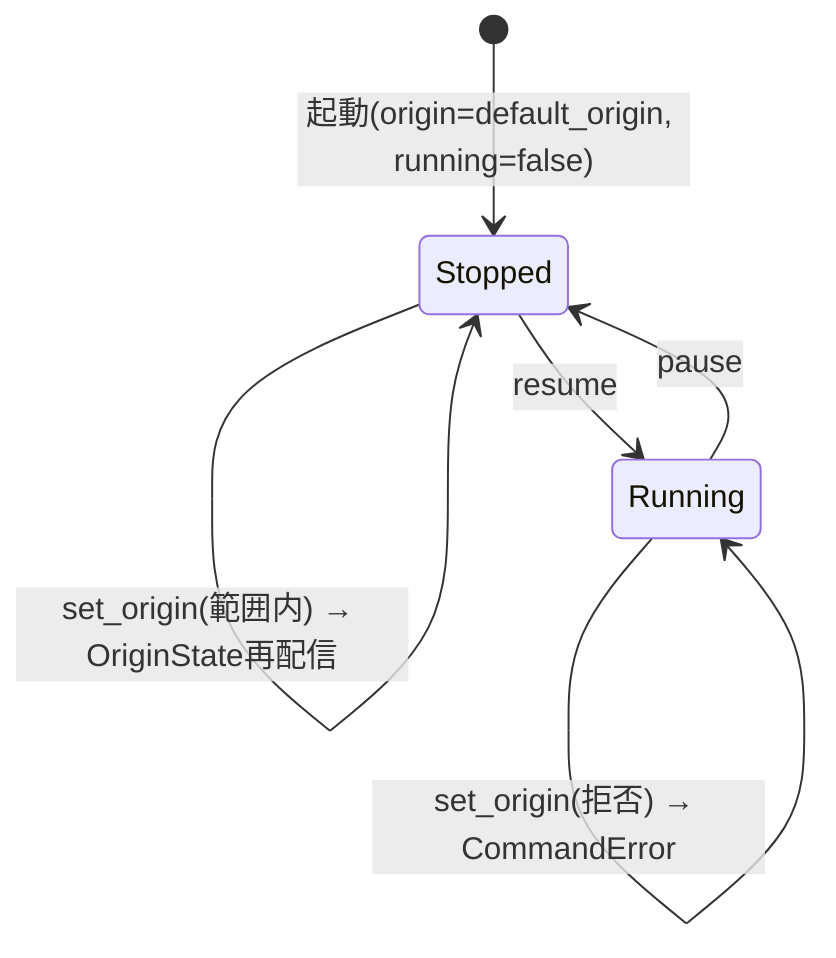

---

## 4. 通信プロトコル詳細

### 4.1 メッセージフレーミング

WebSocketはメッセージ境界を保存するが、メッセージIDと固定長payloadの検証を共通化するため、すべての送受信に
**8バイトの固定ヘッダ**を付ける。ヘッダ後はC++の固定長・標準レイアウト構造体の生バイト列である。
可変長型(`std::string`/`std::vector`/ポインタ)をそのまま送ってはならない。

```
[u16 little endian: message_id] [u16 reserved=0] [u32 little endian: payload_size] [payload]
```

`sample/sim_server/include/webtransport_protocol.hpp`がC++の正、Rust側はABIに依存せず同ファイルの
サイズ・オフセットを明示的にlittle endianで復号する。全payloadは`static_assert`でサイズを固定する。

### 4.2 message_id 一覧

| 値 | 名前 | 方向 | payload | 送信タイミング |
|---|---|---|---|---|
| 0x0001 | ClientCommand | Client→Server | 32 | ユーザー操作時 |
| 0x0002 | SimState | Server→Client | 48 | 約60Hzでbroadcast。送信待ちでは**最新値だけを保持** |
| 0x0003 | OriginState | Server→Client | 16 | 接続直後は要求元へ、状態変化時はbroadcast |
| 0x0004 | CommandError | Server→Client | 8 | コマンド拒否時、要求元のみ |
| 0x0005 | AppStatus | Server→Client | 8 | 接続直後は要求元へ、状態変化時はbroadcast |
| 0x0006 | TrackList | Server→Client | 1424 | 接続直後は要求元へ、進行中は約20Hzでbroadcast |

すべてWebSocketのバイナリメッセージで、TCPによる到達保証と順序保証がある。
受信側はヘッダーの`reserved`が0で`payload_size`が実際の長さと一致し、payloadが上表のサイズと一致することを検証し、
不一致や未知の`message_id`は捨てる(C++は`WebSocketMessaging::receive`、Rustは`protocol::decode_frame`)。

### 4.3 メッセージ型定義

C++の正は`sample/sim_server/include/webtransport_protocol.hpp`(旧方式の名残でファイル名にwebtransportが残る)。
すべてlittle endian、`f64`はIEEE 754 binary64、`f32`はbinary32。行末の数値はpayload先頭からのバイトオフセット。
Rust側の復号後の型は4.6節。

**ClientCommand**(クライアント→サーバー、32バイト)
```
command: u8          0   // 1=pause 2=resume 3=set_param 4=set_origin
reserved: u8[7]      1   // 0で埋める
value: f64           8   // set_param時のみ使用(フロントは現在set_paramを送らない)
lat_deg: f64        16   // set_origin時のみ使用
lon_deg: f64        24   // set_origin時のみ使用
```

**SimState**(サーバー→クライアント、48バイト、高頻度)
```
t: f64               0   // シミュレーション時刻(秒)。running中のみ進む
position_x: f32      8   // ダミーの単一点位置。Rustはpositions[0..3]へ入れる
position_y: f32     12
position_z: f32     16
frame_id: u32       20   // フレーム番号。running状態に関わらず毎ステップ増加
elapsed_time_s: f64 24   // 状況パネルの値(7.5節)。Rustはstatus_values[0..3]へ入れる
altitude_m: f64     32
speed_mps: f64      40
```

**OriginState**(サーバー→クライアント、16バイト、状態変化時+接続直後)
```
lat_deg: f64         0
lon_deg: f64         8
```

**CommandError**(サーバー→クライアント、8バイト、要求元のみ)
```
command: u8          0   // 拒否されたClientCommandの種別
code: u8             1   // 1=未対応 2=実行中の原点変更 3=範囲外
reserved: u8[6]      2
```

**AppStatus**(サーバー→クライアント、8バイト、状態変化時+接続直後。7.8節)
```
running: u8          0   // 0=一時停止中、1=シミュレーション実行中。表示文字列への変換はフロントの責務
reserved: u8[7]      1
```

**TrackList**(サーバー→クライアント、1424バイト、進行中は約20Hz+接続直後。ライブラリ設計書6.12節)
```
t: f64               0   // シミュレーション時刻(秒)
count: u32           8   // 有効な先頭要素数(最大16)
reserved: u32       12
tracks: Track[16]   16   // 全トラックの最新状態
  Track(88バイト):
    lat_deg: f64         0
    lon_deg: f64         8
    alt_m: f64          16
    heading_deg: f64    24   // 進行方向(北から時計回り)
    speed_mps: f64      32   // 対地速度
    pitch_deg: f64      40   // ピッチ(機首上げが正)。3Dモデル(ライブラリ設計書6.13節)の向きに使う
    roll_deg: f64       48   // ロール(右翼が下がる向きが正)。同上
    id: u32             56   // 同じ実体には常に同じID(フロントの航跡・ラベルの対応づけ)
    kind: u8            60   // 0=不明 1=固定翼機 2=ヘリ 3=艦船 4=地上車両 5=ミサイル
    affiliation: u8     61   // 0=不明 1=友軍 2=敵 3=中立
    alt_ref: u8         62   // 0=alt_mは海抜 1=地表からの高さ(サーバーが地形の高さを持たない車両など)
    reserved: u8        63
    label: char[24]     64   // 表示名(コールサイン等)。UTF-8、NUL終端、長ければ切り詰める
```

**StatusPanelConfig**(通信しない)。状況パネルの表示項目はフロントの`protocol::default_status_panel_config()`で固定する(7.5節)。
```
items: Vec<StatusItem>
  StatusItem:
    id: String
    label: String
    unit: String              // 単位。なければ空文字列
```

VAB設定は通信せず、フロントの`components/vab.rs`で定義する(7.4節)。

### 4.4 送信頻度

- シミュレーションループ(simスレッド)は約60Hz(16ms間隔)で駆動する
- `OriginState`/`AppStatus`は変化があったときと接続直後だけ送信する(毎フレーム送らない)
- `TrackList`は全トラックの最新状態をまとめて、シミュレーション進行中だけ約20Hzで送る(3フレームに1回)。位置は
  シミュレーション時刻の関数で、停止中は変わらないので送らない(新規接続には接続直後に1回)。フロントの描画は全体の再描画になるので、
  60Hzで送らずに表示に十分な頻度に抑えている

### 4.5 WebSocket再接続処理(フロント側)

- `WebSocket`は`ws://<host>:<port>/sim`へ接続し、すべてのフレームをバイナリメッセージとして受信する
- TCPによるWebSocketは到達保証ありである。`SimState`は送信待ちの値を常に最新フレームで上書きし、
  遅延した古いリアルタイム状態を送らない。その他の状態・コマンド応答は到達保証のある通常送信とする
- 固定ヘッダとpayloadの検証・復号はDOM・Leptosに依存しない`protocol::decode_frame()`が担当する
- 再接続間隔は**指数バックオフ**(初回1秒、以後2倍ずつ、上限30秒でキャップ)
- バックオフ間隔に**ジッター(±300ms)**を加える(サーバー再起動時のサンダリングハード回避)
- **ブラウザタブが非表示の間は再接続の試行を一時停止**する(Page Visibility API)。タブがアクティブに
  戻ったタイミングで即座に再接続を再開する(バックオフの残り時間を待たない)
- リトライ回数の上限は設けない(タブが表示されている間は無制限にリトライ)
- 再接続成功後は、サーバーから`OriginState`/`AppStatus`が接続直後の仕様により
  再送されるため、フロント側の表示状態は自然に復旧する

### 4.6 プロトコルのクラス図

Rust側(`sample/sim_frontend/src/protocol.rs`)で復号した後の型。バイト配置は4.3節。

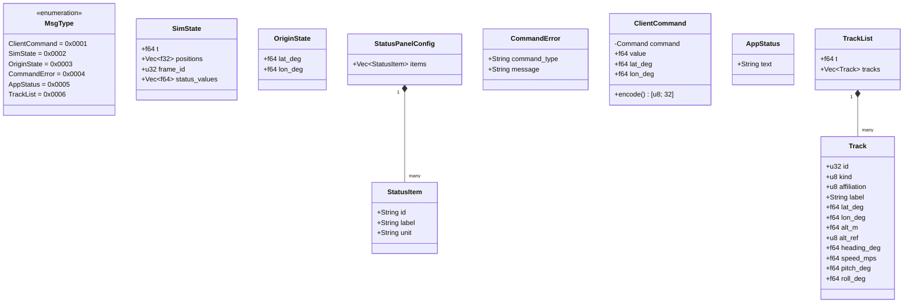

### 4.7 シーケンス図: 接続確立

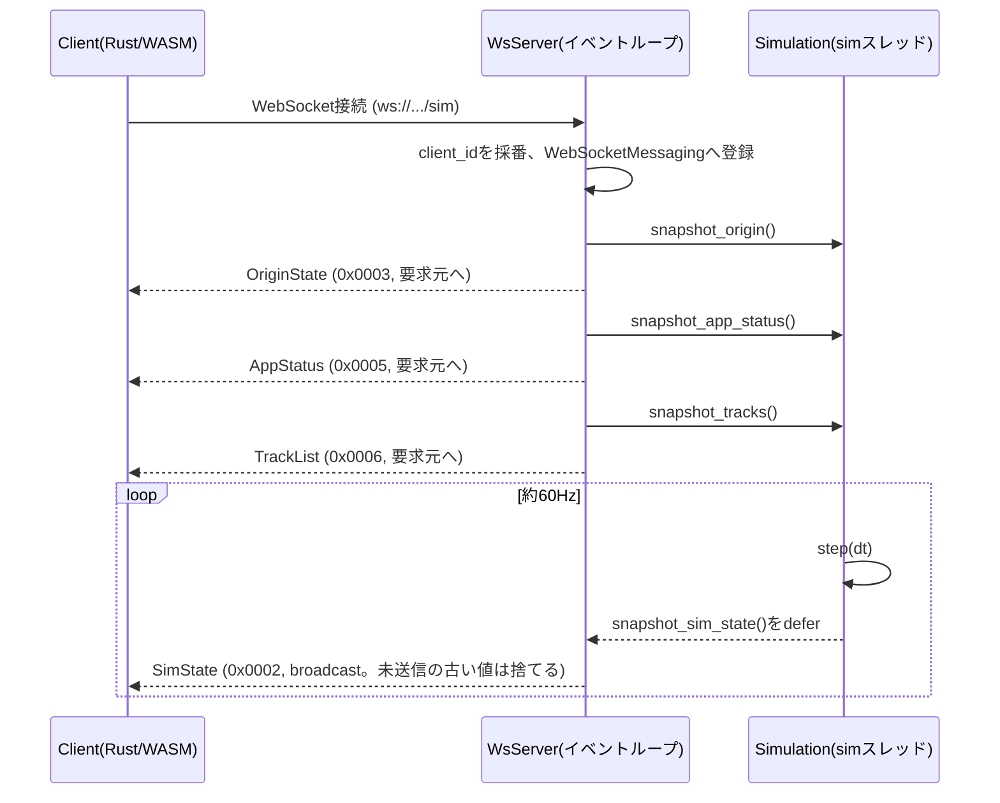

### 4.8 シーケンス図: set_origin(成功/拒否)

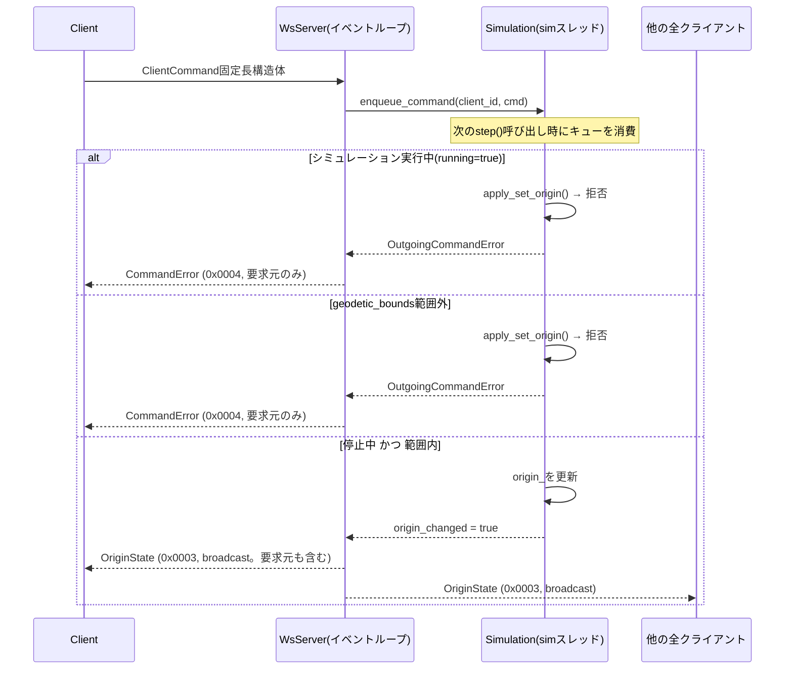

### 4.9 シーケンス図: VABボタン押下

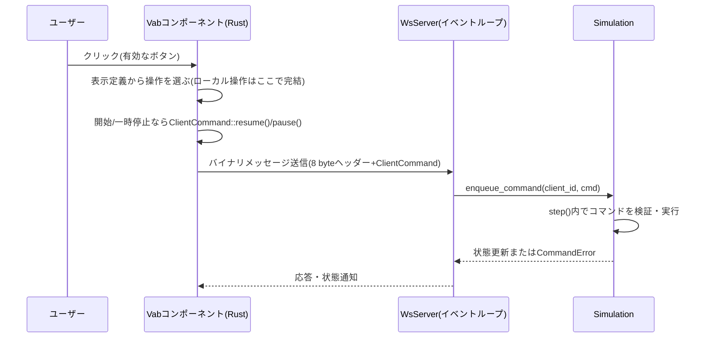

---

## 5. C++側詳細設計

### 5.1 スレッドモデル

- **HTTP/WebSocketイベントループ**: `WsServer::run()`を呼んだスレッド。uWSが地形・アップロードのHTTP配信と`/sim`のWebSocketを担当する
- **simスレッド**: `WsServer::run()`内で`std::thread`として起動。`Simulation::step()`を約60Hz
  (16ms間隔)で呼び続ける
- simスレッドからの送信は`uWS::Loop::defer()`でイベントループへ委譲する。`SimState`だけは
  保留スロット1個(`latest_state`)に上書きし、deferの予約が無いときだけ予約する(送信が追いつかなくても最新値だけを送る)。
  それ以外は値をコピーしたdeferでそのまま送る
- WebSocketの送受信とメッセージIDの振り分けは`WebSocketMessaging`(`include/websocket_messaging.hpp`)に分離する。
  このクラスはuWSの実体を送信関数として受け取り、HTTPやシミュレーション状態を知らない

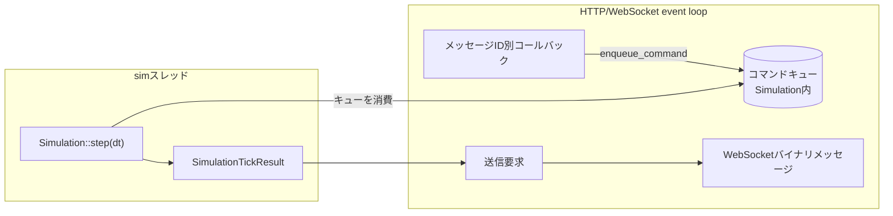

### 5.2 コマンド処理フロー

- `.message`ハンドラで受信したコマンドは**直接シミュレーション状態を書き換えず**、
  `Simulation::enqueue_command()`でスレッドセーフなキュー(`std::deque` + `std::mutex`)に積む
- simスレッド側で`step()`の**前半**でキューを消費してから、物理状態(`t_`等)を更新する
- `step()`の戻り値`SimulationTickResult`に、そのステップで発生した`CommandError`と
  `origin_changed`フラグが入っており、uWSスレッド側がこれを見て適切な送信(broadcast/単一送信)を行う

### 5.3 クラス図

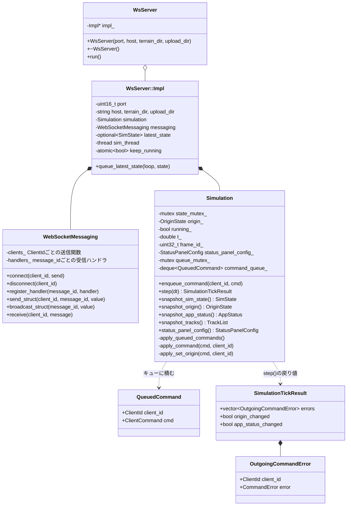

### 5.4 HTTP静的配信(地形データ)

`sim_server`は`/sim`(WebSocket)とは別に、以下のHTTP GETルートを持つ:

| パス | Content-Type | 内容 |
|---|---|---|
| `GET /terrain/metadata.json` | application/json | `assets/terrain/metadata.json`をそのまま返す |
| `GET /terrain/tile_index.json` | application/json | `assets/terrain/tile_index.json`をそのまま返す |
| `GET /terrain/base.bin` | application/octet-stream | `assets/terrain/base.bin`(全タイルの最粗レベルの連結)をそのまま返す |
| `GET /terrain/tiles/:level/:name` | application/octet-stream | `assets/terrain/tiles/{level}/{name}`(例: `L2/N035E138.bin`)。`level`・`name`は英数字・`_`・`.`のみ許可し、`..`を含むものは400(パストラバーサル対策)。**HTTP Range(単一範囲`bytes=a-b`)に対応**し、大きいファイル(最細レベルで1タイル約26MB)からチャンク1個分だけを206で返せる |

**キャッシュ**: 4つのルートとも、応答に`ETag`(ファイルの大きさ+更新時刻)と`Cache-Control: public, max-age=86400, must-revalidate`を付ける。
有効期限内はブラウザが条件付きGETの往復なしで保存した応答を使い、期限切れ後は`If-None-Match`で確認して、変わっていなければ本体なしの**304**を返す
(`*`・`W/`付き・カンマ区切りにも対応)。`sample/map_data/`を作り直したときはETagが変わるので、期限切れ後の再検証で新しいものになる。
すぐに反映したい場合はブラウザのキャッシュを消す。

**圧縮**: Range指定の無い200応答は、`Accept-Encoding`にgzipがあれば`Content-Encoding: gzip`で返す(`http_utils::accepts_gzip`・`http_utils::gzip_compress`)。
Rangeでの部分取得(206)は圧縮しない。全応答に`Vary: Accept-Encoding`を付ける。データ契約上の要件はライブラリ設計書9.1節。

フロント(trunk serveでホストされる別オリジン)からfetchされるため、全ルートとも
`Access-Control-Allow-Origin: *`ヘッダーを付与する。想定CWD(カレントディレクトリ)は`sim_server/`
(`assets/terrain/...`という相対パスでファイルを開くため)。

Range解析、ETag照合、安全なパス要素の判定は`include/http_utils.hpp`の純粋関数へ分離し、
`ws_server.cpp`のHTTP処理から利用する。シミュレーション本体はCMakeの`simulation_core`静的ライブラリとし、
サーバー実行ファイルとCTestの双方から同じ実装をリンクする。

CLIの既定は従来どおり`0.0.0.0:9001`、地形は`assets/terrain`。
`--host`で待受アドレス、`--terrain-dir`で前処理済み地形のルートを指定できる。
指定した地形ルートはHTTP配信と`Simulation`の原点範囲検証の両方に使う。
位置引数のポートは0〜65535を受け付け、0ではOSが空きポートを割り当てる。
待受成功時に標準出力へ`SIM3DVIEW_READY <実ポート>`を改行・flush付きで出し、失敗時は終了コード1で終了する。
Electronはこの通知を使うため、空きポートの事前探索や既存サーバーへの誤接続は行わない。

### 5.6 ファイル受信

「ファイル」→「サーバーへファイル転送」でファイルを選び、明示的な送信ボタンで
ライブラリの`upload::upload_blob`を呼ぶ。送信中は選択と再送を無効化し、結果またはエラーを表示する。
URLは地形と同じくページのホスト名と`sim_port`から`http://<host>:<port>/uploads`を構築する(`ws::default_upload_url`)。

`POST /uploads`は`application/octet-stream`の生バイトを受信する。上限は64 MiB（空ファイル可）。
フロントとサーバーの両方で制限し、サーバーはContent-Lengthに依存せず受信量を積算する。
保存ルートはCWDの`uploads`、`--upload-dir`で変更できる。
サーバー生成のIDディレクトリを排他的に確保し、`data.part`へ順次書き込み、完了時に`data.bin`へrenameする。
元の名前やパスは送信・保存しない。完了時は201と`<ID>/data.bin`、上限超過は413、
Content-Type不正は415、保存失敗は500。失敗・切断時は一時ファイルと空ディレクトリを削除する。
同じファイルを再送しても別IDになり、既存の受信ファイルを上書きしない。
OPTIONSはPOSTとContent-Typeを許可し、全応答にCORSヘッダーを付ける。
この参照サーバーは認証を持たず全オリジンを許可するため、信頼できる開発環境用。
公開運用での認証・Origin制限・総保存容量制限・保持期限はアプリ側で設計する。
受信物のHTTP配信・実行・地形への自動取り込みは行わない。

## 6. フロントエンド(`sim_frontend`)の構成

### 6.1 コンポーネント構成図

```mermaid
graph TD
    App["App (app.rs)<br/>3カラムCSS Gridレイアウト・リサイザー"]
    App --> SimulationStatusPanel["SimulationStatusPanel<br/>(operation_panel.rs) 接続状態・原点・フレーム・航跡数(表示専用)"]
    App --> VabPanel["VabPanel<br/>(vab.rs) 先頭行=カテゴリタブ、中段先頭4枠=スクショ/録画/開始/一時停止、残り+下段=フロント側ダミー"]
    App --> MainPanel["MainPanel<br/>(main_panel.rs) 地形描画canvas(3D/2D, TerrainView)"]
    App --> TopStatusPanel["TopStatusPanel<br/>TabbedPanel: [各種情報]=StatusPanel / [航跡情報]=TrackDetail"]
    App --> BottomStatusPanel["BottomStatusPanel<br/>TabbedPanel: [断面図]=CrossSectionView / [見通し範囲]=LosView"]
    App --> DrawingWindow["DrawingWindow<br/>(drawing_window.rs) 非モーダルFloatingPanel+DrawingEditor(7.7節)"]
    App --> ContextMenu["ContextMenu<br/>右クリックメニュー本体(項目はmap_menu.rsが決める。7.7節)"]
    App --> LogPanel["LogPanel<br/>(log_panel.rs) 画面最下部のログ表示(7.10節)"]

    App -.provide_context.-> WsSignals["WsSignals<br/>(接続状態・受信データのシグナル群)"]
    App -.provide_context.-> TerrainStore["TerrainStore<br/>(地形データを全パネルで共有)"]
    App -.provide_context.-> RadarMarkersState["RadarMarkersState<br/>(観測点一覧・選択状態、全パネル共有)"]
    App -.provide_context.-> DrawToolState["DrawingState / DrawToolState<br/>(作図の一覧・図形の対話作成。6.11節)"]
    App -.provide_context.-> TracksState["TracksState<br/>(航跡の一覧・選択・表示設定。6.12節)"]
    App -.provide_context.-> LogState["LogState<br/>(ログの一覧。log_bridge.rsとlogクレートのロガーが追記)"]
    App -.provide_context.-> MenuStates["ContextMenuState / MapMenuState<br/>(右クリックメニューの状態と、地図の項目を作る関数)"]
    App -.propとして渡す.-> WsConnection["WsConnection<br/>(Rc<RefCell<...>>、Send/Sync境界回避のためcontext不使用)"]

    MainPanel --> Loader["terrain::fetch / terrain::loader<br/>metadata.json・base.bin・タイル取得"]
    MainPanel --> Mesh["terrain::mesh<br/>ENU変換・頂点/インデックス生成"]
    MainPanel --> Renderer["terrain::renderer::TerrainRenderer<br/>wgpu Device/Queue/Pipeline(地形・水域)+draw系パイプライン(観測点ピン/2D覆域/作図/航跡)"]
    MainPanel --> Camera["terrain::camera::OrbitCamera<br/>view_proj行列・screen_to_ray"]
    MainPanel --> Pick["terrain::pick::pick_lat_lon<br/>クリック→レイキャストで緯度経度取得(右クリックメニュー・作図・原点指定)"]
    MainPanel --> Markers["terrain::markers::build_marker_geometry<br/>観測点・覆域の3D頂点生成"]
    BottomStatusPanel --> Los["terrain::los::compute_los<br/>全方位角の見通し限界距離"]
    TerrainStore -.共有データ.-> MainPanel
    TerrainStore -.共有データ.-> BottomStatusPanel
    RadarMarkersState -.共有データ.-> MainPanel
    RadarMarkersState -.共有データ.-> BottomStatusPanel
```

### 6.2 WebSocket接続管理のクラス図(サンプルアプリ側)

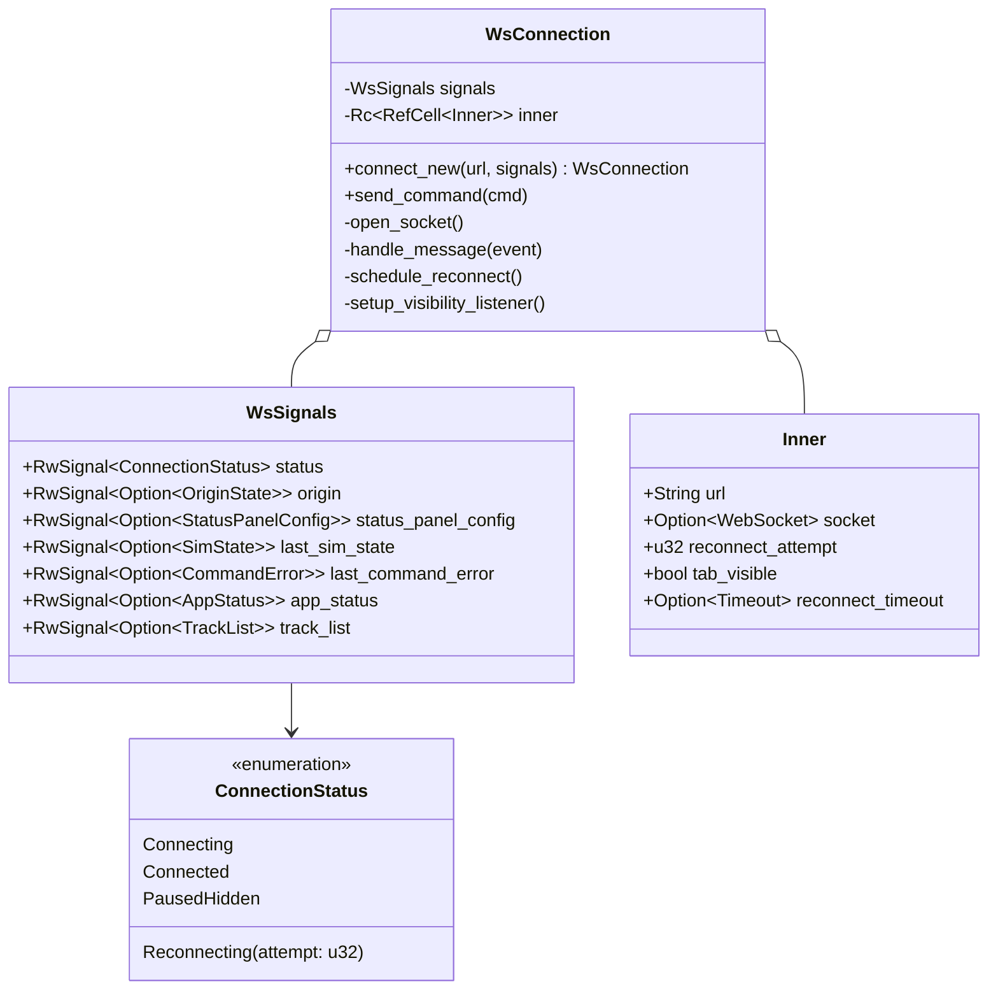

`WsConnection`は`Rc<RefCell<Inner>>`を内部に持ちSend/Syncではないため、Leptos 0.8の`provide_context`(Send+Sync境界を要求する)には乗せられない。
そのため`WsSignals`はcontext経由、`WsConnection`は`WsHandle`(`StoredValue::new_local`で包んだ`Copy`のハンドル。`Send`+`Sync`を満たす)に包み、
コンポーネントのpropとして明示的に渡す設計とした(以前は`unsafe impl Send/Sync`を付与していたが、ハンドル化して`unsafe`を無くした)。

### 6.3 再接続状態遷移図

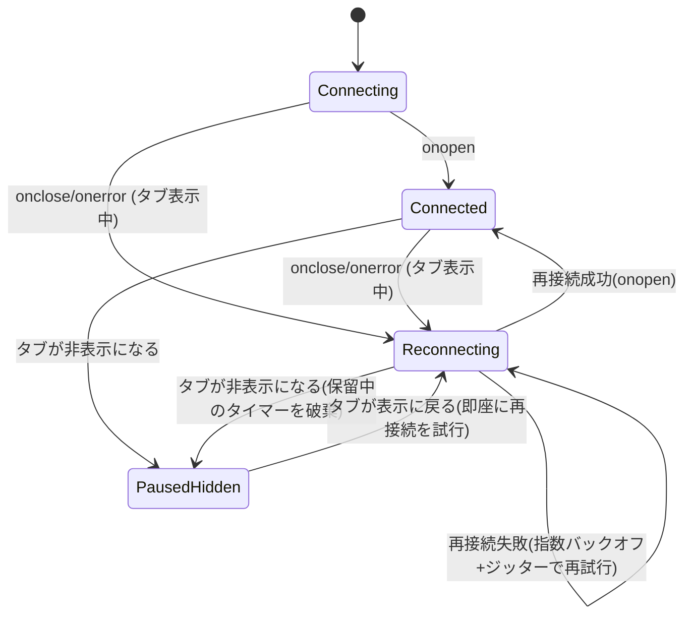

## 7. 業務UI設計

### 7.1 レイアウト

```
┌──────────────────────────────────────────────────────────────┐
│ ファイル  設定  表示  ヘルプ                    ← メニューバー    │
├───────────────────────┬───────────────────┬───────────────────┤
│ シミュレーション          │                   │ トップステータスパネル │
│ ステータスパネル(上)      │                   │  [各種情報][航跡情報]  │
├───────────────────────┤     メインパネル     ├───────────────────┤
│ VABパネル(下)            │    (3D地形)        │ ボトムステータスパネル │
│                         │                   │ [断面図][見通し範囲]  │
├───────────────────────┴───────────────────┴───────────────────┤
│ 12:34:56 情報 サーバー: 接続済み                  [自動スクロール] │
│ 12:34:57 情報 シミュレーション実行中               [クリア]        │
│ 12:35:02 エラー [set_origin] シミュレーション実行中は…  ← ログパネル  │
└──────────────────────────────────────────────────────────────┘
```

画面最上部にメニューバー(`components/menu_bar.rs`)を固定高さで配置し、その下に
既存の3カラムレイアウト(`.app-shell`)を残り高さいっぱいで敷き、最下部に画面幅いっぱいの
ログパネル(`components/log_panel.rs`、7.10節)を3行分の固定高さで置く(`.app-root`が
`display:flex; flex-direction:column`で3者を縦に並べる)。

パネル名は全て位置ベースの汎用名で統一している(シミュレーションステータスパネル/VABパネル/
メインパネル/トップステータスパネル/ボトムステータスパネル)。表示内容そのものを指す旧称
(「操作パネル」「VAB」「地図」「各種情報パネル」「側面図パネル」)は、トップ/ボトムステータス
パネルではタブラベルとして残るのみで、パネル自体の名前としては使わない。

**画面上にはパネル名(見出し・ラベル)を表示しない**(後から「表示名を消してほしい」との要望を受けて
全て削除した)。上記の名前は設計書・コード上の呼び名としてだけ残る。`TabbedPanel`の`title`は
省略可能(省略/空文字なら見出しを出さずタブバーだけ)で、サンプルは指定しない。

- 外側のCSS Gridは左固定パネルと可変区画の2列。可変区画は`SplitPane`でメインパネル・リサイザー・右パネルに分割する
- 左パネルは`display:grid; grid-template-rows: 1fr auto;`で上下2分割
  (シミュレーションステータスパネル/VABパネル)。VABパネル側は`auto`で内容の高さに
  ぴったり合わせ、余った分はシミュレーションステータスパネル側(`1fr`)が吸収する
  (固定`1fr 1fr`だと、VABパネルの実寸と半分の高さがずれた際に一方に余白/スクロールが
  生じるため)
- 右パネルは`grid-template-rows: 1fr 1fr;`で上下2分割(トップ/ボトムステータスパネル、
  こちらは両方とも内容量の変動が小さいため固定分割のままでよい)。両パネルとも
  `TabbedPanel`(7.6節)で実装しており、現状は1タブのみだが後から同じ枠に別タブを追加できる
- 左パネル幅は`--panel-width`(CSS変数、既定320px)で固定
- 地図・右パネルの初期比率と最小幅はsampleが指定する。`SplitPane`が実測幅を基にドラッグ量を比率へ変換し、両側の最小幅を維持する(9.14節)

### 7.2 レスポンシブ方式

- 「表示」メニューの「左ステータスパネル」「右ステータスパネル」で左右の列を個別に表示・非表示へ切り替える。初期状態は両方表示し、表示中はメニューに✓を付ける。設定はページ内だけで保持し、再読み込みで初期状態へ戻る。
- 左の対象はシミュレーションステータスパネルとVAB、右の対象はトップ・ボトムステータスパネル。非表示の列と右側の仕切りの幅は地図へ割り当て、両側非表示なら地図だけにする。
- パネルは非表示中もマウントを維持し、VABのページ・タブの選択・分割比率を再表示時に保持する。地図の再生成は行わず、既存のResizeObserverで描画サイズを追従させる。

- 3カラムの横並びレイアウトは崩さない(縦積みへの再レイアウトは行わない)
- 画面幅が狭くなった場合は、`minmax()`の`fr`部分により中央・右パネルの幅が比例的に縮小する
- `minmax()`の下限を下回る場合は、外側コンテナ(`.app-shell`)に`overflow-x: auto`を設定してあるため
  横スクロールで対応する
- 各パネル内(`.panel-section`)は`overflow-y: auto`で縦スクロールに対応する

### 7.4 VAB仕様

VABの配置・ラベル・有効/無効・選択表示・クリック時の処理は、すべて
`sample/sim_frontend/src/components/vab.rs`が決定する。サーバーはVAB設定やボタンID、
カテゴリ、ページを持たず、業務コマンドを検証・実行して状態通知または拒否応答を返す。
未対応コマンドは要求元に`CommandError`を返す。

- 先頭行は`CATEGORIES`に定義したB1〜B4の4カテゴリ。空ラベルはDOMを生成せず、
  `grid-row`/`grid-column`で位置を維持する。未接続でも表示・選択できる。
- 中段は4行×4列を1ページとし、`mid_pages: Signal<[usize; 4]>`でB1〜B4それぞれのページ数を指定する。
  既定値とサンプル設定は`[1, 2, 2, 2]`(B1は単一ページ、B2〜B4は2ページ)。0は1扱い。
  ページ送り「◀ 現在ページ/総ページ数 ▶」は常に表示する。1ページなら「◀ 1/1 ▶」で左右とも無効、
  複数ページなら先頭で左、末尾で右を無効にする。
  全体のインデックスは`行 * (ページ数 * 4) + ページ * 4 + 列`。
- 下段は4個固定。中段のダミーラベルは`{カテゴリ}-{n}`、下段は`{カテゴリ}A{n}`。
  カテゴリ・ページ・ダミーボタンの操作はローカル状態だけを更新し、通信しない。
- 中段の絶対インデックス0/1はスクリーンショット・録画、2/3は開始・一時停止。
  どのカテゴリでも1ページ目の先頭行に配置する。キャプチャは`CaptureState`へ要求し、
  開始・一時停止だけが`resume`/`pause`コマンドを送る。成功時の状態は既存の`AppStatus`等で受け取る。
  「開始」はシングルクリックで開始・再開、ダブルクリックで一時停止する。
  ダブルクリック時は通常のクリックによる`resume`が先に送られ、最後の`dblclick`で`pause`を送る。
  クリックの判別待ちは行わない。「一時停止」は従来どおりシングルクリックで`pause`を送る。
- 先頭行は`selected_category`、ダミーの中段・下段は`selected_mid`/`selected_bottom`で
  選択色を決める。カテゴリ押下時はページを0、ダミー選択を`None`へ戻す。
  録画表示は`CaptureState.is_recording`に従う。
- ボタンは列幅に従う正方形とし、グリッド列は`minmax(0, 1fr)`、ラベルは絶対配置で寸法計算から除外する。
  `VabLabel`が枠と文字を`ResizeObserver`で監視し、`min(1, 枠幅/文字幅, 枠高/文字高)`で等比縮小する(文字寸法は整数丸めによる欠けを防ぐ1pxの余裕込み)。
  改行は保持し、自動折返しは行わない。長い文字列でもボタンや隣接要素の位置は変わらず、全文はtitleでも確認できる。
  初回計測までは文字を隠し、破棄時に監視を解除する。
- `.vab-button-active`は同じ詳細度の`.vab-button-dummy`よりCSSで後ろに定義する。

旧`VabConfig`と`vab_press`は廃止した。新しい機能もフロントの表示定義から業務コマンド(4.3節の`ClientCommand`)へ
対応付け、サーバーに画面の配置やボタンIDを持ち込まない。コマンドを増やすときはフロントとサーバーを合わせて更新する。

### 7.5 状況パネル仕様

- 表示項目(ラベル・単位・並び順)はフロントの`protocol::default_status_panel_config()`で固定する
  (経過時間[s]・高度[m]・速度[m/s])。通信では送らない
- `SimState`の`elapsed_time_s`・`altitude_m`・`speed_mps`を`status_values`としてこの順に並べて表示する。
  C++側の`Simulation::status_panel_config_`(ダミー値の生成に使う)と順序を合わせる
- 項目を変えるときは、フロントの定義・`SimState`の固定レイアウト(4.3節)・C++の値生成を合わせて更新する
- 数値項目のみを対象とする

### 7.6 右パネルのタブ構成

右パネル上下段(トップ/ボトムステータスパネル、`components/right_panel.rs`)は、ライブラリの`TabbedPanel`(ライブラリ設計書7.6節)で作る。
パネル固有の名前(「各種情報」「断面図」等)は**タブのラベル**で、パネル自体は位置に基づく汎用名にする。`title`は指定しない。

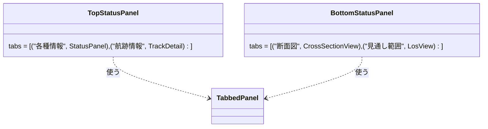

- 「航跡情報」タブ(`components/track_detail.rs`)は、選択中の航跡の名前・識別番号・種別・所属・位置・高度・針路・速度・
  原点からの距離と方位・「選択を解除」ボタンを出す。`TabbedPanel`の`active`を渡し、航跡が選択されたら自動でこのタブへ移る
- ボトムステータスパネルの断面図タブは、要望で一度削除した後に復活した経緯がある(復活時にライブラリの
  `ui::cross_section_view::CrossSectionView`へ移した)。タブの増減は`tab(...)`の1行だけで済み、`TabbedPanel`側は変えていない

### 7.7 メニューバー・フローティングパネル(原点設定/覆域高度設定)・右クリックメニュー

画面最上部のメニューバー(`components/menu_bar.rs`)は「ファイル」「設定」「表示」
「ヘルプ」の4項目。「表示」配下には、地形の陰影のON/OFFを切り替える「陰影表示」(ONのとき項目の頭に✓、
6.8節)、カメラの中心点を原点へ戻す「中心点を原点に戻す」、航跡表示(6.12節)の「航跡ラベル」「航跡(軌跡)」「高度線」の
ON/OFF(`TracksState`の各`show_*`。ONのとき✓)、作図(6.11節)のデモ図形を出し入れする「作図デモ」(`components/drawing_demo.rs`。
消すときは自分が追加した図形のIDだけを消すので、ユーザーが作った図形は残る)がある。図形を自分で作る操作は、「作図...」(移動できる非モーダルのウインドウ。6.11節「図形の対話作成」)。
「設定」配下に2つのフローティングパネルを開く項目がある:

- 「原点設定...」: 原点入力フォーム(緯度・経度・`設定`ボタン、3.5節の
  バリデーション込み)を`ui/origin_dialog.rs`(ライブラリ)として画面中央に表示する。
  フォーム自体の中身は実装当初シミュレーションステータスパネルに直接埋め込まれて
  いたものを移設したもの。ライブラリの`OriginDialog`は通信を持たず、`on_submit`コールバックを呼ぶだけで、
  サンプルの`app.rs`がその中で`set_origin`コマンドを送る
- 「覆域高度設定...」: メインパネルの2D表示モードで使う覆域表示の対象海抜高度
  (`terrain::markers::RadarMarkersState::coverage_altitude_m`、6.9節)を編集する
  `ui/coverage_altitude_dialog.rs`(ライブラリ)を画面中央に表示する。当初はメインパネル
  右上のインライン入力欄(2Dモード時のみ表示)だったが、「高度はメニューから
  フローティングウインドウで入力できるようにして」との要望を受けてこちらへ移設した。
  サーバーへは何も送らないフロント側だけのローカル表示設定で、`origin_dialog.rs`と見た目は同じだが
  実装ははるかに単純(バリデーションも送信ボタンもない、数値入力欄1つだけ)

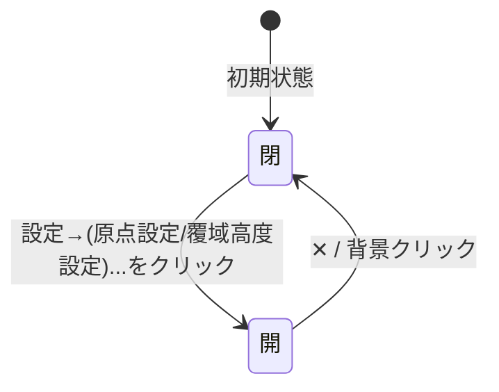

- 開閉状態はそれぞれ`ui::origin_dialog::OriginDialogState`/`ui::coverage_altitude_dialog::CoverageAltitudeDialogState`
  (どちらも`RwSignal<bool>`の単純なラップ)を`provide_context`で共有し、
  `MenuBar`(トリガー)・各ダイアログ本体(表示)の双方が`use_context`で参照する
- メニューのドロップダウンは背景の透明な`.menu-backdrop`、モーダルのフローティングパネルは半透明の
  `.floating-panel-backdrop`をクリックすると閉じる(パネル本体のクリックは`ev.stop_propagation()`でバックドロップまで伝播させない)
- `FloatingPanel`(モーダル/ウインドウ・ドラッグ移動)と右クリックメニュー(`ContextMenu`)の仕様はライブラリ設計書7.7・9.14節。
  サンプルの使い方は次のとおり。
  - 原点設定・覆域高度設定は既定のモーダル。「作図...」(`components/drawing_window.rs`。`DrawingWindowState`の開閉状態をメニューから立てる)と
    「3Dモデル...」(`ModelSettingsDialog`)は`modal=false`+`draggable`のウインドウで、地図を操作したまま出しておける。
  - `app.rs`が`ContextMenuState`と`MapMenuState`を`provide_context`し、`<ContextMenu/>`を1つだけ置く。
  - **地図の右クリック**: `TerrainView`が右クリック位置の`MapMenuTarget`(地表の緯度経度・航跡)を求め、`MapMenuState`が返した項目でメニューを出す
    (ライブラリ設計書9.13節)。図形の作成中は「置いた点を1つ戻す」を優先する。
  - **サンプルの項目**(`components/map_menu.rs`。ライブラリの各`State`を呼ぶだけ): 航跡=見出し(名前・種別・所属)/中心点をこの航跡へ/選択を解除。地表=緯度経度の見出し/
    ここにレーダー観測点を追加/ここを原点に設定(`OriginPickState::on_pick`。シミュレーション停止中のみサーバーが受理)/ここを中心点にする(`RecenterRequestState::request_at`。
    カメラの中心点だけを移し、原点は変えない。高さはその地点の地表)/ここに図形を作成 ▶(図形の種類。`DrawToolState::start_at`でその地点を1点目にして開始)/緯度経度をコピー。
- 「ファイル」配下は「サーバーへファイル転送...」(5.6節)。「ヘルプ」は項目未定のため、
  クリックすると「(準備中)」のプレースホルダのみ表示する
- 実装上の注意: `WsConnection`は`Rc`を含む非`Copy`の値なので、再実行される`{move || ...}`の中へ直接ムーブすると
  2回目以降の呼び出しでムーブ済みエラーになる。サンプルは`Copy`な`WsHandle`(6.2節)を渡し、送信する
  コールバックの中で`conn.send_command(...)`を呼ぶ
- 覆域高度の変更は`coverage_altitude_m`シグナルを更新するだけで、ジオメトリの再構築は`TerrainView`が購読して行う
  (ライブラリ設計書9.13節)。ダイアログとメインパネルは互いを直接呼び出さない

### 7.8 シミュレーションステータスパネルの状態表示(AppStatus)

シミュレーションステータスパネルの状態表示は、バッジなどの装飾を付けず、C++側から配信された
`AppStatus.running`を状態文字列へ変換して表示する。取得できない場合(WebSocketが
`ConnectionStatus::Connected`でない、または接続済みでもまだ`AppStatus`を受け取っていない)は、
詳細を出し分けず一律「接続中」とだけ表示する(`ConnectionStatus`ごとの色分け・文言の出し分けはしない)。

左パネルのシミュレーションステータスパネルには、原点・フレームの下に**「航跡数」**(最新の`TrackList`のトラック数。6.12節)がある。
「開始」「一時停止」ボタン(それぞれ`resume`/`pause`コマンドを送る)は、当初このパネルにあったが、VABパネル(7.4節)に
統合したため撤去した(重複していたため要望により撤去。以前は`resume`を送る部品がフロントに無く、`running_`が`false`のまま
経過時間が0で止まっていた)。実行中は原点を変更できない(3.4節。拒否は`CommandError`)。

`AppStatus.running`の実体はC++側`Simulation::running_`(pause/resumeコマンドで変化)で、
フロントの`protocol::decode_frame`が「一時停止中」「シミュレーション実行中」の文字列へ変換する。`OriginState`の`origin_changed`と同じパターンで
`SimulationTickResult::app_status_changed`フラグを介して、値が変化した時と
接続直後にのみ配信する(毎フレームは送らない)。

---

### 7.9 Electronデスクトップ起動

`sample/sim_desktop`はWindows/Linux x64用の起動アプリ。`sim3dview`の責務とブラウザ起動手順は変えない。
Electronメインプロセスが`sim_server[.exe] 0 --host 127.0.0.1 --terrain-dir <resources/terrain>`を起動し、
15秒以内の準備完了通知を待って、ビルド済みUIを別のループバック空きポートで配信する。
UI出力先は`sample/sim_desktop/out/frontend`とし、Trunk開発サーバーの出力と分ける。

表示URLに`?sim_port=<実ポート>`を渡す。`sample/sim_frontend/src/ws.rs`はこの値をHTTP/WS双方に使う。
指定なし・数字以外・0・65535超過は従来の9001番へ戻す。ホストはページのホスト名、スキームは`ws`/`http`固定(TLSは使わない)。
ポート選択はアプリ側だけの責務で、ライブラリへElectronやサーバー情報を持ち込まない。
ブラウザ版とデスクトップ版はそれぞれ独立したシミュレーションを持ち、地形だけを共有する。

配布版は `resources/terrain` の同梱地形を固定で使う。フォルダー選択・保存設定は持たない。
開発時の既定は `sample/sim_server/assets/terrain`。`SIM3DVIEW_TERRAIN_DIR` は開発時の読み込み先と配布生成時のコピー元を指定する。
サーバー実行ファイルは`SIM3DVIEW_SERVER_EXE`でも指定できる。
通常終了時は自分が起動した子プロセスだけを停止し、C++の異常終了・描画プロセス停止は通知してアプリを閉じる。
デスクトップアプリ自体の強制終了やOSクラッシュ時の子プロセス回収は保証しない。

ウィンドウはNode統合を無効、contextIsolationとsandboxを有効にし、Node/IPCをUIへ公開しない。
外部オリジンへの遷移・新規ウィンドウを拒否する。UI配信はHostと実パスを検査し、公開ルート外のファイルを返さない。
UIビルドはNode.jsからTrunkを起動し、PowerShellに依存しない。
開発時のサーバーはWindowsでは`build/Debug/sim_server.exe`、Linuxでは単一構成の`build/sim_server`。
配布生成は実行中のOS向けに行い、WindowsはRelease、LinuxはCMakeで指定した構成を使う。
配布フォルダーにはElectron実行環境、UI、C++実行ファイル、ライセンスを含める。
Windowsではサーバーと同じフォルダーのDLLもコピーする。Linuxでは実行権限を付け、
システム共有ライブラリは配布先OSで導入する。同じディストリビューション・アーキテクチャを配布の基準にする。
LinuxのC++ビルドはシステムのOpenSSL・zlib・GDALを利用し、スレッド依存はCMakeの`Threads::Threads`で指定する。
GDALはConfig形式を優先し、見つからなければCMakeのFindGDALへフォールバックする。
配布生成前に地形の必須ファイルを検査し、全タイルを `resources/terrain` へコピーする。
コピーに失敗した場合は配布生成を失敗させる。GeoTIFF入力は同梱しない。
地形の出典表示を含む `sample/THIRD_PARTY_NOTICE.md` を配布物にコピーする。

### 7.10 ログパネル

画面最下部に、アプリの出来事と警告・エラーを1行ずつ表示するログパネル(`components/log_panel.rs`)を置く。
サンプル固有の画面であり、ライブラリへは持ち込まない。

- 配置: `.app-root`の直下で`.app-shell`の下。`.app-shell`が横スクロールしても画面幅いっぱいのまま動かない。
  高さは3行分で固定し(`.log-list`の`height: calc(3 * 1.4em)`)、地図・左右パネルはその分だけ縮む。
  上下の余白は外側の`.log-panel`に持たせる(スクロール領域の中に持たせると、最下部で4行目の端が覗くため)。
- 1行は「時刻(`HH:MM:SS`、ローカル時刻)・レベル(情報/警告/エラー)・本文」。警告は黄、エラーは赤で表示する。
  本文は折り返し、長い文字列でも横スクロールは出さない。
- 保持件数は`MAX_LOG_ENTRIES`(1000件)。超えたら古いものから捨てる。「クリア」ボタンで全消去する。
- 追記元:
  - `log_bridge.rs`: 接続状態の変化(再接続の試行は警告。再接続のたびの「接続中...」は最初の1回だけ)、
    `AppStatus`・`OriginState`の変化(再接続時に同じ値が再送されても重複させない)、`CommandError`(エラー)。
  - ファイル転送ウインドウ: 送信の成功(情報)・失敗(エラー)。
  - `log`クレート: `main.rs`で`console_log::init_with_level`の代わりに`log_panel::init_logger`を登録する。
    このロガーは従来どおり全レベルをブラウザのコンソールへ出し、警告・エラーだけをログパネルへも流す
    (ライブラリの警告・エラーを含む)。ログはシグナルの読み書きの途中からも呼ばれうるため、
    パネルへの追記は`spawn_local`で現在の処理が終わってから行う。
- 1件の本文は改行を含んでよい。CRLF・CRはLFへ揃え、末尾の改行・空白は落とす(空行を出さない)。
  途中の改行は`.log-text`の`white-space: pre-wrap`で複数行として表示し、長い本文は幅に合わせて折り返す。
- 自動スクロール: 最下部を表示している(張り付いている)間だけ、追記のたびに最下部へ移動する。
  切り替えボタンは持たず、表示位置だけで決める。
  - 最下部へ合わせる契機は、スクロール領域と内容の`ResizeObserver`(描画前に通知される)と、追記ごとの
    `request_animation_frame`。行数を数えず内容の実寸で合わせるので、1件が改行・折り返しで何行になっても、
    幅の変化で折り返しが変わっても最下部に届く。後者は、件数上限で1行捨てて1行足し、内容の高さが
    変わらずResizeObserverが通知しない場合のため。
  - 張り付きはスクロールイベントで決める(`pinned_after_scroll`)。現在の内容の最下部(残り2px以内)か、
    前回レイアウトを見たときの内容の高さでの最下部なら張り付き、そうでなく上へ動いたときだけ外す。
    スクロールイベントは次のフレームでまとめて届くため、ユーザーが最下部まで動かした直後に行が
    追記されると現在の高さでは最下部から外れて見える。そのため追記前の高さでも判定する。
  - こちらが最下部へ移動した位置も「直前の位置」として記録する。記録しないと、同じフレームで
    ユーザーが少しだけ上へ戻した操作が前回の位置より下にあるため「上へ動いた」と判定されず、
    最下部へ引き戻されてしまう。
  - 内容が減ってscrollTopが切り詰められた場合(クリア・折り返しの解消)は最下部になるので外れない。
    先頭の行を捨てたときのブラウザの表示位置補正が上向きのスクロールと判定されないよう、
    `.log-list`は`overflow-anchor: none`にする。
- 手動スクロール: ホイール・スクロールバー・キー操作で上へ戻すと自動スクロールが止まり、新しい行が
  追記されても表示位置を保つ。最下部まで戻すと再開する。右端の「最新へ」ボタンでも最下部へ移動して
  再開できる(張り付いている間は押せない)。
